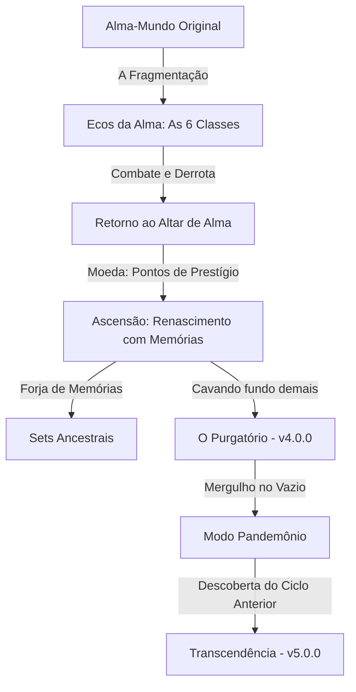

# Documento de Planejamento e Especificação — Amaro RPG Idle
## Roadmap de Desenvolvimento e Lore Fundacional (v3.5.0 → v5.0.0)

Este documento estabelece o planejamento estratégico, o direcionamento criativo (Lore) e a arquitetura técnica para as próximas atualizações de **Amaro RPG Idle**. Ele serve como guia para a implementação futura e deve ser consultado antes de iniciar o desenvolvimento de cada nova versão.

---

## 1. Lore Fundacional: "O Ciclo da Alma Partida"

Mecanicamente, o herói nunca morre de verdade — ele ressuscita após 3 segundos no combate, e ao realizar a Ascensão, retorna ao início mais forte com Pontos de Prestígio. O lore traduz essas mecânicas para o universo do jogo: o jogador controla um fragmento consciente de uma **Alma-Mundo** fragmentada que está presa em um ciclo eterno de morte e renascimento, tentando se recompor.



### 1.1 Texto de Abertura
Este texto será exibido em um modal especial e imersivo ao iniciar um novo save pela primeira vez:

> *Antes que houvesse reinos, havia uma única Alma — vasta, inteira, sonhando o mundo em existência.*
>
> *Ela se partiu.*
>
> *Ninguém sabe se foi guerra, acidente ou escolha. O que se sabe é que seus cacos caíram sobre a terra como estrelas, e cada um deles despertou como um herói: um Guerreiro de fúria inquebrantável, um Mago de fogo arcano, um Arqueiro de mira impossível — seis ecos de uma única vontade, cada um convencido de ser o único.*
>
> *Os monstros que você enfrenta não nasceram deste mundo. São o vazio entre os cacos, tentando preencher o espaço onde a Alma deveria estar inteira — e a cada fase que você atravessa, o vazio fica mais denso, mais faminto, mais forte.*
>
> *Você vai morrer. Muitas vezes. Mas cada morte é só um fragmento retornando à fonte por um instante — e cada retorno o torna mais do que era.*
>
> *Chamam isso de Ascensão. Você chama de a única forma de continuar.*
>
> *E em algum lugar, no fundo de tudo, algo mais antigo que os cacos está esperando você cavar fundo demais.*
>
> *Chamam isso de Pandemônio.*

### 1.2 Os Ecos da Alma (Classes)
Cada classe existente e futura representa uma faceta psicológica e existencial da Alma-Mundo:

| Classe | Papel Narrativo | Vínculo Mecânico |
| :--- | :--- | :--- |
| **Guerreiro** | O Eco da Vontade | A teimosia e resistência de nunca aceitar a derrota. |
| **Mago** | O Eco do Pensamento | A curiosidade que busca compreender o universo, queimando tudo ao redor. |
| **Arqueiro** | O Eco da Precisão | A percepção à distância que aprendeu a atingir o perigo antes de ser tocada. |
| **Paladino** | O Eco da Devoção | A fusão da Vontade e do Instinto para proteger os outros cacos (Evolução do Guerreiro). |
| **Clérigo** | O Eco da Compaixão | A fusão do Pensamento e da Vontade, entendendo que para durar é preciso curar (Evolução do Mago). |
| **Ladrão** | O Eco da Sobrevivência | O Instinto de preservação puro, que enxerga brechas e oportunidades no caos (Evolução do Arqueiro). |
| **Necromante** *(v4.0.0)* | O Eco da Reivindicação | A fusão da Compaixão e da Sobrevivência, distorcendo o ciclo de cura e vida para dominar os mortos (Classe Avançada). |
| **Avatar** *(v5.0.0)* | A Alma Unificada | O caco que transcendeu e uniu todas as facetas em uma forma integrada (Classe de Prestígio Suprema). |

Esta relação justifica narrativamente a regra de que classes avançadas exigem Nível 10 em classes primárias: a evolução de poder acompanha a fusão de diferentes Ecos da Alma-Mundo.

### 1.3 Onde a Lore Aparece no Jogo
Para manter a imersão sem sobrecarregar a jogabilidade ou exigir novos motores visuais:
*   **Modal de Introdução**: Exibido uma única vez ao iniciar um novo save slot pela primeira vez, reaproveitando o padrão visual de modal do inventário.
*   **Sub-aba "Crônicas"**: Inserida no painel de Guia, contendo o texto mestre e registros de progressão.
*   **Falas do Bestiário**: Adição de 1 a 2 linhas narrativas no detalhe de cada monstro indicando o que ele representa na distorção do vazio.

---

## 2. Linha do Tempo e Roadmap das Versões

```
[v4.2.0] (Atual)
   │
   ├──► [v3.5.0] Elites do Vazio (Monstros com afixos + Lore no Bestiário) [IMPLEMENTADO]
   ├──► [v3.6.0] Trilha da Ascensão (Desafios Diários + Recordes) [IMPLEMENTADO]
   ├──► [v3.7.0] Ecos Instáveis (Sistema básico de Relíquias + useRelicStore) [IMPLEMENTADO]
   │
[v4.0.0] O Purgatório e as Relíquias (Major Update) [IMPLEMENTADO]
   │   ├── Novo Território: Purgatório (Fases 21-30) e Chefe de 2 Fases
   │   ├── Expansão do Sistema de Relíquias (8 Relíquias com habilidades ativas no Nível 5)
   │   └── Nova Classe Secundária: Necromante
   │
   ├──► [v4.1.0] Torre Infinita (Modo semanal vertical sem regeneração de HP/Mana) [IMPLEMENTADO]
   ├──► [v4.2.0] Memórias Celestiais (Sets Celestiais + Extensão de Forja para +8) [IMPLEMENTADO]
   ├──► [v4.3.0] Codex de Lendas (Protótipo de Lore + Sistema de Notificações) [IMPLEMENTADO]
   │
[v5.0.0] Transcendência e o Segundo Ciclo (Major Update) [PLANEJADO]
       ├── Nova Camada de Prestígio (Transcendência e Pontos de Transcendência - PT)
       ├── Nova Zona: Ecoterra (Fases espelhadas com drops de Essência de Transcendência)
       ├── Classe Suprema: Avatar (Escala com o maior atributo dinâmico)
       └── Codex de Lendas Completo (Integração de 40+ Conquistas)
```

### 2.1 Visão Geral do Alinhamento Narrativo

| Versão | Tipo | Tema | Amarração com a Lore | Status |
| :--- | :--- | :--- | :--- | :--- |
| **3.5.0** | Menor | Elites e Afixos de Monstros | O vazio começa a "aprender" a imitar os heróis. | `[IMPLEMENTADO]` |
| **3.6.0** | Menor | Desafios Diários e Recordes | O ciclo de Ascensão ganha marcos mensuráveis. | `[IMPLEMENTADO]` |
| **3.7.0** | Menor | Relíquias (prévia) | Primeiros cacos de Alma "estranhos" começam a cair. | `[IMPLEMENTADO]` |
| **4.0.0** | Grande | O Purgatório e as Relíquias | O vazio entre os cacos ganha um nome e um território. | `[IMPLEMENTADO]` |
| **4.1.0** | Menor | Torre Infinita | Um teste vertical e isolado da própria Alma. | `[IMPLEMENTADO]` |
| **4.2.0** | Menor | Sets Celestiais e Refinamento de Forja | Memórias de uma vida ainda não vivida. | `[IMPLEMENTADO]` |
| **4.3.0** | Menor | Codex de Lendas (prévia) | Registro da lore de conquistas e sistema de notificações integrados. | `[IMPLEMENTADO]` |
| **5.0.0** | Grande | Transcendência e o Segundo Ciclo | A Alma-Mundo descobre que já se partiu antes. | `[PLANEJADO]` |

---

## 3. Especificação Detalhada das Versões Menores (Ciclo v3.5.0 → v3.7.0)

### 3.1 Versão 3.5.0 — "Elites do Vazio" [IMPLEMENTADO]
*   **Monstros Elite**:
    *   **Chance de Spawn**: $8\%$ em dificuldades Inferno ou superior, escalando $+0.5\%$ por nível de fase no Pandemônio.
    *   **Identidade Visual**: Contorno pulsante prateado ao redor do sprite do Phaser, indicador `[ELITE]` no HUD de combate e tamanho aumentado em $1.15\times$.
    *   **Status**: HP e Dano base multiplicados por $3.0\times$.
    *   **Afixos Aleatórios (1 por Elite)**:
        1.  *Enfurecido*: Velocidade de ataque aumentada em $+40\%$.
        2.  *Blindado*: Reduz todo o dano direto recebido em $25\%$.
        3.  *Vampírico*: Cura a si mesmo em $10\%$ do dano causado ao jogador.
        4.  *Volátil*: Explode ao morrer, causando $20\%$ da Vida Máxima do herói como dano imediato (mitigável por Constituição).
        5.  *Regenerador*: Recupera $2\%$ do HP Máximo por segundo no tick do combate.
    *   **Recompensas**: Garante $100\%$ de chance de drop de equipamentos (ignorando Sorte) e bônus fixo de $2.0\times$ no drop de ouro.
*   **Bestiário Estendido**:
    *   Inclusão de $2$ a $3$ lines de descrição narrativa para cada um dos 20 monstros do catálogo básico, ligando-os ao "vazio".

### 3.2 Versão 3.6.0 — "Trilha da Ascensão" [IMPLEMENTADO]
*   **Desafio Diário Local**:
    *   Usa uma semente (*seed*) numérica gerada a partir da data local do sistema (`YYYYMMDD`) para criar uma **Fase Espelho** única por dia.
    *   Modificadores fixos diários (ex.: *Dano Recebido aumentado em 50% e Cooldowns reduzidos em 30%*).
    *   **Redefinição**: Ocorre diariamente à meia-noite (**00:00**) com base no **horário local do sistema do jogador**.
    *   **Recompensa**: Ouro e o novo item consumível **Fragmento de Alma Instável** (essencial para o Altar de Alma).
*   **Painel de Recordes Pessoais**:
    *   Aba na tela de Ascensão persistida no `localStorage` sob `medieval_idle_personal_records`.
    *   Registra: Maior fase alcançada, maior quantidade de PP ganho em um único reset, menor tempo de run até a Fase 20, e número total de Ascensões.
    *   *Toasts* dourados personalizados ao quebrar recordes locais baseados no fuso horário do usuário.

### 3.3 Versão 3.7.0 — "Ecos Instáveis" [IMPLEMENTADO]
*   **Sistema de Relíquias (Protótipo)**:
    *   Introdução dos **Fragmentos de Alma Instável** como recompensa do Desafio Diário e drop raro ($5\%$) de Chefes de Fase.
    *   Forja de Relíquias no Altar de Alma a um custo de $10$ Fragmentos por tentativa.
    *   **3 Relíquias Iniciais** (Nível Máximo: 3):
        1.  *Luz da Alma Partida*: $+3\%$ Dano Geral por nível.
        2.  *Moeda do Ciclo Eterno*: $+3\%$ Ouro Ganho por nível.
        3.  *Símbolo do Aprendizado*: $+3\%$ Chance de Drop por nível.

---

## 4. Versão 4.0.0 — "O Purgatório e as Relíquias" (Major Update)

### 4.1 Pilar Narrativo
O vazio entre os cacos da Alma-Mundo finalmente ganha um nome: o **Purgatório** — uma camada entre a Fase 20 (fim do Apocalipse) e o loop infinito do Pandemônio, onde os cacos perdidos de vidas passadas do herói (as **Relíquias**) podem ser recuperados antes de ele decidir mergulhar de vez no Pandemônio.

### 4.2 Novo Território: O Purgatório (Fases 21–30)
*   **Posicionamento**: O Purgatório substitui a transição imediata da Fase 20 para o Pandemônio. Ao vencer o chefe da Fase 20, o jogador entra no Purgatório.
*   **Estrutura de Fases**: Novo bloco intermediário de **10 fases fixas e não-aleatórias** (diferente do spawn aleatório do Pandemônio), narrativamente ambientadas em cenários de cristal partido / espelhos quebrados.
*   **Escalonamento**: HP e Dano dos inimigos escalam em $4.5\times$ sobre a base do Apocalipse (intermediário entre Apocalipse $4.0\times$ e Pandemônio $5.0\times$).
*   **Identidade Visual**: Tons de cristal lilás e cinza, simulando espelhos quebrados.
*   **Gatilho de Progressão**: Concluir o Purgatório pela primeira vez é o novo requisito e gatilho para desbloquear o Modo Pandemônio (substituindo o requisito direto de Fase 20).
*   **Chefe Final (Fase 30) - "O Guardião dos Cacos"**:
    *   Primeiro chefe com duas fases distintas de combate.
    *   *Fase 1 (100% a 50% HP)*: Combate físico e uso de atordoamentos.
    *   *Fase 2 (Abaixo de 50% HP)*: O chefe se divide ou entra em estado de Fúria Arcana (+50% velocidade de ataque, mudando a textura para um aspecto cristalino brilhante e conjurando relâmpagos contínuos de dano mágico).

### 4.3 Expansão do Sistema de Relíquias (Versão Completa)
*   **Total de Relíquias**: Expansão de 3 para **8 Relíquias** totais, com o Nível Máximo de cada uma elevado de 3 para **5**.
*   **Drops de Fragmentos**: Além do Desafio Diário, Fragmentos de Alma Instável também dropam com **5% de chance** ao derrotar o **Chefe de qualquer fase da campanha** (o 16º inimigo de cada estágio), tornando o sistema viável para quem não faz os desafios diários.
*   **Nova Interface Dedicada**: Criação de uma aba dedicada "Relíquias" no menu principal (substituindo o acesso apenas pela árvore de prestígio/Altar de Alma), com grade visual informativa e estatísticas de progresso parecidas com a aba de Bestiário.
*   **Efeito Capstone (Nível 5)**: Além dos atributos lineares normais dos níveis 1 a 4, atingir o nível máximo (5) em uma relíquia concede uma passiva única e poderosa:

| Relíquia | Bônus por Nível (1-4) | Efeito de Nível 5 (Capstone) |
| :--- | :--- | :--- |
| **Luz da Alma Partida** | $+3\%$ Dano Geral | $+10\%$ Multiplicador de Dano Crítico |
| **Moeda do Ciclo Eterno** | $+4\%$ Ouro Ganho | $+5\%$ chance de monstros normais droparem ouro em dobro |
| **Símbolo do Aprendizado** | $+3\%$ Chance de Drop | $+10\%$ chance de o item dropado ser Raro ou superior |
| **Gema da Vontade** | $+4$ Força | $+10\%$ de penetração de armadura |
| **Núcleo do Pensamento** | $+4$ Magia | $+15\%$ Regeneração de Mana |
| **Foco da Precisão** | $+4$ Destreza | $+5\%$ Velocidade de Ataque |
| **Brasão da Devoção** | $+6$ Constituição | Concede $+2\%$ de HP máximo como barreira no início do combate |
| **Olho da Sobrevivência** | $+4$ Sorte | Reduz o cooldown da habilidade de Cura em 1.5s |

### 4.4 Nova Classe Secundária: Necromante (`Necromancer`)
*   **Requisito de Desbloqueio**: Requer **Nível 10 simultâneo** nas classes **Clérigo e Ladrão**, representando narrativamente a fusão de dois Ecos da Alma-Mundo (Compaixão e Sobrevivência).
*   **Atributo Principal**: Magia | **Atributo Secundário**: Sorte (Primeira classe a usar Sorte para escala de dano secundário).
*   **Fantasia de Combate (Drenagem e Inversão)**: Em oposição ao Clérigo, o Necromante drena a energia dos monstros para o herói e ressuscita temporariamente o último monstro derrotado como aliado por 10 segundos na Ultimate.
*   **Habilidade Passiva Única**: O dano das habilidades do Necromante aumenta em $+0.1\%$ para cada $1$ ponto de Sorte.
*   **Mecânica de Drenagem**: Habilidades com efeito de drenagem de vida curam o herói com escalonamento dinâmico baseado em sua integridade física:
    $$\text{Cura de Drenagem} = \lfloor (\text{HP Máximo} - \text{HP Atual}) \times (0.20 + 0.05 \times \text{Nível Habilidade}) \rfloor$$
    *Desta forma, a eficácia da cura aumenta proporcionalmente à gravidade da situação do herói, recompensando o uso tático sob risco extremo.*
*   **Árvore de Habilidades**:
    1.  *Toque da Morte* (Ativa - Nível 1): Causa $160\%$ de dano mágico e cura o herói através da mecânica de **Cura de Drenagem** detalhada acima.
    2.  *Escudo Ósseo* (Ativa - Nível 3): Reduz o dano recebido em $20\%$ por $6$ segundos. Ao expirar, explode causando $150\%$ de dano mágico baseado na Constituição.
    3.  *Sangue Frio* (Passiva - Nível 5): $+5$ de Magia e $+2$ de Sorte por nível.
    4.  *Sifão de Almas* (Ativa - Nível 7): Causa $320\%$ de dano mágico. Se o inimigo morrer sob o efeito de Sifão, restaura $20\%$ da mana total.
    5.  *Ecos da Tumba* (Passiva - Nível 9): $+5$ de Constituição por nível.
    6.  *Exército de Esqueletos* (Ativa - Nível 11): Conjura dois servos que causam $120\%$ de dano por segundo por 8 segundos.
    7.  *Ceifa das Almas Perdidas* (Ultimate - Nível 15): Causa $1300\%$ de dano mágico de área baseado em Magia e ressuscita o último inimigo derrotado como um lacaio aliado temporário que desfere ataques básicos equivalentes a $100\%$ do dano do Necromante por 10 segundos.
*   **Equipamentos Próprios (Sets)**:
    *   **Set do Arauto da Ceifa** (Qualidade Comum/Rara de drop inicial).
    *   **Set Ancestral do Senhor dos Ecos Perdidos** (Obtido pós-Ascensão via forja/drops).
    *   **Set Pandemoníaco do Devorador de Almas** (Obtido na dificuldade Pandemônio).

### 4.5 Itens e Economia (v4.0.0)
*   **Baú de Relíquia na Loja**: Um novo item na Loja comprável com **Ouro** (não em Fragmentos de Alma Instável). Ao ser aberto, ele garante 3 Fragmentos de Alma Instável. Isso provê um sumidouro prático de ouro para jogadores endgame que possuem ouro excedente, mas poucos Fragmentos para aprimorar Relíquias.
*   **Ajuste de Recompensa de Desafio**: Como agora os chefes da campanha também dropam Fragmentos de Alma Instável de forma passiva, a recompensa de Fragmentos do Desafio Diário é **duplicada (2×)**, garantindo que o desafio mantenha sua primazia e relevância diária.

### 4.6 Resumo de Escopo Técnico da 4.0.0

| Sistema | Está pronto (herdado) | Precisa ser criado |
| :--- | :--- | :--- |
| **Fases fixas do Purgatório** | Sistema de fases/tiers (Pesadelo/Inferno/Apocalipse) | Novo bloco de 10 fases + flag `purgatoryCompleted` como requisito |
| **Chefe com 2 fases** | `CombatFSM` de chefe único tradicional | Máquina de estados de transição por % de HP na FSM |
| **Relíquias** | `useRelicStore` (protótipo da v3.7.0) | Expansão de 3 para 8 relíquias, nível máximo de 3 para 5, nova aba de UI |
| **Necromante** | Framework de classes/skill tree/sets | Dados da classe, ícones, lógica de Drenagem no `CombatFSM` e sets |

---

## 5. Especificação Detalhada das Versões Menores (Ciclo v4.1.0 → v4.3.0)

### 5.1 Versão 4.1.0 — "Torre Infinita"
*   **Mecânica de Subida**:
    *   **Nova Aba "Torre"**: Adição de um menu dedicado no painel principal, onde o jogador acessa andares verticais e progressivos de combate de escopo fechado. Este modo não consome vidas da campanha e não interfere no progresso de fases da campanha principal.
    *   **Tensão de Recursos**: O HP e a Mana do herói **não são restaurados** automaticamente entre os andares da torre. Os cooldowns das habilidades persistem de um andar para o outro, exigindo conservação estratégica de mana e habilidades de cura.
    *   **Recompensas**: Títulos visuais decorativos exibidos no painel do personagem e fragmentos de Alma Instável.
    *   **Reset Semanal**: A torre e seus andares são resetados semanalmente usando a mesma lógica de semente temporal (*seed*) do Desafio Diário, garantindo novos layouts de andares todas as semanas.

### 5.2 Versão 4.2.0 — "Memórias Celestiais"
*   **Sets Celestiais (Tier Superior)**:
    *   Disponíveis no drop apenas após derrotar o chefe da Fase 30 do Purgatório pela segunda vez em diante.
    *   **Multiplicador de Atributo**: $6.0\times$ (superior aos $4.5\times$ dos Sets Ancestrais).
    *   **Forja Expandida**: O limite de nível místico na forja aumenta de +5 para **+8**. A curva de custo segue a fórmula:
        $$\text{Custo Místico} = 100 \times 5^{L}\text{ Ouro para } L \ge 5$$
*   **Polimento de UX da Forja**: Substituição do antigo painel estático de resultado estimado por uma interface de visualização lado a lado. Agora exibe em tempo real o item resultante da fusão comparado diretamente com os dois itens sacrificados no inventário. Também foi corrigida a responsividade do modal de seleção de equipamentos, que agora utiliza posicionamento `fixed` e altura dinâmica baseada na viewport, impedindo transbordamentos e garantindo rolagem fluida em celulares.

### 5.3 Versão 4.3.0 — "Primeiras Páginas do Codex & Sistema de Notificações" `[IMPLEMENTADO]`
*   **Codex de Lendas (Protótipo)**:
    *   Inserção de uma sub-aba "Codex" no menu de Guia/Crônicas, com o registro cronológico de conquistas locais do jogador (ex.: primeira Ascensão realizada, classe Necromante desbloqueada, Pandemônio ativo).
    *   **Lore Adicional**: Cada conquista desbloqueada revela um curto parágrafo de lore de imersão sobre a história da Alma-Mundo e as vidas passadas do jogador, sem impacto mecânico de atributos para evitar desbalanceamento.
*   **🔔 Sistema de Notificações de Progressão (Bottom UI)**:
    *   Criado o componente `ProgressNotifications.tsx`, que exibe uma fila de notificações "toast" na parte inferior da interface do usuário com animação `slideUp`.
    *   **Eventos cobertos**:
        *   `CLASS_UNLOCKED`: Disparado quando o herói atinge o nível necessário (ex: Nível 50) para desbloquear uma classe avançada. Exibe nome e ícone da classe com borda roxa e reproduz som `playUpgrade`.
        *   `BESTIARY_COMPLETED`: Acionado ao completar as metas de eliminação de um inimigo (100 abates comuns ou 50 abates de chefes). Exibe bônus de `+1% Dano Geral` ativo e reproduz `playCoin`.
        *   `ASCENSION_AVAILABLE`: Notificado **uma única vez por ciclo** (controlado pela flag `ascensionNotified` persistida no `localStorage`) quando as condições mínimas de prestígio e estágio para ascender são atingidas.
    *   Todas as notificações possuem botão "Dispensar" e não bloqueiam a interatividade da arena (`pointer-events: none` no contêiner pai).
*   **⚔️ Toasts de Combat Drops (Top Right Arena)**:
    *   Criado o componente `CombatDropToasts.tsx`, renderizado diretamente sobre a arena de combate no `App.tsx`, exibindo toasts compactos com animação `fadeInRight` e som `playCoin` ao dropar:
        *   **Chaves da Torre** (`tower_key`).
        *   **Fragmentos de Alma Instável** (`unstable_soul_fragment`).
*   **🌉 Novos Eventos na Ponte de Eventos (`GameBridge`)**:
    *   Registrados no enum `GameEvent` em `core/types.ts`:
        *   `CLASS_UNLOCKED` — emitido em `useGameStore.ts > addXp()`.
        *   `BESTIARY_COMPLETED` — emitido em `useGameStore.ts > registerEnemyKill()`.
        *   `ASCENSION_AVAILABLE` — emitido em `useGameStore.ts > addXp()` e `advanceStage()`.
        *   `ITEM_DROPPED` — emitido em `CombatFSM.ts` ao adicionar Chave da Torre ou Fragmento de Alma Instável ao inventário com sucesso.


---

## 6. Versão 5.0.0 — "Transcendência e o Segundo Ciclo" (Major Update)

### 6.1 Pilar Narrativo
> *Você achou que estava se recompondo. Estava apenas repetindo.*
>
> *Em algum lugar sob o Pandemônio, uma versão sua de um ciclo esquecido está esperando — não para te deter, mas para te mostrar o que vem depois de "inteiro".*

### 6.2 Mecânica da Transcendência (Prestígio Secundário)
*   **Requisito de Desbloqueio**: Disponível para personagens que possuem o modo Pandemônio ativo e alcançaram a **Fase 50** no loop infinito pelo menos uma vez.
*   **O Ritual**: Ao Transcender, o jogador reseta todo o progresso da Ascensão (incluindo níveis de upgrades permanentes comprados com PP, ouro, e inventário), mas recebe os valiosos **Pontos de Transcendência (PT)**.
*   **Fórmula de PT**:
    $$\text{PT Obtidos} = \lfloor \left( \frac{\text{PP Vitalício Acumulado}}{500} \right)^{0.75} \rfloor$$
*   **Bônus Visual**: A esfera "Alma" no Altar de Alma ganha uma segunda camada dourada ao redor do roxo existente para indicar o prestígio transcendido.
*   **Upgrades Permanentes de Transcendência (Árvore de PT)**:
    1.  *Eco Permanente*: $+1.5\%$ de todos os atributos globais por nível (Sem limite de nível).
    2.  *Essência Vital*: $+2\%$ HP Máximo e $+2\%$ Mana Máxima por nível.
    3.  *Forja Infinita*: Aumenta a chance de acionar a "Forja Lendária" em $+1\%$ por nível.
    4.  *Domínio do Vazio*: Aumenta o dano causado contra Elites do Vazio em $+10\%$ por nível.

### 6.3 A Zona Espelho: Ecoterra (O Segundo Ciclo)
*   **Acesso**: Após a primeira Transcendência, o jogador pode ativar a **Ecoterra** no painel de seleção de zonas.
*   **Revelância de Gameplay**: Pode ser jogada desde a Fase 1 de cada nova Ascensão, dando utilidade imediata e reuso para as fases iniciais com alta dificuldade.
*   **Estética**: As fases de 1 a 20 recebem uma paleta invertida espectral (tingimento azul-neon / ciano).
*   **Monstros**: Monstros da Ecoterra possuem $+30\%$ de Vida e $+20\%$ de Velocidade, mas dropam a valiosa **Essência de Transcendência**, necessária para comprar consumíveis especiais e redefinir talentos na árvore de PT.
*   **Debuff Contínuo — Instabilidade da Alma**:
    Devido à distorção temporal do ciclo espelhado na Ecoterra, o herói é penalizado com debuffs ambientais constantes enquanto estiver nesta zona:
    *   **Drenagem de Mana**: Perda contínua de $1.5\%$ da Mana Máxima por segundo.
    *   **Erosão Temporal**: O tempo de recarga (cooldown) de todas as habilidades ativas é aumentado em $+15\%$.

### 6.4 Classe Suprema: Avatar (`Avatar`)
*   **Desbloqueio**: Concedido automaticamente ao acumular **10 Pontos de Transcendência (PT)** permanentes, independente do histórico ou níveis de outras classes.
*   **Conceito**: É uma classe de prestígio, não possuindo árvore de talentos tradicional. O jogador foca em maximizar seus atributos via Relíquias e Transcendência.
*   **Fórmula de Dano Única**: O Avatar não possui atributo principal. Todo o seu dano escala dinamicamente a partir do **Maior Atributo Ativo** do herói no momento do tick de dano:
    $$\text{Atributo Efetivo} = \max(\text{Strength}, \text{Magic}, \text{Dexterity}, \text{Constitution}, \text{Luck})$$
*   **Habilidades de Combate**:
    *   O Avatar possui 3 habilidades ativas integradas desde o Nível 1:
        1.  *Eco Unificado* (Ativa): Causa $250\%$ do maior atributo como dano do tipo elemental do inimigo.
        2.  *Barreira Prismática* (Ativa): Escuda o jogador em $30\%$ do maior atributo por 5s.
        3.  *Coro da Alma Inteira* (Ultimate): Canaliza o poder de todos os cacos, causando dano imediato de:
            $$\text{Dano do Coro} = (\text{Str} + \text{Mag} + \text{Dex} + \text{Con} + \text{Luk}) \times 5.0$$
            *Cooldown: 60s | Mana: 100*
*   **Equipamentos Próprios (Sets)**:
    *   **Set do Avatar Celestizado** (Qualidade Comum/Rara de drop na Ecoterra).
    *   **Set Ancestral da Totalidade** (Obtido via fusão de forja).
    *   **Set Pandemoníaco do Eco Supremo** (Tier máximo de Pandemônio pós-Transcendência).

### 6.5 Codex de Lendas (Versão Completa)
*   **Expansão do Protótipo**: O Codex agora contém mais de 40 conquistas narrativas de fim de jogo.
*   **Recompensa de Completude**: Ao desbloquear todas as conquistas do Codex de Lendas, o jogador recebe o título cosmético permanente **"Guardião do Ciclo Completo"** em dourado sob o nome do personagem, sem ganho de poder mecânico.

### 6.6 Resumo de Escopo Técnico da 5.0.0

| Sistema | Está pronto (herdado) | Precisa ser criado |
| :--- | :--- | :--- |
| **Mecânica de Transcendência** | Base de PP e resets da Ascensão | Nova moeda PT, árvore de upgrades de Transcendência, reset estendido |
| **Zona Ecoterra** | Framework de zonas de campanha | Efeitos de tintura de tela (Phaser), debuffs ambientais e drop de Essência |
| **Classe Avatar** | Sistema de classes comuns | Lógica de `StatEngine` para recálculo do maior atributo no tick, habilidades integradas |
| **Codex de Lendas** | Protótipo básico da v4.3.0 | 40+ entradas de conquistas e sistema de rastreamento local |

---

## 7. Diretrizes Técnicas de Implementação (Para o Desenvolvedor)

### 7.1 Arquitetura de Estados (Zustand)
Para manter o projeto performático e modularizado, os novos sistemas de Relíquias e Transcendência devem utilizar fatias de estado (*state slices*) acopladas à store principal ou stores inteiramente isoladas para evitar salvamentos JSON excessivos:

```typescript
// Exemplo de modelagem para Relíquias em useRelicStore.ts
export interface Relic {
  id: string;
  level: number;
}

export interface RelicState {
  unstableSoulFragments: number;
  relics: Record<string, Relic>;
  addFragments(amount: number): void;
  forgeRelic(): { success: boolean; relicId?: string };
  upgradeRelic(relicId: string): boolean;
}
```

### 7.2 Lógica de Combate e o Motor Phaser
*   **Afixos no CombatFSM**:
    Adicionar um campo opcional `affixes: string[]` nos monstros instanciados. Na transição do estado do inimigo para ativo, a FSM do combate deve aplicar modificadores temporários aos status do monstro ou injetar callbacks específicos para afixos como *Regenerador* e *Vampírico*.
*   **Transição de Fase de Chefes**:
    No loop de atualização do `CombatFSM`, verificar o percentual de vida do chefe. Ao cruzar o limiar de 50% pela primeira vez, pausar a animação por 500ms, disparar partículas de explosão no Phaser e atualizar o estado de combate interno do chefe com novos valores de velocidade e dano.

### 7.3 Considerações Finais de Sequenciamento e Riscos
*   **Riscos da v4.0.0 (O Purgatório e o Guardião)**:
    A transição do chefe "Guardião dos Cacos" para uma segunda fase a 50% de HP requer um gerenciamento cuidadoso do estado da FSM no `CombatFSM.ts`. Recomenda-se implementar testes automatizados locais que comprovem que efeitos ativos (queimação, veneno, lentidão) persistem ou limpam de forma consistente durante a pausa da transição de 500ms para evitar travamento de ticks de combate.
*   **Riscos da v5.0.0 (Escalonamento do Avatar)**:
    Como o Avatar calcula seu dano e efeitos com base no maior atributo ativo, a computação dinâmica do `StatEngine` no tick de ataque do herói pode introduzir micro-gargalos de processamento. Recomenda-se cachear o cálculo do maior atributo por tick de combate, atualizando-o somente quando houver alteração de equipamentos ou ativação de poções/boosts.
*   **Consistência de Nomenclatura (Imersão de Equipamentos)**:
    Para manter a consistência com a lore dos Ecos da Alma-Mundo, novos conjuntos de equipamentos devem seguir estritamente o padrão gramatical em português:
    *   *Sets Comuns*: `"Set do Arauto da Ceifa"`, `"Set do Avatar Celestizado"`.
    *   *Sets Ancestrais*: `"Set Ancestral do Senhor dos Ecos Perdidos"`, `"Set Ancestral da Totalidade"`.
    *   *Sets Pandemoníacos*: `"Set Pandemoníaco do Devorador de Almas"`, `"Set Pandemoníaco do Eco Supremo"`.

---

> **Nota de Planejamento**: Este documento deve ser atualizado continuamente à medida que as especificações técnicas de cada sub-versão forem consolidadas.
