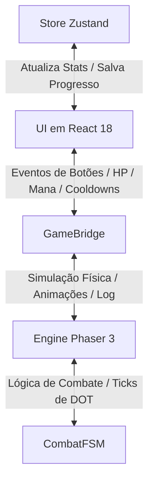
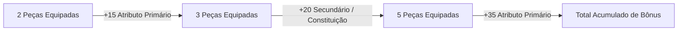
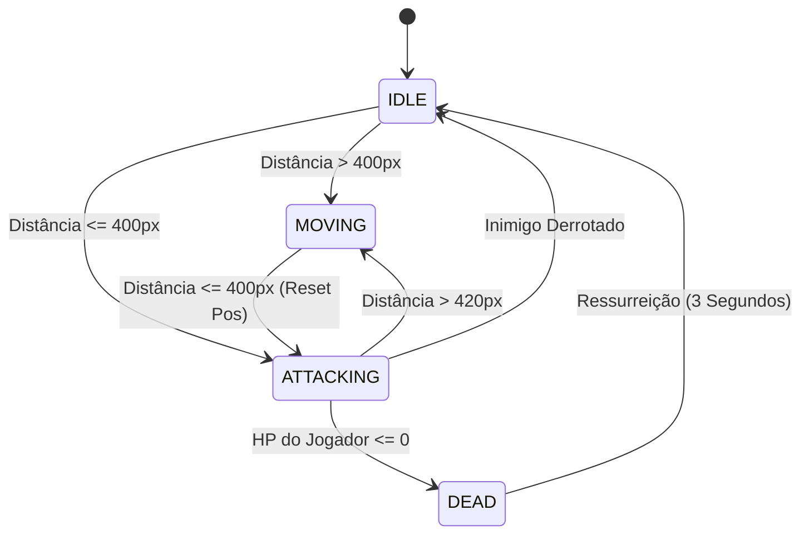

# Manual Técnico Definitivo - Amaro RPG Idle

Este documento serve como o manual interno oficial e especificação técnica para o projeto **Amaro RPG Idle**. Ele detalha todos os sistemas de jogo, fórmulas matemáticas, arquitetura de software, componentes de interface, mecânicas de progressão e o histórico de atualizações com base nas implementações reais contidas no código-fonte.

---

## 1. Visão Geral do Jogo

**Amaro RPG Idle** é um jogo de RPG incremental progressivo (*idle*) com elementos de *roguelite* (*ascensão*). O jogador gerencia um herói pertencente a uma de várias classes disponíveis, combatendo hordas de monstros e chefes em tempo real através de uma simulação gráfica 2D. O progresso é impulsionado pela aquisição de pontos de atributos, desbloqueio e aprimoramento de habilidades ativas e passivas, e equipagem de itens de raridades variadas com bônus de conjuntos (*sets*).

Ao encontrar barreiras de dificuldade causadas pelo escalonamento exponencial dos monstros, o jogador pode realizar a **Ascensão (Prestígio)**, trocando seu nível atual e progresso de fases por Pontos de Prestígio permanentes, que concedem aumentos robustos aos atributos primários para as rodadas seguintes.

---

## 2. Arquitetura e Engenharia de Software

O jogo é estruturado como uma aplicação web moderna que combina a renderização reativa com um motor de simulação de alta performance.

### A. Stack Tecnológica
*   **Front-End React (v18+)**: Responsável pela renderização de todas as janelas de menu, abas, árvores de upgrades, inventário e manipulação dos dados do personagem.
*   **Gerenciamento de Estado (Zustand)**: Toda a persistência, progresso do herói, inventário e níveis de classe são mantidos em uma store global reativa (`useGameStore`).
*   **Motor Gráfico (Phaser 3)**: Responsável pela cena gráfica 2D de combate, animações dos sprites dos personagens, renderização dos cenários (*parallax scroll*), efeitos visuais de habilidades, números flutuantes de dano e processamento do ciclo de combate físico.
*   **TypeScript (Strict Mode)**: Garante a tipagem estrita de todas as estruturas e interfaces do jogo, mitigando bugs de tempo de execução.

### B. O Canal de Comunicação: GameBridge
Para desacoplar a interface do usuário (React) do motor de simulação (Phaser), foi implementada uma ponte de comunicação assíncrona orientada a eventos chamada `GameBridge`.
O fluxo de dados ocorre através de um barramento de eventos compartilhado (`GameEvent`), garantindo que o Phaser saiba quando o jogador aciona uma habilidade e que o React atualize o HUD de HP/Mana em alta frequência sem re-renderizar componentes pesados.

#### Mapeamento de Eventos (`GameEvent`)
*   **Comandos da UI (React $\rightarrow$ Phaser)**:
    *   `ACTION_TRIGGERED`: Dispara o uso de uma habilidade ativa pelo jogador.
    *   `START_COMBAT`: Inicia ou retoma o loop de combate na cena.
    *   `END_COMBAT`: Pausa a simulação.
    *   `TOGGLE_AUTOCAST`: Ativa ou desativa a conjuração automática por IA das habilidades de ataque/cura.
*   **Feedback da Engine (Phaser $\rightarrow$ React / HUD)**:
    *   `PLAYER_HP_CHANGED`: Notifica a porcentagem, valor atual e valor máximo de HP do jogador (atualiza referências diretas na UI para evitar gargalos de renderização).
    *   `PLAYER_MANA_CHANGED`: Notifica a porcentagem, valor atual e valor máximo de mana do jogador.
    *   `LOG_EMITTED`: Envia mensagens de texto em tempo real sobre os eventos de combate para o console de logs de batalha.
    *   `COOLDOWNS_CHANGED`: Envia a tabela atualizada de recarga de habilidades ativas em milissegundos.
    *   `ENEMY_DEFEATED` e `STAGE_COMPLETED`: Atualizam o estado da fase e do bestiário no Zustand.



---

## 3. Interface do Usuário e Visual (UI/UX)

O jogo utiliza uma linguagem de design premium no estilo *Dark Mode* focada na legibilidade, organization de abas e usabilidade no desktop e dispositivos móveis.

### A. Paleta de Cores e Temática (WhatsApp Dark Style)
A interface é construída sobre uma paleta de tons escuros curados, proporcionando alto contraste para os elementos de RPG e cores vibrantes para indicar raridades e buffs:
*   **Fundo da Aplicação (`Background`)**: `#161717` (preto suave de baixo brilho).
*   **Superfícies e Painéis (`Surfaces`)**: `#1D1F1F` (cinza escuro para cards, abas e contêineres).
*   **Caixas de Texto e Inputs**: `#252727` (cinza médio para destacar elementos interativos secundários).
*   **Destaques de Dano e Recursos**:
    *   `HP / Vida`: Vermelho Vibrante (`#ef4444`)
    *   `Mana`: Azul Arcane (`#3b82f6`)
    *   `Cura / Restauração`: Verde Esmeralda (`#10b981`)
    *   `Dano Físico`: Laranja de Combate (`#f59e0b`)

### B. Elementos do HUD e Viewport
1.  **Combate Viewport (Phaser Canvas)**: Exibe em tempo real o herói do jogador e o monstro atual no cenário.
    *   **Escala e Tamanho**: Utiliza um `ZOOM_FACTOR` integrado de $1.35\times$ com tamanho base de sprites aumentado para $165\text{px}$ (personagem e monstros comuns) e $215\text{px}$ (chefes), proporcionando uma presença visual imponente na tela.
    *   **Textos de Identificação**: O nível do inimigo foi removido do nome flutuante acima do sprite para evitar redundâncias com o HUD de estágio.
    *   **Inimigos Elites**: O afixo de Elite (ex: `ELITE ENFURECIDO`) é renderizado centralizado em uma linha superior própria, imediatamente acima do nome do monstro.
    *   **Efeitos e Debuffs**: Debuffs ativos (como `[ATORDADO]` ou `[ENVENENADO]`) são posicionados dinamicamente no topo do título de Elite, garantindo leitura limpa da cena de combate.
    *   **Textos de Dano Flutuante**: O dano e efeitos são renderizados mais abaixo (sobre o corpo do alvo, deslocados $+65\text{px}$ em Y) e demoram mais tempo para sumir ($1.5\text{s}$ no dano de habilidades/ticks e $1.4\text{s}$ no dano de toques), subindo com velocidade reduzida para maior legibilidade.
    *   A base do cenário (*ground*) é travada verticalmente para manter o alinhamento visual durante a movimentação.
    *   **Cenários e Backgrounds (Mapeamento e Rolagem)**: O cenário de combate é renderizado em `TileSprite` de rolagem horizontal contínua (*sidescrolling*):
        *   *Mapeamento por Dificuldade/Fase*:
            *   Fases de Campanha Padrão (ciclo baseado no tema): Floresta (`medieval_background.png`), Deserto (`desert_background.png`), Neve (`snow_background.png`), Cemitério (`cemetery_background.png`) e Ruínas (`ruins_background.png`).
            *   Fases 21-30 (Purgatório): Cenário de cacos e cristais mágicos (`purgatory_background.png`).
            *   Fases 31+ (Pandemônio): Cenário vulcânico caótico sob medida de obsidiana e correntes arcanas (`pandemonium_background.png`).
            *   Modo Torre Infinita: Cenário da torre de tijolos cinza (`tower_background.png`).
        *   *Alinhamento do Chão*: Para garantir que os pés de heróis e monstros fiquem apoiados de forma natural, a linha de horizonte físico do solo na imagem original de `1024 x 1024` deve ser desenhada a exatamente **9% da borda inferior** (aproximadamente a 90 pixels de altura do rodapé), o que corresponde à altura de Y = 532.5 pixels renderizados no canvas (a 67.5 pixels do limite inferior do jogo).
        *   *Textura Seamless (Looping)*: A imagem deve possuir emendas perfeitas nas bordas laterais (loop contínuo) para que a rolagem por movimentação ocorra sem cortes.
2.  **HUD de Status**: Exibe duas barras horizontais (HP e Mana) com preenchimento colorido e contadores absolutos (`Valor Atual / Valor Máximo`), acompanhados da Fase Atual do jogo, progresso do Estágio (monstros eliminados de 20), velocidade da simulação e atalhos de controle de som.
3.  **Controle de Velocidade e Pausa**: Permite alterar o ritmo da simulação do Phaser ou pausar o jogo completamente (velocidades `⏸`, `1x`, `2x` e `3x`) usando multiplicadores temporais no relógio interno da cena. As velocidades mais rápidas possuem travas de segurança: a velocidade 2x é liberada após a primeira ascensão (`ascensionCount >= 1`), e a velocidade 3x é liberada a partir da quinta ascensão (`ascensionCount >= 5`).

### C. Estrutura do Menu de Abas
O painel inferior/lateral de gerenciamento é dividido em abas com transições suaves (`animate-tabFade` para evitar saltos bruscos de tela):
*   **Combate**: Console de logs de batalha detalhados e botões de atalho rápido das habilidades desbloqueadas, com overlay cinza semitransparente indicando o tempo de cooldown restante e botão de alternância do Auto-Cast (IA).
*   **Atributos**: Painel com os pontos de atributos livres para distribuição (+5 a cada nível), listagem dos atributos finais do personagem calculados em tempo real (Força, Magia, Destreza, Constituição e Sorte) e bônus passivos de classe. Inclui um seletor multiplicador de distribuição de pontos (`x1` / `x10` / `x100`) posicionado na mesma linha do cabeçalho "Atributos Primários" e alinhado perfeitamente com os botões de upgrades abaixo, permitindo investir pontos rapidamente com escala visual correspondente nos botões de ação. Os botões de distribuição suportam **pressionar e segurar** (hook `useHoldRepeat`): o primeiro clique aplica o valor imediatamente, após ~400ms de pressão contínua o incremento passa a repetir automaticamente a cada ~100ms (mouse ou toque), interrompendo assim que o botão é solto, sai do alcance do ponteiro ou os pontos disponíveis se esgotam.
*   **Habilidades**: Árvore visualizada de forma hierárquica por conexões de dependência. Permite comprar ou aprimorar (até nível 5 por padrão, estendendo-se até o nível 10 nas dificuldades Inferno e Apocalipse) habilidades ativas e passivas da classe atual utilizando Pontos de Habilidade adquiridos por nível. Assim como os botões de Atributos, os botões "Aprimorar" (tanto no modal desktop quanto na lista expansível mobile) suportam pressionar e segurar para aplicar múltiplos níveis em sequência sem cliques repetidos.
*   **Equipamento**: Grade de inventário com 30 slots exibindo itens recolhidos por drop. Possui um conjunto de slots de equipagem ativa (`Cabeça`, `Torso`, `Pernas`, `Mãos` e `Arma`). Ao clicar em um item, abre-se um painel de detalhes local absoluto contendo atributos, raridade e bônus de conjunto.
*   **Ascensão**: Exibe estatísticas acumuladas, a quantidade de Pontos de Prestígio (PP) que o jogador ganhará se resetar agora, os requisitos mínimos de PP e o painel de Upgrades Permanentes de Ascensão.
*   **Bestiário**: Enciclopédia de monstros catalogados no jogo. Mostra a ilustração transparente de cada monstro e uma contagem de abates acumulados.
*   **Guia**: Central de documentação interna com regras e tutoriais.
*   **Saves**: Gerenciador de progresso com suporte a seis slots independentes e recursos de Importação/Exportação através de criptografia textual leve.
*   **Opções**: Centraliza configurações do jogo e preferências de Qualidade de Vida (QoL) do jogador, incluindo áudio, console de combate, formatação de números, auto-venda de equipamentos dropados e controle do robô assistente.

### D. Posicionamento Inteligente de Modais (Refatoração)
Os modais informativos de itens no inventário e detalhes de monstros no bestiário foram convertidos de contêineres fixos globais (comuns em interfaces web tradicionais que causam bloqueio de interatividade) para **modais locais com posicionamento absoluto**. Eles são renderizados diretamente dentro da hierarquia da aba ativa. Isso garante que o scroll continue funcionando normalmente, evita o transbordo visual (*clipping*) e assegura a usabilidade ideal em resoluções desktop comuns e telas mobile.

### E. Opções do Jogo e Qualidade de Vida (QoL)
A aba **Opções** centraliza recursos voltados a personalizar a experiência de jogo e automatizar tarefas repetitivas, salvando as preferências do usuário localmente em `localStorage`.

1.  **Configurações de Áudio**:
    *   **Música de Fundo (BGM)**: Permite ligar ou desligar a música de fundo do jogo.
    *   **Efeitos Sonoros (SFX)**: Permite habilitar ou desabilitar todos os efeitos sonoros de cliques, golpes e magias.
    *   *Nota: Os controles rápidos de áudio foram retirados do cabeçalho principal e centralizados inteiramente nesta aba.*

2.  **Visual & Interface**:
    *   **Console de Combate**: Permite mostrar ou esconder os logs de combate em tempo real que aparecem no rodapé da aba Combate.
    *   **Abreviar Números Grandes**: Quando ativado, os números exibidos na interface (como ouro do jogador, valor de venda de itens) e no console de logs de combate (como danos físicos, mágicos, DOTs de veneno/queimadura e curas) são abreviados utilizando sufixos compactos (K para milhares, M para milhões, B para bilhões, T para trilhões). Quando desativado, os valores são exibidos inteiramente como números inteiros.
        *   *Exemplo*: `10.500` é formatado como `10.5K`; `1.000.000` é formatado como `1M`.
    *   **Modo de Economia**: Voltado para prolongar a bateria e reduzir o custo gráfico em sessões *idle* longas ou dispositivos mais fracos. Quando ativado (`economyModeEnabled`, persistido em `localStorage` como as demais preferências), a cena de combate (`CombatScene.ts`) para de renderizar completamente os textos flutuantes de dano (`spawnDamageText`) e o efeito de toque/crítico (`spawnTouchEffect`, incluindo o círculo de impacto), e o laço de renderização do Phaser é limitado a `targetFps = 15` (contra os `60`fps padrão; o mesmo teto de `15`fps já aplicado quando a aba Cidadela está em primeiro plano). A alternância é refletida em tempo real via `useGameStore.subscribe`, sem necessidade de reiniciar o combate.

3.  **Automação & QoL**:
    *   **Auto-venda de Equipamentos Comuns**: Se habilitado, qualquer equipamento de raridade **Comum** dropado por monstros é vendido instantaneamente no momento do drop, adicionando seu valor correspondente em ouro diretamente à carteira do jogador, sem ocupar espaço no inventário.
    *   **Auto-venda de Equipamentos Raros**: Se habilitado, qualquer equipamento de raridade **Raro** dropado por monstros é vendido instantaneamente no momento do drop por ouro, otimizando o fluxo de esvaziamento do inventário.
    *   **Desativar Robô Assistente**: Permite desativar as ações de clique automático geradas pelo upgrade permanente de prestígio "Robô Assistente", permitindo que jogadores testem o desempenho puro de sua classe sem a interferência da automação ou joguem de forma estritamente ativa.

### F. Navegação por Gestos (Mobile Swipe)
Para melhorar a experiência de usabilidade em dispositivos móveis, foi adicionado suporte a gestos de arrastar (*swipe*) horizontal no painel de interface principal (`game-ui-root`):
*   **Swipe para a Esquerda**: Avança para a próxima aba à direita (ex.: de *Combate* para *Atributos*).
*   **Swipe para a Direita**: Retorna para a aba anterior à esquerda (ex.: de *Atributos* para *Combate*).
*   **Trava de Segurança e Prevenção de Conflitos**: O sistema detecta se o gesto é predominantemente horizontal (variação horizontal pelo menos 1.5 vezes maior que a vertical) para não conflitar com a rolagem vertical de listas e tabelas. Adicionalmente, gestos iniciados em elementos interativos com arrasto próprio (como sliders de configuração e a árvore de habilidades rolável horizontalmente `.tree-container`) são ignorados automaticamente para preservar a jogabilidade e usabilidade nativas.

### G. Padrão Técnico e Visual para Sprites (Ativos Gráficos)
Para garantir a coesão visual e o funcionamento adequado dos efeitos de transparência dinâmica na engine Phaser, todas as artes de heróis e monstros devem seguir estritamente as especificações abaixo:
1.  **Estilo Artístico (Pixel Art de Alta Densidade - 512-bit / HD)**:
    *   Os sprites não devem utilizar pixels excessivamente grandes/rústicos (estilo 8-bit ou 16-bit clássicos) e também não devem ser ilustrações vetoriais completamente lisas.
    *   Devem adotar um estilo de pixel art moderno e de alta densidade (equivalente a 512-bit ou superior em uma grade 1024x1024), caracterizado por contornos pretos finos e nítidos, pelagens ou superfícies com texturas de micro-pixels feitas à mão, e transições de sombreamento/dithering bem definidas.
2.  **Dimensões da Imagem**:
    *   Tamanho padrão de arquivo: `1024 x 1024` pixels.
    *   A arte deve estar centralizada horizontalmente no canvas da imagem.
3.  **Fundo da Imagem (Tratamento de Transparência)**:
    *   O fundo deve ser **branco puro sólido (`#FFFFFF`)**, sem nenhum ruído, degradê ou variação de cor.
    *   **Evitar Branco Puro Interno**: Não use a cor branca pura (`#FFFFFF` ou RGB `255,255,255`) na parte interna do corpo, armaduras, armas, olhos ou dentes dos personagens/monstros. Como a engine remove o branco puro com uma tolerância de 30 para criar a transparência, usar `#FFFFFF` ou tons de off-white excessivamente claros internamente causará furos transparentes no meio do sprite em jogo. Use tons mais escuros, cinzas opacos ou off-white bem marcados (abaixo de 220 nos canais de cor) para as áreas internas de metal e brilhos.
    *   Não são permitidas auras, brilhos coloridos, efeitos de iluminação externa (*outer glow*) ou suavizações com anti-aliasing em tons de cinza na borda externa dos sprites, pois a função `makeTextureTransparent` remove o branco puro. Qualquer ruído causará uma borda branca desagradável ao redor do monstro no jogo.
4.  **Sombra Sob os Pés (Drop Shadow)**:
    *   Todo combatente deve conter uma **sombra elíptica preta sólida absoluta (`#000000`)** sob os pés/patas.
    *   A sombra não deve ter degradês, transparências (*opacidade reduzida*) ou bordas esfumaçadas. Deve ser preta 100% opaca.
    *   A elipse de sombra deve estar perfeitamente alinhada e em contato direto com a base dos pés do personagem, garantindo que o sprite pareça assentado corretamente no chão do cenário de combate.

### H. Persistência da Tela Ativa (Wake Lock)
Para evitar que o dispositivo móvel apague ou bloqueie a tela durante sessões longas de jogo *idle*, foi implementado o hook `useWakeLock` (`src/hooks/useWakeLock.ts`), consumido em `App.tsx`:
*   **Screen Wake Lock API Nativa**: Utiliza `navigator.wakeLock.request('screen')`, sem dependências externas, com checagem de suporte (`'wakeLock' in navigator`) para não quebrar em navegadores/versões que não implementam a API.
*   **Ativação Condicionada à Tela de Jogo**: O lock é solicitado apenas enquanto `screen === 'playing'`, sendo liberado (`sentinel.release()`) automaticamente ao retornar ao Menu, à Seleção de Classe ou aos Saves, evitando manter a tela ligada desnecessariamente fora do combate.
*   **Reaquisição em `visibilitychange`**: O sistema operacional libera o wake lock automaticamente sempre que a aba fica oculta (troca de app, tela bloqueada manualmente). O hook escuta o evento `visibilitychange` do documento e readquire o lock assim que a aba volta a ficar visível, sem exigir nenhuma ação do jogador.

### I. Sistema de Música de Fundo (BGM) Temática por Fase
A trilha sonora do jogo é inteiramente sintetizada em tempo real via Web Audio API (`AudioManager.ts`, `bgmThemes.ts`), sem uso de arquivos de áudio externos. Seis temas distintos, cada um com sua própria progressão de acordes, timbres de osciladores (`sine`/`triangle`/`square`/`sawtooth` por camada de baixo, arpejo e melodia) e andamento, são associados às fases de dificuldade da campanha:
*   **Normal (Fases 1-5)** — "Fantasia Sombria (Lá Menor)": tema original do jogo, arpejo sereno em Lá Menor Natural.
*   **Pesadelo (Fases 6-10)** — "Vigília Amaldiçoada (Lá Menor Diminuta)": progressão diminuta e dissonante, andamento levemente acelerado.
*   **Inferno (Fases 11-15)** — "Fornalha Abissal (Mi Menor Grave)": acordes graves e pesados com sub-bass reforçado, osciladores mais densos.
*   **Apocalipse (Fases 16-20)** — "Corrida do Juízo Final (Ré Menor Urgente)": staccato urgente e andamento acelerado, timbres em `square`/`sawtooth`.
*   **Purgatório (Fases 21-30)** — "Véu Suspenso (Sol Sus Etéreo)": intervalos abertos e suspensos (sus2/sus4), andamento mais lento e atmosfera etérea.
*   **Pandemônio (Fase 31+)** — "Caos Primordial (Cluster Dissonante)": clusters de semitons em dissonância máxima, andamento bem acelerado.
*   **Seleção de Fase**: a função `getPhaseForStage(character.currentStage)` (`bgmThemes.ts`) determina o tema ativo a partir do estágio de combate atual do personagem, usando os mesmos limiares de fase do `CombatFSM.ts` (Normal 1-5, Pesadelo 6-10, Inferno 11-15, Apocalipse 16-20, Purgatório 21-30, Pandemônio 31+). A troca de tema é detectada reativamente via `useGameStore.subscribe` dentro do `AudioManager`, reiniciando o loop de BGM (`stopBGM()` + `startBGM()`) sempre que a fase muda enquanto a música está tocando.
*   **Torre Infinita e Cidadela**: como a seleção de tema depende exclusivamente do `currentStage` do personagem — não da tela ativa — tanto a Torre Infinita quanto a Cidadela automaticamente herdam a música da fase vigente do jogador, sem trilha sonora própria.

---

## 4. Sistema de Classes e Maestria

### Criação de Personagem: Nome e Classe
Antes de iniciar uma nova jornada, o jogador define um **nome de personagem** (campo `name: string` na interface `Character`, `src/core/types.ts`) na tela de Seleção de Classe (`CharacterSelect.tsx`). O nome é digitado em um campo de texto (limite de 20 caracteres, obrigatório e sujeito a `trim()`) posicionado acima da grade/carrossel de classes; o botão "Iniciar Jornada" permanece desabilitado até que um nome válido seja informado. O valor é propagado via `startNewGame(classId, name)` até `DEFAULT_CHARACTER(classId, name)` na store, e substitui o nome da classe como identificação do herói no cabeçalho do painel de Atributos e no texto flutuante acima do sprite do jogador na cena de combate (`playerNameText`, `CombatScene.ts`). Personagens salvos antes da introdução deste campo (sem `name` persistido) recebem como *fallback* o nome da própria classe (`CLASS_CONFIGS[classId].name`), preservando a compatibilidade com saves antigos sem exigir migração de dados.

O jogo possui oito classes distintas: três classes primárias disponíveis desde o início, três classes secundárias avançadas desbloqueadas através do progresso de classe, uma classe avançada especial de endgame (Necromante) e uma classe suprema transcendental de pós-endgame (Avatar, detalhada na Seção 11.E).

### A. Desbloqueio de Classes Secundárias e Especiais (Roguelite)
As classes avançadas secundárias requerem dedicação a uma classe primária específica e são desbloqueadas quando o jogador alcança pelo menos o **Nível 50** na classe base correspondente. O progresso de classe é persistido globalmente através da chave `medieval_idle_global_class_levels` no armazenamento local do navegador. Quando o jogador realiza resets, ascensões ou cria novos jogos em slots alternativos, a permissão das classes avançadas é mantida.
*   **Paladino (`Paladin`)**: Requer Guerreiro (`Warrior`) Nível $\ge 50$.
*   **Clérigo (`Cleric`)**: Requer Mago (`Mage`) Nível $\ge 50$.
*   **Ladrão (`Rogue`)**: Requer Arqueiro (`Ranger`) Nível $\ge 50$.
*   **Necromante (`Necromancer`)**: Requer as duas classes secundárias avançadas, **Clérigo Nível 50 e Ladrão Nível 50**, independentemente do slot de salvamento ativo.
*   **Avatar (`avatar`)**: Requer possuir o talento *Avatar Pleno* na árvore de Transcendência (`transcendenceUpgrades.avatar_pleno > 0`) — não depende de nível de classe base nem de nenhum outro atalho. Ver Seção 11.E para a mecânica completa.

### B. Atributos Iniciais e Taxas de Crescimento
Cada classe possui uma distribuição distinta de atributos base e ganha bônus diferentes automaticamente a cada passagem de nível (*Level Up*), conforme detalhado na tabela abaixo:

| Classe | Descrição de Combate | Principal Atributo | Força (Base / Cresc.) | Magia (Base / Cresc.) | Destreza (Base / Cresc.) | Const. (Base / Cresc.) | Sorte (Base / Cresc.) |
| :--- | :--- | :--- | :---: | :---: | :---: | :---: | :---: |
| **Guerreiro** | Combatente corpo a corpo robusto de alto dano físico e defesa. | Força | 12 / +2.0 | 4 / +0.5 | 8 / +1.0 | 14 / +2.5 | 5 / +0.5 |
| **Mago** | Conjurador arcano focado em magias explosivas elementais. | Magia | 4 / +0.5 | 15 / +3.0 | 7 / +1.0 | 8 / +1.0 | 5 / +0.5 |
| **Arqueiro** | Atirador ágil que aplica venenos e dispara flechas rápidas. | Destreza | 6 / +1.0 | 5 / +0.5 | 15 / +3.0 | 9 / +1.5 | 8 / +0.8 |
| **Paladino** | Protetor sagrado de altíssimo HP cuja força escala com defesa. | Constituição | 10 / +1.5 | 6 / +1.0 | 5 / +0.5 | 16 / +3.0 | 5 / +0.5 |
| **Clérigo** | Mestre sagrado especializado em curas massivas e expor inimigos. | Magia | 7 / +1.0 | 13 / +2.5 | 5 / +0.5 | 11 / +2.0 | 6 / +0.6 |
| **Ladrão** | Assassino ágil de acertos críticos com foco em venenos e força. | Destreza | 8 / +1.5 | 3 / +0.5 | 16 / +3.0 | 8 / +1.0 | 10 / +1.0 |
| **Necromante** | Mestre da morte que drena os vivos e comanda lacaios profanos. | Magia | 5 / +0.8 | 15 / +3.2 | 6 / +0.8 | 10 / +1.8 | 12 / +1.5 |
| **Avatar** | Fusão de todas as energias; escala dinamicamente com o maior atributo ativo (ver Seção 11.E). | *Maior Atributo Ativo* | 15 / +2.5 | 15 / +2.5 | 15 / +2.5 | 15 / +2.5 | 15 / +2.5 |

### C. Fórmulas de Atributos Derivados (Balanceamento de Utilidade)
Para garantir um combate equilibrado e incentivar a distribuição diversificada de pontos, o jogo aplica um sistema de **escalonamento dinâmico**. Atributos que servem como fonte primária de dano para uma classe concedem bônus reduzidos aos status secundários (como HP Máximo ou regenerações), enquanto as demais classes se beneficiam de uma escala amplificada nesses mesmos atributos.

#### 1. Vida Máxima (HP), Regeneração e Redução de Dano
A Vida Máxima, a Regeneração de HP e a resistência a danos escalam a partir do atributo **Constituição**:
*   **Classes Primárias de Constituição (Paladino)**:
    *   HP Máximo ganho por ponto de Constituição: $8\text{ HP}$
    *   Regeneração de HP ganha por ponto de Constituição: $0.03\text{ HP/s}$
*   **Outras Classes (Guerreiro, Mago, Arqueiro, Clérigo, Ladrão)**:
    *   HP Máximo ganho por ponto de Constituição: $18\text{ HP}$ (incentiva classes frágeis a investirem em sobrevivência)
    *   Regeneração de HP ganha por ponto de Constituição: $0.08\text{ HP/s}$
*   **Redução de Dano Recebido (Todas as Classes)**:
    *   Cada ponto de Constituição reduz em $0.05\%$ todo o dano recebido por ataques de monstros, com um limite máximo de $95\%$ de redução total para fins de equilíbrio de jogabilidade.

#### 2. Mana Máxima e Regeneração
A Mana Máxima e a Regeneração de Mana escalam a partir do atributo **Magia**:
*   **Classes Primárias de Magia (Mago, Clérigo, Necromante)**:
    *   Mana Máxima ganha por ponto de Magia: $6\text{ Mana}$ (previne mana infinita e uso descontrolado de auto-cast)
    *   Regeneração de Mana ganha por ponto de Magia: $0.02\text{ Mana/s}$
*   **Outras Classes (Guerreiro, Arqueiro, Paladino, Ladrão)**:
    *   Mana Máxima ganha por ponto de Magia: $18\text{ Mana}$ (torna viável conjurar habilidades táticas com poucos pontos investidos)
    *   Regeneração de Mana ganha por ponto de Magia: $0.05\text{ Mana/s}$

#### 3. Velocidade de Ataque (Attack Speed) e Esquiva (Dodge)
A velocidade com que o herói realiza ataques básicos e sua chance de se esquivar de ataques inimigos escalam a partir do atributo **Destreza**, através de uma **raiz quadrada** (para evitar crescimento linear descontrolado em fases avançadas):
$$\text{Velocidade de Ataque} = \left(1 + \sqrt{\text{Destreza}} \times \text{Fator de Destreza}\right) \times \text{Bônus de Velocidade de Habilidades} \times \left(1 + \text{Bônus de Set/Colar/Academia}\right)$$
*   **Classes Primárias de Destreza (Arqueiro, Ladrão)**: $\text{Fator de Destreza} = 0.15$
*   **Outras Classes (Guerreiro, Mago, Paladino, Clérigo)**: $\text{Fator de Destreza} = 0.40$ (compensa a menor Destreza base dessas classes)
*   O multiplicador final de velocidade é limitado a um teto de **$15\times$**.
*   **Esquiva (Todas as Classes)**:
    $$\text{Chance de Esquiva} = \min\left(75\%,\ \text{Destreza} \times 0.1\% + \text{Ascensões} \times 0.5\%\right)$$
    Cada ponto de Destreza concede $+0.1\%$ de Chance de Esquiva, e cada Ascensão realizada soma $+0.5\%$ adicional, com limite de até $75\%$ de esquiva máxima para fins de balanceamento do jogo.

#### 4. Drop, Ouro e Crítico (Sorte)
O atributo **Sorte** influencia a probabilidade e qualidade dos itens derrubados, o ouro ganho e também o desempenho em combate ativamente através do clique:
*   **Chance de Drop (Monstros Normais)**:
    $$\text{Chance} = \min\left(50\%, 5\% + \text{Sorte} \times 0.2\% + \text{Bônus de Relíquia} + \text{Bônus de Colar (}dropChancePct\text{)}\right)$$
*   **Multiplicador de Ouro** (escala por raiz quadrada, ver também Seção 13.B):
    $$\text{Bônus} = 1 + \frac{\sqrt{\text{Sorte Final}}}{10}$$
*   **Chance de Crítico**:
    Cada ponto de Sorte adiciona $+0.05\%$ de Chance de Crítico (cumulativo com itens e upgrades de prestígio).
*   **Dano Crítico**:
    Cada ponto de Sorte adiciona $+0.2\%$ de Dano Crítico (cumulativo com itens e upgrades de prestígio).
*   **Multiplicador Especial do Necromante**: O Necromante possui um bônus que faz com que o dano de suas habilidades de combate aumente em $+0.1\%$ para cada 1 ponto de Sorte.

> **Nota de nomenclatura (histórico, resolvido na v6.0.0)**: as stats `critChance`/`critDamage` (`BaseStats`) se chamavam `touchCritChance`/`touchCritDamage` até a v6.0.0 — resquício de quando o crítico só existia no clique/tap. Elas sempre foram, na prática, o **único sistema de crítico do jogo**: o mesmo roll e o mesmo multiplicador são reutilizados literalmente nos três pontos de cálculo de dano em `CombatFSM.ts` (toque, ataque básico e habilidades), nunca existiu uma stat de crítico separada para ataque básico/habilidades. O prefixo "touch" foi removido de `BaseStats`, `StatEngine.ts`, `CombatFSM.ts`, `useGameStore.ts` (incluindo os upgrades de prestígio `perm_touch_crit`/`perm_touch_crit_dmg`, cujo campo `stat:` interno passou de `'touchCritChance'`/`'touchCritDamage'` para `'critChance'`/`'critDamage'`), `GameUI.tsx`, `ForgeView.tsx` e `VaultPanel.tsx` (rótulos e `PERCENT_STATS`) para refletir isso — sem migração de saves (decisão consciente do desenvolvedor, projeto ainda em fase de testes internos). Já `touchDamageMult` continua com o nome original por ser genuinamente exclusivo do toque (não entra na fórmula de ataque básico nem de habilidades).

#### 5. Penetração de Armadura e Dano Geral (Força)
Além dos modificadores de classe e bônus secundários em ataques físicos, o atributo **Força** concede um aumento passivo global de dano:
*   **Aumento de Dano (Todas as Classes)**:
    Cada ponto de Força adiciona $+0.05\%$ de aumento no dano final causado pelo jogador (penetração de armadura). Este bônus é multiplicativo e aplica-se tanto a ataques básicos quanto a todas as habilidades de ataque.

---

## 5. Sistema de Equipamentos e Inventário

O herói pode encontrar e equipar peças de equipamentos derrubados por monstros para somar atributos diretamente aos seus valores base.

### A. Raridades e Distribuição de Atributos
*   **Comum (`common`)**: Concede bônus em apenas **1 atributo** aleatório da lista de atributos viáveis para a classe do jogador. O nome recebe o sufixo "Rústico".
*   **Raro (`rare`)**: Concede bônus em **2 atributos** distintos. O nome é associado ao conjunto temático da classe ativa (ex: "Peitoral do Senhor da Guerra").
*   **Lendário (`legendary`)**: Concede bônus em **3 atributos** distintos. Possui multiplicador de escala alto e nome associado ao conjunto temático da classe.
*   **Ancestral (`ancestral`)**: Concede bônus em **3 atributos** de altíssima escala. Disponível apenas para jogadores que realizaram a primeira Ascensão (`ascensionCount >= 1`), com taxa de drop de 10% sob itens normais, gerando apenas o set temático da classe ativa no momento do combate. Atributos base gerados com multiplicador de escala místico de $4.5\times$ (superior ao $2.5\times$ lendário). Identificado visualmente por uma borda tracejada em tom violeta, brilho místico pulsante e indicador estelar no slot.
*   **Celestial (`celestial`)**: Equipamento de tier supremo disponível como drop especial na campanha do Purgatório apenas após derrotar o chefe da Fase 30 (`boss_crystal_guardian`) pela segunda vez em diante. Possui 10% de chance de substituir os drops normais. Concede bônus em **3 atributos** de escala divina com multiplicador de atributos de **$6.0\times$**. Os itens deste set recebem um bônus especial de **$2.0\times$** em seu valor de venda por ouro.

O valor final de cada atributo concedido pelo item é calculado com base na Fase atual do combate onde o item caiu:
$$\text{Atributo do Item} = \max\left(1, \text{round}\left( \text{Fase} \times \text{Multiplicador Raridade} \times \text{Random}(0.8, 1.2) \right)\right)$$
*Onde o $\text{Multiplicador Raridade}$ é $1.0$ para Comum, $1.5$ para Raro, $2.5$ para Lendário, $4.5$ para Ancestral e $6.0$ para Celestial.*

### B. Bônus de Conjunto (Sets)
Equipar múltiplos itens raros, lendários ou ancestrais pertencentes ao mesmo conjunto de classe ativa libera bônus adicionais de atributos acumulativos a partir de 2, 3 e 5 peças:



*   **Set do Senhor da Guerra (`warrior`)**:
    *   2 peças: $+15$ Força
    *   3 peças: $+20$ Constituição
    *   5 peças: $+35$ Força *(Total acumulado: +50 Str, +20 Con)*
*   **Set do Mestre Arcano (`mage`)**:
    *   2 peças: $+15$ Magia
    *   3 peças: $+20$ Constituição
    *   5 peças: $+35$ Magia *(Total acumulado: +50 Magic, +20 Con)*
*   **Set do Rastreador das Sombras (`ranger`)**:
    *   2 peças: $+15$ Destreza
    *   3 peças: $+20$ Constituição
    *   5 peças: $+35$ Destreza *(Total acumulado: +50 Dex, +20 Con)*
*   **Set do Guardião Divino (`paladin`)**:
    *   2 peças: $+15$ Constituição
    *   3 peças: $+20$ Força
    *   5 peças: $+35$ Constituição *(Total acumulado: +50 Con, +20 Str)*
*   **Set do Sumosacerdote (`cleric`)**:
    *   2 peças: $+15$ Magia
    *   3 peças: $+20$ Constituição
    *   5 peças: $+35$ Magia *(Total acumulado: +50 Magic, +20 Con)*
*   **Set do Assassino Fantasma (`rogue`)**:
    *   2 peças: $+15$ Destreza
    *   3 peças: $+20$ Força
    *   5 peças: $+35$ Destreza *(Total acumulado: +50 Dex, +20 Str)*
*   **Set do Arauto da Ceifa (`necromancer`)**:
    *   2 peças: $+15$ Magia
    *   3 peças: $+20$ Constituição
    *   5 peças: $+35$ Magia *(Total acumulado: +50 Magic, +20 Con)*
*   **Set do Avatar Celestizado (`avatar`)** [Dropado na Ecoterra]:
    *   2 peças: $+10$ Força, $+10$ Magia, $+10$ Destreza
    *   3 peças: $+15$ Constituição, $+15$ Sorte
    *   5 peças: $+20$ em todos os atributos primários *(Total acumulado: +30 For/Mag/Des, +35 Con/Sor)*

*   **Sets Ancestrais (Pós-Ascensão)**:
    Estes conjuntos são liberados apenas após a primeira ascensão do personagem e garantem bônus de atributos extremamente superiores, além de mecânicas únicas de toque e combate:
    *   **Bônus Especiais de Conjunto**:
        *   **3 peças**: Multiplicador de dano de toque duplicado ($2.0\times$ Touch Damage).
        *   **5 peças**: $+15\%$ de Dano Final Global.
    *   **Set Ancestral do Conquistador (`warrior`)**:
        *   2 peças: $+80$ Força
        *   3 peças: $+100$ Constituição, $+50$ Sorte
        *   5 peças: $+200$ Força *(Total acumulado: +280 Força, +100 Con, +50 Sorte)*
    *   **Set Ancestral do Arquimago (`mage`)**:
        *   2 peças: $+80$ Magia
        *   3 peças: $+100$ Constituição, $+50$ Sorte
        *   5 peças: $+200$ Magia *(Total acumulado: +280 Magia, +100 Con, +50 Sorte)*
    *   **Set Ancestral do Caçador Estelar (`ranger`)**:
        *   2 peças: $+80$ Destreza
        *   3 peças: $+100$ Constituição, $+50$ Sorte
        *   5 peças: $+200$ Destreza *(Total acumulado: +280 Destreza, +100 Con, +50 Sorte)*
    *   **Set Ancestral do Sentinela Eterno (`paladin`)**:
        *   2 peças: $+80$ Constituição
        *   3 peças: $+100$ Força, $+50$ Sorte
        *   5 peças: $+200$ Constituição *(Total acumulado: +280 Constituição, +100 For, +50 Sorte)*
    *   **Set Ancestral do Sábio Divino (`cleric`)**:
        *   2 peças: $+80$ Magia
        *   3 peças: $+100$ Constituição, $+50$ Sorte
        *   5 peças: $+200$ Magia *(Total acumulado: +280 Magia, +100 Con, +50 Sorte)*
    *   **Set Ancestral do Ceifador de Almas (`rogue`)**:
        *   2 peças: $+80$ Destreza
        *   3 peças: $+100$ Força, $+50$ Sorte
        *   5 peças: $+200$ Destreza *(Total acumulado: +280 Destreza, +100 For, +50 Sorte)*
    *   **Set Ancestral do Senhor dos Ecos Perdidos (`necromancer`)**:
        *   2 peças: $+80$ Magia
        *   3 peças: $+100$ Constituição, $+50$ Sorte
        *   5 peças: $+200$ Magia *(Total acumulado: +280 Magia, +100 Con, +50 Sorte)*
    *   **Set Ancestral da Totalidade (`avatar`)** [Forjado no Altar de Fusão Mística]:
        *   2 peças: $+50$ Força, $+50$ Magia, $+50$ Destreza
        *   3 peças: $+80$ Constituição, $+80$ Sorte
        *   5 peças: $+120$ em todos os atributos primários *(Total acumulado: +170 For/Mag/Des, +200 Con/Sor)*

*   **Sets Pandemoníacos (Exclusivos do Modo Pandemônio)**:
    Estes conjuntos de tier supremo são obtidos apenas derrotando inimigos na dificuldade Pandemônio (Fase 21+) e possuem atributos extraordinários, além de mecânicas de sobrevivência e agressividade:
    *   **Bônus Especiais de Conjunto**:
        *   **3 peças**: $+5\%$ de Roubo de Vida (Lifesteal) baseado em todo o dano direto infligido.
        *   **5 peças**: $+25\%$ de Dano Final Global e $+10\%$ de Vida Máxima.
    *   **Set Pandemoníaco do Destruidor (`warrior`)**:
        *   2 peças: $+250$ Força
        *   3 peças: $+300$ Constituição, $+150$ Sorte
        *   5 peças: $+600$ Força *(Total acumulado: +850 Força, +300 Con, +150 Sorte)*
    *   **Set Pandemoníaco do Feiticeiro do Vazio (`mage`)**:
        *   2 peças: $+250$ Magia
        *   3 peças: $+300$ Constituição, $+150$ Sorte
        *   5 peças: $+600$ Magia *(Total acumulado: +850 Magia, +300 Con, +150 Sorte)*
    *   **Set Pandemoníaco do Franco-Atirador (`ranger`)**:
        *   2 peças: $+250$ Destreza
        *   3 peças: $+300$ Constituição, $+150$ Sorte
        *   5 peças: $+600$ Destreza *(Total acumulado: +850 Destreza, +300 Con, +150 Sorte)*
    *   **Set Pandemoníaco do Vingador Sagrado (`paladin`)**:
        *   2 peças: $+250$ Constituição
        *   3 peças: $+300$ Força, $+150$ Sorte
        *   5 peças: $+600$ Constituição *(Total acumulado: +850 Constituição, +300 Força, +150 Sorte)*
    *   **Set Pandemoníaco do Sumo-Inquisidor (`cleric`)**:
        *   2 peças: $+250$ Magia
        *   3 peças: $+300$ Constituição, $+150$ Sorte
        *   5 peças: $+600$ Magia *(Total acumulado: +850 Magia, +300 Con, +150 Sorte)*
    *   **Set Pandemoníaco do Executor (`rogue`)**:
        *   2 peças: $+250$ Destreza
        *   3 peças: $+300$ Força, $+150$ Sorte
        *   5 peças: $+600$ Destreza *(Total acumulado: +850 Destreza, +300 Força, +150 Sorte)*
    *   **Set Pandemoníaco do Devorador de Almas (`necromancer`)**:
        *   2 peças: $+250$ Magia
        *   3 peças: $+300$ Constituição, $+150$ Sorte
        *   5 peças: $+600$ Magia *(Total acumulado: +850 Magia, +300 Con, +150 Sorte)*
    *   **Set Pandemoníaco do Eco Supremo (`avatar`)** [Dropado no Modo Pandemônio (Fases 21+)]:
        *   2 peças: $+150$ Força, $+150$ Magia, $+150$ Destreza
        *   3 peças: $+200$ Constituição, $+200$ Sorte
        *   5 peças: $+350$ em todos os atributos primários *(Total acumulado: +500 For/Mag/Des, +550 Con/Sor)*

*   **Sets Celestiais (Tier Supremo - Pós-Purgatório Fase 30)**:
    Estes conjuntos representam a progressão máxima de endgame e são liberados após vencer o Guardião dos Cacos duas ou mais vezes no Purgatório. Possuem atributos celestiais e impulsionam ao extremo a velocidade e automação:
    *   **Bônus Especiais de Conjunto**:
        *   **3 peças**: $+2$ cliques por segundo adicionais gerados pelo Robô Assistente.
        *   **5 peças**: $+40\%$ de Dano Final Global, $+20\%$ de Vida Máxima e $+10\%$ de Velocidade de Ataque (Attack Speed).
    *   **Set Celestial do Semideus (`warrior`)**:
        *   2 peças: $+160$ Força
        *   3 peças: $+200$ Constituição, $+100$ Sorte
        *   5 peças: $+400$ Força *(Total acumulado: +560 Força, +200 Con, +100 Sorte)*
    *   **Set Celestial do Senhor do Tempo (`mage`)**:
        *   2 peças: $+160$ Magia
        *   3 peças: $+200$ Constituição, $+100$ Sorte
        *   5 peças: $+400$ Magia *(Total acumulado: +560 Magia, +200 Con, +100 Sorte)*
    *   **Set Celestial do Observador Estelar (`ranger`)**:
        *   2 peças: $+160$ Destreza
        *   3 peças: $+200$ Constituição, $+100$ Sorte
        *   5 peças: $+400$ Destreza *(Total acumulado: +560 Destreza, +200 Con, +100 Sorte)*
    *   **Set Celestial do Arcanjo (`paladin`)**:
        *   2 peças: $+160$ Constituição
        *   3 peças: $+200$ Força, $+100$ Sorte
        *   5 peças: $+400$ Constituição *(Total acumulado: +560 Constituição, +200 Força, +100 Sorte)*
    *   **Set Celestial do Serafim (`cleric`)**:
        *   2 peças: $+160$ Magia
        *   3 peças: $+200$ Constituição, $+100$ Sorte
        *   5 peças: $+400$ Magia *(Total acumulado: +560 Magia, +200 Con, +100 Sorte)*
    *   **Set Celestial do Espectro Astral (`rogue`)**:
        *   2 peças: $+160$ Destreza
        *   3 peças: $+200$ Força, $+100$ Sorte
        *   5 peças: $+400$ Destreza *(Total acumulado: +560 Destreza, +200 Força, +100 Sorte)*
    *   **Set Celestial do Ceifador de Estrelas (`necromancer`)**:
        *   2 peças: $+160$ Magia
        *   3 peças: $+200$ Constituição, $+100$ Sorte
        *   5 peças: $+400$ Magia *(Total acumulado: +560 Magia, +200 Con, +100 Sorte)*
    *   **Set Celestial do Avatar Supremo (`avatar`)** [Dropado do boss Guardião dos Cacos (2ª morte em diante)]:
        *   2 peças: $+100$ Força, $+100$ Magia, $+100$ Destreza
        *   3 peças: $+150$ Constituição, $+150$ Sorte
        *   5 peças: $+250$ em todos os atributos primários *(Total acumulado: +350 For/Mag/Des, +400 Con/Sor)*

### C. Desmonte de Equipamentos
*   **Reciclagem e Recompensas**: Para fornecer uma utilidade ecológica aos itens de equipamento sobressalentes acumulados, o jogador pode optar por desmontar qualquer peça diretamente a partir do modal de detalhes do inventário.
*   **Taxa de Retorno Estritamente Balanceada**: O desmonte de qualquer equipamento de qualquer slot (Cabeça, Peito, Pernas, Luvas, Arma, Colar) ou nível de raridade (Comum, Raro, Lendário, Ancestral, Místico) retorna estritamente **1 Fragmento de Forja** (`forgeFragments`). Itens do tipo consumível (como chaves ou baús) não possuem opção de desmonte.

### D. Slot de Colar (`necklace`) e Passivos Utilitários
Introduzido na v5.0.0, o Colar é o **sexto slot de equipamento** (junto a Cabeça, Peito, Pernas, Luvas e Arma), posicionado no topo direito do painel de equipamentos. Diferente dos demais slots, ele não concede atributos primários (Força, Magia, Destreza, Constituição, Sorte) — em vez disso, rola de **1 a 3 passivos utilitários** aleatórios de um pool fixo de 10 efeitos possíveis.

*   **Chance de Drop (Independente da Sorte)**: Ao derrotar qualquer inimigo, o jogo realiza uma rolagem **separada e adicional** à chance de drop normal (Seção 7.F): $5\%$ fixos, sem influência da Sorte, relíquias de drop ou do próprio `dropChancePct` de outros itens equipados. Essa rolagem é independente da rolagem de equipamento normal (Cabeça/Peito/Pernas/Luvas/Arma) — é possível o jogador receber um Colar e um item de outro slot no mesmo abate, já que ambas as rolagens ocorrem no mesmo kill sem se excluírem.
*   **Raridade e Tiers**: O Colar utiliza o **mesmo sistema de raridade e tiers** dos demais equipamentos (Comum, Raro, Lendário, Ancestral, Celestial, Pandemoníaco), incluindo os mesmos multiplicadores de escala (`mult`: $1.0$/$1.5$/$2.5$/$4.5$/$6.0$/$7.0$) e as mesmas condições de desbloqueio (Celestial após a 2ª morte do Guardião dos Cacos, Pandemoníaco na Fase 21+, Ancestral pós-Ascensão). Apenas o **conteúdo** dos atributos gerados é diferente (passivos utilitários em vez de atributos primários).
*   **Quantidade de Passivos por Raridade**:
    *   **Comum**: 1 passivo.
    *   **Raro**: 2 passivos.
    *   **Épico / Lendário / Místico**: 3 passivos (o teto de 3 passivos é compartilhado por todas as raridades superiores a Raro, não exclusivo de Lendário).
    *   Os passivos são sorteados sem repetição dentre os 10 disponíveis.
*   **Pool de Passivos Utilitários** (magnitude escala com a Fase de obtenção e o multiplicador de raridade `mult`, cada um com teto individual):
    | Passivo | Efeito | Fórmula Base | Teto |
    | :--- | :--- | :---: | :---: |
    | `damageMultiplierPct` | Dano Final Global | $0.02 \times (1 + \text{Fase} \times 0.015) \times \text{mult}$ | $20\%$ |
    | `maxHpPct` | Vida Máxima | $0.02 \times (1 + \text{Fase} \times 0.015) \times \text{mult}$ | $20\%$ |
    | `maxManaPct` | Mana Máxima | $0.02 \times (1 + \text{Fase} \times 0.015) \times \text{mult}$ | $20\%$ |
    | `attackSpeedPct` | Velocidade de Ataque | $0.01 \times (1 + \text{Fase} \times 0.01) \times \text{mult}$ | $10\%$ |
    | `damageReductionPct` | Redução de Dano Recebido (inclui dano de explosão de Elites Voláteis) | $0.01 \times (1 + \text{Fase} \times 0.01) \times \text{mult}$ | $12\%$ |
    | `lifesteal` | Roubo de Vida em dano direto | $0.005 \times (1 + \text{Fase} \times 0.01) \times \text{mult}$ | $4\%$ |
    | `touchDamageMult` | Multiplicador de Dano de Toque | $0.05 \times (1 + \text{Fase} \times 0.02) \times \text{mult}$ | $50\%$ |
    | `dropChancePct` | Bônus na Chance de Drop normal (Seção 7.F) | $0.01 \times (1 + \text{Fase} \times 0.015) \times \text{mult}$ | $15\%$ |
    | `frenzyChancePct` | Chance de Frenesi instantâneo por clique | $0.005 \times (1 + \text{Fase} \times 0.005) \times \text{mult}$ | $3\%$ |
    | `robotClicks` | Toques por segundo adicionais do Robô Assistente | $\max(1, \min(3, \lfloor 1 + \text{Fase} \times 0.01 \times \text{mult} \rfloor))$ | $3$ toques/s |

    *Nota: `dropChancePct` alimenta a fórmula normal de chance de drop (Seção 7.F) mas não afeta a rolagem fixa de $5\%$ do próprio Colar.*
*   **Participação em Bônus de Conjunto**: O Colar possui `setName` como qualquer outro equipamento e conta normalmente para os limiares de 2/3/5 peças descritos na Seção 5.B. Como o jogador agora possui **6 slots equipáveis** em vez de 5, é possível equipar 3 peças de um conjunto (ex: Cabeça, Peito, Pernas) e 3 peças de outro conjunto (ex: Luvas, Arma, Colar) simultaneamente, ativando **dois bônus de 3 peças distintos ao mesmo tempo** — algo impossível antes da v5.0.0, quando o máximo alcançável era 3+2 peças entre dois conjuntos.
*   **Fusão na Forja (Altar de Fusão Mística)**: O Colar pode ser fundido normalmente com outro Colar do mesmo conjunto (`setName`) na Grande Forja Arcana, seguindo as mesmas regras de custo, limite de Nível Místico ($+8$) e chance de "Forja Lendária" ($5\%$ de bônus de $+50\%$) dos demais slots. Diferente dos atributos primários (que são somados e arredondados para cima como inteiros), os passivos percentuais do Colar são somados e arredondados com **3 casas decimais de precisão**, exibindo corretamente a prévia de fusão em formato percentual.

### E. Módulo Visual Compartilhado de Itens
A apresentação visual de um item (borda/glow por conjunto — Ancestral, Pandemoníaco, Celestial —, cor e fundo por raridade, overlay de nível de forja/místico `+N` e a tradução em português de todos os atributos, incluindo os passivos exclusivos do Colar) é centralizada em `src/components/shared/itemVisuals.ts`. Tanto a grade de Inventário/Equipamentos (`GameUI.tsx`) quanto o Depósito da Cidadela (`VaultPanel.tsx`, Seção 18.D) consomem este mesmo módulo, garantindo que um item guardado no Depósito seja exibido com exatamente a mesma fidelidade visual de um item no inventário ativo.

---

## 6. Árvores de Habilidades

Cada classe possui uma árvore com habilidades ativas e passivas exclusivas. Adicionalmente, a habilidade ativa de **Cura** está disponível para todas as classes e já vem concedida e desbloqueada gratuitamente no Nível 1 (via `initialSkills`, sem custo de Pontos de Habilidade), da mesma forma que a primeira habilidade exclusiva de cada classe.

### Regras de Progressão e Nível Máximo
*   **Limite de Nível Padrão**: Por padrão (Fases 1 a 10, dificuldades Normal e Pesadelo), cada habilidade comum pode ser aprimorada até o **Nível 5**.
*   **Expansão no End-Game (Inferno / Apocalipse)**: Ao alcançar a Fase 11 (dificuldades Inferno e Apocalipse), o limite máximo de nível de todas as habilidades comuns é expandido para o **Nível 10**.
*   **Expansão no End-Game (Modo Pandemônio)**: Ao alcançar a Fase 21 (dificuldade Pandemônio), o limite máximo de nível de todas as habilidades comuns é expandido para o **Nível 15**, com **exceção das habilidades passivas**, cujos limites de nível são completamente removidos (**ilimitadas / `Infinity`**), permitindo que o jogador gaste pontos de habilidades excedentes infinitamente para aprimorar os bônus de atributos no endgame.
*   **Exceção — Habilidades Ativas do Avatar**: as 3 habilidades ativas exclusivas da classe Avatar têm esse teto estendido para o **Nível 25** em vez do Nível 15 (ver Seção 4.B, subseção Avatar, para a motivação de design e a lista completa).
*   **Escalonamento**:
    *   *Habilidades Ativas*: O dano aumenta em $+15\%$ multiplicativo por nível da habilidade baseado no multiplicador original (ex: dano de $150\%$ vai para $240\%$ no nível 5, $315\%$ no nível 10 e até $465\%$ no nível 15).
    *   *Cura*: A porcentagem curada aumenta em $+2.5\%$ por nível (de $15\%$ no nível 1 para $25\%$ no nível 5, $37.5\%$ no nível 10 e até $50\%$ de cura no nível 15).
    *   *Habilidades Passivas*: Os bônus de atributos se acumulam linearmente por nível (ex: $+5$ de Força por nível resulta em $+25$ no nível 5, $+50$ no nível 10 e até $+75$ no nível 15). Quando desbloqueada a progressão ilimitada no endgame, a interface substitui o indicador numérico do nível máximo pelo símbolo de infinito (**`∞`**), renderizando o formato `Nível Atual / ∞`.
    *   *Efeitos e Debuffs*: Os valores de dano ou durações dos efeitos secundários aplicados pelas habilidades escalam em $+15\%$ multiplicativo por nível adicional da habilidade:
        *   *Efeitos de Dano/Regeneração Periódica*: O dano/cura por tick aumenta a cada nível, mantendo a duração fixa (ex: o Veneno da *Flecha Venenosa* de $20\%$ da Destreza passa a causar $32\%$ no nível 5, $47\%$ no nível 10 e $62\%$ no nível 15).
        *   *Efeitos de Controle/Utilidade*: A duração (tempo do efeito) aumenta a cada nível, mantendo a potência fixa (ex: o Atordoamento de *Bater Escudo* de $2\text{s}$ dura $3.2\text{s}$ no nível 5, $4.7\text{s}$ no nível 10 e $6.2\text{s}$ no nível 15).

### Habilidades Ultimate (End-Game)
As habilidades Ultimate são técnicas extremamente poderosas exclusivas de cada classe, desbloqueadas sob condições estritas:
*   **Condições de Desbloqueio**: O personagem precisa estar na dificuldade **Inferno** ou superior (Fase 11+), ter alcançado pelo menos o **Nível 15** e possuir a habilidade tier 6 de sua classe desbloqueada (nível $\ge 1$).
*   **Progressão de Nível**: As habilidades Ultimate possuem `maxLevel` base de **5** e seguem exatamente as mesmas regras de expansão de nível máximo descritas em "Regras de Progressão e Nível Máximo" acima — podendo ser aprimoradas até o **Nível 10** ao alcançar a Fase 11 (Inferno) e até o **Nível 15** ao alcançar a Fase 21 (Pandemônio). O dano escala em $+15\%$ multiplicativo por nível, como qualquer habilidade ativa comum. *Exceção*: a Ultimate do Avatar (*Coro da Alma Inteira*) segue o teto estendido de Nível 25 da classe (ver Seção 4.B).
*   **Custo e Cooldown**: Possuem custos elevados de mana e tempos de recarga prolongados (50 a 80 segundos), refletindo seu impacto massivo no combate.

#### Catálogo de Habilidades Ultimate por Classe
1.  **Guerreiro**: *Cólera dos Titãs* (`ultimate_warrior`)
    *   *Dano*: Causa $2400\%$ de dano físico baseado em Força.
    *   *Custo de Mana*: $50$ Mana | *Tempo de Recarga*: $60.000$ ms (60s)
    *   *Efeito Visual*: Impacto titânico com grandes rachaduras de fogo e forte tremor contínuo de tela.
2.  **Mago**: *Supernova* (`ultimate_mage`)
    *   *Dano*: Causa $3000\%$ de dano mágico baseado em Magia.
    *   *Custo de Mana*: $80$ Mana | *Tempo de Recarga*: $70.000$ ms (70s)
    *   *Efeito Visual*: Explosão estelar expansiva cobrindo a tela inteira em tons brilhantes de azul e branco.
3.  **Arqueiro**: *Flecha do Juízo Final* (`ultimate_ranger`)
    *   *Dano*: Causa $2200\%$ de dano de perfuração baseado em Destreza.
    *   *Custo de Mana*: $45$ Mana | *Tempo de Recarga*: $55.000$ ms (55s)
    *   *Efeito Visual*: Raio de energia verde esmeralda de alta velocidade cortando a tela horizontalmente com múltiplos feixes adicionais.
4.  **Paladino**: *Julgamento Sagrado* (`ultimate_paladin`)
    *   *Dano*: Causa $2000\%$ de dano sagrado baseado em Constituição.
    *   *Custo de Mana*: $60$ Mana | *Tempo de Recarga*: $65.000$ ms (65s)
    *   *Efeito Visual*: Três pilares gigantes dourados atingindo o monstro consecutivamente com explosões de luz divina.
5.  **Clérigo**: *Ascensão Celestial* (`ultimate_cleric`)
    *   *Dano e Efeito*: Causa $1800\%$ de dano sagrado baseado em Magia e **cura 100% da Vida Máxima** do herói.
    *   *Custo de Mana*: $70$ Mana | *Tempo de Recarga*: $80.000$ ms (80s)
    *   *Efeito Visual*: Anjos de luz cruzam a tela com ondas curativas verdejantes e chuva de faíscas brilhantes.
6.  **Ladrão**: *Lâmina da Aniquilação* (`ultimate_rogue`)
    *   *Dano*: Causa $2800\%$ de dano físico baseado em Destreza.
    *   *Custo de Mana*: $50$ Mana | *Tempo de Recarga*: $50.000$ ms (50s)
    *   *Efeito Visual*: Animação de corte sombrio em X na cor vermelha com desfoque de movimento, tremor e partículas de sombras.
7.  **Necromante**: *Ceifa das Almas Perdidas* (`ultimate_necromancer`)
    *   *Dano*: Não causa dano direto — ressuscita o último monstro comum derrotado como um lacaio aliado temporário por 10 segundos, cujos ataques causam o **dobro** do dano que o monstro causava em vida.
    *   *Custo de Mana*: $75$ Mana | *Tempo de Recarga*: $60.000$ ms (60s)
    *   *Efeito Visual*: Foice gigante que corta a tela com explosão de névoa escura e invoca um monstro lacaio.
8.  **Avatar**: *Coro da Alma Inteira* (`ultimate_avatar`)
    *   *Dano*: Causa dano imediato calculado sobre a soma de todos os atributos primários: $(\text{Str} + \text{Mag} + \text{Dex} + \text{Con} + \text{Luk}) \times 10.0$.
    *   *Custo de Mana*: $100$ Mana | *Tempo de Recarga*: $60.000$ ms (60s)
    *   *Efeito Visual*: Reúne a força de todos os cacos de memórias passadas do herói em um único golpe unificado.

### A. Custos de Recursos e Recargas (Cooldowns)
Os custos de mana e os tempos de cooldown são calculados de acordo com o nível exigido para desbloqueio da habilidade (`requiredLevel`):
*   **Custo de Mana**:
    *   *Slash (Guerreiro)*: $8$ Mana
    *   *Fireball (Mago)*: $15$ Mana
    *   *Cura (Comum)*: $12$ Mana
    *   *Habilidades Ultimate*: Custo fixado por classe (45 a 80 de Mana)
    *   *Outras Habilidades*: $10 + (\text{Nível Requerido} \times 1.5)$ Mana
*   **Tempo de Recarga (Cooldown) no Combate**:
    *   *Cura (Comum)*: $10.000$ ms (10.0 segundos)
    *   *Habilidades de Nível Requerido $\le 1$*: $6.000$ ms (6.0 segundos)
    *   *Habilidades de Nível Requerido $\le 3$*: $10.000$ ms (10.0 segundos)
    *   *Habilidades de Nível Requerido $\le 7$*: $16.000$ ms (16.0 segundos)
    *   *Habilidades de Nível Requerido $> 7$*: $24.000$ ms (24.0 segundos)
    *   *Habilidades Ultimate*: Cooldown fixado por classe (50s a 80s)

---

### B. Catálogo Detalhado de Habilidades por Classe

#### ⚔️ Guerreiro (Warrior)
Escala suas habilidades de ataque com **Força** (`strength`).
*   **Slash** (Ativa, Nível Requerido: 1, Mana: 8, Cooldown: 6s):
    *   *Mecânica*: Causa $150\%$ de dano físico base. O dano aumenta em $+15\%$ multiplicativo por nível da habilidade (até $240\%$ no nível 5).
    *   *Efeito Visual*: Executa um corte vermelho transversal sobre o monstro e treme levemente a câmera do jogo.
*   **Impacto de Escudo** (Ativa, Nível Requerido: 3, Mana: 14.5, Cooldown: 10s):
    *   *Mecânica*: Causa $120\%$ de dano físico base (até $192\%$ no nível 5) e **aplica Atordoamento por 2 segundos** no monstro.
    *   *Efeito Visual*: Golpe físico com impacto retangular cinza e forte tremor de tela.
*   **Fúria Berserk** (Passiva, Nível Requerido: 5):
    *   *Mecânica*: Aumento passivo de $+5$ em Força para cada nível da habilidade comprado (até $+25$ de Força no nível 5).
*   **Executar** (Ativa, Nível Requerido: 7, Mana: 20.5, Cooldown: 16s):
    *   *Mecânica*: Causa $300\%$ de dano físico base (até $480\%$ no nível 5). **Causa 50% de dano extra (totalizando 450% a 720%) se o HP do monstro estiver abaixo de 35%**.
    *   *Efeito Visual*: Animação de corte diagonal duplo em cor vermelha intensa com texto crítico flutuante "¡MISERICÓRDIA!".
*   **Grito de Guerra** (Passiva, Nível Requerido: 9):
    *   *Mecânica*: Aumento passivo de $+5$ em Constituição por nível da habilidade (até $+25$ de Constituição no nível 5).
*   **Tempestade de Aço** (Ativa, Nível Requerido: 11, Mana: 26.5, Cooldown: 24s):
    *   *Mecânica*: Redemoinho de golpes físicos que causa $400\%$ de dano físico base (até $640\%$ no nível 5).
    *   *Efeito Visual*: Efeito contínuo de cortes rápidos circulares ao redor do alvo e vibração severa.

#### 🔮 Mago (Mage)
Escala suas habilidades de ataque com **Magia** (`magic`).
*   **Fireball** (Ativa, Nível Requerido: 1, Mana: 15, Cooldown: 6s):
    *   *Mecânica*: Causa $250\%$ de dano mágico base (até $400\%$ no nível 5). **Aplica Queimadura por 3 segundos**, que causa $15\%$ do valor de Magia do jogador como dano de fogo a cada segundo.
    *   *Efeito Visual*: Círculo laranja brilhante voa do jogador e explode no monstro em uma área de fumaça e fogo.
*   **Raio de Gelo** (Ativa, Nível Requerido: 3, Mana: 14.5, Cooldown: 10s):
    *   *Mecânica*: Causa $150\%$ de dano mágico base (até $240\%$ no nível 5) e **aplica Lentidão por 4 segundos**, reduzindo a velocidade de ataque do monstro em 40%.
    *   *Efeito Visual*: Projétil azul-claro de gelo que colide gerando partículas azuis e o rótulo `[LENTO]` acima do alvo.
*   **Escudo de Mana** (Passiva, Nível Requerido: 5):
    *   *Mecânica*: Aumento passivo de $+5$ em Magia para cada nível da habilidade comprado (até $+25$ de Magia no nível 5).
*   **Relâmpago** (Ativa, Nível Requerido: 7, Mana: 20.5, Cooldown: 16s):
    *   *Mecânica*: Dispara uma descarga que causa $350\%$ de dano mágico base (até $560\%$ no nível 5).
    *   *Efeito Visual*: Feixe elétrico roxo descendente caindo diretamente do céu sobre o alvo com clarão na tela.
*   **Brilho Arcano** (Passiva, Nível Requerido: 9):
    *   *Mecânica*: Aumento passivo de $+5$ em Magia por nível da habilidade (até $+25$ de Magia no nível 5).
*   **Meteoro** (Ativa, Nível Requerido: 11, Mana: 26.5, Cooldown: 24s):
    *   *Mecânica*: Cataclismo que causa $500\%$ de dano mágico base (até $800\%$ no nível 5). **Aplica Atordoamento por 1.5s e Queimadura por 5s** (causando 15% de Magia por segundo).
    *   *Efeito Visual*: Meteoro gigante caindo diagonalmente com grande explosão de fogo que sacode a tela inteira.

#### 🏹 Arqueiro (Ranger)
Escala suas habilidades de ataque com **Destreza** (`dexterity`).
*   **Disparo Preciso** (Ativa, Nível Requerido: 1, Mana: 11.5, Cooldown: 6s):
    *   *Mecânica*: Causa $150\%$ de dano de perfuração base (até $240\%$ no nível 5).
    *   *Efeito Visual*: Flecha veloz cruza a tela colidindo com partículas vermelhas no monstro.
*   **Flecha Venenosa** (Ativa, Nível Requerido: 3, Mana: 14.5, Cooldown: 10s):
    *   *Mecânica*: Causa $100\%$ de dano de perfuração base (até $160\%$ no nível 5) e **aplica Veneno por 5 segundos**, causando dano contínuo equivalente a $20\%$ da Destreza do jogador por segundo.
    *   *Efeito Visual*: Projétil verde deixando rastro de partículas tóxicas e marcando o inimigo com o status `[ENVENENADO]`.
*   **Olho de Águia** (Passiva, Nível Requerido: 5):
    *   *Mecânica*: Aumento passivo de $+5$ em Destreza por nível da habilidade comprado (até $+25$ de Destreza no nível 5).
*   **Disparo Duplo** (Ativa, Nível Requerido: 7, Mana: 20.5, Cooldown: 16s):
    *   *Mecânica*: Dispara dois projéteis de alta velocidade causando $280\%$ de dano de perfuração base (até $448\%$ no nível 5).
    *   *Efeito Visual*: Dois projéteis paralelos rápidos atingindo o inimigo consecutivamente em curto intervalo.
*   **Passo Ligeiro** (Passiva, Nível Requerido: 9):
    *   *Mecânica*: Aumento passivo de $+3$ em Destreza e $+2$ em Constituição por nível da habilidade (até $+15$ Dex e $+10$ Con no nível 5).
*   **Chuva de Flechas** (Ativa, Nível Requerido: 11, Mana: 26.5, Cooldown: 24s):
    *   *Mecânica*: Causa $420\%$ de dano de perfuração base (até $672\%$ no nível 5).
    *   *Efeito Visual*: Uma tempestade de pequenas flechas descendo sobre o monstro causando tremidos de tela e múltiplos textos de dano.

#### 🛡️ Paladino (Paladin)
Escala suas habilidades de ataque com **Constituição** (`constitution`).
*   **Golpe Sagrado** (Ativa, Nível Requerido: 1, Mana: 11.5, Cooldown: 6s):
    *   *Mecânica*: Causa $150\%$ de dano sagrado baseado em Constituição (até $240\%$ no nível 5).
    *   *Efeito Visual*: Corte diagonal brilhante em tom dourado acompanhado de flash de luz.
*   **Escudo da Justiça** (Ativa, Nível Requerido: 3, Mana: 14.5, Cooldown: 10s):
    *   *Mecânica*: Causa $120\%$ de dano sagrado (até $192\%$ no nível 5) e **aplica Fraqueza por 5 segundos**, reduzindo todo o dano infligido pelo monstro em 30%.
    *   *Efeito Visual*: Explosão retangular dourada sobre o monstro marcando-o com o status `[ENFRAQUECIDO]`.
*   **Retribuição Aura** (Passiva, Nível Requerido: 5):
    *   *Mecânica*: Aumento passivo de $+5$ em Constituição por nível da habilidade comprado (até $+25$ de Constituição no nível 5).
*   **Punição da Luz** (Ativa, Nível Requerido: 7, Mana: 20.5, Cooldown: 16s):
    *   *Mecânica*: Golpe pesado de dano misto que causa $250\%$ base (até $400\%$ no nível 5) calculado sobre a **média de Constituição e Força** do personagem:
        $$\text{Dano Base} = (\text{Constituição} \times 1.25 + \text{Força} \times 1.25) \times \text{Multiplicador de Nível}$$
    *   *Efeito Visual*: Pilar de luz dourada brilhante cobrindo o monstro com partículas de energia que sobem.
*   **Dever Sagrado** (Passiva, Nível Requerido: 9):
    *   *Mecânica*: Aumento passivo de $+3$ em Força e $+3$ em Constituição por nível da habilidade (até $+15$ Str e $+15$ Con no nível 5).
*   **Consagração** (Ativa, Nível Requerido: 11, Mana: 26.5, Cooldown: 24s):
    *   *Mecânica*: Causa $380\%$ de dano sagrado ao monstro (até $608\%$ no nível 5) e **aplica Consagração (Regeneração) ao jogador por 6 segundos**, restaurando $15\%$ do valor de Constituição do herói como HP por segundo.
    *   *Efeito Visual*: Chão sob os combatentes brilha em tom dourado sagrado, com efeito de cura subindo nos pés do herói.

#### ✝️ Clérigo (Cleric)
Escala suas habilidades com **Magia** (`magic`).
*   **Golpe de Fé** (Ativa, Nível Requerido: 1, Mana: 11.5, Cooldown: 6s):
    *   *Mecânica*: Causa $150\%$ de dano sagrado base (até $240\%$ no nível 5).
    *   *Efeito Visual*: Esfera de energia dourada disparada em direção ao monstro, gerando explosão de faíscas.
*   **Bênção Divina** (Passiva, Nível Requerido: 3):
    *   *Mecânica*: Aumento passivo de $+5$ em Magia para cada nível da habilidade comprado (até $+25$ de Magia no nível 5).
*   **Escudo Sagrado** (Passiva, Nível Requerido: 5):
    *   *Mecânica*: Aumento passivo de $+5$ em Constituição para cada nível da habilidade comprado (até $+25$ de Constituição no nível 5).
*   **Ira do Céu** (Ativa, Nível Requerido: 7, Mana: 20.5, Cooldown: 16s):
    *   *Mecânica*: Causa $300\%$ de dano sagrado base (até $480\%$ no nível 5) e **aplica Exposto por 5 segundos**, aumentando todo o dano recebido pelo monstro em 20%.
    *   *Efeito Visual*: Relâmpago dourado caindo do céu diretamente sobre o monstro e gerando o rótulo `[EXPOSTO]`.
*   **Crescimento Espiritual** (Passiva, Nível Requerido: 9):
    *   *Mecânica*: Aumento passivo de $+3$ em Magia e $+3$ em Constituição por nível da habilidade (até $+15$ Magic e $+15$ Con no nível 5).
*   **Julgamento Final** (Ativa, Nível Requerido: 11, Mana: 26.5, Cooldown: 24s):
    *   *Mecânica*: Causa $450\%$ de dano sagrado base (até $720\%$ no nível 5).
    *   *Efeito Visual*: Grande explosão dourada (1.6x maior que o normal) com tremores intensos e múltiplos feixes de luz cruzando a tela.

#### 🗡️ Ladrão (Rogue)
Escala suas habilidades de ataque com **Destreza** (`dexterity`).
*   **Apunhalar** (Ativa, Nível Requerido: 1, Mana: 11.5, Cooldown: 6s):
    *   *Mecânica*: Causa $180\%$ de dano físico base (até $288\%$ no nível 5).
    *   *Efeito Visual*: Corte físico vermelho de alta velocidade em ângulo diagonal sobre o inimigo.
*   **Adaga de Veneno** (Ativa, Nível Requerido: 3, Mana: 14.5, Cooldown: 10s):
    *   *Mecânica*: Causa $120\%$ de dano de perfuração base (até $192\%$ no nível 5) e **aplica Veneno por 4 segundos**, causando dano contínuo equivalente a $25\%$ da Destreza do jogador por segundo.
    *   *Efeito Visual*: Corte de adaga acompanhado de névoa roxa, aplicando o rótulo `[TOXINA]` no monstro.
*   **Manto de Sombras** (Passiva, Nível Requerido: 5):
    *   *Mecânica*: Aumento passivo de $+5$ em Destreza por nível da habilidade comprado (até $+25$ de Destreza no nível 5).
*   **Ataque Furtivo** (Ativa, Nível Requerido: 7, Mana: 20.5, Cooldown: 16s):
    *   *Mecânica*: Golpe pelas costas causando $320\%$ de dano físico base (até $512\%$ no nível 5).
    *   *Efeito Visual*: O herói desaparece por uma fração de segundo e executa um corte transversal letal vermelho escuro com forte tremor de tela.
*   **Passo Sombrio** (Passiva, Nível Requerido: 9):
    *   *Mecânica*: Aumento passivo de $+3$ em Destreza e $+3$ em Força por nível da habilidade (até $+15$ Dex e $+15$ Str no nível 5).
*   **Florescer Letal** (Ativa, Nível Requerido: 11, Mana: 26.5, Cooldown: 24s):
    *   *Mecânica*: Redemoinho de adagas que causa $450\%$ de dano físico base (até $720\%$ no nível 5).
    *   *Efeito Visual*: Múltiplos cortes físicos vermelhos cruzados em alta velocidade no corpo do monstro, seguidos de grande explosão de poeira e forte tremor.

#### 💀 Necromante (Necromancer)
Escala suas habilidades de ataque com **Magia** (`magic`) e bônus de dano com **Sorte** (`luck`).
*   **Toque da Morte** (Ativa, Nível Requerido: 1, Mana: 11.5, Cooldown: 6s):
    *   *Mecânica*: Causa $160\%$ de dano mágico base. Cura o herói através da mecânica de Cura de Drenagem:
        $$\text{Cura de Drenagem} = \lfloor (\text{HP Máximo} - \text{HP Atual}) \times (0.20 + 0.05 \times \text{Nível}) \rfloor$$
    *   *Efeito Visual*: Dreno de energia verde/sombria do inimigo em direção ao herói.
*   **Escudo Ósseo** (Ativa, Nível Requerido: 3, Mana: 14.5, Cooldown: 10s):
    *   *Mecânica*: Reduz o dano recebido em 20% por 6 segundos. Ao expirar, causa 150% de dano baseado na Constituição do personagem.
    *   *Efeito Visual*: Órgãos/ossos giratórios que envolvem o herói e explodem ao final.
*   **Sangue Frio** (Passiva, Nível Requerido: 5):
    *   *Mecânica*: Aumento passivo de $+5$ em Magia e $+2$ em Sorte por nível da habilidade comprado (até $+25$ de Magia e $+10$ de Sorte no nível 5).
*   **Sifão de Almas** (Ativa, Nível Requerido: 7, Mana: 20.5, Cooldown: 16s):
    *   *Mecânica*: Causa $320\%$ de dano mágico base. Se o inimigo morrer sob o efeito, restaura 20% da mana total do personagem.
    *   *Efeito Visual*: Feixe de almas que viaja do monstro para o jogador.
*   **Ecos da Tumba** (Passiva, Nível Requerido: 9):
    *   *Mecânica*: Aumento passivo permanente de $+5$ em Constituição por nível da habilidade (até $+25$ de Constituição no nível 5).
*   **Exército de Esqueletos** (Ativa, Nível Requerido: 11, Mana: 26.5, Cooldown: 24s):
    *   *Mecânica*: Conjura servos que atacam continuamente causando $120\%$ de dano por segundo por 8 segundos.
    *   *Efeito Visual*: Esqueletos que emergem e atacam o inimigo.

#### 🌌 Avatar (`avatar`)
Classe suprema transcendental (ver Seção 11.E para desbloqueio e mecânica completa). Diferente das demais classes, todas as suas 4 habilidades são concedidas e desbloqueadas imediatamente já no Nível 1 (via `initialSkills`, sem custo de desbloqueio nem árvore de dependências entre elas) — mas continuam evoluindo normalmente de nível com Pontos de Habilidade, como qualquer outra classe. As 3 habilidades ativas escalam com o **Maior Atributo Ativo** do personagem (`max(Força, Magia, Destreza, Constituição, Sorte)`) em vez de um único atributo fixo.
*   **Eco Unificado** (Ativa):
    *   *Mecânica*: Causa $250\%$ do maior atributo ativo como dano do tipo elemental do inimigo.
*   **Barreira Prismática** (Ativa):
    *   *Mecânica*: Concede um escudo de absorção equivalente a $30\%$ do maior atributo ativo por 5 segundos.
*   **Coro da Alma Inteira** (Ultimate) — ver Seção 6, Catálogo de Habilidades Ultimate, item 8.
*   **Convergência das Cinco Almas** (Passiva, Nível Requerido: 1, adicionada na v5.9.0):
    *   *Mecânica*: Aumento passivo de $+5$ em Força, Magia, Destreza, Constituição **e** Sorte simultaneamente por nível da habilidade (todos os 5 atributos primários de uma vez, ao contrário das passivas das demais classes que bonificam 1 a 2 atributos).
    *   *Motivação de Design*: Corrige o excedente de Pontos de Habilidade que sobrava ocioso no Avatar — a classe possuía apenas 3 habilidades (todas ativas), então ao atingirem o teto de nível não havia mais onde investir pontos. Sendo uma habilidade passiva, ela se beneficia da mesma regra de progressão ilimitada (`∞`) que as passivas de outras classes ganham a partir da Fase 21 (ver "Regras de Progressão e Nível Máximo" acima).

**Exceção de Teto de Nível — Habilidades Ativas do Avatar até Nível 25**: a partir da Fase 21 (Pandemônio), as 3 habilidades ativas exclusivas do Avatar (Eco Unificado, Barreira Prismática, Coro da Alma Inteira) têm seu teto de nível estendido para **Nível 25**, em vez do Nível 15 padrão aplicado às demais classes (`getSkillMaxLevel`, `src/store/useGameStore.ts`). Essa exceção existe pelo mesmo motivo da nova passiva: poucas habilidades para escoar o excedente de pontos. A **Cura** (`heal`), disponível a todas as classes, está deliberadamente fora dessa exceção — ela já atinge $50\%$ de eficácia no Nível 15 e não se beneficiaria de níveis adicionais.

---

### C. Habilidade Comum: 💚 Cura (`heal`)
*   **Tipo**: Habilidade Ativa
*   **Nível Requerido**: 1
*   **Desbloqueio**: Concedida gratuitamente no Nível 1 para todas as classes (via `initialSkills`, já no Rank 1 desde a criação do personagem), sem custo de Pontos de Habilidade — o mesmo tratamento dado à primeira habilidade exclusiva de cada classe.
*   **Custo de Mana**: $12$ Mana
*   **Tempo de Recarga**: $10.000$ ms ($10$ segundos)
*   **Cálculo Matemático da Restauração**:
    $$\text{Valor da Cura} = \lfloor \text{HP Máximo} \times (0.15 + (\text{Nível da Habilidade} - 1) \times 0.025) \rfloor$$
    *Onde a cura recupera 15% do HP máximo no nível 1, aumentando +2.5% por nível adicional, até atingir 50% de cura máxima do HP total no nível 15 (teto máximo da habilidade).*
*   **Funcionamento de Inteligência Artificial (Auto-Cast)**:
    Quando a Conjuração Automática de Habilidades está habilitada (liberada definitivamente após a primeira ascensão, ou temporariamente ao vencer a Fase 5 na primeira rodada) e o HP do herói cai abaixo de sua vida máxima no percentual configurado pelo jogador (padrão de **50% de sua vida máxima**), o motor de combate prioriza imediatamente o uso de **Cura** antes de qualquer outra habilidade ofensiva, desde que haja mana suficiente e a habilidade não esteja em recarga.
*   **Efeito Visual no Phaser**:
    Cria um círculo concêntrico verde brilhante nos pés do herói. O círculo sobe verticalmente em direção ao peito e se expande até $1.3\times$ de tamanho antes de desaparecer gradualmente. Exibe um número flutuante verde brilhante `+<quantidade>` acima do herói.

---

## 7. Motor de Combate (CombatFSM) e Escalonamento

O loop de simulação principal roda sobre uma Máquina de Estados Finita (`CombatFSM`) acoplada ao Phaser.



### A. Estados de Combate (`CombatState`)
1.  **`IDLE`**: O herói e o monstro estão spawnados. Se houver alvo a uma distância superior a 400 pixels, o FSM transiciona para `MOVING`. Caso contrário, transiciona para `ATTACKING`.
2.  **`MOVING`**: O herói corre em direção ao monstro enquanto o cenário desliza ao fundo (*parallax scroll*). Ao atingir 400 pixels de distância, o movimento cessa e a simulação inicia a fase de combate ativo.
3.  **`ATTACKING`**: Herói e monstro desferem ataques básicos de forma cíclica baseados em seus tempos de recarga individuais, além de processarem habilidades e ticks de status.
4.  **`CASTING`**: Estado temporário durante a execução de habilidades ativas.
5.  **`DEAD`**: O herói foi derrotado. O progresso de monstros derrotados no estágio atual é resetado para zero. Após um período de 3 segundos, o herói ressuscita com HP e mana cheios e o FSM retorna para `IDLE` no início da mesma fase.

### B. Ciclos de Ataque e Velocidades
*   **Ataque Básico do Jogador**: Causa dano físico, mágico ou de perfuração equivalente a $3.0\times$ do Atributo Principal da classe ativa e seu bônus de Força secundário (com a adição de chance e dano crítico globalizados), mais uma variação aleatória de $+0$ a $+3$, multiplicado por uma cadeia completa de modificadores globais:
    $$\text{Dano Básico} = \left\lfloor \left((\text{Atributo Principal} + \text{Bônus Secundário de Força}) \times 3.0 + \text{Random}(0, 3)\right) \times \text{Exposto} \times \text{Boost de Dano} \times \text{Crítico} \times \text{Força}_{\text{pen.}} \times (1 + \text{Relíquia Luz da Alma}) \times \text{Penetração de Armadura (Relíquia)} \times \text{Bônus de Set/Colar/Academia} \right\rfloor$$
    *   *Onde o bônus secundário de Força se aplica apenas a classes que não possuem a Força como atributo primário:*
        $$\text{Bônus Secundário de Força} = \begin{cases} 0 & \text{se Guerreiro} \\ \text{Força} \times 0.25 & \text{se Mago, Arqueiro, Paladino, Clérigo, Ladrão} \end{cases}$$
    *   *Força$_{\text{pen.}}$ (penetração de armadura por Força, Seção 4.C.5): $1 + \text{Força} \times 0.0005$.*
    *   *Boost de Dano* agrega os bônus de Ascensão e do Bestiário (Seção 7.E); *Exposto* é o multiplicador do debuff aplicado por certas habilidades (ex.: Ira do Céu do Clérigo).
    A recarga do ataque básico é calculada dinamicamente a partir da Velocidade de Ataque (fórmula por raiz quadrada, ver Seção 4.C.3):
    $$\text{Recarga do Ataque} = \max\left( 200\text{ ms}, \frac{3000\text{ ms}}{\text{Velocidade de Ataque}} \right)$$
*   **Ataque do Inimigo**: Causa dano com base no escalonamento da fase. Contudo, antes de aplicar o dano à vida do herói, o jogo calcula a chance de esquiva do jogador baseada em sua Destreza e no número de Ascensões (fórmula completa na Seção 4.C.3):
    $$\text{Chance de Esquiva} = \min\left(75\%, \text{Destreza} \times 0.1\% + \text{Ascensões} \times 0.5\%\right)$$
    Se a esquiva for bem-sucedida, o ataque é anulado, a mensagem de log relata o desvio e o texto flutuante **"Desviou!"** é disparado. O tempo de recarga base do ataque do monstro diminui com o nível da fase para torná-lo mais rápido, modificado por seu multiplicador de velocidade:
    $$\text{Recarga Base} = 3600 - \left( \text{Fase} \times 30 \right)$$
    $$\text{Recarga do Inimigo} = \max\left( 1000\text{ ms}, \frac{\text{Recarga Base}}{\text{Multiplicador de Velocidade do Monstro}} \right)$$

### C. Escalonamento Exponencial de Dificuldade dos Inimigos
O jogo possui **30 fases fixas de campanha** — as 20 fases clássicas divididas em 4 tiers de dificuldade, seguidas pelo bloco intermediário do **Purgatório (Fases 21-30)** — e, após vencer o chefe da Fase 30, um **Modo Infinito** chamado **Modo Pandemônio (Fase 31+)**. Cada fase exige a derrota de **20 monstros normais** (`ENEMIES_PER_STAGE`, `src/core/types.ts`, elevado de 15 para 20) seguidos pela eliminação de um **Chefe de Fase** para permitir o avanço. No Modo Pandemônio, a progressão é sem fim e a seleção de inimigos comuns e chefes torna-se inteiramente aleatória.

#### Tiers de Dificuldade e Multiplicadores
| Tier | Fases | Fator de Dificuldade | Aumento vs. Normal |
| :--- | :---: | :---: | :--- |
| **Normal** | 1 – 5 | × 1.0 | — |
| **Pesadelo** 🔴 | 6 – 10 | × 2.0 | +100% de HP e Dano |
| **Inferno** 🟠 | 11 – 15 | × 3.0 | +200% de HP e Dano |
| **Apocalipse** 🟣 | 16 – 20 | × 4.0 | +300% de HP e Dano |
| **Purgatório** 💎 | 21 – 30 | × 5.0 | +400% de HP e Dano |
| **Pandemônio** 💀 | 31+ (Infinito) | × 6.0 inicial | +500% de HP/Dano inicial (escalonamento exponencial padrão contínuo) |

*Cada tier possui identidade visual exclusiva no HUD: cor do label, tint de background e tint do sprite do inimigo mudam conforme o tier ativo. O Modo Pandemônio é representado por tons e brilhos vermelhos e pretos intensos.*

*   **Fórmulas de Escalonamento de Dificuldade**:
    $$\text{Fator HP} = 1.30^{\text{Fase} - 1}$$
    $$\text{Fator Dano} = 1.18^{\text{Fase} - 1}$$
    *(O Fator Dano usa um expoente mais conservador que o Fator HP para conter o crescimento do dano recebido em fases avançadas, mantendo o combate jogável sem exigir redução de dano desproporcional.)*
    $$\text{Fator Tier} = \begin{cases} 1.0 & \text{se Fase} \le 5 \text{ (Normal)} \\ 2.0 & \text{se } 6 \le \text{Fase} \le 10 \text{ (Pesadelo)} \\ 3.0 & \text{se } 11 \le \text{Fase} \le 15 \text{ (Inferno)} \\ 4.0 & \text{se } 16 \le \text{Fase} \le 20 \text{ (Apocalipse)} \\ 5.0 & \text{se } 21 \le \text{Fase} \le 30 \text{ (Purgatório)} \\ 6.0 & \text{se Fase} \ge 31 \text{ (Pandemônio)} \end{cases}$$
    *O Fator Tier é idêntico para HP e Dano — ambos escalam simetricamente em todos os tiers, incluindo a transição do Purgatório para o Pandemônio.*
*   **Vida Máxima de Inimigo Comum**:
    $$\text{HP Máximo Normal} = \lfloor (150 + (\text{Fase} \times 50)) \times \text{Fator HP} \times \text{Multiplicador HP Monstro} \times \text{Fator Tier} \rfloor$$
*   **Vida Máxima de Chefe**:
    $$\text{HP Máximo Chefe} = \lfloor (150 + (\text{Fase} \times 50)) \times \text{Fator HP} \times \text{Multiplicador HP Chefe} \times 3.0 \times \text{Fator Tier} \rfloor$$
*   **Dano dos Ataques do Inimigo**:
    $$\text{Dano do Inimigo} = \lfloor (10 + \text{Fase} \times 4.0 + \text{Random}(0, 2)) \times \text{Fator Dano} \times \text{Multiplicador Dano Monstro} \times \text{Fator Tier} \times \text{Redução por Constituição} \rfloor$$
    *(Na Torre Infinita, a fórmula usa base $10 + \text{Andar} \times 3.0$ e um Fator Dano exponencial próprio de $1.10^{\text{Andar}-1}$, sem o Fator Tier — ver Seção 10 sobre a Torre.)*

---

### D. Tabela de Configuração do Bestiário

O jogo possui 24 monstros catalogados de acordo com sua fase e tipo:

| Fase | Tipo | ID do Monstro | Nome do Monstro | Textura | Mult. HP | Mult. Dano | Mult. Vel. | XP Concedido |
| :---: | :--- | :--- | :--- | :--- | :--- | :--- | :--- | :---: |
| **1 / 6** | Normal | `goblin` | Goblin Ladino | `enemy_goblin` | 0.75 | 0.85 | 1.35 | 25 |
| **1 / 6** | Normal | `shadow_wolf` | Lobo das Sombras | `enemy_wolf` | 0.90 | 1.00 | 1.20 | 30 |
| **1 / 6** | Normal | `orc_warrior` | Guerreiro Orc | `enemy_orc` | 1.20 | 1.10 | 0.90 | 40 |
| **1 / 6** | **Chefe** | `boss_forest_golem` | Golem de Pedra Silvestre | `boss_forest_golem` | 2.50 | 1.40 | 0.70 | 120 |
| **2 / 7** | Normal | `sand_serpent` | Serpente da Areia | `enemy_sand_serpent` | 0.85 | 1.15 | 1.10 | 35 |
| **2 / 7** | Normal | `desert_bandit` | Bandido Nômade | `enemy_desert_bandit` | 1.00 | 1.00 | 1.25 | 35 |
| **2 / 7** | Normal | `desert_scorpion` | Escorpião de Fogo | `enemy_scorpion` | 0.90 | 1.20 | 1.15 | 38 |
| **2 / 7** | **Chefe** | `boss_sand_scorpion`| Rei Escorpião de Ouro | `enemy_scorpion` | 2.80 | 1.50 | 0.95 | 150 |
| **3 / 8** | Normal | `frost_wolf` | Lobo Invernal | `enemy_wolf` | 0.95 | 1.00 | 1.20 | 40 |
| **3 / 8** | Normal | `ice_elemental` | Elemental de Gelo | `enemy_ice_elemental` | 1.15 | 1.25 | 0.90 | 45 |
| **3 / 8** | Normal | `cave_yeti` | Yeti das Cavernas | `enemy_yeti` | 1.40 | 1.10 | 0.80 | 50 |
| **3 / 8** | **Chefe** | `boss_frost_dragon` | Dragão de Gelo Ancião | `boss_frost_dragon` | 3.20 | 1.60 | 0.85 | 200 |
| **4 / 9** | Normal | `skeleton_warrior` | Esqueleto Guerreiro | `enemy_skeleton` | 1.00 | 1.00 | 1.00 | 45 |
| **4 / 9** | Normal | `decaying_zombie` | Zumbi Putrefato | `enemy_zombie` | 1.30 | 0.90 | 0.80 | 48 |
| **4 / 9** | Normal | `tormented_ghost` | Fantasma Atormentado | `enemy_ghost` | 0.80 | 1.30 | 1.10 | 52 |
| **4 / 9** | **Chefe** | `boss_necromancer` | Necromante Sombrio | `enemy_necromancer` | 2.70 | 1.60 | 0.90 | 250 |
| **5 / 10**| Normal | `stone_gargoyle` | Gárgula de Pedra | `enemy_gargoyle` | 1.20 | 1.10 | 1.10 | 55 |
| **5 / 10**| Normal | `living_armor` | Armadura Possuída | `enemy_living_armor` | 1.50 | 1.25 | 0.85 | 60 |
| **5 / 10**| Normal | `demon_imp` | Diabrete Menor | `enemy_imp` | 0.90 | 1.35 | 1.30 | 58 |
| **5 / 10**| **Chefe** | `boss_archdemon` | Arquidemônio das Ruínas | `boss_archdemon` | 3.50 | 1.70 | 0.90 | 300 |
| **21-30** | Normal | `purgatory_specter` | Espectro do Purgatório | `enemy_shadow_reflection` | 3.80 | 3.20 | 1.20 | 60 |
| **21-30** | Normal | `lost_soul` | Alma Perdida | `enemy_mirror_illusion` | 4.20 | 2.80 | 1.00 | 65 |
| **21-30** | Normal | `crystal_shatterer` | Quebrador de Cristais | `enemy_glass_shard` | 4.60 | 3.50 | 0.85 | 70 |
| **21-30** | **Chefe** | `boss_crystal_guardian` | Guardião dos Cacos | `boss_crystal_guardian` | 8.00 | 4.50 | 1.10 | 500 |

*Nota: O XP ganho é multiplicado a cada fase pela taxa acelerada de $\text{Fator XP} = 1.35^{\text{Fase} - 1}$ para equilibrar o aumento da barra de nível.*

*   **Custo de XP para Subir de Nível**: Para acompanhar o crescimento exponencial do ganho de XP acima, o custo de XP necessário para o próximo nível também escala pelo mesmo fator, com base na Fase atual do personagem:
    $$\text{XP Necessário} = \left\lfloor (\text{Nível} + 80) \times 3.25 \times 1.35^{\text{Fase} - 1} \right\rfloor$$
    Como o mesmo fator exponencial multiplica tanto o ganho quanto o custo, a proporção entre XP ganho por abate e XP necessário para o próximo nível permanece constante ao longo de todo o jogo, evitando que o ganho de XP ultrapasse disparadamente o custo em fases avançadas. O piso constante de **+80** somado ao Nível (`LEVEL_COST_OFFSET`) pesa proporcionalmente mais nos níveis baixos — freando a subida vertiginosa nos primeiros abates da Fase 1 — e se torna praticamente irrelevante em níveis altos, preservando o ritmo de progressão do mid/endgame (Fase 20+). Ver Versão 5.5.0 no Histórico de Updates para o contexto da mudança.

---

### E. Sistema de Bônus de Dano do Bestiário

O Bestiário concede um bônus passivo e permanente de **Dano Geral** ao herói com base na derrota acumulada de monstros comuns e chefes. Para que um monstro seja considerado "concluído" no Bestiário, o jogador deve alcançar a meta de eliminação exigida:
*   **Monstros Comuns**: 100 abates.
*   **Chefes (Bosses)**: 50 abates, exceto o **Guardião dos Cacos** (`boss_crystal_guardian`, chefe da Fase 30), cuja meta foi reduzida para **20 abates** (ver Versão 5.5.0 no Histórico de Updates).

O cálculo do multiplicador de dano é efetuado na classe `StatEngine` (através do método `calculateBestiaryDamageMultiplier`) com base nas seguintes regras de acúmulo de bônus:
1.  **Bônus Individual por Monstro**:
    *   **Fases 1 a 5** (Floresta, Deserto, Neve, Cemitério, Ruínas): Cada monstro concluído concede **+1% de Dano Geral**.
    *   **Fase 6** (Purgatório): Cada monstro concluído concede **+2% de Dano Geral**.
2.  **Bônus por Fase Concluída** (derrotar a quantidade exigida dos 4 monstros correspondentes àquela fase):
    *   **Fases 1 a 5**: Concluir a fase concede **+2% de Dano Geral adicional**.
    *   **Fase 6** (Purgatório): Concluir a fase concede **+7% de Dano Geral adicional**.
3.  **Bônus de Completude do Álbum**:
    *   Caso todas as 6 fases estejam completamente preenchidas (todos os 24 monstros catalogados e concluídos), o jogador recebe um bônus adicional extra de **+20% de Dano Geral**.

#### Multiplicador Máximo Possível:
$$\text{Bônus Máximo} = \underbrace{(5 \text{ fases} \times 4 \text{ monstros} \times 1\%)}_{20\%} + \underbrace{(1 \text{ fase} \times 4 \text{ monstros} \times 2\%)}_{8\%} + \underbrace{(5 \text{ fases} \times 2\%)}_{10\%} + \underbrace{(1 \text{ fase} \times 7\%)}_{7\%} + \underbrace{20\%}_{\text{Completude}} = \mathbf{65\% \text{ de Dano Geral}}$$

---

### F. Fórmulas de Geração de Espólios (Drops)
Sempre que um inimigo é derrotado, há uma chance de gerar um equipamento no inventário do herói. A Sorte (`luck`) do jogador influencia tanto a probabilidade de ocorrer o drop quanto a qualidade da peça gerada.

1.  **Probabilidade de Drop**:
    *   *Monstro Comum*:
        $$\text{Chance de Drop} = \min\left(0.50,\ 0.05 + \text{Sorte} \times 0.002 + \text{Bônus da Relíquia Símbolo do Aprendizado} + \text{Bônus }dropChancePct\text{ do Colar}\right)$$
        *(Os bônus de Relíquia e do passivo `dropChancePct` do Colar — Seção 5.D — somam-se antes da fórmula base ser limitada ao teto de $50\%$.)*
    *   *Chefe de Fase*:
        $$\text{Chance de Drop} = 1.00\quad (100\%)$$
2.  **Qualidade (Raridade) do Item**:
    O sistema realiza uma rolagem ponderada através de três pesos numéricos que variam dinamicamente com base na Sorte do herói:
    *   $\text{Peso Lendário} = \min\left(300, 50 + \text{Sorte} \times 2\right)$
    *   $\text{Peso Raro} = \min\left(600, 250 + \text{Sorte} \times 5\right)$
    *   $\text{Peso Comum} = \max\left(100, 700 - (\text{Peso Raro} - 250) - (\text{Peso Lendário} - 50)\right)$
    
    $$\text{Peso Total} = \text{Peso Lendário} + \text{Peso Raro} + \text{Peso Comum}$$
    A raridade é determinada jogando um valor de $0$ a $\text{Peso Total}$: se menor que $\text{Peso Lendário}$, o item é **Lendário**; se menor que $\text{Peso Lendário} + \text{Peso Raro}$, o item é **Raro**; caso contrário, é **Comum**.

*Nota: A rolagem acima cobre apenas os slots normais (Cabeça, Peito, Pernas, Luvas, Arma). O Colar (Seção 5.D) possui uma rolagem de drop totalmente separada e fixa em $5\%$, independente da Sorte — ela não substitui nem compete com a chance de drop normal, podendo ambas ocorrerem no mesmo abate.*

---

## 8. Sistema de Status Effects (Buffs & Debuffs)

O combate processa efeitos de status temporários gerados por habilidades ativas, impactando os atributos, velocidade e vida de ambos os personagens em tempo real.

| Efeito | Sigla | Alvo | Duração | Funcionamento Mecânico | Cálculo de Dano ou Cura do Efeito |
| :--- | :---: | :---: | :---: | :--- | :--- |
| **Atordoamento** | `[ATORDADO]` | Inimigo | 1.5s - 2s | Congela todas as ações e temporizadores de ataque. Ao expirar, reinicia o tempo de carregamento de ataque baseado na velocidade. | -- |
| **Veneno** | `[ENVENENADO]` | Inimigo | 4s - 5s | Aplica dano contínuo (DOT) a cada tick de 1 segundo. | $20\%$ (Arqueiro) ou $25\%$ (Ladrão) de Destreza por segundo. |
| **Queimadura** | `[QUEIMANDO]` | Inimigo | 3s - 5s | Aplica dano contínuo (DOT) a cada tick de 1 segundo. | $15\%$ de Magia (Mago) por segundo. |
| **Lentidão** | `[LENTO]` | Inimigo | 4.0s | Reduz a velocidade de ataque do inimigo em 40%. | -- |
| **Fraqueza** | `[FRAQUEZA]` | Inimigo | 5.0s | Reduz em 30% todo o dano direto causado pelo monstro. | -- |
| **Exposto** | `[EXPOSTO]` | Inimigo | 5.0s | Aumenta em 20% todo o dano recebido pelo monstro. | -- |
| **Consagração** | `[REGEN]` | Herói | 6.0s | Restaura vida continuamente (HOT) a cada tick de 1 segundo. | $15\%$ de Constituição (Paladino) por segundo. |

### Regras de Processamento de Status
*   **Reaplicação**: Reconjurar uma habilidade cujos status correspondentes já estejam ativos no alvo reinicia o tempo de duração restante para o valor máximo original (não há empilhamento de intensidade, apenas atualização de duração).
*   **Tick Lógico**: Os danos e curas acumulados no tempo (DOT/HOT) realizam o cálculo de dano uma vez a cada 1000 ms com base nos atributos em tempo real do herói.
*   **Atraso Pós-Atordoamento**: Quando o atordoamento expira, a IA do inimigo é forçada a carregar seu tempo de ataque a partir do zero utilizando sua velocidade de ataque base. Isso impede que o monstro atropele o herói com ataques instantâneos acumulados e recompensa o uso tático de stuns.

---

## 9. Mecânica de Ascensão (Prestígio)

Ao atingir barreiras de avanço, o jogador pode realizar a Ascensão, zerando seu progresso imediato por bônus permanentes e cumulativos.

### A. Condições e Perda de Dados
*   **Requisito de Progresso**:
    *   **Primeira Ascensão (`ascensionCount === 0`)**: Requer que a fase de nível 5 esteja totalmente completa (o jogador deve ter alcançado a fase 6, ou seja, `highestStageReached >= 6`). O requisito de nível 5 do personagem não se aplica.
    *   **Ascensões Subsequentes (`ascensionCount > 0`)**: Requer que a fase de nível 5 esteja totalmente completa (o jogador deve ter alcançado a fase 6, ou seja, `highestStageReached >= 6`).
*   **Requisito Mínimo de PP**: Acumular XP suficiente para obter pelo menos o número de Pontos de Prestígio (PP) exigido pelo número de ascensões já efetuadas:
    $$\text{Requisito de PP} = \begin{cases} 1 & \text{se Ascensões} = 0 \\ 3 + 2 \times \text{Ascensões} & \text{se Ascensões} \ge 1 \end{cases}$$
*   **Elementos Resetados**: Nível do personagem (retorna a 1), XP acumulada (retorna a 0), fase ativa (retorna a 1), contagem de monstros derrotados no estágio (retorna a 0), pontos de atributos normais distribuídos, saldo de ouro acumulado (retorna a 0) e os equipamentos do inventário. *Nota especial: se o Modo Pandemônio estiver desbloqueado, os equipamentos equipados no personagem NÃO sofrem reset na ascensão, apenas os itens do inventário de armazenamento.*
*   **Redução de Materiais de Expedição**: Os recursos farmados via Quartel de Expedições da Cidadela (Madeira, Pedra, Carne e Insígnia de Estudo) não são zerados, mas têm seu saldo reduzido para **apenas 2% do valor acumulado** na Ascensão, evitando o acúmulo exagerado desses materiais ao longo de múltiplas runs. Essa redução se aplica somente à Ascensão — a Transcendência (Seção 11) possui suas próprias regras de retenção, descritas separadamente.
*   **Elementos Mantidos**: Nível das habilidades destravadas e upgrades adquiridos nas árvores, classe ativa e suas maestrias desbloqueadas, melhorias permanentes de prestígio e o estado de desbloqueio/ativação do Modo Pandemônio.

### B. Fórmulas de Recompensa de Prestígio
A XP total acumulada pelo personagem desde o nível 1 (`totalXpEarned`) é um contador vitalício persistido, incrementado diretamente a cada ganho de XP (independente de quantos níveis esse ganho cruza), e resetado a 0 apenas na Ascensão. Isso substitui a antiga fórmula fechada $50 \times \text{Nível} \times (\text{Nível} - 1) + \text{XP Atual}$, que só era válida enquanto o custo de XP por nível era puramente linear (ver Seção 7.C sobre a curva de custo de XP escalada por fase). Saves antigos sem o contador são migrados automaticamente no carregamento, reconstruindo uma aproximação via essa fórmula legada.

O ganho de Pontos de Prestígio (PP) na ascensão é determinado por:
$$\text{PP Obtidos} = \lfloor \lfloor \left( \frac{\text{XP Total}}{1000} \right)^{0.45} \rfloor \times 1.5 \rfloor$$

### C. Catálogo de Upgrades de Prestígio Permanente
Os pontos de prestígio obtidos são gastos no menu de Ascensão em bônus permanentes para os atributos iniciais ou mecânicas de toque, aplicando-se de imediato nos resets seguintes:
*   **Força Divina (`perm_str`)**: $+12$ Strength permanente por nível. Custo inicial: $3\text{ PP} \times \text{Nível}$. Nível Máximo: 10 (Sem limite após Pandemônio).
*   **Mente Arcana (`perm_mag`)**: $+12$ Magic permanente por nível. Custo inicial: $3\text{ PP} \times \text{Nível}$. Nível Máximo: 10 (Sem limite após Pandemônio).
*   **Foco Ágil (`perm_dex`)**: $+6$ Dexterity permanente por nível. Custo inicial: $3\text{ PP} \times \text{Nível}$. Nível Máximo: 10 (Sem limite após Pandemônio).
*   **Vigor Eterno (`perm_con`)**: $+18$ Constitution permanente por nível. Custo inicial: $3\text{ PP} \times \text{Nível}$. Nível Máximo: 10 (Sem limite após Pandemônio).
*   **Bênção da Sorte (`perm_luk`)**: $+6$ Luck permanente por nível. Custo inicial: $3\text{ PP} \times \text{Nível}$. Nível Máximo: 10 (Sem limite após Pandemônio).
*   **Toque Divino (`perm_touch`)**: $+8$ Poder do Toque permanente por nível. Custo inicial: $3\text{ PP} \times \text{Nível}$. Nível Máximo: 10.
*   **Foco Crítico (`perm_touch_crit`)**: $+3\%$ Chance de Crítico global por nível. Custo inicial: $3\text{ PP} \times \text{Nível}$. Nível Máximo: 10.
*   **Poder Devastador (`perm_touch_crit_dmg`)**: $+15\%$ Dano Crítico global por nível. Custo inicial: $3\text{ PP} \times \text{Nível}$. Nível Máximo: 10.
*   **Robô Assistente (`perm_robot`)**: Desbloqueia e aprimora um robô de clique automático permanente que realiza $+1$ Toque por segundo por nível. Custo inicial: $5\text{ PP} \times \text{Nível}$. Nível Máximo: 5.

### D. Ativação Especial do Modo Pandemônio
*   **Requisito de Desbloqueio (Altar de Alma)**:
    1.  **Vencer o Purgatório (Fase 30)**: O jogador precisa completar o Purgatório derrotando o chefe da Fase 30 ("Guardião dos Cacos"). Sem o Modo Pandemônio desbloqueado, o progresso fica travado na Fase 30 (o jogador retorna para a Fase 21 ao vencer o estágio para continuar coletando recursos).
    2.  **Atributos de Prestígio**: O jogador precisa atingir o nível máximo (nível 10) nos 5 atributos permanentes de prestígio (Força Divina, Mente Arcana, Foco Ágil, Vigor Eterno e Bênção da Sorte).
*   **Custo e Ativação**: Ao satisfazer todos os requisitos, a esfera central "Alma" na árvore de prestígio torna-se interativa. O desbloqueio permanente do Modo Pandemônio exige o pagamento de **100 Pontos de Prestígio (PP)**, executando uma Ascensão especial imediata.
*   **Mecânica de Campanha e Loop Infinito**: Com o Modo Pandemônio desbloqueado, o jogador avança pelas 20 fases normais e depois pelas 10 fases do Purgatório (Fases 21 a 30). Ao derrotar o Guardião dos Cacos na Fase 30, o bloqueio é quebrado e o jogo entra no **Loop Infinito do Pandemônio (Fase 31+)**.
*   **Dificuldade e Recompensas no Pandemônio**: A partir da fase 21, o HP e Dano dos inimigos recebem um multiplicador de **5.0x** sobre a base escalonada (aumentando continuamente a cada estágio infinito). Os inimigos comuns e chefes são gerados aleatoriamente em todas as rodadas. Os drops de equipamentos no Modo Pandemônio possuem status **7.0x superiores** e recebem o prefixo "Pandemoníaco(a)".
*   **Retenção de Itens Equipados**: Estando com o Modo Pandemônio desbloqueado, todas as ascensões futuras do herói preservam as peças de armadura e armas equipadas ativamente nos slots de equipamento (`Cabeça`, `Torso`, `Pernas`, `Mãos` e `Arma`), destruindo apenas as sobras guardadas no inventário de 30 slots. Isso permite que o jogador reinicie rodadas rapidamente utilizando os bônus de seus melhores equipamentos.

---

## 10. A Torre Infinita

O modo **Torre Infinita** (v4.1.0) consiste em uma arena de desafios verticais com batalhas estáticas e progressão de andares por transições fluidas de tela.

### A. Renderização Estática e Alinhamento do Cenário
*   **Asset Exclusivo:** O cenário utiliza a imagem estática `tower_background.png` (resolução base de $800 \times 600$ adaptada dinamicamente para o canvas de $1024 \times 1024$), retratando o interior de uma torre de pedra com escadarias ao fundo.
*   **Ausência de Sidescrolling:** Como se trata de uma escalada de andares, a rolagem de tela lateral (parallax) utilizada nas fases normais é desativada por completo neste modo.
*   **Grounding Preciso:** Para garantir a correta aderência visual de heróis e inimigos sobre o chão de pedra da Torre, o nível vertical do solo foi calibrado e fixado na coordenada exata $Y = 532.5$, eliminando offsets manuais e inconsistências visuais na física de gravidade da arena.

### B. Fluxo de Combate e Transições de Andar
*   **Posicionamento Inicial:** O personagem do jogador inicia parado diretamente no centro esquerdo da arena (coordenada $X = 180$), aguardando a entrada do inimigo.
*   **Chegada do Inimigo:** O monstro surge caminhando a partir do canto direito da tela até alcançar sua coordenada final de combate ($X = 600$). A inteligência artificial de combate e o relógio de habilidades permanecem congelados e só iniciam as ações de agressão quando o inimigo atinge sua posição final.
*   **Avanço e Fade-Out/Fade-In:** Ao derrotar o oponente, o monstro é removido imediatamente da HUD para evitar informações fantasmas, e o herói corre em direção ao canto direito da tela. É disparada uma transição suave e rápida de fade-out e fade-in no canvas do Phaser (com duração calibrada para não sobrecarregar as animações).
*   **Reset de Posição:** Durante a opacidade máxima do fade-out (tela preta), o herói é transportado de volta para a sua coordenada inicial ($X = 180$) no estado parado (`idle`), dando a percepção de que ele subiu para o próximo andar e está aguardando a chegada do próximo inimigo assim que o fade-in é concluído.
*   **Retorno em Caso de Derrota:** Se o herói for derrotado, a simulação o transporta de volta para as fases normais da campanha. Para corrigir o bug visual no qual o personagem aparecia virado de costas (devido à transição abrupta de morte), a engine força o reset imediato do sprite e da animação de morte para a orientação padrão voltada à direita.

### C. Acompanhamento Dinâmico da HUD de Combate
*   As barras flutuantes de vida (HP) e os nomes do jogador e do inimigo são calculados e renderizados de forma dinâmica baseada no bounding box do sprite, permitindo que a vida e o nome acompanhem suavemente o herói enquanto ele corre pela arena ao final de cada andar.

### D. Chaves da Torre e Restrições de Entrada
*   **Consumo Obrigatório**: A entrada no modo Torre Infinita exige e consome 1 **Chave da Torre** (`tower_key`) por tentativa. O botão "INICIAR SUBIDA" no painel da Torre Infinita permanece desabilitado se o herói não possuir nenhuma chave em seu inventário.
*   **Drop na Campanha**: Chaves da Torre são adquiridas derrotando monstros ao longo da campanha normal (fases 1-30), desde que a subida da Torre Infinita e o Desafio Diário não estejam ativos no momento do abate. A taxa de drop é **fixa** dependendo do monstro derrotado: monstros comuns possuem **0.625%** de chance de drop, monstros Elites possuem **1.875%** e Chefes de fase possuem **3.75%** de chance (ver Versão 5.5.0 no Histórico de Updates). O drop destas chaves **não** sofre influência da estatística de **Sorte** do herói.
*   **Proteção no Inventário**: As chaves são armazenadas na aba de Consumíveis do inventário. Por segurança, elas possuem restrição estrita de uso direto: ao tentar consumi-las no inventário, o jogador é impedido e instruído a utilizá-las diretamente no painel da Torre Infinita, evitando desperdícios e erros de uso.
*   **Chave da Torre Evoluída (`tower_key_evolved`)**: Variante superior consumida no lugar da Chave da Torre comum. Ao entrar com ela (`useTowerStore.startTowerAttempt('evolved')`), a subida inteira concede **3x Ouro, XP e Fragmentos de Forja** enquanto durar a tentativa (`activeKeyType === 'evolved'` em `CombatFSM.ts` e `useTowerStore.ts`). Não possui taxa de drop em combate — é obtida exclusivamente através da produção passiva da **Torre de Vigia Astral** da Cidadela (Seção 18.F) ou da compra do consumível **Chave da Fenda Temporal** na Loja Celestial (Seção 11.D), que concede +2 unidades imediatas por 20 Essências de Transcendência.
*   **Preservação em Resets de Prestígio**: Diferente do restante do inventário (que é zerado nesses eventos), as Chaves da Torre Evoluídas **sobrevivem** à Ascensão, ao desbloqueio do Pandemônio e à Transcendência (`performPrestige`, `unlockPandemonium` e `performTranscendence` em `useGameStore.ts` preservam especificamente os itens com `consumableType === 'tower_key_evolved'`). A Chave da Torre comum continua sendo zerada normalmente nesses resets.

### E. Recompensas: Fragmentos de Forja
*   **Recompensa de Progresso**: Ao derrotar inimigos e superar andares na Torre Infinita, o jogador é recompensado com uma nova moeda especial chamada **Fragmentos de Forja** (`forgeFragments`).
*   **Escalonamento**: A quantidade de Fragmentos de Forja concedida cresce progressivamente a cada andar superado, incentivando o avanço vertical e a progressão contínua.
*   **Exibição na HUD**: O saldo acumulado de Fragmentos de Forja é persistido no save do jogador e exibido dinamicamente no cabeçalho superior do jogo (ao lado do Ouro e das Chaves), provendo feedback visual constante sobre a economia do herói.

### F. Economia de Combate: XP Fixo e Ausência de Outros Drops
*   **XP Fixo por Inimigo**: Diferente da campanha normal (onde o XP escala com `xpValue` do inimigo e a fase atual do herói), cada inimigo comum derrotado dentro da Torre Infinita concede um XP fixo equivalente a **1% do XP necessário para o próximo nível** do herói (`XpEngine.getXpNeededForLevel(nível, fase) × 0.01`, calculado em `CombatFSM.ts`). Isso desacopla o ganho de XP na Torre da fase/nível do personagem fora dela, evitando que a farm da Torre acelere artificialmente a curva de evolução do herói.
*   **Multiplicadores Mantidos**: Sobre essa base de 1%, os multiplicadores especiais de XP continuam se aplicando normalmente: Chefe de andar concede **3x**, inimigos Elite concedem **2x** adicional, e a Chave da Torre Evoluída mantém seu bônus de **3x** XP (ver Seção 13.D).
*   **Nenhum Drop de Equipamento, Consumível ou Material**: Dentro da Torre Infinita, inimigos **não** dropam equipamentos (elmo, armadura, arma, colar etc.), consumíveis (incluindo o raro Fragmento de Alma Instável) nem materiais da Cidadela (Madeira, Pedra, Carne). A única recompensa de combate na Torre, além do XP fixo acima, são os **Fragmentos de Forja** concedidos por andar superado (Seção 10.E) — o objetivo é que a Torre sirva como fonte dedicada de Fragmentos de Forja, sem inflar o inventário do jogador com itens redundantes.

---

## 11. O Segundo Ciclo: Transcendência, Loja Celestial e a Ecoterra

A atualização **v5.0.0 "Transcendência e o Segundo Ciclo"** introduz mecânicas avançadas de fim de jogo (*endgame*) destinadas a jogadores que superaram o Modo Pandemônio e buscam a evolução suprema de sua alma. Nesta versão, a interface de Transcendência foi completamente desacoplada do Altar de Ascensão e recebeu uma **Aba Dedicada de Navegação** própria, incluindo a nova **Loja Celestial** e a classe transcendental **Avatar**.

### A. Aba de Transcendência Cósmica (Interface Dedicada)
A mecânica de Transcendência agora é acessada diretamente pelo menu principal através da aba **Transcendência (🌌)**, que se torna visível assim que as condições de desbloqueio são atingidas. Esta aba é subdividida em duas seções de gerenciamento:
1.  **🌌 Talentos & Ritual**: Concentra o painel do Ritual de Transcendência, a Árvore de Talentos de Transcendência (onde os PT são gastos) e o switch de ativação do espelho da Ecoterra.
2.  **🛒 Loja Celestial**: Nova loja exclusiva que permite trocar a **Essência de Transcendência (ET)** obtida na Ecoterra por itens consumíveis transcendentais de alto impacto.

### B. Mecânica de Transcendência (Segundo Ciclo de Prestígio)
*   **Condições de Desbloqueio do Rito** (`performTranscendence`, `useGameStore.ts`): as três precisam ser verdadeiras simultaneamente, e o herói não pode estar dentro da Torre Infinita nem do Desafio Diário no momento:
    1.  **Modo Pandemônio** já desbloqueado (`pandemoniumUnlocked`).
    2.  **Fase 50** alcançada no Loop Infinito (`highestStageReached >= 50`).
    3.  O cálculo de PT (fórmula abaixo) resultar em pelo menos **1 PT** — na prática, isso exige **500 Pontos de Prestígio (PP) vitalícios acumulados** (`lifetimePrestigePointsAccumulated`) desde a última Transcendência (ou desde o início, na primeira vez).
*   **Fórmula de Conversão PP → PT**:
    $$\text{PT Obtidos} = \left\lfloor \left( \frac{\text{PP Vitalício Acumulado}}{500} \right)^{0.75} \right\rfloor$$
    O "PP Vitalício Acumulado" é a soma de todos os Pontos de Prestígio já obtidos em **todas** as Ascensões realizadas desde a última Transcendência (`lifetimePrestigePointsAccumulated`, que nunca diminui quando PP é gasto na árvore de prestígio — só é zerado ao transcender). Não é o saldo de PP disponível no momento, e sim o total histórico do ciclo. Por segurança de migração, o jogo usa `max(lifetimePrestigePointsAccumulated, PP_atual + PP_já_gasto_na_árvore)` como valor efetivo, caso o contador vitalício esteja ausente em saves antigos.
    *   Referência de escala: são necessários **68.400 PP vitalícios** para 40 PT (o suficiente para maximizar os 4 talentos principais da árvore) e **80.031 PP** para os 45 PT que fecham a árvore inteira, incluindo o capstone Avatar Pleno.
*   **Reset de Transcendência**: é um reset mais profundo que a Ascensão comum — zera nível, XP (atual e o contador vitalício `totalXpEarned`), ouro, Fragmentos de Forja, atributos base e taxas de crescimento (voltam ao padrão da classe), habilidades desbloqueadas/níveis, Pontos de Prestígio e upgrades de prestígio, contagem de Ascensões, fase atual e fase máxima alcançada, e **equipamentos e inventário (sempre, sem exceção — diferente da Ascensão, que preserva o equipamento vestido se o Pandemônio já estiver desbloqueado)** — exceto as **Chaves da Torre Evoluídas**, que sobrevivem mesmo a este reset mais profundo (ver Seção 13.D) —, e também **redesbloqueia o Modo Pandemônio do zero** (`pandemoniumUnlocked` volta a `false`, exigindo repetir o Altar de Alma na Seção 9.D). O **Depósito/Almoxarifado da Cidadela também é esvaziado** neste reset — diferente da Ascensão, cujos itens guardados no Depósito sobrevivem (ver Seção 18.D); as demais construções da Cidadela (Torre de Vigia, Quartel, Oficina, etc.) não são afetadas.
*   **O que é mantido**: os **Pontos de Transcendência** acumulados (somam com o novo ganho), a **árvore de Talentos de Transcendência** já comprada, o contador `transcendenceCount`, e as construções da Cidadela (exceto o conteúdo do Depósito).
*   **Árvore de Upgrades de Transcendência**: os PT obtidos são distribuídos em uma árvore de talentos exclusivos (`TRANSCENDENCE_UPGRADES_CATALOG`, acessível na sub-aba *Talentos & Ritual*). Ao contrário da árvore de Prestígio, o custo por nível aqui é **fixo** (não escala com o nível atual):
    1.  *Mana Suprema* (`mana_suprema`): $+10\%$ de Mana Máxima por nível. Custo: 1 PT/nível. Nível máximo: 10 (10 PT para maximizar).
    2.  *Domínio do Vazio* (`dominio_vazio`): $+5\%$ de Dano contra Elites por nível. Custo: 1 PT/nível. Nível máximo: 10 (10 PT para maximizar).
    3.  *Foco Temporal* (`foco_temporal`): Reduz o tempo de recarga de todas as habilidades em $3\%$ por nível. Custo: 1 PT/nível. Nível máximo: 10 (10 PT para maximizar).
    4.  *Alma do Avatar* (`alma_avatar`): Aumento multiplicativo de $+2\%$ nos atributos base por nível. Custo: 2 PT/nível. Nível máximo: 5 (10 PT para maximizar).
    5.  *Avatar Pleno* (`avatar_pleno`): Desbloqueia a classe Suprema Avatar. Custo: 5 PT (nível único). Exige que os outros 4 talentos estejam no nível máximo (5+) antes de poder ser comprado.
    *   **Total para maximizar os 4 talentos principais**: 40 PT. **Total incluindo Avatar Pleno**: 45 PT.
    *   **Respec**: `resetTranscendenceUpgrades` devolve integralmente todo o PT já investido na árvore e a zera, ao custo de **10 Essências de Transcendência (ET)** — moeda diferente do PT, obtida separadamente na Ecoterra (ver Seção 11.C).

### C. A Zona Espelho: Ecoterra
*   **Ativação e Acesso**: Após realizar a primeira Transcendência (`transcendenceCount >= 1`), o switch de ativação **Espelho da Ecoterra** é exibido sob a aba *Talentos & Ritual*. Quando ativado, as Fases 1 a 20 da campanha normal são convertidas em suas variantes espectrais da Ecoterra.
*   **Modificadores e Status dos Inimigos**: Para representar a distorção temporal do ciclo espelhado, todos os monsters gerados na Ecoterra (Fases 1–20) recebem buffs de status significativos:
    *   **HP Máximo**: Aumentado em **$+30\%$** de forma multiplicativa.
    *   **Velocidade de Ataque**: Aumentada em **$+20\%$** (reduzindo o tempo de recarga base do oponente).
*   **Penalidades Ambientais (Instabilidade da Alma)**:
    Enquanto o herói estiver combatendo na Ecoterra, ele sofre com a instabilidade da fresta temporal:
    *   *Drenagem de Mana*: Perda contínua de $1.5\%$ da Mana Máxima do jogador por segundo.
    *   *Erosão Temporal*: O tempo de recarga (cooldown) de todas as habilidades ativas é aumentado em $+15\%$.
*   **Recompensa: Essência de Transcendência (ET)**:
    Monstros derrotados na Ecoterra possuem chance de dropar **Essência de Transcendência** (`transcendenceEssence`), um recurso de alta raridade utilizado na Loja Celestial.
*   **Estética Visual no Phaser**:
    *   O motor gráfico altera o rótulo de indicação de zona no HUD superior de combate para **"ECOTERRA"**, com uma paleta de cores ciano brilhante (`#00e5ff`).
    *   A velocidade de rolagem paralaxe do cenário e a tintura dos sprites dos monstros são ajustadas para tons neon-espectrais azulados e cianos para representar a atmosfera etérea da zona espelhada.

### D. A Loja Celestial (Consumíveis de Transcendência)
A Loja Celestial (acessível na sub-aba *Loja Celestial*) permite ao jogador gastar suas Essências de Transcendência (ET) coletadas nos seguintes consumíveis de elite:
1.  **Elixir Transcendental (🧪)** [Custo: 15 ET]: Concede instantaneamente +10 Níveis ao personagem ativo, somando +50 Pontos de Atributo e +10 Pontos de Habilidade correspondentes permanentes na rodada corrente.
2.  **Cristal de Forja Eterna (💎)** [Custo: 25 ET]: Um cristal que, ao ser quebrado, adiciona imediatamente +25 Fragmentos de Forja ao saldo do jogador, acelerando a fabricação e refinamento de equipamentos.
3.  **Chave da Fenda Temporal (🔑)** [Custo: 20 ET]: Concede imediatamente +2 Chaves da Torre Infinita ao inventário de consumíveis do jogador, permitindo mais entradas no desafio.

### E. Classe Suprema: Avatar
*   **Desbloqueio**: Desbloqueada de forma definitiva e exclusiva ao comprar o talento *Avatar Pleno* na árvore de Transcendência (Seção 11.B) — o que por sua vez exige ter os outros 4 talentos (Mana Suprema, Domínio do Vazio, Foco Temporal, Alma do Avatar) no Nível 5, e mais 5 PT para o próprio Avatar Pleno (30 PT no total pelo caminho mínimo). Não existe mais um atalho alternativo por quantidade de PT acumulado — essa era uma condição paralela e inconsistente com o requisito de nível 5 nos talentos, corrigida na Versão 5.5.0 (ver Histórico de Updates).
*   **Mecânica de Atributo Único**: O Avatar não possui uma escala de atributo principal pré-definida. Todo o seu poder ofensivo e defensivo escala dinamicamente a partir do **Maior Atributo Ativo** no momento do tick de cálculo:
    $$\text{Atributo Efetivo} = \max(\text{Strength}, \text{Magic}, \text{Dexterity}, \text{Constitution}, \text{Luck})$$
*   **Habilidades Integradas**:
    1.  *Eco Unificado* (Ativa): Causa $250\%$ do maior atributo como dano do tipo elemental do inimigo.
    2.  *Barreira Prismática* (Ativa): Concede um escudo de absorção equivalente a $30\%$ do maior atributo por 5 segundos.
    3.  *Coro da Alma Inteira* (Ultimate): Reúne a força de todos os cacos de memórias passadas, desferindo dano imediato calculado sobre a soma de todos os atributos primários:
        $$\text{Dano do Coro} = (\text{Str} + \text{Mag} + \text{Dex} + \text{Con} + \text{Luk}) \times 10.0$$
        *Custo: 100 Mana | Cooldown: 60 segundos*
*   **Conjuntos de Equipamento Especiais**:
    O Avatar possui quatro conjuntos de equipamentos customizados e integrados ao sistema de bônus do `StatEngine`:
    *   **Set do Avatar Celestizado (Comum/Raro/Lendário)** [Dropado na Ecoterra]:
        *   *2 Peças*: $+10$ Força, $+10$ Magia, $+10$ Destreza.
        *   *3 Peças*: $+15$ Constituição, $+15$ Sorte.
        *   *5 Peças*: $+20$ em todos os atributos primários (For, Mag, Des, Con, Sor).
    *   **Set Ancestral da Totalidade (Ancestral)** [Forjado no Altar de Fusão Mística]:
        *   *2 Peças*: $+50$ Força, $+50$ Magia, $+50$ Destreza.
        *   *3 Peças*: $+80$ Constituição, $+80$ Sorte.
        *   *5 Peças*: $+120$ em todos os atributos primários (For, Mag, Des, Con, Sor).
    *   **Set Pandemoníaco do Eco Supremo (Pandemoníaco)** [Dropado no Modo Pandemônio (Fases 21+)]:
        *   *2 Peças*: $+150$ Força, $+150$ Magia, $+150$ Destreza.
        *   *3 Peças*: $+200$ Constituição, $+200$ Sorte.
        *   *5 Peças*: $+350$ em todos os atributos primários (For, Mag, Des, Con, Sor).
    *   **Set Celestial do Avatar Supremo (Celestial)** [Dropado do boss Guardião dos Cacos (2ª morte em diante)]:
        *   *2 Peças*: $+100$ Força, $+100$ Magia, $+100$ Destreza.
        *   *3 Peças*: $+150$ Constituição, $+150$ Sorte.
        *   *5 Peças*: $+250$ em todos os atributos primários (For, Mag, Des, Con, Sor).

---

## 12. Sistema de Salvamento e Carregamento

A persistência do jogo é robusta, segura e segmentada em slots de uso livre.

### A. Persistência de Slots
O jogo oferece seis slots de salvamento independentes armazenados na memória local do navegador.
*   `medieval_idle_save_slot_1` até `medieval_idle_save_slot_6` contêm a serialização JSON dos dados do herói (`Character`), incluindo atributos, maestrias de classe, itens no inventário e abates de monstros.
*   `medieval_idle_save` contém o arquivo de carregamento rápido utilizado ao carregar o jogo na inicialização do menu principal.
*   `medieval_idle_current_slot` registra o índice do slot ativo no momento da sessão de jogo.

### B. Compartilhamento Base64 (Importação e Exportação)
Para permitir o compartilhamento de arquivos de salvamento entre dispositivos, o jogo implementa a codificação Base64. A camada de dados (`useGameStore.ts`) não mudou desde a v6.1.0 — apenas a forma como a interface (`SavesMenu.tsx`) entrega/recebe esse conteúdo do usuário, que passou de área de transferência/caixa de texto para arquivo baixado/selecionado:
*   **Exportação**: A ação `exportSave(slotIndex)` lê a string JSON do slot especificado no localStorage e a converte em texto codificado Base64 através do método `btoa()`, retornando a string para a UI. `SavesMenu.tsx` empacota esse texto num `Blob` e aciona o download de um arquivo `.sav` (nomeado `amaro-rpg-idle_slot{N}_{classe}_{data}.sav`) via um elemento `<a download>` temporário e `URL.createObjectURL` — não há mais botão de "copiar código" nem exibição do texto Base64 na tela.
*   **Importação**: Um único `<input type="file">` oculto e compartilhado entre os slots (`accept=".sav,.txt,text/plain,application/octet-stream"`, aceitando também o formato `.txt` usado antes da mudança) é acionado ao clicar em "Importar"; o conteúdo do arquivo escolhido é lido via `FileReader.readAsText()` e passado para `importSave(slotIndex, conteúdo)`, que decodifica via `atob()`, valida a integridade da estrutura do herói (presença de atributos, classes e IDs válidos) e a salva no slot desejado, atualizando a store de jogo reativa se o slot importado for o selecionado. Não há mais caixa de texto para colar o código manualmente.

---

## 13. Economia e Sistema de Ouro (Gold)

O ouro é a principal moeda de troca e progresso econômico no jogo, obtido através de vitórias contra monstros no ciclo de combate e utilizado nas fusões de equipamentos.

### A. Fórmulas de Drop e Recompensa por Combate
Cada inimigo derrotado concede uma quantidade de ouro calculada dinamicamente, escalando exponencialmente a cada estágio para acompanhar a curva de progressão.
*   **Fator de Escala de Estágio**:
    $$\text{Escala de Ouro} = 1.085^{\text{Stage} - 1}$$
*   **Recompensa Base da Fase** (inclui um fator adicional de **redução de 50%** aplicado sobre o valor bruto, para conter o acúmulo em fases avançadas):
    $$\text{Ouro Base} = \lfloor (10 + \lfloor \text{Stage} \times 1.5 \rfloor) \times \text{Escala de Ouro} \times 0.5 \rfloor$$
*   **Monstros Comuns vs. Chefes (Bosses)**:
    Se o monstro for o Chefe do Estágio (20º monstro derrotado na fase), ele concede um bônus multiplicador de $3.5\times$ sobre o valor base:
    $$\text{Ouro Inicial} = \begin{cases} \text{Ouro Base} \times 3.5 & \text{se for Chefe} \\ \text{Ouro Base} & \text{se for Monstro Comum} \end{cases}$$

### B. Influência do Atributo Sorte (Luck)
O atributo de Sorte (`Luck`) do herói atua como um multiplicador direto de ganho de ouro e também influencia o desempenho em combate ativamente através do clique:
*   **Ganho de Ouro**:
    $$\text{Bônus de Sorte} = 1 + \frac{\sqrt{\text{Sorte Final}}}{10}$$
    $$\text{Ouro Final Recebido} = \lfloor \text{Ouro Inicial} \times \text{Bônus de Sorte} \rfloor$$
*   **Performance de Combate**:
    *   **Chance de Crítico (Global)**: Cada ponto de Sorte adiciona $+0.05\%$ de Chance de Crítico (anteriormente restrito ao Toque, agora aplicável globalmente a ataques e habilidades):
        $$\text{Bônus Crit Chance} = \text{Sorte Final} \times 0.05\%$$
    *   **Dano Crítico (Global)**: Cada ponto de Sorte adiciona $+0.2\%$ de Dano Crítico (anteriormente restrito ao Toque, agora aplicável globalmente a ataques e habilidades):
        $$\text{Bônus Crit Damage} = \text{Sorte Final} \times 0.2\%$$

### C. Comportamento no Prestígio (Ascensão)
Durante o ritual de Ascensão (Prestígio), o saldo de ouro acumulado pelo herói **é redefinido para zero** (sofre reset total junto com os demais recursos). Isso exige que o jogador recomece a acumular moedas em sua nova jornada de evolução para poder usufruir da forja.

### D. Venda de Equipamentos por Ouro
Para auxiliar na geração de ouro e na limpeza do inventário, o antigo sistema de "Descarte/Destruição" de equipamentos foi substituído por uma mecânica de **Venda por Ouro**. Os consumíveis (como baús e boosters) ainda podem ser descartados normalmente, mas os equipamentos agora possuem valor de mercado calculado em tempo real.

#### 1. Fórmulas de Precificação
O valor de venda em ouro de um equipamento é calculado com base em sua raridade, no estágio de obtenção (`stage`) e em eventuais bônus de conjunto ativos:

$$\text{Valor de Venda} = \lfloor \text{Valor Base} \times 1.25^{\text{stage} - 1} \times \text{Multiplicador de Set} \rfloor$$

*   **Valores Base por Raridade:**
    *   Comum (`common`): $15$ Ouro
    *   Raro (`rare`): $40$ Ouro
    *   Épico (`epic`): $100$ Ouro
    *   Lendário (`legendary`): $250$ Ouro
    *   Místico (`mystic`): $1000 \times \text{Nível Místico}$ Ouro
*   **Multiplicadores de Set:**
    *   Itens pertencentes a conjuntos **Ancestrais** (obtidos pós-ascensão) possuem um multiplicador de conjunto de **$1.5\times$** sobre o valor final.
    *   Itens pertencentes a conjuntos **Pandemoníacos** (obtidos no Modo Pandemônio) possuem um multiplicador de conjunto de **$3.0\times$** sobre o valor final.

#### 2. Venda em Lote (Batch Selling)
Para otimizar o gerenciamento do inventário de 30 slots, o jogador pode realizar a venda de itens em lote através de botões específicos integrados ao final do painel de inventário:
*   **Vender Comuns & Mágicos:** Realiza a venda instantânea de todos os itens do inventário de raridade Comum, Rara e Épica.
*   **Vender Lendários:** Realiza a venda instantânea de todos os itens do inventário de raridade Lendária (preservando itens Ancestrais e Místicos).

### E. Organização em Abas do Inventário (Equipamentos vs. Consumíveis)
Para otimizar o espaço visual da interface (especialmente em dispositivos móveis) e garantir a segurança dos recursos mais raros obtidos pelo jogador, o inventário geral foi reestruturado em duas abas principais de navegação:
1.  **Aba de Equipamentos**: Destinada a abrigar armas, armaduras, manoplas, elmos e perneiras que podem ser equipados ativamente pelo personagem. É nesta aba que estão posicionados os botões de **Venda em Lote** ("Vender Comuns & Mágicos" e "Vender Lendários"), facilitando a limpeza rápida de slots.
2.  **Aba de Consumíveis**: Destinada a abrigar itens de uso imediato ou moedas em forma de item, como Baús de Equipamentos Lendários/Ancestrais, Baús de Relíquias, Chaves da Torre e Fragmentos de Alma Instável.
    *   *Proteção contra Vendas*: Todos os itens contidos na aba de Consumíveis são protegidos por travas de sistema contra vendas em massa ou rápidas, prevenindo que o jogador venda acidentalmente moedas raras ou consumíveis de alto valor estratégico adquiridos na Loja ou como recompensas.

### F. Sistema de Relíquias (Altar da Alma)
Paralelamente ao ouro, o jogo possui uma segunda economia de progressão permanente baseada em **Fragmentos de Alma Instável** (`unstableSoulFragments`), persistidos independentemente do personagem ativo na chave `medieval_idle_relics` (compartilhados entre todos os slots de save).

*   **Obtenção de Fragmentos**: Chefes de Fase possuem **5% de chance** de derrubar 1 unidade de "Fragmento de Alma Instável" ao serem derrotados (`CombatFSM.ts`).
*   **Forja de Relíquia**: Por $10$ Fragmentos, o jogador pode forjar no Altar da Alma, o que sorteia **aleatoriamente uma relíquia elegível** (nível atual $<$ nível máximo $5$) dentre as 8 disponíveis e a desbloqueia ou aprimora em +1 nível. Não é possível escolher qual relíquia será sorteada.
*   **Catálogo de Relíquias** (todas com Nível Máximo 5, bônus linear por nível + efeito especial exclusivo no Nível 5, o "Capstone"):

| Relíquia | Bônus por Nível | Efeito Capstone (Nível 5) |
| :--- | :--- | :--- |
| Luz da Alma Partida (`luz_alma`) | $+3\%$ Dano Geral | $+10\%$ Dano Crítico |
| Moeda do Ciclo Eterno (`moeda_ciclo`) | $+4\%$ Ouro Ganho | $+5\%$ de chance de Ouro em Dobro |
| Símbolo do Aprendizado (`simbolo_aprendizado`) | $+3\%$ Chance de Drop | $+10\%$ de chance de promover um drop Comum para Raro/Lendário |
| Gema da Vontade (`gema_vontade`) | $+4$ Força | $+10\%$ de Penetração de Armadura |
| Núcleo do Pensamento (`nucleo_pensamento`) | $+4$ Magia | $+15\%$ de Regeneração de Mana |
| Foco da Precisão (`foco_precisao`) | $+4$ Destreza | $+5\%$ de Velocidade de Ataque |
| Brasão da Devoção (`brasao_devoacao`) | $+6$ Constituição | $+2\%$ de HP Máximo como barreira ao iniciar/reviver em combate |
| Olho da Sobrevivência (`olho_sobrevivencia`) | $+4$ Sorte | Reduz o Cooldown de Cura em $1.5\text{s}$ |

*   **Superaquecimento de Alma (Cidadela — Laboratório de Relíquias)**: Uma vez que uma relíquia atinja o Nível 5, ela pode ser submetida ao Superaquecimento no **Laboratório de Relíquias Místicas** da Cidadela Astral (Seção 18.G), amplificando seu efeito Capstone em aproximadamente $2.5\times$ (ex.: o Dano Crítico da Luz da Alma Partida sobe de $+10\%$ para $+25\%$).

---

## 14. Altar de Forja Mística

O sistema de Forja permite combinar dois equipamentos compatíveis do inventário para criar itens de raridade **Mística** (Roxa/Lilás) mais poderosos.

### A. Condições de Fusão e Restrições
Para que dois itens possam ser fundidos no altar de forja, eles devem obrigatoriamente cumprir os seguintes critérios de compatibilidade:
*   **Mesmo Slot (Tipo)**: Os dois itens devem pertencer ao mesmo slot de equipamento (ex.: Arma com Arma, Luva com Luva).
*   **Mesmo Conjunto (Set)**: Os dois itens devem obrigatoriamente pertencer ao mesmo conjunto (`setName`). Isso garante a consistência das peças e impede a fusão acidental de conjuntos diferentes de uma mesma classe.
*   **Mesma Categoria de Raridade**:
    *   **Fusão Não-Mística**: Dois itens normais/convencionais (Comum, Incomum, Raro, Épico ou Lendário). Eles não precisam ser da mesma raridade entre si (ex.: um Épico e um Lendário do mesmo tipo podem ser fundidos).
    *   **Fusão Mística**: Dois itens Místicos. Contudo, eles **devem ter exatamente o mesmo nível místico** (ex.: Místico +1 com Místico +1). Não é permitido fundir um item convencional com um místico, ou dois místicos de níveis diferentes.
*   **Nível Místico Máximo**: O nível místico máximo de destino permitido para qualquer item é **+8** (elevado de +5 para +8 na Versão 4.2.0 — ver Histórico de Updates).

### B. Custo de Fusão
A fusão exige o pagamento de uma taxa combinada de Ouro e **Fragmentos de Forja** que aumenta progressivamente dependendo do nível místico resultante:
*   **Fusão Inicial** (Gera Místico +1): $500$ Ouro e $250$ Fragmentos de Forja.
*   **Fusão de Itens Místicos até +5** (Místico $+2$ até $+5$): custos fixos em tabela (abaixo).
*   **Fusão de Itens Místicos +6 a +8**: Ouro escalado pela fórmula $100 \times 5^L$ (onde $L$ é o nível místico de origem) e Fragmentos de Forja fixos por patamar (12.500 / 25.000 / 50.000).

| Nível de Origem | Nível Resultante | Custo em Ouro | Custo em Fragmentos de Forja |
| :--- | :--- | :--- | :--- |
| Convencional + Convencional | Místico +1 | $500$ Ouro | $250$ Fragmentos |
| Místico +1 + Místico +1 | Místico +2 | $1.000$ Ouro | $625$ Fragmentos |
| Místico +2 + Místico +2 | Místico +3 | $2.500$ Ouro | $1.250$ Fragmentos |
| Místico +3 + Místico +3 | Místico +4 | $12.500$ Ouro | $2.500$ Fragmentos |
| Místico +4 + Místico +4 | Místico +5 | $62.500$ Ouro | $6.250$ Fragmentos |
| Místico +5 + Místico +5 | Místico +6 | $312.500$ Ouro | $12.500$ Fragmentos |
| Místico +6 + Místico +6 | Místico +7 | $1.562.500$ Ouro | $25.000$ Fragmentos |
| Místico +7 + Místico +7 | Místico +8 | $7.812.500$ Ouro | $50.000$ Fragmentos |

### C. Regras de Fusão — Fórmula Assimétrica de Atributos
Quando o Altar da Forja processa a fusão, os atributos dos dois itens de origem são combinados no novo item místico seguindo uma **fórmula assimétrica** que recompensa o uso de itens complementares em vez de penalizar o item mais valioso:

#### Fórmula Normal (probabilidade 95%)
Para cada atributo $K$ presente em pelo menos um dos dois itens de origem:

1.  **Atributo exclusivo** (presente em apenas um dos itens — o outro vale 0):
    $$\text{Atributo Resultante}(K) = \text{valor do portador}$$
    *O atributo é copiado integralmente, sem nenhuma penalidade.*

2.  **Atributo compartilhado** (ambos os itens possuem o atributo $K$):
    $$\text{Atributo Resultante}(K) = \text{Maior}(K) + \lceil \text{Menor}(K) \times 0.5 \rceil$$
    *O valor do item com maior atributo é preservado integralmente. O valor do item com menor atributo contribui com 50% do seu valor, arredondado para cima.*

**Exemplo de aplicação:**
| Slot | Item A (Força) | Item B (Força) | Cálculo | Resultado |
| :--- | :---: | :---: | :--- | :--- |
| Forja Normal | 50 | 5 | $50 + \lceil 5 \times 0.5 \rceil$ | **53** |
| Forja Normal | 20 | 20 | $20 + \lceil 20 \times 0.5 \rceil$ | **30** |
| Forja Normal (Exclusivo) | 0 | 12 | $12$ (portador único) | **12** |

#### Forja Lendária (probabilidade 5% — evento aleatório)
Há uma chance de **5%** de a fusão resultar em uma **Forja Lendária**. Neste caso, a fórmula assimétrica é completamente substituída por:
$$\text{Atributo Resultante}(K) = \lceil (\text{Item A}(K) + \text{Item B}(K)) \times 1.5 \rceil$$
*A soma total dos dois atributos é amplificada em +50%. O evento é sinalizado visualmente por um toast dourado com o texto "⚡ FORJA LENDÁRIA!" na tela.*

**Notas gerais:**
- Todos os resultados utilizam arredondamento para cima ($\lceil \rceil$) para evitar valores com casas decimais.
- **Identidade do Item Místico:** A identidade visual, raridade Mística lilás, `classId` e `spriteName` são herdadas do Item A (primeiro slot). Para evitar a perda de distinção visual das peças de uma classe, o nome do item místico resultante incorpora dinamicamente a identidade do conjunto original (ex: *Luva Mística do Senhor da Guerra +1* ou *Armadura Mística Ancestral do Conquistador +1*).
- **Pertinência ao Conjunto (Set):** O campo `setName` do Item A é copiado integralmente para o item Místico resultante. Isso garante que a nova peça continue contando nos bônus de conjunto do `StatEngine` — um item *Luva Mística do Senhor da Guerra +1*, por exemplo, ainda ativa os bônus de 2, 3 e 5 peças normalmente.
- **Indicação Visual de Nível:** Um número em fuchsia (`+1` a `+5`) é renderizado no canto superior esquerdo do ícone do item tanto na grade do inventário quanto nos slots de equipamento ativo, permitindo identificar o nível místico sem precisar abrir o painel de detalhes.

---

## 15. Loja e Sistema de Consumíveis

A Loja de Suprimentos fornece aos jogadores uma mecânica alternativa para adquirir equipamentos poderosos, expandir seu inventário e impulsionar a progressão de combate através de recursos consumíveis temporários, instantâneos ou permanentes.

### A. Estrutura de Custos e Economia
Os itens na Loja são adquiridos estritamente utilizando o **Ouro (Gold)** acumulado pelo personagem no decorrer das batalhas.
*   **Baú de Equipamento Lendário**: Custa $500$ Ouro.
*   **Boost de Toque (Touch Booster)**: Custa $1.000$ Ouro.
*   **Baú de Equipamento Ancestral**: Custa $3.000$ Ouro.
*   **Boost de Toque x3 (Touch Booster x3)**: Custa $5.000$ Ouro.
*   **Baú de Relíquias (Relic Chest)**: Custa $500.000$ Ouro.
*   **Espaço no Inventário (Inventory Slot Upgrade)**: Custa $100.000$ Ouro.

### B. Funcionamento dos Consumíveis e Upgrades
Ao efetuar a compra de qualquer item na Loja, ele é processado de acordo com seu tipo de efeito (físico ou de melhoria direta):

#### 1. Upgrades Diretos (Espaço no Inventário)
*   **Espaço no Inventário**: Ao ser comprado, o efeito é consumido instantaneamente de forma permanente. Ele adiciona $+1$ slot de capacidade máxima ao inventário de equipamentos do personagem (`inventorySlots`), sem gerar um item físico.
*   **Limitação**: O inventário inicial conta com $30$ slots base. Compras na loja podem adicionar até $+70$ slots adicionais, com um limite máximo final travado em **$100$ slots**. O botão de compra é desabilitado e sinaliza "Limite Atingido" ao alcançar essa capacidade.

#### 2. Baús de Equipamento e Relíquias (Lendário, Ancestral e Relíquia)
*   **Baús de Equipamentos (Lendário e Ancestral)**: Ao serem abertos, são consumidos e geram aleatoriamente de **1 a 3 equipamentos** de classe correspondente à classe ativa do personagem. Ocupam um slot físico temporário como consumível até a abertura.
    *   *Baú Lendário*: Sorteia peças de raridade **Lendária** do conjunto padrão correspondente à classe atual.
    *   *Baú Ancestral*: Sorteia peças de raridade **Ancestral** (Set Ancestral pós-ascensão) correspondentes à classe ativa.
    *   *Validação de Espaço*: Para abrir o baú, o sistema valida se há espaço suficiente no inventário para acomodar os novos equipamentos (até 3 slots livres). Caso contrário, a abertura é cancelada impedindo a perda de itens por falta de slots.
*   **Baú de Relíquias (Relic Chest)**: Ao ser aberto, é consumido e concede instantaneamente **3 Fragmentos de Alma Instável** (usados no Altar de Relíquias para forjar e evoluir relíquias), exigindo apenas 1 slot livre no inventário (o slot do próprio baú ao ser liberado).

#### 3. Boost de Toque (Frenesi de 1 minuto ou 3 minutos)
*   **Efeito**: Ao ativar o booster de toque normal (`boost_touch`) ou a versão aprimorada (`boost_touch_x3`), o item correspondente é removido do inventário e emite um evento especial de ativação via `GameBridge` (`ACTIVATE_FRENZY_BOOST`) contendo a respectiva duração.
*   **Integração de Motor**: O evento é ouvido no motor Phaser (`CombatScene.ts`), que aciona o método `activateFrenzyBoost` no `CombatFSM`.
*   **Mecânica de Combate**: O FSM força o estado de **Frenesi** ativado independentemente do medidor de combos/toques, configurando o tempo restante do Frenesi para a duração especificada:
    *   *Boost de Toque normal*: $60$ segundos ($60.000$ ms).
    *   *Boost de Toque x3*: $180$ segundos ($180.000$ ms ou 3 minutos).
    Durante o período, garante $100\%$ de taxa de acerto crítico e cliques automáticos na arena.

---

## 17. Modo de Teste (God Mode / Cheat de Desenvolvimento)

Esta seção documenta o **Modo de Teste (Multiplicador 5x)** implementado especificamente para testes internos e validação ágil de conteúdos de fim de jogo (*endgame*). Por se tratar de um recurso de trapaça temporário que **não deve constar na versão final do jogo**, todas as intervenções de código foram mapeadas abaixo para facilitar sua remoção completa no futuro.

### A. Mecânica de Funcionamento
Quando ativado na interface, o modo aplica as seguintes regras:
1. **Atributos de Personagem**: Todos os status finais consolidados do personagem (`strength`, `magic`, `dexterity`, `constitution`, `luck` e `touch`) são multiplicados por **5x** na engine de cálculo. Como consequência direta, a vida máxima (`playerMaxHP`), mana máxima (`playerMaxMana`) e as suas respectivas taxas de regeneração automática aumentam em exatamente **5x**.
2. **Dano Causado**: Todos os danos diretos desferidos pelo jogador contra monstros (ataques básicos automáticos, cliques físicos de toque na arena e dano de todas as habilidades ativas disparadas) recebem um multiplicador de **5x**.
3. **Recompensas**: Toda a experiência ganha ao derrotar monstros comuns ou chefes de estágio é multiplicada por **5x**.

### B. Mapeamento das Intervenções de Código (Guia de Remoção)

Para remover completamente este recurso no futuro, remova ou reverta as seguintes linhas de código:

#### 1. Tipos e Interfaces (`src/core/types.ts`)
*   **Arquivo**: `src/core/types.ts`
*   *O que remover*: A propriedade opcional `testMode?: boolean;` dentro da interface `Character`.

#### 2. Estado Global (`src/store/useGameStore.ts`)
*   **Arquivo**: `src/store/useGameStore.ts`
*   *O que remover*:
    *   A assinatura do método `toggleTestMode(): void;` na interface `GameState`.
    *   A inicialização da chave `testMode: false,` no objeto `DEFAULT_CHARACTER`.
    *   A implementação da ação `toggleTestMode` (que faz o toggle da flag e emite o log de ativação/desativação no chat).

#### 3. Motor de Atributos (`src/core/StatEngine.ts`)
*   **Arquivo**: `src/core/StatEngine.ts`
*   *O que remover*: O bloco condicional `if (character.testMode)` dentro do método `calculateFinalStats` que multiplica por 5 os atributos principais do personagem antes de retornar o objeto `finalStats`.

#### 4. Motor de Batalha e Regras de Combate (`src/core/CombatFSM.ts`)
*   **Arquivo**: `src/core/CombatFSM.ts`
*   *O que remover*:
    *   No método `performTap`: A condicional que multiplica `finalTouchDmg` por 5 se `this.characterData.testMode` for verdadeiro.
    *   No método `performPlayerAttack`: A condicional que multiplica `damage` por 5 se `this.characterData.testMode` for verdadeiro (lembre-se de reverter a palavra-chave `let damage` de volta para `const damage`).
    *   No método `handleEnemyDefeat`: A condicional que multiplica `gainedXp` por 5 se `char.testMode` for verdadeiro (lembre-se de reverter `let gainedXp` de volta para `const gainedXp`).
    *   No método `triggerSkill`: A condicional que multiplica `dmg` por 5 se `this.characterData.testMode` for verdadeiro.

#### 5. Interface Visual do Jogo (`src/components/GameUI.tsx`)
*   **Arquivo**: `src/components/GameUI.tsx`
*   *O que remover*: A marcação TSX do botão switch do Modo de Teste (bloco contendo o comentário `{/* Modo de Teste (Cheat Mode) */}` dentro do componente `ActiveSkillsPanel`).

---

## 18. A Cidadela Astral (v5.1.0 – v5.4.0): Expansão de Gerenciamento de Base

A expansão **"O Despertar da Cidadela"** introduz um módulo completo de gerenciamento de base fora do combate sidescrolling, distribuído em quatro atualizações incrementais (v5.1.0 a v5.4.0). A Cidadela adiciona uma nova camada econômica (materiais, produção passiva e construções evolutivas) que retroalimenta o combate principal, a Torre Infinita, a Forja e o sistema de Relíquias, sem alterar a lógica central desses sistemas.

### A. Arquitetura da Tela Cheia e Comunicação com o Phaser
A Cidadela é renderizada como um *overlay* React de tela cheia (`src/components/citadel/CitadelPanel.tsx`, `position: fixed; inset: 0; z-index: 100`) sobreposto ao Canvas do Phaser, evitando a destruição e recriação do contexto WebGL (o que causaria *overhead* de recarregamento de texturas). Ao entrar na aba **Cidadela (🌌)** — visível apenas quando `character.citadel.unlocked === true` —, o `GameUI.tsx` emite o evento `GameEvent.TAB_CHANGED` pela `GameBridge`. O `CombatScene.ts` assina esse evento e reduz o custo gráfico (`this.game.loop.targetFps = 15` e suspensão do *scroll* de fundo em `scrollWorld`), mas **não pausa a `CombatFSM`**: o combate, os drops e o ganho de XP/Ouro continuam avançando normalmente em segundo plano, como esperado em um jogo *idle*, restaurando o desempenho total (`targetFps = 60`) ao retornar à aba Combate.

### B. Modelo de Dados (`src/core/types.ts` / `src/store/useGameStore.ts`)
O estado da Cidadela é serializado dentro do nó do personagem ativo, em dois novos campos opcionais de `Character`:
```typescript
interface CitadelBuildingState {
  level: number;
  lastTick: number; // Timestamp Unix do último processamento de produção offline
  upgradeInProgress?: { targetLevel: number; startedAt: number; completesAt: number }; // Upgrade em tempo real (v6.1.0+), ver Seção 18.I
}

interface CitadelState {
  unlocked: boolean;
  commandCenter: CitadelBuildingState;
  vault: CitadelBuildingState & { storedItems: EquipmentItem[] };
  expeditions: CitadelBuildingState & { allocatedClassIds: string[] };
  academy: CitadelBuildingState & { researchDmgLevel: number; researchHpLevel: number; researchSpeedLevel: number };
  watchTower: CitadelBuildingState & { storedKeys: number };
  forgeWorkshop: CitadelBuildingState;
  cosmicSiphon: CitadelBuildingState;
  synchronyAltar: CitadelBuildingState;
  relicLab: CitadelBuildingState & { overheatedRelicIds: string[] };
}

// Character passa a incluir:
materials?: { wood: number; stone: number; meat: number; studyInsignias: number };
citadel?: CitadelState;
```
Todos os campos são opcionais e mesclados com valores padrão (`DEFAULT_CITADEL()`, `DEFAULT_MATERIALS()`) pela função compartilhada `mergeLoadedCharacter()` (`useGameStore.ts`), chamada pelos três pontos de carregamento de save (`loadSavedGame`, `loadGameFromSlot`, `importSave`) — antes da auditoria de engenharia pós-6.1.0 essa lógica de merge era duplicada inline em cada um dos três, o que já havia causado divergência de comportamento entre eles (ver Seção 16) —, preservando total retrocompatibilidade com saves anteriores à v5.1.0. A produção passiva de todas as estruturas é centralizada na ação `tickCitadelProduction()`, chamada uma vez ao montar `GameUI.tsx` (recuperando o tempo offline via delta de `Date.now()` contra `lastTick`) e repetida a cada 60 segundos enquanto o jogo está aberto.

### C. Desbloqueio e o Centro de Comando (v5.1.0; construção evoluível desde a v6.0.0)
A aba da Cidadela é liberada automaticamente na primeira Ascensão do jogador (`ascensionCount` passa de 0 para 1 dentro de `performPrestige`), iniciando com o **Centro de Comando no Nível 1** liberado gratuitamente. Três novos materiais passam a ser dropados por monstros da campanha, sem influência da Sorte:
$$\text{Quantidade Ganha} = \max(1, \lfloor \text{Fase} \times 0.5 \rfloor) \times \text{Multiplicador de Elite } (2.0 \text{ ou } 1.0) \times \big(1 + \text{Nível do Centro de Comando} \times 0.10\big)$$
*   **Madeira (`wood`)**: Inimigos de terreno Floresta e Deserto.
*   **Pedra (`stone`)**: Golens, Gárgulas e Armaduras Possuídas.
*   **Carne (`meat`)**: Lobos, Serpentes e Escorpiões.
Cada entrada de `ENEMY_TYPES` (`CombatFSM.ts`) recebeu uma tag opcional `materialDrops?: ('wood'|'stone'|'meat')[]`, permitindo que um mesmo monstro conceda mais de um material simultaneamente.

Diferente das outras 8 construções, o Centro de Comando **nunca fica "não construído"** — começa direto no Nível 1 e pode ser melhorado até o Nível 5 (`buildOrUpgradeCommandCenter`, `useGameStore.ts`; custo base 80 Madeira / 80 Pedra / 80 Carne, escalando em `80 × 1.7^(nível-1)`, `COMMAND_CENTER_UPGRADE_COST` em `citadelFormulas.ts`). Ele cumpre duas funções centrais na economia da Cidadela:
1.  **Bônus de coleta**: cada nível concede **+10% na quantidade de Madeira/Pedra/Carne** dropada em combate (fórmula acima, `COMMAND_CENTER_MATERIAL_DROP_BONUS`), até **+50%** no Nível 5 — aplicado em `CombatFSM.ts` no momento do drop de material.
2.  **Teto de nível das demais construções**: o nível do Centro de Comando limita o nível máximo que **qualquer uma das outras 8 construções** pode alcançar (ex.: o Depósito só sobe ao Nível 2 depois que o Centro de Comando chegar ao Nível 2). Cada `buildOrUpgrade*` (Depósito, Quartel, Academia, Torre de Vigia, Oficina, Sifão, Altar, Laboratório) rejeita a melhoria com a mensagem "Requer o Centro de Comando no Nível X primeiro." quando esse teto é o fator limitante, e cada painel de construção (`VaultPanel.tsx` e os demais) desabilita o botão de melhoria e exibe esse aviso na UI. `CitadelOverview.tsx` ganhou um card dedicado ao Centro de Comando, com sprite, nível, bônus atual/próximo e botão de melhoria — já que ele não possui sub-aba própria na barra de navegação (fica hospedado na sub-aba "Visão Geral").

### D. Depósito / Almoxarifado
*   **Custo**: 50 Madeira + 50 Pedra (construção); custos subsequentes escalam em `50 × 1.8^(nível-1)`.
*   **Função**: Protege equipamentos Comuns, Raros, Épicos e Lendários do reset de inventário causado pela Ascensão. Itens Místicos (refinados na Forja) são bloqueados do depósito.
*   **Capacidade**: `min(10, nível × 2)` slots — de 2 (Nível 1) a 10 (Nível 5).
*   Os itens guardados residem em `citadel.vault.storedItems` (array independente do `inventory`), portanto **sobrevivem** ao reset de `performPrestige` (Ascensão), que zera apenas `inventory` e `equipment`. **Não sobrevivem**, porém, ao Rito de Transcendência (`performTranscendence`, Seção 11.B): por ser um reset mais profundo, `storedItems` é esvaziado nesse momento, mesmo com as demais construções da Cidadela permanecendo intactas.

### E. Quartel de Expedições e Academia Militar (v5.2.0)
**Quartel de Expedições** — Custo base 150 Madeira / 200 Pedra / 100 Carne:
*   Permite alocar classes já desbloqueadas e com nível registrado (`classLevels` local ou `medieval_idle_global_class_levels` global) — exceto a classe atualmente ativa (`character.classId`) — em expedições passivas.
*   **Duração da Alocação**: cada classe enviada fica em expedição por **8 horas** (`EXPEDITION_ALLOCATION_DURATION_MS`), custando `20.000 × nível_do_Quartel` de Ouro no ato do envio. Ao expirar, a classe retorna automaticamente ao Quartel (liberando o slot) e um log de conclusão é emitido.
*   Slots simultâneos: 1 (Nível 1) → 2 (Nível 3) → 3 (Nível 5).
*   Produção base por hora e por classe alocada: 20 Madeira / 20 Pedra / 20 Carne / 5 Insígnias de Estudo, multiplicada por `1 + (nível-1) × 0.15` (ou seja, **+15% de produção por nível do Quartel**, além do aumento de slots) e pelo bônus de grupo de atributo da classe:
    *   *Força* (Guerreiro, Paladino): +25% Pedra/h.
    *   *Destreza* (Arqueiro, Ladrão): +25% Madeira e Carne/h.
    *   *Magia* (Mago, Clérigo, Necromante, Avatar): +30% Insígnias de Estudo/h.
*   **Confirmação obrigatória** (v6.0.0): tanto alocar uma classe (gasta Ouro) quanto retirá-la manualmente antes do prazo (perde o tempo restante) exigem um segundo clique de confirmação em `ExpeditionPanel.tsx` — o cartão da classe se transforma temporariamente em um par de botões Cancelar/Confirmar (estado local `pendingAction`) em vez de agir no primeiro toque, evitando gasto ou perda acidental por toque duplo no celular.
*   **Identidade por Save**: cada entrada de classe elegível/alocada na expedição é identificada pelo par (classe, slot de save) — não apenas pela classe — permitindo que a mesma classe apareça múltiplas vezes na lista quando nivelada em saves diferentes, cada uma rotulada com o nome do personagem de origem (ex.: "Amaro (Guerreiro)"). Um novo registro `medieval_idle_global_class_characters` (paralelo ao registro de níveis globais existente, que segue sendo usado para o gating de desbloqueio de classes) mantém, por slot, o nome do personagem e o nível mais recente de cada classe jogada.

**Academia Militar** — Custo base 200 Madeira / 300 Pedra / 50 Insígnias de Estudo:
*   Consome a nova moeda **Insígnias de Estudo** (`materials.studyInsignias`) em sete pesquisas permanentes e universais (válidas para qualquer classe do save), injetadas em `StatEngine.calculateFinalStats` como um novo passo "4.6" (as quatro últimas, adicionadas na v6.0.0, cobrem sistemas antes fora do alcance da Academia — dano de Toque e as duas raridades de drop mais raras do jogo):
    1.  *Táticas de Combate Avançadas*: `+1.5%` de Dano Geral por nível (`damageMultiplierPct`).
    2.  *Condicionamento Físico Extremo*: `+2%` de Vida Máxima por nível (`maxHpPct`).
    3.  *Exercícios de Agilidade*: `+1%` de Velocidade de Ataque por nível (`attackSpeedPct`).
    4.  *Precisão de Toque*: `+2%` de Dano de Toque por nível, aplicado multiplicativamente (`touchDamageMult *= 1 + nível × 0.02`) — afeta qualquer fonte de dano de Toque (clique/tap base, Robô Assistente, etc.), igual ao multiplicador de Toque de equipamentos e relíquias.
    5.  *Fúria Crítica*: `+2` pontos percentuais de **Dano Crítico** por nível, somado direto a `critDamage` (`researchCritDmgLevel` em `citadel.academy`) — vale para toque, ataque básico e habilidades por igual, já que é o único sistema de crítico do jogo (ver nota de nomenclatura na Seção 4). Não afeta a *chance* de crítico, só a magnitude do dano quando ele ocorre.
    6.  *Cartografia da Torre*: `+2%` relativo na chance de drop da **Chave da Torre** comum (a dropada em combate na campanha, `CombatFSM.ts`, distinta da Chave da Torre Evoluída fabricada pela Torre de Vigia) por nível, multiplicando a chance base (`finalKeyChance = keyDropChance × (1 + nível × 0.02)`).
    7.  *Ressonância de Almas*: `+2%` relativo na chance de drop do **Fragmento de Alma Instável** (base 5% em Chefes de Fase) por nível, mesma fórmula multiplicativa (`soulFragmentChance = 0.05 × (1 + nível × 0.02)`).
*   O teto de nível de cada pesquisa é `nível_da_Academia × 5` (de 5 no Nível 1 até 25 no Nível 5); custo de pesquisa: `20 × próximo_nível` Insígnias — mesma fórmula para as sete pesquisas.
*   **Indicador de Bônus Total**: `AcademyPanel.tsx` exibe, junto da descrição de cada pesquisa, o bônus total atualmente acumulado no nível vigente (`nível × valor_por_nível`, calculado por `getResearchTotalBonusLabel` em `citadelFormulas.ts`) — não apenas o valor por nível, facilitando ver de imediato o efeito real já obtido em cada pesquisa.

### F. Torre de Vigia Astral e Oficina de Automação da Forja (v5.3.0)
**Torre de Vigia Astral** — Custo base 500 Madeira / 500 Pedra / 300 Carne:
*   Fabrica **Chaves da Torre Evoluída** (`tower_key_evolved` — ver Seção 13.D) de forma passiva (mesmo offline), a uma taxa de 24h/chave (Nível 1-2), 12h/chave (Nível 3-4) e 6h/chave (Nível 5).
*   Possui um buffer interno de capacidade 1 (Nível 1-2), 2 (Nível 3-4) e 4 (Nível 5) chaves, garantindo uma janela de segurança de até 24h de ausência sem desperdício de produção em qualquer tier. As chaves acumuladas são automaticamente escoadas para o inventário assim que houver espaço.

**Oficina de Automação da Forja** — Custo base 600 Madeira / 800 Pedra / 150 Insígnias de Estudo:
*   Converte Ouro e Madeira excedentes em **Fragmentos de Forja** através de "ordens de serviço" passivas de 1 hora (200 Ouro + 50 Madeira → 15 Fragmentos por ordem), com o nível da Oficina determinando quantas ordens paralelas podem ser processadas por hora.
*   **Nível 5 "Mestre Forjador"** desbloqueia o **Desmonte Automatizado**: equipamentos de raridade Comum ou Rara "puros" (sem pertencer a um conjunto Ancestral, Pandemoníaco ou Celestial) dropados em combate são convertidos instantaneamente em +1 Fragmento de Forja em segundo plano, sem nunca ocupar um slot do inventário (`CombatFSM.ts`, fluxo de drop de equipamento).

### G. Sistemas de Fim de Jogo: Sifão, Altar e Laboratório (v5.4.0)
**Sifão de Essência Cósmica** — Custo base 1500 Pedra / 1000 Madeira / 50 Essências de Transcendência:
*   Mitiga as duas penalidades ambientais da Ecoterra (ver Seção 11.C) de forma linear por nível: a drenagem de mana de `1.5%/s` cai para `max(0, 1.5% - nível × 0.3%)`, e a erosão de recarga de `+15%` cai para `max(0, 15% - nível × 3%)`.
*   No **Nível 5 "Sincronia Perfeita"**, ambas as penalidades são completamente neutralizadas, permitindo lutar na Ecoterra com 100% da capacidade técnica original.

**Altar de Sincronia Elemental** — Custo base 2000 Pedra / 200 Essências de Transcendência / 500 Insígnias de Estudo:
*   Eleva o teto de dano da classe Avatar, injetando uma fração dos atributos secundários no cálculo do Maior Atributo Ativo (ver Seção 11.E), centralizado no método `CombatFSM.getAvatarEffectiveAttribute()`:
$$\text{Atributo Efetivo Final} = \max(\text{Str}, \text{Mag}, \text{Dex}, \text{Con}, \text{Luk}) + \lfloor \text{Soma dos Demais Atributos} \times (\text{Nível do Altar} \times 0.03) \rfloor$$
*   No Nível 5, o Avatar soma **+15%** de toda a pontuação de seus atributos secundários ao valor do seu atributo principal ativo.

**Laboratório de Relíquias Místicas** — Custo base 3000 Pedra / 2000 Madeira / 100 Fragmentos de Alma Instável:
*   Libera 2 vagas de **Superaquecimento de Alma** por nível (até 10 vagas no Nível 5, cobrindo as 8 relíquias existentes), permitindo submeter qualquer relíquia já no Nível máximo (5) a um processo de amplificação de seu efeito Capstone, ao custo de 50.000 Ouro + 20 Fragmentos de Alma Instável por relíquia (`useRelicStore.spendFragments`).
*   O Superaquecimento amplifica em ~2.5× a magnitude do bônus Capstone de cada uma das 8 relíquias, incluindo o exemplo de referência do design original — a *Luz da Alma Partida*, cujo Capstone de Multiplicador de Dano Crítico sobe de `+10%` para `+25%` — bem como Moeda do Ciclo Eterno, Símbolo do Aprendizado, Gema da Vontade, Núcleo do Pensamento, Foco da Precisão, Brasão da Devoção e Olho da Sobrevivência.

### H. Sprites de Evolução das Construções (`EvolutionSprite.tsx`)
A arte definitiva já está integrada (Versão 5.7.0), tanto em `CitadelSpriteStage.tsx` (pátio clicável, com background real) quanto em `CitadelOverview.tsx` (lista de status).
*   **Componente**: `EvolutionSprite.tsx` recorta o quadrante correto de uma spritesheet **1024×1024 em grid 2×2** com base no nível atual da construção. A ordem do grid **não é leitura em linha** — foi confirmada visualmente nas artes geradas pela IA (a mesma construção fica mais elaborada ao longo de uma diagonal, não ao longo das linhas/colunas):
    *   `[0,1]` (inferior-esquerdo) → **Bloqueado/Nível 1** — versão mais simples.
    *   `[0,0]` (superior-esquerdo) → **Básico**.
    *   `[1,1]` (inferior-direito) → **Avançado**.
    *   `[1,0]` (superior-direito) → **Supremo** — versão mais elaborada.
    O corte por terços de `maxLevel` (`getEvolutionTier`) segue o mesmo padrão de breakpoints já usado pela Torre de Vigia (níveis 1-2 / 3-4 / 5), mantendo a linguagem visual consistente mesmo entre construções com tetos de nível diferentes. Desde a v6.0.0, o Centro de Comando também segue esse cálculo normalmente (`maxLevel = 5`, como as outras construções) em vez de ficar fixo num quadrante — a prop `fixedTier`, usada até então para fixá-lo sempre no quadrante Avançado, foi removida de `EvolutionSprite.tsx` por não ter mais nenhum consumidor.
*   **Fallback automático**: enquanto o arquivo de uma construção não existir (ou falhar ao carregar), o componente recua sozinho para o ícone emoji atual — nenhuma outra parte do app precisa saber se a arte definitiva já foi adicionada.
*   **Convenção de arquivos e nomes** (`citadelBuildingSprites.ts`, compartilhado pelos dois componentes): cada construção usa um arquivo próprio 1024×1024 em `public/assets/`, todos em grid 2×2 (inclusive o Centro de Comando):
    | Construção | Arquivo |
    | :--- | :--- |
    | Centro de Comando | `citadel_command_center.png` |
    | Depósito | `citadel_vault.png` |
    | Quartel de Expedições | `citadel_expeditions.png` |
    | Academia Militar | `citadel_academy.png` |
    | Torre de Vigia Astral | `citadel_watch_tower.png` |
    | Oficina de Automação | `citadel_forge_workshop.png` |
    | Sifão de Essência Cósmica | `citadel_cosmic_siphon.png` |
    | Altar de Sincronia Elemental | `citadel_synchrony_altar.png` |
    | Laboratório de Relíquias | `citadel_relic_lab.png` |
    | Background do pátio | `citadel_background.png` (imagem única, sem grid — carregada diretamente em `CitadelSpriteStage.tsx`, não passa por `EvolutionSprite`) |
*   **Remoção automática de fundo** (`imageBackgroundStrip.ts`): como as construções são renderizadas em React/DOM (não em Phaser), `EvolutionSprite` processa cada imagem por um canvas antes de exibir. Usa **chroma key explícito** (cor de chave fixa `DEFAULT_CHROMA_KEY = { r: 254, g: 2, b: 1 }`, o vermelho `#FE0201` usado nas artes atuais, com tolerância de soma-de-diferenças 50) em vez de auto-detectar a cor pela borda da imagem como `CombatScene.makeTextureTransparent` faz no Phaser — a auto-detecção por linha y=0 não funciona aqui porque as spritesheets 2x2 de evolução têm um contorno preto fino ao redor e entre os quadrantes, então a "cor de fundo" amostrada na borda seria esse preto do contorno, apagando todo o contorno preto real da arte pixel art (a maior parte do desenho) em vez do fundo vermelho. `getTransparentImageUrl(src, keyColor?, tolerance?)` aceita cor e tolerância customizadas para o caso de uma arte futura usar outra cor de fundo. O resultado é cacheado por `src`+`keyColor`+`tolerance` (`getTransparentImageUrl`), então cada imagem só é processada uma vez mesmo com múltiplos re-renders. Pode ser desligado por construção via a prop `stripBackground={false}` (útil se, no futuro, algum arquivo já vier com canal alfa real). O background do pátio (`citadel_background.png`) **não** passa por essa remoção — é opaco por natureza, cobrindo toda a área atrás dos marcadores.
*   **Posições dos marcadores**: grid 3×3 (20%/50%/80% em cada eixo) calibrado para as 8 clareiras + 1 espaço central de `citadel_background.png`, definido em `buildings` dentro de `CitadelSpriteStage.tsx`. Se o background for regerado com um layout diferente, ajuste os valores `top`/`left` de cada entrada para acompanhar — nenhuma outra mudança de código é necessária.

### I. Tempo Real de Construção e Melhoria das Estruturas
A partir da v6.1.0, toda melhoria de estrutura da Cidadela (as 9 construções, incluindo o Centro de Comando) passou a levar um tempo real para ser concluída, em vez de aplicar o novo nível instantaneamente:
*   **Fórmula de Duração** (`getStructureUpgradeDurationMs`, `citadelFormulas.ts`):
    *   **Centro de Comando** (já começa no Nível 1): melhorar para o Nível 2 leva **5h**, e cada melhoria seguinte soma **+2h** (Nível 2→3 = 7h, 3→4 = 9h, 4→5 = 11h).
    *   **Demais 8 construções** (começam "não construídas", Nível 0): construir/melhorar para o Nível 1 leva **1h**, e cada nível seguinte soma **+1h** (1→2 = 2h, 2→3 = 3h, 3→4 = 4h, 4→5 = 5h).
*   **Fluxo**: ao clicar em "Melhorar"/"Construir", a ação correspondente (`buildOrUpgrade*`, `useGameStore.ts`) valida os requisitos e deduz o custo em materiais normalmente, mas em vez de aplicar `level: nextLevel` de imediato, grava `upgradeInProgress: { targetLevel, startedAt, completesAt }` na construção. O nível efetivo (e todos os benefícios que dependem dele) só muda quando o upgrade é resolvido.
*   **Resolução (Offline-Safe)**: a resolução dos upgrades concluídos é feita no início de `tickCitadelProduction()` — a mesma ação já responsável pela produção passiva de Expedições, Torre de Vigia e Oficina de Forja (Seção 18.B), chamada automaticamente ao carregar a Cidadela e a cada 60 segundos. Qualquer construção cujo `completesAt` já tenha passado (inclusive por tempo decorrido enquanto o jogador estava offline) tem seu nível aplicado e o `upgradeInProgress` removido nesse momento, com um log de conclusão (`🏗️ <Construção> alcançou o Nível X!`) emitido via `GameBridge`. Os efeitos colaterais de nível 5 que antes disparavam no clique do botão (Desmonte Automatizado da Oficina de Forja; neutralização das penalidades da Ecoterra pelo Sifão Cósmico) agora só são aplicados quando o upgrade correspondente efetivamente é resolvido.
*   **Upgrades Paralelos entre Construções**: como cada construção tem seu próprio campo `upgradeInProgress`, o jogador pode ter melhorias em andamento em várias construções diferentes ao mesmo tempo (ex.: Depósito e Academia melhorando simultaneamente). Uma mesma construção, porém, só permite **1 melhoria em andamento por vez** — uma nova tentativa de melhoria é rejeitada com a mensagem "já está em melhoria" enquanto o timer não conclui.
*   **Sem Aceleração**: não há mecanismo de gasto de recursos para concluir um upgrade instantaneamente — o jogador precisa aguardar o tempo real passar (a contagem prossegue normalmente mesmo com o jogo fechado).
*   **Interface**: cada painel de construção (`CitadelOverview.tsx` para o Centro de Comando e os 8 `*Panel.tsx` das demais) usa o hook compartilhado `useCountdown` (`src/hooks/useCountdown.ts`) para exibir uma contagem regressiva (`🏗️ Melhorando para Nível X... (Yh Zm)`) no lugar do botão de melhoria enquanto `upgradeInProgress` está ativo naquela construção específica.
*   **Retrocompatibilidade**: como `upgradeInProgress` é um campo opcional, saves anteriores à v6.1.0 continuam carregando normalmente (nenhuma construção é interpretada como "em melhoria" até que o jogador inicie um novo upgrade).

---


## 16. Histórico de Updates e Otimizações de Engenharia

Esta seção consolida as principais melhorias técnicas, balanceamentos e correções aplicados ao longo do ciclo de desenvolvimento do jogo:

### Auditoria de Código e Correções de Engenharia (Pós-6.1.0)
Auditoria completa do código-fonte cobrindo performance, código morto, otimização e segurança/persistência, seguida da implementação e verificação em navegador de todas as correções priorizadas:

*   **🐛 Correção do Reset de Relíquias**: `resetRelics()` (`useRelicStore.ts`) sofria de um bug de cópia rasa — `{ ...DEFAULT_RELICS }` copiava o objeto, mas os objetos `Relic` internos continuavam sendo as mesmas referências da constante de módulo, que acabava sendo mutada permanentemente por `loadRelicsFromStorage()`. Na prática, "Resetar Relíquias" não zerava os níveis para nenhum jogador que já tivesse evoluído uma relíquia. Corrigido com um `cloneDefaultRelics()` que faz cópia profunda antes de qualquer mutação; o nível carregado do `localStorage` também passou a ser limitado (`Math.min`/`Math.max`) entre 0 e `maxLevel` da relíquia.
*   **🔀 Consolidação da Lógica de Merge de Save**: a lógica de reconstrução de `Character` a partir de um save salvo, antes duplicada quase que verbatim em `loadSavedGame`, `loadGameFromSlot` e `importSave` (já tendo divergido: só `loadSavedGame` resetava `activeDailyChallenge` para `false` ao carregar), foi extraída para uma função única `mergeLoadedCharacter()` em `useGameStore.ts`, usada pelos três pontos de carregamento (ver Seção 18.B). Também foi adicionado um campo `saveVersion` a `Character` (gravado em todo save novo) para suportar migrações de formato no futuro, e os campos `gold`, `level`, `currentStage`, `attributePoints` e `skillPoints` carregados do save passaram a ser normalizados para não-negativos/finitos, prevenindo `NaN` propagado por um save corrompido ou editado manualmente via DevTools.
*   **⚡ Performance — Menos Recomputação em Combate**: as *subscriptions* do Zustand em `CombatFSM.ts`, `AudioManager.ts` e `CombatScene.ts` (que recalculavam status finais, música e FPS-alvo a cada *qualquer* mutação do estado global, incluindo ganho de ouro/XP irrelevantes) passaram a comparar a referência/valor relevante antes de reprocessar. O multiplicador de dano do bestiário (`StatEngine.calculateBestiaryDamageMultiplier`) agora é cacheado por instância de `CombatFSM`, invalidado apenas quando `killCount` muda, em vez de ser recalculado a cada toque/ataque. O painel de Equipamento (`GameUI.tsx`) passou a memoizar `calculateFinalStats` via `useMemo`.
*   **🖼️ Cache de Textura entre Reconstruções do Phaser.Game**: `makeTextureTransparent()` (`CombatScene.ts`) fazia um scan de pixels custoso (~30 texturas) toda vez que o `Phaser.Game` era destruído e recriado (perda de contexto WebGL; retorno de aba oculta por mais de 3s — ver `App.tsx`). O `ImageData` já processado agora é cacheado num `Map` de módulo, fora do ciclo de vida da *Scene*, e reaproveitado nas reconstruções seguintes — verificado simulando a reconstrução do `Game` em sessão ativa, sem regressão visual nos sprites.
*   **🧹 Limpeza de Código Morto e Duplicação**: removidos `StatEngine.calculateStat`/`calculateAllStats` (sem nenhum uso no repositório) e o stub vazio `GameBridge.sendCommand` (nunca chamado). O sorteio de atributos em itens gerados (`StatEngine.ts`, `CombatFSM.ts`, `useGameStore.ts`) usava o padrão `array.sort(() => 0.5 - Math.random())`, com viés conhecido de distribuição — substituído por `StatEngine.pickRandomElements()`, um Fisher-Yates parcial uniforme. Os 7 painéis de construção da Cidadela (Torre de Vigia, Sifão Cósmico, Academia, Oficina da Forja, Altar de Sincronia, Laboratório de Relíquias, Quartel de Expedições) tiveram seu cabeçalho/botão de melhoria/mensagens de bloqueio (~250 linhas duplicadas) extraídos para o componente compartilhado `CitadelBuildingPanel` (`src/components/citadel/shared/`).
*   **🔒 Segurança — Persistência e Painel de Testes**: `savePersonalRecords()` (`useGameStore.ts`) passou a ter tratamento de erro (único `localStorage.setItem` do código sem `try/catch`). O log de combate (`GameUI.tsx`) deixou de usar `innerHTML` para renderizar mensagens, usando construção de DOM segura (`textContent`) — sink sem exploração conhecida hoje, mas fechado preventivamente. O acesso por senha ao painel de testes/dev mode (criação de itens arbitrários e bloqueio de saves) agora só funciona em build de desenvolvimento (`import.meta.env.DEV`), não mais no jogo publicado em produção.

### Revisão Documental (Auditoria de Manual vs. Código-Fonte)
*   **📖 Correção de Fórmulas Desatualizadas**: Auditoria completa comparando o corpo do manual (Seções 4, 6 e 7) contra o código-fonte real de `CombatFSM.ts`, `useGameStore.ts` e demais módulos, corrigindo descrições que haviam ficado defasadas em relação a mudanças já registradas apenas no changelog:
    *   Velocidade de Ataque e Esquiva (Seções 4.C.3 e 7.B): fórmula linear substituída pela fórmula real por raiz quadrada da Destreza (fatores $0.15$/$0.40$), incluindo o bônus de esquiva por Ascensão e o teto de $15\times$ no multiplicador de velocidade.
    *   Piso de recarga do ataque básico: corrigido de $800\text{ ms}$ para o valor real de $200\text{ ms}$.
    *   Multiplicador de Ouro por Sorte (Seção 4.C.4): fórmula linear substituída pela fórmula real por raiz quadrada, eliminando a contradição com a Seção 13.B.
    *   Fórmula de Dano Básico do jogador (Seção 7.B): documentados os multiplicadores reais ausentes (Exposto, Boost de Dano, penetração de armadura por Força, bônus de Relíquias e de Sets/Colar/Academia) e corrigida a variação aleatória de `Random(0,2)` para `Random(0,3)`.
    *   Escalonamento de dano dos inimigos (Seção 7.C): expoente corrigido de $1.25$ para o valor real de $1.18$ por fase.
    *   Habilidades Ultimate (Seção 6): removida a afirmação de que ficam travadas no Nível 1 — na verdade seguem as mesmas regras de expansão de nível das demais habilidades ativas (até Nível 10 no Inferno, Nível 15 no Pandemônio).
    *   Nível Místico Máximo da Forja (Seção 14): corpo principal atualizado de $+5$ para o teto real de $+8$, com a tabela de custos completa até $+8$.
    *   Upgrades de Prestígio (Seção 9.C): "Toque Divino" corrigido de $+5$ para $+8$ por nível; "Robô Assistente" corrigido de $+2$ para $+1$ Toque/s por nível.
*   **📖 Nova Seção 13.F "Sistema de Relíquias (Altar da Alma)"**: O catálogo completo das 8 relíquias e suas fórmulas de obtenção/forja, antes disperso apenas em notas de changelog históricas, ganhou uma seção dedicada e atual.

### Versão 6.1.0 "Ajustes de Balanceamento Pós-Cidadela" (Atual)
*   **🔑 Chaves da Torre Evoluídas Preservadas em Resets**: `tower_key_evolved` no inventário deixa de ser zerada na Ascensão, no desbloqueio do Pandemônio e na Transcendência (`performPrestige`, `unlockPandemonium` e `performTranscendence` em `useGameStore.ts`), diferente do restante do inventário (e da Chave da Torre comum, que continua sendo zerada normalmente).
*   **📊 Indicador de Bônus Total na Academia Militar**: `AcademyPanel.tsx` agora exibe, além do bônus por nível, o **total atual** acumulado em cada uma das sete pesquisas (`nível × valor_por_nível`), via a nova função `getResearchTotalBonusLabel` em `citadelFormulas.ts`.
*   **📉 Redução Adicional na Retenção de Materiais de Expedição**: o percentual de Madeira/Pedra/Carne/Insígnia de Estudo mantido após a Ascensão caiu de 10% para **2%** do valor acumulado na run (Seção 11.B).
*   **💰 Nova Redução na Escala de Ouro em Combate**: sobre a fórmula já reduzida anteriormente, foi aplicado um fator adicional de **-50%** no Ouro Base por abate (`CombatFSM.ts`), reduzindo o ritmo de acúmulo de Ouro em todas as fases (Seção 13.A).
*   **🔨 Aumento do Custo Inicial da Grande Forja**: o custo em Fragmentos de Forja da fusão inicial (Convencional → Místico +1) subiu de 100 para **250**, com toda a tabela de níveis seguintes escalada na mesma proporção (×2.5): 250 → 625 → 1.250 → 2.500 → 6.250 → 12.500 → 25.000 → 50.000 (Seção 11.B).
*   **🗼 Reformulação da Torre Infinita — XP Fixo e Sem Drops de Item**: o XP por inimigo na Torre deixou de escalar com a fase/nível do herói fora da torre e passou a ser fixo em **1% do XP necessário para o próximo nível** (mantendo os multiplicadores de Chefe/Elite/Chave Evoluída); equipamentos, consumíveis e materiais da Cidadela deixaram de dropar dentro da Torre — a única recompensa de combate ali, além do XP fixo, são os Fragmentos de Forja por andar (Seção 10.F).
*   **💾 Exportar/Importar Save por Arquivo em vez de Código de Texto**: `SavesMenu.tsx` deixou de copiar o código Base64 do save para a área de transferência e de aceitar colagem em uma caixa de texto — exportar agora baixa um arquivo `.sav` (`amaro-rpg-idle_slot{N}_{classe}_{data}.sav`, gerado via `Blob`/`URL.createObjectURL`), e importar abre o seletor de arquivos do sistema (`<input type="file">`, lido via `FileReader`), aceitando também arquivos `.txt` exportados em versões anteriores. A codificação interna do conteúdo (Base64 via `exportSave`/`importSave` em `useGameStore.ts`) não mudou (Seção 12.B).

### Versão 6.0.0 "O Despertar da Cidadela"
Marco de lançamento que encerra o arco iniciado na Versão 5.1.0: a **Cidadela Astral** está agora completa, com as 8 construções, os 4 materiais de base e a arte definitiva todos em produção estável. Esta versão consolida o trabalho das Versões 5.1.0 a 5.7.0 como release oficial e acrescenta um conjunto menor de ajustes gerais de qualidade de vida e balanceamento (Versões 5.5.0, 5.8.0 e 5.9.0).

#### 🏰 Expansão Completa: A Cidadela Astral
*   **Nova aba de gerenciamento de base**: Desbloqueada na primeira Ascensão, a Cidadela roda como um overlay de tela cheia sobre o Canvas do Phaser, sem interromper o combate em segundo plano (o herói continua avançando, farmando e dropando itens enquanto o jogador organiza a base).
*   **4 novos materiais de coleta**: Madeira, Pedra e Carne passam a ser dropados por monstros da campanha (sem influência da Sorte), e Insígnias de Estudo são geradas pelo Quartel de Expedições — todos consumidos na construção e evolução das 8 estruturas.
*   **Centro de Comando** — a construção central da Cidadela, evoluível do Nível 1 ao 5 (custo base 80 Madeira / 80 Pedra / 80 Carne): cada nível concede +10% na quantidade de Madeira/Pedra/Carne coletada em combate (até +50% no Nível 5) e funciona como **teto de nível para as outras 8 construções** — nenhuma delas pode ultrapassar o nível atual do Centro de Comando (ex.: o Depósito só sobe ao Nível 2 depois do Centro de Comando).
*   **As 8 construções subordinadas da Cidadela**, cada uma com sua própria árvore de níveis (limitada pelo Centro de Comando):
    1.  **Depósito (Almoxarifado)** — protege até 10 equipamentos do reset de inventário da Ascensão (itens Místicos ficam de fora).
    2.  **Quartel de Expedições** — aloca classes já jogadas em missões passivas de coleta, com bônus de eficiência por grupo de atributo, +15% de produção por nível do Quartel, expiração automática de 8h por alocação, e confirmação obrigatória (Cancelar/Confirmar) tanto para alocar (gasta Ouro) quanto para retirar antes do prazo (perde o tempo restante), evitando toques acidentais.
    3.  **Academia Militar** — investe Insígnias de Estudo em sete pesquisas permanentes e universais: Dano Geral, Vida Máxima, Velocidade de Ataque, Dano de Toque, Dano Crítico Geral, chance de drop de Chave da Torre e chance de drop de Fragmento de Alma Instável.
    4.  **Torre de Vigia Astral** — fabrica Chaves da Torre Infinita passivamente, mesmo offline, com taxa e capacidade escalando por nível.
    5.  **Oficina de Automação da Forja** — converte Ouro e Madeira em Fragmentos de Forja automaticamente, culminando no Desmonte Automatizado de itens Comuns/Raros no Nível 5 ("Mestre Forjador").
    6.  **Sifão de Essência Cósmica** — mitiga linearmente a drenagem de mana e a erosão de recarga causadas pela Ecoterra, até neutralizá-las por completo no Nível 5 ("Sincronia Perfeita").
    7.  **Altar de Sincronia Elemental** — eleva o teto de dano do Avatar injetando até +15% da soma dos atributos secundários no Maior Atributo Ativo no Nível 5.
    8.  **Laboratório de Relíquias Místicas** — permite Superaquecer as 8 relíquias do Altar da Alma já no Nível 5, amplificando seus efeitos Capstone em ~2.5×.
*   **Arte definitiva integrada**: Backgrounds e spritesheets de evolução (Bloqueado/Básico/Avançado/Supremo) de todas as construções, com recorte de transparência dedicado (`imageBackgroundStrip.ts`) e grid de marcadores calibrado ao pátio real (ver Seção 18 para o histórico técnico completo dessa produção, incluindo as correções de alinhamento e chroma key das Versões 5.6.0 e 5.7.0).

#### 🛠️ Ajustes e Melhorias Gerais
*   **Recalibragem de progressão** (v5.5.0): piso de custo de XP para conter o nivelamento inicial acelerado demais, meta de abates do Guardião dos Cacos reduzida no Bestiário, nova redução no drop de Chaves da Torre, e correções de bugs (Depósito sobrevivendo à Transcendência indevidamente, atalho inconsistente de desbloqueio do Avatar).
*   **Ergonomia e qualidade de vida** (v5.8.0): pressionar-e-segurar nos botões de Atributos/Habilidades, tela sempre ativa durante o combate (Wake Lock), nome de personagem na criação, Modo de Economia nas Opções, e expansão da meta de monstros por fase de 15 para 20 antes do Chefe.
*   **Equilíbrio do Avatar** (v5.9.0): nova habilidade passiva infinita "Convergência das Cinco Almas" (+5 em todos os atributos por nível) e teto de nível estendido para 25 nas 3 habilidades ativas da classe, corrigindo o excedente de Pontos de Habilidade sem uso.
*   **Aba Guia revisada**: fórmulas de dificuldade, recarga de habilidades e Forja Mística corrigidas para bater com o código real; nova sub-aba "🏰 Sistemas" reunindo Cidadela, Colar, Transcendência/Ecoterra e QoL; nova seção dedicada à classe Avatar.

### Versão 5.9.0 "Equilíbrio do Avatar"
*   **⚖️ Balanceamento: Nova Passiva Infinita para o Avatar**: Adicionada a habilidade `cosmic_convergence` ("Convergência das Cinco Almas") ao catálogo do Avatar (`SKILLS_CATALOG`, `src/store/useGameStore.ts`) — a primeira habilidade **passiva** da classe, concedendo `+5` em Força, Magia, Destreza, Constituição e Sorte simultaneamente por nível. Corrige o problema de Pontos de Habilidade acumulando ociosamente: antes, o Avatar possuía apenas 3 habilidades (todas ativas), então ao atingirem o teto de nível não havia mais onde investir pontos. Por ser passiva, herda automaticamente a regra existente de progressão ilimitada (`∞`) a partir da Fase 21, sem exigir nenhuma mudança em `getSkillMaxLevel`. Adicionada também a `initialSkills` da classe (`CLASS_CONFIGS.avatar`), já desbloqueada desde o Nível 1 como as demais habilidades do Avatar.
*   **⚖️ Balanceamento: Teto de Nível 25 para as Ativas do Avatar**: `getSkillMaxLevel` (`src/store/useGameStore.ts`) ganhou uma exceção por `classId`: a partir da Fase 21 (Pandemônio), as habilidades **ativas** com `classId === 'avatar'` (Eco Unificado, Barreira Prismática, Coro da Alma Inteira) agora escalam até o **Nível 25** em vez do Nível 15 padrão de todas as outras classes — mesma motivação da passiva nova (poucas habilidades para escoar pontos excedentes). A **Cura** (`heal`), comum a todas as classes, foi deliberadamente mantida fora dessa exceção por já atingir 100% de eficácia no Nível 15.
*   **📖 Aba Guia Atualizada**: A subseção "🌟 Classe Suprema: Avatar" (sub-aba Classes do `GuidePanel`) ganhou os blocos "Árvore de Habilidades Reduzida (por design)", "Convergência das Cinco Almas (Passiva Infinita)" e "Teto Estendido das Habilidades Ativas (Nível 25)", explicando a mudança de balanceamento diretamente ao jogador.

### Versão 5.8.0 "Ergonomia, Persistência e Modo de Economia"
*   **🖱️ Pressionar e Segurar nos Botões de Investimento**: Novo hook reutilizável `useHoldRepeat` (`src/hooks/useHoldRepeat.ts`) e componente `HoldButton` em `GameUI.tsx`, aplicados aos botões de distribuição de Atributos (`+{multiplier}`) e de aprimoramento de Habilidades (modal desktop e lista mobile). O primeiro toque/clique aplica o efeito imediatamente; mantendo pressionado por ~400ms, o incremento passa a repetir a cada ~100ms até o botão ser solto, o ponteiro sair da área ou os pontos disponíveis se esgotarem — elimina a necessidade de cliques repetidos para investir grandes quantidades de pontos.
*   **🔋 Tela Sempre Ativa Durante o Jogo (Wake Lock)**: Novo hook `useWakeLock` (`src/hooks/useWakeLock.ts`, ver Seção 3.H) mantém a tela do dispositivo ligada via Screen Wake Lock API nativa enquanto o jogador está na tela de combate (`screen === 'playing'`), com reaquisição automática após o navegador liberar o lock (aba oculta) e feature-detection para navegadores sem suporte.
*   **✍️ Nome de Personagem na Criação**: Adicionado o campo `name: string` à interface `Character` (`src/core/types.ts`). A tela de Seleção de Classe (`CharacterSelect.tsx`) ganhou um campo de texto obrigatório (máx. 20 caracteres) para nomear o herói antes de "Iniciar Jornada"; o nome substitui o nome da classe como identificador do personagem no painel de Atributos e no texto flutuante da cena de combate. Saves antigos sem o campo usam o nome da classe como *fallback* automático (ver Seção 4).
*   **🌙 Modo de Economia (Opções)**: Novo toggle `economyModeEnabled` na aba Opções → Visual & Interface, persistido em `localStorage`. Quando ativo, oculta por completo os números de dano flutuantes e o efeito de toque/crítico em `CombatScene.ts`, e reduz o `targetFps` do laço de renderização do Phaser de 60 para 30, reagindo em tempo real via `useGameStore.subscribe` sem exigir reinício do combate (ver Seção 3.E).
*   **⚔️ Expansão da Progressão por Fase: 20 Monstros + Chefe**: A constante única `ENEMIES_PER_STAGE` (`src/core/types.ts`) foi elevada de **15 para 20**, exigindo 5 abates adicionais de monstros normais antes da liberação do Chefe de cada fase. Por ser a única fonte de verdade consumida por `CombatFSM.ts`, `CombatScene.ts` e pelo texto de progresso do HUD, nenhuma outra lógica precisou ser alterada (ver Seção 7.C).

### Versão 5.7.0 "Arte da Cidadela em Produção"
*   **🖼️ Background e Sprites Definitivos da Cidadela**: Integrados os 9 arquivos de construção (`citadel_*.png`) e o background do pátio (`citadel_background.png`), todos gerados por IA com fundo sólido vermelho `#FE0201` para recorte de transparência. `CitadelSpriteStage.tsx` trocou o chão/estradas 100% CSS por `` do background real; as posições dos 9 marcadores foram recalibradas de um layout livre para um grid 3×3 (20%/50%/80%) batendo com as 8 clareiras + espaço central da arte.
*   **🐛 Correção: Ordem do Grid de Evolução**: A suposição inicial de que o grid 2×2 seguia leitura em linha (`[0,0]` Bloqueado → `[1,0]` Básico → `[0,1]` Avançado → `[1,1]` Supremo) estava incorreta — a IA desenhou a progressão em diagonal (inferior-esquerdo → superior-esquerdo → inferior-direito → superior-direito, confirmado visualmente em `citadel_vault.png`, `citadel_watch_tower.png` e `citadel_forge_workshop.png`). `TIER_COL`/`TIER_ROW` em `EvolutionSprite.tsx` corrigidos para essa ordem real.
*   **🏰 `fixedTier` para Construções sem Evolução**: O Centro de Comando também veio como grid 2×2 (apesar de nunca evoluir, sempre Nível 1), então a suposição de que seria uma imagem única (`singleFrame`) também estava errada. Adicionada a prop `fixedTier` a `EvolutionSprite` para fixar o quadrante Avançado (`[1,1]`) independente do cálculo por nível.
*   **🐛 Correção Crítica: Detecção de Fundo Quebrava o Contorno Preto da Arte**: `imageBackgroundStrip.ts` originalmente auto-detectava a cor de fundo amostrando a linha `y=0` da imagem (mesma heurística do Phaser). Como as spritesheets de construção têm uma borda/linha divisória preta fina ao redor e entre os quadrantes, `y=0` caía exatamente nessa borda preta, não no vermelho de fundo — o algoritmo então apagava todo o contorno preto real da arte pixel art (a maior parte do desenho) em vez do fundo. Confirmado via teste isolado em canvas no navegador antes da correção (mostrando o efeito destrutivo) e depois dela (contornos pretos preservados, apenas o vermelho removido). Substituído por chroma key explícito com a cor `#FE0201` conhecida de antemão (ver Seção 18.H).
*   **🐛 Correção: Desalinhamento dos Marcadores com o Background**: `citadel_background.png` é uma imagem quadrada (1024×1024) exibida com `object-fit: cover` dentro de um container não-quadrado (retângulo 4:3 no desktop) — isso corta ~12,5% do topo e ~12,5% da base da imagem para preenchê-lo, deslocando o mapeamento entre porcentagem de posição e conteúdo real da imagem (e variando conforme a proporção da tela). Tentativa inicial de correção: um componente `SquareStage` que confinava o background + marcadores a uma área quadrada centralizada (medida via `ResizeObserver`) — resolvia o alinhamento, mas deixava barras pretas nas laterais/topo-base sempre que o container não era quadrado, diferente do comportamento dos backgrounds da tela de combate (que preenchem 100% da área). **Solução final**: trocado `object-fit: cover` por `object-fit: fill` (estica a imagem sem cortar) e removido o `SquareStage`. Como o esticamento é uniforme em porcentagem — a mesma transformação aplicada à imagem e aos marcadores posicionados em `top`/`left` % — o alinhamento permanece perfeito em qualquer proporção de tela, sem barras, ao custo de a arte ficar levemente espichada/achatada dependendo do formato do container (equivalente ao que já acontece com os backgrounds da campanha).
*   **🐛 Correção: Fundo Escuro Atrás da Arte Real (Centro de Comando)**: O box do marcador (`.citadel-marker-icon`) tem um fundo decorativo (`linear-gradient` escuro para construções erguidas, listrado para vazias) pensado como "cartão" atrás do ícone emoji. Como o Centro de Comando está sempre `built: true`, esse fundo escuro aparecia atrás do castelo mesmo com a transparência do PNG funcionando corretamente, dando a impressão de um "fundo preto". Adicionada a prop `onResolvedChange` a `EvolutionSprite` (notifica o pai se está exibindo arte real ou o ícone de fallback); `BuildingMarker` agora esconde o fundo/borda decorativos assim que a arte real carrega, deixando o sprite "pousar" direto sobre o pátio.

### Versão 5.6.0 "Fundação para Arte da Cidadela"
*   **🖼️ Slots de Sprite de Evolução das Construções**: Novo componente `EvolutionSprite.tsx` que recorta o quadrante correto (Bloqueado/Básico/Avançado/Supremo) de uma spritesheet 1024×1024 em grid 2×2 por construção, com fallback automático para o ícone emoji enquanto o arquivo definitivo não existir. Integrado em `CitadelSpriteStage.tsx` (pátio) e `CitadelOverview.tsx` (lista), com a convenção de nomes de arquivo centralizada em `citadelBuildingSprites.ts` (ver Seção 18.H). Nenhuma mudança de código será necessária quando a arte definitiva for adicionada — basta depositar os arquivos em `public/assets/`.
*   **✂️ Remoção de Fundo Sólido no DOM (`imageBackgroundStrip.ts`)**: Como as construções da Cidadela são renderizadas em React (não em Phaser), foi portado para o DOM o mesmo algoritmo de recorte de transparência por canvas já usado em `CombatScene.makeTextureTransparent` para personagens/inimigos — amostra as cores da borda superior da imagem e as torna transparentes em toda a imagem. `EvolutionSprite` aplica isso automaticamente a cada spritesheet de construção antes de exibir, com cache por `src`.

### Versão 5.5.0 "Recalibragem de Progressão"
*   **📈 Correção da Curva de Custo de XP (Nivelamento Inicial)**: A constante multiplicadora do custo de XP por nível (`XpEngine.getXpNeededForLevel`) havia sido reduzida de `Nível × 100` para `Nível × 3.25` para permitir mais níveis ao longo da campanha. Como o fator exponencial de fase (`1.35^{Fase-1}`) multiplica igualmente o ganho e o custo de XP, essa mudança acelerou a subida de nível de forma **uniforme em todas as fases**, tornando o início do jogo absurdamente rápido (o primeiro abate já concedia múltiplos níveis, e o jogador chegava à Fase 2 com dezenas de níveis acumulados).
    *   Introduzido um piso constante `LEVEL_COST_OFFSET = 80` somado ao Nível antes da multiplicação: `(Nível + 80) × 3.25 × 1.35^{Fase-1}`. Esse piso pesa proporcionalmente muito nos níveis baixos (freando o início) e se torna desprezível em níveis altos, preservando o ritmo de progressão do mid/endgame (Fase 20+) que a mudança anterior pretendia alcançar.
    *   Impacto estimado por simulação: nível ao fim da Fase 1 caiu de ~18 para ~2; nível ao fim da Fase 20 caiu de ~109 para ~55; nível ao fim do Purgatório (Fase 30) caiu de ~159 para ~97 — ainda bem acima da fórmula anterior a `100`, que resultava em apenas ~27 no fim do Purgatório.
*   **🗡️ Redução da Meta de Abates do Guardião dos Cacos no Bestiário**: A meta de eliminação exigida para "concluir" o chefe final da Fase 30 (`boss_crystal_guardian`) no Bestiário foi reduzida de 50 para **20 abates**, mantendo os demais chefes em 50. Ajuste especial aplicado em `StatEngine.calculateBestiaryDamageMultiplier`, `useGameStore.registerEnemyKill` e nas duas telas do `BestiaryPanel` em `GameUI.tsx`.
*   **🔑 Nova Redução no Drop de Chaves da Torre**: As probabilidades de drop da "Chave da Torre" em combate (já reduzidas em 50% na Versão 4.4.0) foram cortadas para **1/4** dos valores vigentes, para desacelerar ainda mais o ritmo de acúmulo de chaves na campanha normal:
    *   *Chefes (Boss)*: de 15% para **3.75%**.
    *   *Elites*: de 7.5% para **1.875%**.
    *   *Monstros Comuns*: de 2.5% para **0.625%**.
    *   A produção passiva da Torre de Vigia Astral (Seção 18.F) e o consumível "Chave da Fenda Temporal" não foram alterados por este ajuste.
*   **🎖️ Expiração Automática das Expedições do Quartel**: Antes, uma classe alocada no Quartel de Expedições permanecia farmando materiais indefinidamente até o jogador removê-la manualmente. Isso foi substituído por um limite fixo de **8 horas** por alocação (`EXPEDITION_ALLOCATION_DURATION_MS`): ao expirar, a classe retorna automaticamente ao Quartel, liberando o slot para uma nova alocação (ver Seção 18.E).
*   **🐛 Correção: Depósito da Cidadela sobrevivendo à Transcendência**: `performTranscendence` não zerava o Depósito/Almoxarifado da Cidadela, permitindo que o jogador preservasse equipamentos através do reset mais profundo do jogo — comportamento que deveria ser exclusivo da Ascensão (Prestígio), não da Transcendência. Corrigido para que o Rito de Transcendência esvazie `citadel.vault.storedItems`, mantendo as demais construções da Cidadela intactas (ver Seção 11.B e Seção 18.D).
*   **🐛 Correção: Condição de Desbloqueio do Avatar Inconsistente**: `isClassUnlocked('avatar', ...)` liberava a classe Avatar tanto pela compra real do talento *Avatar Pleno* quanto por um atalho paralelo de **10 PT acumulados** (gastos ou não) — um limiar mais baixo e alcançável antes mesmo de colocar 5 pontos em qualquer um dos 4 talentos-requisito, tornando a mensagem "exige Nível 5 nos outros talentos" enganosa e a UI da árvore marcava *Avatar Pleno* como "MÁXIMO"/"Desbloqueado por PT" sem o jogador nunca tê-lo comprado de fato. Removido o atalho de 10 PT em `isClassUnlocked` (`useGameStore.ts`) e na árvore de talentos (`GameUI.tsx`): agora a classe Avatar só é liberada com a compra efetiva de *Avatar Pleno*, que continua exigindo Nível 5 em Mana Suprema, Domínio do Vazio, Foco Temporal e Alma do Avatar. Textos de UI em `GameUI.tsx` e `App.tsx` atualizados para refletir a regra única.

### Versão 5.4.0 "O Despertar Cósmico"
*   **🌫️ Sifão de Essência Cósmica**: Nova construção da Cidadela que mitiga linearmente a drenagem de mana (`1.5%/s → 0%/s`) e a erosão de recarga (`+15% → 0%`) da Ecoterra por nível, culminando na "Sincronia Perfeita" no Nível 5 (ver Seção 18.G).
*   **🔯 Altar de Sincronia Elemental**: Centraliza o cálculo do "Maior Atributo Ativo" do Avatar em `CombatFSM.getAvatarEffectiveAttribute()` (substituindo dois blocos de código duplicados) e injeta até `+15%` da soma dos atributos secundários no atributo principal ativo no Nível 5.
*   **🧪 Laboratório de Relíquias Místicas e Superaquecimento de Alma**: Nova mecânica que amplifica em ~2.5× os efeitos Capstone (Nível 5) das 8 relíquias existentes, ao custo de Ouro e Fragmentos de Alma Instável. Adicionada a ação `spendFragments` em `useRelicStore.ts`.

### Versão 5.3.0 "Automação Industrial e Logística da Torre"
*   **🗼 Torre de Vigia Astral**: Fabrica Chaves da Torre Infinita passivamente (mesmo offline), com taxa de produção e buffer interno escalando por nível (24h→6h por chave; capacidade de 1 a 4 chaves).
*   **🛠️ Oficina de Automação da Forja**: Converte Ouro e Madeira em Fragmentos de Forja via ordens de serviço passivas de 1h. No Nível 5 ("Mestre Forjador"), ativa o **Desmonte Automatizado**: drops Comuns/Raros "puros" viram Fragmento de Forja direto, sem passar pelo inventário.

### Versão 5.2.0 "O Hub de Expedições e a Moeda do Conhecimento"
*   **🎖️ Quartel de Expedições**: Aloca classes inativas (já jogadas, exceto a ativa) em missões passivas que geram Madeira, Pedra, Carne e a nova moeda **Insígnias de Estudo**, com bônus de eficiência por grupo de atributo da classe (Força/Destreza/Magia).
*   **🎓 Academia Militar**: Investe Insígnias de Estudo em 3 pesquisas permanentes e universais (Dano Geral, Vida Máxima, Velocidade de Ataque), injetadas como um novo passo no `StatEngine.calculateFinalStats`, com teto de nível escalando conforme o nível da Academia.

### Versão 5.1.0 "O Despertar da Cidadela e Coleta de Insumos"
*   **🌌 Liberação da Cidadela Astral**: Nova aba de tela cheia (`CitadelPanel.tsx`) desbloqueada na primeira Ascensão, renderizada como overlay sobre o Canvas do Phaser sem interromper o combate em segundo plano (o Phaser reduz o FPS alvo via `GameEvent.TAB_CHANGED`, mas a `CombatFSM` continua ativa).
*   **🪵 Três Novos Materiais**: Madeira, Pedra e Carne passam a ser dropados por monstros da campanha (sem influência da Sorte), com mapeamento por tipo de monstro em `ENEMY_TYPES.materialDrops`.
*   **📦 Depósito (Almoxarifado)**: Protege até 10 equipamentos Comuns/Raros/Épicos/Lendários do reset de inventário da Ascensão (itens Místicos são bloqueados).

### Versão 5.0.3
*   **⚖️ Correção: Assimetria de Dano no Tier Pandemônio**:
    *   **Problema**: O multiplicador de dificuldade por tier do HP dos inimigos (`hpBoost`) já contemplava corretamente os 6 tiers (incluindo Purgatório ×5.0 e Pandemônio ×6.0 na Fase 31+), mas o multiplicador equivalente de Dano (`dmgBoost`) havia ficado defasado desde a introdução do Purgatório: parava em ×5.0 a partir da Fase 21 e nunca escalava para ×6.0 no Pandemônio, fazendo o HP dos inimigos crescer proporcionalmente mais que o Dano a partir da Fase 31+.
    *   **Correção**: `dmgBoost` em `CombatFSM.ts` agora espelha exatamente os mesmos 6 tiers do `hpBoost`, restaurando a simetria de escalonamento entre HP e Dano em todas as fases.
*   **📖 Correção de Documentação: Tiers de Dificuldade Desatualizados**:
    *   A tabela de Tiers de Dificuldade e as fórmulas de escalonamento (Seção 7.C) ainda descreviam apenas 4 tiers fixos e um "Modo Pandemônio (Fase 21+)", refletindo o estado do jogo antes da introdução do Purgatório. Atualizado para os 6 tiers reais atualmente implementados: Normal (1-5), Pesadelo (6-10), Inferno (11-15), Apocalipse (16-20), Purgatório (21-30) e Pandemônio (31+, infinito).

### Versão 5.0.2
*   **🐛 Correção: Ascensão dentro da Torre Infinita**:
    *   **Problema**: Realizar Ascensão, ativar o Modo Pandemônio ou realizar a Transcendência enquanto o personagem estava dentro da Torre Infinita corrompia o estado do jogo: a fase da campanha não era resetada para a Fase 1 (o `useTowerStore` restaurava, ao sair da torre, o estágio salvo *antes* da ascensão, sobrescrevendo o reset), resultando em um personagem recém-resetado (nível 1, equipamentos zerados) enfrentando o estágio avançado em que estava antes de entrar na torre — o que podia causar tela preta por incompatibilidade de escala entre o personagem e os inimigos.
    *   **Correção**: `performPrestige`, `unlockPandemonium` e `performTranscendence` (`useGameStore.ts`) agora verificam se `towerActive` (Torre Infinita) ou `activeDailyChallenge` (Desafio Diário) estão ativos antes de executar o reset, bloqueando a ação e emitindo um aviso no log de combate. Os botões correspondentes na interface (`GameUI.tsx`) também ficam desabilitados nesses estados, com texto explicativo.

### Versão 5.0.1
*   **⚖️ Rebalanceamento da Curva de Custo de XP por Nível**:
    *   **Problema**: O custo de XP para subir de nível era linear (`Nível × 100`), enquanto o XP concedido por abate escala exponencialmente com a fase (`1.35^(Fase-1)`). A partir de aproximadamente o Nível 18+, o ganho de XP passava a superar disparadamente o custo do próximo nível, quebrando a sensação de progressão.
    *   **Nova Fórmula**: O custo de XP por nível passou a escalar com a mesma taxa exponencial usada no ganho, com base na Fase atual do personagem: $\text{XP Necessário} = \lfloor \text{Nível} \times 100 \times 1.35^{\text{Fase} - 1} \rfloor$. Como o mesmo fator multiplica ganho e custo, a proporção entre eles permanece constante do início ao fim do jogo.
    *   **Level-Up em Cascata**: Corrigido um bug em que um único ganho de XP suficiente para vários níveis só aplicava 1 nível por vez (usava `if` em vez de `while` em `addXp`). Agora múltiplos níveis são aplicados corretamente numa única atualização, incluindo pontos de atributo, pontos de habilidade e crescimento de stats por cada nível ganho.
    *   **Contador Vitalício de XP (`totalXpEarned`)**: Como o custo por nível passou a depender também da Fase em que o personagem estava a cada level-up, a antiga fórmula fechada de reconstrução do XP total ($50 \times \text{Nível} \times (\text{Nível}-1) + \text{XP Atual}$) deixou de ser válida. Substituída por um contador persistido incrementado diretamente a cada ganho de XP, usado no cálculo de Pontos de Prestígio na Ascensão (ver Seção 9.B). Saves antigos são migrados automaticamente no carregamento, reconstruindo uma aproximação via fórmula legada.

### Versão 5.0.0 "Transcendência e o Segundo Ciclo"
*   **🌌 Aba Dedicada de Transcendência**: A interface de Transcendência foi desacoplada do Altar de Ascensão e ganhou uma aba própria no menu superior de navegação. O Ritual de Transcendência (`performTranscendence` em `useGameStore.ts`) requer o Modo Pandemônio liberado, ter alcançado a Fase 50 no Loop Infinito e ao menos 500 PP Vitalícios acumulados (ver Seção 11.B).
*   **🌟 Classe Transcendental: Avatar**: Nova classe suprema (`classId: 'avatar'`), desbloqueada pelo talento *Avatar Pleno* na árvore de Transcendência ou pelo acúmulo de 10 Pontos de Transcendência (PT). Escala dinamicamente com o maior atributo primário ativo do personagem; sua Ultimate *Coro da Alma Inteira* escala com a soma de todos os atributos (ver Seção 11.E).
*   **🛒 Nova Loja Celestial**: Painel de troca que consome Essências de Transcendência (ET) coletadas na Ecoterra por consumíveis exclusivos: Elixir Transcendental (+10 Níveis, +50 atributos e +10 pontos de habilidade), Cristal de Forja Eterna (+25 Fragmentos de Forja) e Chave da Fenda Temporal (+2 Chaves da Torre Infinita) (ver Seção 11.D).
*   **🍃 Espelho da Ecoterra e Segundo Ciclo**: Nova zona-espelho ativável que fortalece os monstros das Fases 1 a 20 (+30% HP, +20% Velocidade de Ataque) em troca da coleta de Essência de Transcendência, sob penalidades ambientais arcanas (ver Seção 11.C).
*   **📿 Novo Slot de Equipamento: Colar**: Adicionado o slot de Colar (`necklace`) ao painel de equipamentos, concedendo de 1 a 3 passivos utilitários aleatórios (redução de dano físico/de explosões, chance de frenesi no clique, roubo de vida, chance de drop). Possui taxa de drop fixa de 5% (independente de Sorte) e participa da contagem de peças de conjunto, permitindo ativar até dois bônus de 3 peças distintos simultaneamente.
*   **🔩 Ajuste de Recompensas da Torre Infinita**: A quantidade de Fragmentos de Forja concedidos ao avançar andares na Torre Infinita foi quadruplicada, e a Grande Forja Arcana passou a suportar fusões de Colar com prévia de atributos e formatação percentual precisa.

### Versão 4.4.5
*   **🦂 Sprite do Rei Escorpião de Ouro**:
    *   Criação e integração do sprite em pixel art exclusivo para o chefe "Rei Escorpião de Ouro" (`boss_sand_scorpion.png`).
    *   Substituição do antigo mapeamento de textura que causava o reuso do sprite de escorpião comum (`enemy_scorpion.png`) na lógica de spawn do `CombatFSM.ts`.
    *   Configuração do novo ativo visual no carregamento da cena do Phaser (`CombatScene.ts`) e no sistema de remoção de fundo com transparência alfa baseado em canvas do cliente, garantindo que o boss seja exibido de forma limpa no bestiário e na arena de combate.
*   **🌋 Background Customizado do Pandemônio (Fases 31+)**:
    *   Desenvolvimento e integração de um cenário vulcânico único (`pandemonium_background.png`) composto por fluxos de obsidiana e correntes arcanas sob medida.
    *   Configuração da rolagem contínua lateral (*sidescrolling*) impecável através de emendas de textura sem costuras (*seamless loops*).
    *   Calibração precisa da linha física de horizonte do solo a exatamente **9% da borda inferior** do ativo (Y = 532.5 pixels no motor Phaser), garantindo o alinhamento anatômico dos pés de personagens e inimigos.

### Versão 4.4.0
*   **🎒 Expansão de Inventário na Loja**:
    *   Inclusão de um novo upgrade permanente na Loja de Suprimentos: **Espaço no Inventário**.
    *   Cada compra consome $100.000$ de Ouro e expande permanentemente em $+1$ o limite de slots do inventário de equipamentos do jogador.
    *   O limite máximo é travado em **$100$ slots** ($30$ slots padrão de base $+70$ slots comprados).
*   **⚖️ Reformulação e Balanceamento do Escudo de Espinhos (Desafio Diário)**:
    *   A fórmula de reflexão do modificador de Desafio Diário *Escudo de Espinhos* foi refatorada. O inimigo ainda reflete $20\%$ de todo o dano causado pelo herói, porém o dano de reflexão sofrido pelo jogador agora é **limitado a no máximo 5% de sua Vida Máxima (Max HP)** por acerto.
    *   Isso resolve o problema crônico em fases de endgame no qual o herói desferia danos milionários e morria instantaneamente por causa do dano refletido ("hitkill" auto-infligido).
*   **🔑 Ajuste no Drop de Chaves da Torre**:
    *   Redução de **50%** nas probabilidades de drop da "Chave da Torre" de monstros na campanha normal de combate para regular o ritmo de subida na Torre Infinita:
        *   *Chefes (Boss)*: Reduzido de 30% para **15%**.
        *   *Elites*: Reduzido de 15% para **7.5%**.
        *   *Monstros Comuns*: Reduzido de 5% para **2.5%**.

### Versão 4.3.0
*   **🔔 Sistema de Notificações Integrado e Eventos da Ponte**:
    *   **Notificações de Progressão (Bottom UI)**: Criação de um sistema de fila de notificações na parte inferior da interface do usuário (componente `ProgressNotifications.tsx`). Exibe painéis animados (`slideUp`) com bordas coloridas temáticas, ícone representativo e botão "Dispensar" para os seguintes marcos:
        *   *Desbloqueio de Classes*: Disparado quando os requisitos de classe avançada são atingidos (ex: nível 50), emitindo o evento `CLASS_UNLOCKED` e reproduzindo o efeito sonoro de upgrade (`playUpgrade`).
        *   *Bestiário Concluído*: Acionado ao bater as metas de eliminação de inimigos comuns (100 abates) ou chefes (50 abates), emitindo `BESTIARY_COMPLETED`, tocando o som de moedas (`playCoin`) e notificando o bônus de $+1\%$ de dano global.
        *   *Ascensão Disponível*: Notifica o jogador quando as condições mínimas de prestígio/estágio para ascender são atingidas pela primeira vez na rodada, emitindo `ASCENSION_AVAILABLE` e reproduzindo o som `playUpgrade`.
    *   **Toasts de Combat Drops (Top Right Arena)**: Implementação de notificações compactas no canto superior direito da tela de combate (componente `CombatDropToasts.tsx`). Apresenta animação de entrada lateral direita (`fadeInRight`) e efeito sonoro de obtenção (`playCoin`) ao dropar itens valiosos em combate:
        *   *Chaves da Torre (`tower_key`)*.
        *   *Fragmentos de Alma Instável (`unstable_soul_fragment`)*.
    *   **Acoplamento à Ponte de Eventos (`GameBridge`)**: Registro dos novos eventos `CLASS_UNLOCKED`, `BESTIARY_COMPLETED`, `ASCENSION_AVAILABLE` e `ITEM_DROPPED` no enum global `GameEvent` para sincronizar perfeitamente as ações físicas simuladas e as atualizações do Zustand com os alertas React de UI.
    *   **Controle de Persistência e Prevenção de Spam**: Adição da flag `ascensionNotified` à estrutura do `Character` e do Zustand para que o alerta de ascensão ocorra estritamente uma única vez por ciclo. O reset da flag ocorre dinamicamente na execução da Ascensão/Prestígio.
    *   **Interatividade e Usabilidade Mobile**: Configuração do contêiner de notificações com `pointer-events: none` de forma a garantir que os alertas visuais flutuantes não retenham cliques, permitindo ao jogador continuar usando toques na arena do Phaser por baixo dos toasts.

*   **📖 Codex de Lendas — Sub-aba "Crônicas" no Guia**:
    *   **Implementação**: A aba **Guia** recebeu um sistema de sub-abas (`⚔️ Classes` e `📖 Crônicas`). A sub-aba Crônicas é o **Codex de Lendas** — um registro narrativo de conquistas desbloqueadas com base no progresso real do save.
    *   **Componente**: Implementado diretamente no `GuidePanel` (`GameUI.tsx`). Consome os campos `character.ascensionCount`, `character.classLevels`, `getGlobalClassLevels()`, `character.killCount`, `character.highestStageReached`, `character.purgatoryCompleted` e `character.pandemoniumUnlocked` via Zustand para determinar o estado de desbloqueio em tempo real.
    *   **Badge de Progresso**: O botão da sub-aba exibe um badge roxo com o contador `X/11` indicando quantas entradas foram desbloqueadas. A aba Crônicas também inclui uma barra de progresso linear (`linear-gradient`) que reflete a porcentagem de conclusão.
    *   **Sistema de Dicas (`hint`)**: Entradas bloqueadas exibem uma dica 🔑 com a condição exata de desbloqueio. Para marcos de progresso contínuo (Ascensões, Abates, Fase), a dica inclui o progresso atual do jogador de forma dinâmica (ex: `Alcance a Fase 30 — maior fase atingida: 15/30`).
    *   **11 Entradas do Codex**:

        | ID | Ícone | Título | Condição de Desbloqueio |
        | :--- | :---: | :--- | :--- |
        | `first_breath` | ⚔️ | Primeiro Fôlego | Sempre desbloqueada |
        | `first_ascension` | 🌀 | O Primeiro Ciclo | Realizar 1ª Ascensão |
        | `five_ascensions` | 🔁 | Memória Repetida | Realizar 5 Ascensões |
        | `paladin_unlocked` | 🛡️ | A Armadura da Fé | Guerreiro Nível 50 |
        | `cleric_unlocked` | ✨ | O Dom da Cura | Mago Nível 50 |
        | `rogue_unlocked` | 🗡️ | A Lâmina nas Sombras | Arqueiro Nível 50 |
        | `necromancer_unlocked` | 💀 | O Pactário da Morte | Clérigo Nível 50 + Ladrão Nível 50 |
        | `purgatory_cleared` | 🔮 | O Guardião Quebrado | Fase 30 concluída (`purgatoryCompleted`) |
        | `pandemonium_unlocked` | 🌌 | Além do Purgatório | Pandemônio ativado (`pandemoniumUnlocked`) |
        | `bestiary_hunter` | 📖 | Caçador de Memórias | 500 abates totais |
        | `stage_30` | 🏔️ | O Topo de Algo | Fase 30 alcançada (`highestStageReached >= 30`) |

    *   **Bônus do Bestiário**: Quando ativo, o painel do Codex exibe a linha `🗡️ Bônus do Bestiário ativo: +N% de Dano Geral` calculada via `StatEngine.calculateBestiaryDamageMultiplier`.
    *   **Dados técnicos de implementação**:
        *   `getGlobalClassLevels()` importado de `useGameStore` e adicionado ao import de `GameUI.tsx`.
        *   Nível de classe verificado como `Math.max(classLevels[id], globalClassLevels[id])` para suporte multi-save.
        *   Entradas com desbloqueio condicional exibem badge `DESBLOQUEADO` com cor temática da entrada.
        *   Entradas bloqueadas ficam com `opacity: 0.5` e borda cinza, sem revelar o texto de lore.

### Versão 4.2.0
*   **🌌 Sets Celestiais e Expansão da Forja (Memórias Celestiais)**:
    *   **Sets Celestiais de Tier Supremo**: Introdução de 7 novos conjuntos temáticos exclusivos de tier Celestial. Estes itens possuem um multiplicador de atributos divino de **$6.0\times$** (superior aos $4.5\times$ dos Sets Ancestrais e $7.0\times$ dos Pandemoníacos).
    *   **Desbloqueio de Drop Progressivo**: Os Sets Celestiais tornam-se elegíveis para drop especial na campanha do Purgatório (com 10% de chance de substituir os drops convencionais) apenas após derrotar o chefe da Fase 30 (`boss_crystal_guardian`) pela segunda vez em diante.
    *   **Bônus de Valor de Venda**: Itens pertencentes aos conjuntos Celestiais ganham um bônus de **$2.0\times$** em seu valor de venda por ouro no inventário.
    *   **Extensão do Refinamento Místico**: Elevação do nível místico máximo de refinamento de **+5** para **+8** na Forja.
    *   **Nova Curva de Custos Exponencial**: Implementação de nova fórmula de custos para fusões místicas avançadas a partir do nível +5 ($L \ge 5$):
        $$\text{Custo de Ouro} = 100 \times 5^{L}$$
    *   **Escalonamento de Fragmentos de Forja**: Ajuste progressivo nos custos de Fragmentos de Forja necessários para os níveis de refinamento avançados:
        *   Para $+6$ ($L = 5$): $5.000$ Fragmentos.
        *   Para $+7$ ($L = 6$): $10.000$ Fragmentos.
        *   Para $+8$ ($L = 7$): $20.000$ Fragmentos.
    *   **Refatoração do Painel de Comparação da Forja**: Substituição do antigo preview de fusão de lista vertical por uma **visualização reativa lado a lado em 3 colunas**:
        *   *Coluna 1 (Esquerda)*: Detalhes, raridade e atributos do item de Sacrifício A.
        *   *Coluna 2 (Centro)*: Resultados estimados da fusão, exibindo o nome final calculado (incluindo o nível místico e sufixos de conjuntos) e badges de comparação na cor verde esmeralda destacando o ganho líquido de atributos em relação ao item base.
        *   *Coluna 3 (Direita)*: Detalhes, raridade e atributos do item de Sacrifício B.
    *   **Correção de Responsividade do Modal de Seleção**: Ajuste do contêiner de seleção para usar posicionamento fixado (`fixed inset-0 z-50`) e altura dinâmica (`max-h-[80vh] flex flex-col`) com lista redimensionável. Isso garante que o modal permaneça perfeitamente centralizado e visível na viewport em dispositivos móveis, sem ultrapassar os limites físicos do celular e garantindo que a rolagem interna de itens funcione perfeitamente.

### Versão 4.1.0
*   **🏰 O Desafio da Torre Infinita**:
    *   **Modo de Combate Estático**: Transição completa do fluxo de sidescrolling dinâmico para combates estáticos centralizados na Torre Infinita.
    *   **Background e Grounding Exclusivos**: Inclusão do asset dedicado `tower_background.png` com alinhamento grounded calibrado no solo vertical em $Y = 532.5$, eliminando inconsistências físicas e o efeito visual de "torre dupla".
    *   **Mecânica de Fade-Out/Fade-In**: Implementação de transições de fade-out e fade-in de tela para avanço de andares. O herói corre em direção ao próximo desafio e ressurge na posição inicial aguardando a aproximação do oponente.
    *   **Correções de Animação e HUD**: Ajuste para sincronizar o nome e a vida dos heróis em movimento, ocultação imediata do nome do inimigo abatido, correção da orientação do sprite ao retornar para as fases normais após derrotas na Torre e renderização do andar atual da Torre (`TORRE INFINITA - Andar X`) no painel de progresso do topo da tela.
    *   **Prevenção de Dano Prematuro**: Restrição de estados no motor de combate (`CombatFSM.ts`), bloqueando ataques básicos, toques automáticos, ativações de frenesi, e conjuração de habilidades ativas (via auto-cast ou manualmente) enquanto o herói ou o inimigo estiverem em transição ou aproximação (estados `MOVING` e `TRANSITION`).
    *   **🔑 Chaves da Torre & Entrada Controlada**: Introdução do item consumível `tower_key`. Uma chave é exigida e deduzida ao iniciar a subida. O botão de início de combate valida o saldo de chaves. As chaves dropam dos monstros na campanha normal com chance escalada por Sorte. O uso direto de chaves no inventário é bloqueado com mensagem explicativa.
    *   **🎒 Inventário Organizado em Abas**: Segmentação visual e lógica do inventário entre as abas de "Equipamentos" e "Consumíveis", otimizando a interface móvel e protegendo recursos valiosos e consumíveis (baús, chaves, fragmentos) contra venda rápida ou em lote acidental.
    *   **⚒️ Nova Economia de Fragmentos de Forja**: Adição dos Fragmentos de Forja como recompensa progressiva por andar na Torre Infinita. Esta nova moeda atua como insumo obrigatório ao lado do Ouro na Grande Forja para permitir a fusão e o aprimoramento de equipamentos Místicos.
    *   **📊 Indicadores HUD Globais**: Inclusão de contadores persistentes e dinâmicos para chaves da torre e fragmentos de forja no cabeçalho superior global da interface de jogo.

### Versão 4.0.0
*   **🌌 O Purgatório e as Relíquias (Major Update)**:
    *   **Território do Purgatório (Fases 21–30)**: Adicionado um novo bloco intermediário fixo de 10 fases temáticas de cristais partidos. Os inimigos possuem HP e Dano escalados em $4.5\times$ sobre a base do Apocalipse.
    *   **Chefe da Fase 30 ("Guardião dos Cacos")**: Primeiro chefe com combate de duas fases. Na Fase 2 (abaixo de 50% HP), o chefe entra em estado de Fúria Arcana (+50% velocidade de ataque, textura cristalina brilhante e conjuração contínua de relâmpagos).
    *   **Progresso Bloqueado**: Concluir o Purgatório derrotando o Guardião dos Cacos é o novo requisito mandatório para desbloquear o Modo Pandemônio. O avanço de fases é pausado e travado na Fase 30 até a ativação do ritual de alma.
    *   **Nova Classe Avançada: Necromante**:
        *   *Desbloqueio*: Requer **Clérigo Nível 50 + Ladrão Nível 50** (as duas classes avançadas, independente de save). O progresso de nível máximo por classe é rastreado globalmente via `medieval_idle_global_class_levels` no localStorage.
        *   *Atributos*: Dano principal escala com Magia; dano secundário e bônus escalam com Sorte (aumenta o dano de habilidades em $+0.1\%$ para cada 1 ponto de Sorte).
        *   *Habilidades*:
            1. *Toque da Morte* (Nvl. 1): Causa 160% de dano mágico e drena vida do inimigo com a fórmula: $\text{Cura de Drenagem} = \lfloor (\text{HP Máximo} - \text{HP Atual}) \times (0.20 + 0.05 \times \text{Nível}) \rfloor$.
            2. *Escudo Ósseo* (Nvl. 3): Reduz o dano recebido em 20% por 6 segundos e explode causando 150% de dano de Constituição ao expirar.
            3. *Sangue Frio* (Nvl. 5): +5 Magia e +2 Sorte por nível de habilidade (Passiva).
            4. *Sifão de Almas* (Nvl. 7): Causa 320% de dano mágico e regenera 20% da mana se o alvo expirar sob o efeito.
            5. *Ecos da Tumba* (Nvl. 9): +5 Constituição por nível de habilidade (Passiva).
            6. *Exército de Esqueletos* (Nvl. 11): Conjura dois servos que desferem 120% de dano por segundo por 8 segundos.
            7. *Ceifa das Almas Perdidas* (Nvl. 15 - Ultimate): Não causa dano direto — ressuscita o último monstro comum derrotado como um lacaio aliado temporário por 10 segundos, cujos ataques causam o dobro do dano que o monstro causava em vida.
    *   **Expansão de Relíquias (8 Relíquias, Nível Máximo 5)**:
        *   Total de relíquias aumentado para 8, com novo limite máximo de nível 5. Atingir o nível máximo (5) destrava uma habilidade passiva única (Capstone):
            1. *Luz da Alma Partida*: +3% Dano Geral por nível | Capstone: +10% Multiplicador de Dano Crítico.
            2. *Moeda do Ciclo Eterno*: +4% Ouro Ganho por nível | Capstone: +5% de chance de monstros comuns derrubarem ouro em dobro.
            3. *Símbolo do Aprendizado*: +3% Chance de Drop por nível | Capstone: +10% de chance de o item dropado ser Raro ou superior.
            4. *Gema da Vontade*: +4 Força por nível | Capstone: +10% de penetração de armadura.
            5. *Núcleo do Pensamento*: +4 Magia por nível | Capstone: +15% de Regeneração de Mana.
            6. *Foco da Precisão*: +4 Destreza por nível | Capstone: +5% de Velocidade de Ataque.
            7. *Brasão da Devoção*: +6 Constituição por nível | Capstone: +2% do HP máximo como barreira de escudo no início do combate.
            8. *Olho da Sobrevivência*: +4 Sorte por nível | Capstone: Reduz o cooldown da habilidade de Cura em 1.5 segundos.
    *   **Filtro da Forja contra Consumíveis**: Corrigido bug crítico de fusão acidental. Consumíveis (baús, boosters e fragmentos) foram estritamente filtrados fora da lista da Forja.
    *   **Economia e Loja**:
        *   *Baú de Relíquias*: Adicionado à Loja de Ouro (custando 50.000 de ouro), garantindo 3 Fragmentos de Alma Instável ao ser consumido.
        *   *Desafio Diário*: Recompensa de Fragmentos de Alma Instável duplicada (2x) para compensar os drops adicionais obtidos de chefes normais de fases.

### Versão 3.7.0
*   **🏛️ Altar de Relíquias (Protótipo)**:
    *   Implementação do sistema básico de Relíquias e da nova moeda de *Fragmentos de Alma Instável*, obtida com **5% de chance** ao derrotar o **chefe de qualquer fase da campanha** (16º inimigo de cada estágio) e como recompensa dos desafios diários.
    *   Forja de relíquias a um custo de 10 Fragmentos por tentativa no Altar de Alma.
    *   Lançamento das 3 relíquias iniciais limitadas ao nível 3 (*Luz da Alma Partida*, *Moeda do Ciclo Eterno* e *Símbolo do Aprendizado*).

### Versão 3.6.0
*   **🔮 Painel de Prestígio e Trilha da Ascensão**:
    *   **Abas de Prestígio**: O painel `PrestigeTreePanel` foi refatorado para abrigar duas sub-abas: **Árvore de Almas** (Upgrades clássicos com PP e Esfera do Pandemônio) e a nova **Trilha da Ascensão** (Desafios Diários e Recordes).
    *   **Desafio Diário (Fase Espelho)**:
        *   **Seed determinística baseada na data**: A semente numérica do dia é calculada via `YYYYMMDD` (baseada no horário local do sistema do jogador), gerando modificadores diários e recompensas fixas.
        *   **Afixos Rotativos**: O desafio conta com modificadores especiais de dificuldade retirados do array `DAILY_MODIFIERS` (como bônus de CD, multiplicadores de dano ou debuffs de HP).
        *   **Reset Automático**: Ocorre diariamente à meia-noite (**00:00**) do fuso horário local do dispositivo do usuário.
        *   **Recompensas Especiais**: O desafio concede Ouro e o novo item consumível **Fragmento de Alma Instável** (essencial para futuras forjas de relíquias).
    *   **Painel de Recordes Pessoais**:
        *   Persistência local sob a chave `medieval_idle_personal_records` no `localStorage`. Rastreia: Maior Fase Alcançada, Maior ganho de PP em um único reset, Menor tempo de speedrun até a Fase 20 (Speedrun a 20) e Número Total de Ascensões.
        *   Dispara um toast dourado comemorativo com a mensagem de recorde batido.
*   **📜 Revelação Gradual da Lore de Abertura**:
    *   **Efeito Cinemático Temporizado**: Os parágrafos do modal da Lore de Abertura ("O Ciclo da Alma Partida") agora são revelados progressivamente com intervalos estritos de **2 segundos** entre cada um, gerando uma experiência de imersão literária.
    *   **Scroll Automático**: Inserida a referência `loreContainerRef` que aciona um scroll vertical suave a cada novo parágrafo exibido, garantindo que o texto em exibição permaneça legível.
    *   **Botão Dinâmico de Ação**: O botão de destino brilha em tons dourados pulsantes e muda de "Pular Introdução" para "Aceitar o Destino" somente após a revelação do 7º e último parágrafo do texto.
    *   **Bloqueio Estrito de Combate**: O loop de combate no Phaser (`CombatScene.ts`) permanece completamente travado enquanto a flag de lore de abertura (`character.introLoreShown`) for falsa, respeitando a narrativa do jogo.
*   **⚔️ Limpeza do HUD de Combate**:
    *   Remoção de prefixos repetitivos de fase (como `[Inferno]`) nos nomes dos monstros no HUD de combate superior da tela principal, otimizando o espaço da interface e a clareza para o jogador.

### Versão 3.5.0
*   **👾 Inimigos de Elite e Mecânica de Afixos**:
    *   **Spawn Procedural**: Introduzida $8\%$ de chance de spawn de inimigos de Elite na geração de monstros normais (`setupEnemyForLevel`) a partir das dificuldades Inferno ou superior (Fase $\ge 11$). No Modo Pandemônio (Fases 21+), a chance de Elite escala $+0,5\%$ por nível de fase adicional (ex: 10,5% de chance na Fase 25).
    *   **Vida e Dano Triplicados**: Inimigos Elite recebem um aumento de $3.0\times$ em seu HP Máximo (`enemyMaxHP`) e de $3.0\times$ em seu Dano base causado por ataque automático.
    *   **Bônus de Recompensas e Drops**: Eliminar um inimigo Elite concede $2.0\times$ mais Ouro (acumulável com multiplicador base de prestígio) e $2.0\times$ mais XP. Adicionalmente, garante $100\%$ de chance de drop de equipamentos (igual a um Chefe de Fase).
    *   **Cinco Afixos do Vazio**: Cada Elite recebe um dos seguintes modificadores de combate aleatoriamente no spawn:
        1.  *Enfurecido*: Aumenta a velocidade de ataque do monstro em $40\%$ (cooldown de ataque reduzido).
        2.  *Blindado*: Reduz em $25\%$ todo o dano direto recebido (toques do jogador, ataques básicos e habilidades de ataque).
        3.  *Vampírico*: Cura a si mesmo em $10\%$ do dano causado ao jogador por seus ataques físicos.
        4.  *Volátil*: Explode ao ser derrotado, causando dano explosivo equivalente a $20\%$ da Vida Máxima do herói (mitigado pelo status defensivo de Constituição).
        5.  *Regenerador*: Regenera passivamente $2\%$ de seu HP Máximo a cada segundo de combate.
    *   **Feedback Visual e Efeitos Especiais (Phaser)**:
        *   Modificador de escala de $+15\%$ no sprite do inimigo na arena.
        *   Efeito de pulsação suave contínua de escala de tamanho em loop de combate.
        *   Indicador de afixo prateado e nome especial exibido no HUD de combate (ex: `Gárgula de Pedra [Elite BLINDADO]`).
        *   Colorização metálica prateada com brilho pulsante dinâmico nos frames de renderização do sprite do monstro.
*   **📜 Introdução Narrativa Imersiva ("Ciclo da Alma Partida")**:
    *   **Modal de Lore Inicial**: Criação de modal cinemático com suporte a filtros de desfoque, efeitos de transição visual premium e textos descritivos da Lore oficial do jogo, exibido estritamente ao iniciar um novo save/personagem para prender e ambientar o jogador. A persistência de exibição é rastreada individualmente por save slot no Zustand.

### Versão 3.4.5
*   **⚖️ Balanceamento de Atributos Secundários (Força & Constituição)**:
    *   **Penetração de Armadura (Força)**: Cada ponto de Força agora concede $+0,05\%$ de aumento no dano final causado pelo herói (ataques básicos e todas as habilidades de ataque).
    *   **Redução de Dano (Constituição)**: Cada ponto de Constituição agora concede $+0,05\%$ de redução de dano recebido (proteção contra ataques de monstros, limitado a $95\%$ de redução máxima).
*   **🛡️ Nova Hierarquia Visual do Set Pandemoníaco**:
    *   **Pandemônio (Base)**: Itens de raridade convencional representados por bordas tracejadas verdes (`#10b981`), fundo verde suave e gema de conjunto.
    *   **Pandemônio (Místico)**: Itens refinados na forja de raridade mística contam com borda tracejada verde, fundo roxo escuro (`rgba(124, 58, 237, 0.2)`) e efeito de brilho pulsante verde.
    *   **Garantia de Raridade**: Forçada a raridade **Lendária** para os itens de conjuntos iniciais ("Set Inicial"), alinhando a progressão.

### Versão 3.4.0
*   **⚖️ Suavização do Escalamento de Dificuldade**:
    *   **Ajuste no Escalamento dos Monstros**: Curvas de escalonamento exponencial de HP e dano dos inimigos foram suavizadas significativamente para evitar hitkills e barreiras insuperáveis no endgame. A curva de HP do inimigo foi reduzida de $1.85^{\text{Fase} - 1}$ para $1.50^{\text{Fase} - 1}$ e a de dano de $1.45^{\text{Fase} - 1}$ para $1.25^{\text{Fase} - 1}$.
    *   **Aumento de Dano do Jogador**: O multiplicador de dano dos atributos principais nos ataques básicos e habilidades foi elevado de $1.0\times$ para $3.0\times$ para dar ao jogador ferramentas eficazes contra a vida elevada dos monstros.
*   **⚡ Unificação e Globalização da Mecânica de Crítico**:
    *   **Crítico Global**: A Chance de Crítico e o Dano Crítico (anteriormente limitados apenas ao clique manual do "Toque") foram unificados e agora aplicam-se a ataques básicos automáticos e a todas as habilidades de ataque.
    *   **Feedback Visual e Logs**: Adicionados indicadores visuais e mensagens de console que destacam quando um crítico é desferido (símbolo `⚡` e cor vermelha `#ef4444` no texto flutuante e logs).
*   **🏷️ Renomeação Visual e Alinhamento da Interface (UI)**:
    *   **Nomenclatura Consistente**: Os upgrades permanentes na tela de prestígio foram renomeados de "Toque Crítico" e "Toque Devastador" para "Foco Crítico" e "Poder Devastador", alinhando os nomes com a nova mecânica global de combate.
    *   **Rótulos de Atributos**: Os rótulos de atributos no menu de atributos do herói e no altar de forja foram atualizados de "Crítico de Toque" para "Chance de Crítico" e "Dano Crítico".

### Versão 3.3.0
*   **⚡ Habilidades de Fim de Jogo (Modo Pandemônio & Habilidades Ultimate)**:
    *   **Habilidades até Nível 15**: O limite máximo de todas as habilidades comuns foi expandido para o nível 15 na dificuldade Pandemônio (Fases 21+), permitindo um escalonamento de dano e cura até 100%.
    *   **Habilidades Ultimate de Classe**: Adicionada 1 habilidade de classe Ultimate ultra poderosa por personagem (limite fixado de Nível 1, desbloqueada a partir do nível 15 do herói na dificuldade Inferno+). Elas possuem custos elevados de mana e cooldowns longos de 50s a 80s:
        *   Guerreiro (*Cólera dos Titãs*): 1200% de dano de Força | 60s CD | 50 Mana.
        *   Mago (*Supernova*): 1500% de dano de Magia | 70s CD | 80 Mana.
        *   Arqueiro (*Flecha do Juízo Final*): 1100% de dano de Destreza | 55s CD | 45 Mana.
        *   Paladino (*Julgamento Sagrado*): 1000% de dano de Constituição | 65s CD | 60 Mana.
        *   Clérigo (*Ascensão Celestial*): 900% de dano de Magia e cura 100% de HP | 80s CD | 70 Mana.
        *   Ladrão (*Lâmina da Aniquilação*): 1400% de dano de Destreza | 50s CD | 50 Mana.
*   **🔊 Usabilidade Visual e Sonora**:
    *   **Confirmações de Transação**: Implementados pop-ups de confirmação antes de efetuar compras na Loja e ao clicar nos botões de venda em massa de equipamentos.
    *   **Efeitos Sonoros de Transações**: Integrados áudios de confirmação ao efetuar compras bem-sucedidas ou vender itens para prover feedback sonoro tátil imediato.
*   **⚖️ Correções de Interface e Balanceamento**:
    *   **Dano do Toque na Ascensão**: Ajustada a exibição do bônus de Dano de Toque na aba de Ascensão para relatar $+5$ por nível de upgrade, alinhando a informação visual com a fórmula de cálculo real interna.
    *   **Overhaul de Velocidade de Ataque**:
        *   *Redução do Cooldown Mínimo*: O limite de recarga de ataque do jogador foi drasticamente reduzido de 800ms para **200ms**, elevando o limite máximo de velocidade para até 5 ataques por segundo.
        *   *Curva de Destreza Não-Linear*: Substituída a fórmula linear simples por uma curva de raiz quadrada ($\sqrt{\text{Destreza}}$) para equilibrar a progressão de midgame e endgame (multiplicadores ajustados para $0.15$ para classes primárias e $0.40$ para secundárias), evitando saturação precoce ou quebra com valores de destreza extremamente elevados (500+ a 2000+).
        *   *Sincronização de DPS*: Acoplada limitação de multiplicador de 15x no DPS passivo (`CombatFSM.ts`) para sincronizá-lo fielmente com o limite real de 200ms simulado na arena.

### Versão 3.2.0
*   **🪙 Implementação do Sistema de Venda de Equipamentos**:
    *   **Substituição da Destruição**: Removida a opção de descarte/destruição para equipamentos e substituída por uma mecânica de venda por ouro em tempo real. Itens consumíveis ainda podem ser descartados.
    *   **Fórmulas de Precificação por Estágio**: O valor de venda em ouro agora escala de forma exponencial baseado na raridade e no estágio (`stage`) em que o item foi dropado ou gerado ($1.25^{\text{stage} - 1}$), incentivando a busca por itens in maiores dificuldades.
    *   **Bônus de Conjunto na Precificação**: Itens pertencentes a conjuntos Ancestrais ganham bônus de $1.5\times$ e conjuntos Pandemoníacos ganham $3.0\times$ em seu valor de venda.
    *   **Rastreamento do Estágio (`stage`)**: Atualizada a geração de drops em combate (`CombatFSM`), abertura de baús na Loja (`useConsumable`) e fusões na Forja para capturar e persistir o maior estágio de obtenção nos equipamentos.
    *   **Venda em Lote (Batch Selling)**: Adicionados os botões premium "Vender Comuns & Mágicos" e "Vender Lendários" no rodapé do painel de inventário na interface do usuário (`GameUI.tsx`) para agilizar a limpeza do inventário e a geração de ouro.

### Versão 3.1.0
*   **⚖️ Overhaul do Sistema de Ascensão e Prestígio**:
    *   **Ascensões Infinitas**: Removidas barreiras de progresso fictícias para suportar ascensões infinitas com total escalonamento de combate.
    *   **Multiplicador de PP Triplicado**: Ajustada a fórmula de ganho de Pontos de Prestígio (PP) em `useGameStore.ts` e `GameUI.tsx` alterando o multiplicador final de `0.5` para `1.5`, acelerando drasticamente o ganho de PP.
    *   **Remoção de Limite Base no Pandemônio**: O limite de nível 10 para os 5 atributos base de ascensão (`perm_str`, `perm_mag`, `perm_dex`, `perm_con`, `perm_luk`) é inteiramente removido (tornando-se infinito/ilimitado) assim que o jogador desbloqueia o Modo Pandemônio.
    *   **Bônus de Atributos Duplicados**: Os atributos ganhos por nível de upgrade nos 5 atributos de ascensão foram dobrados para acelerar a progressão tardia:
        *   Força Divina: $+12$ de Força por nível (antes $+6$)
        *   Mente Arcana: $+12$ de Magia por nível (antes $+6$)
        *   Foco Ágil: $+6$ de Destreza por nível (antes $+3$)
        *   Vigor Eterno: $+18$ de Constituição por nível (antes $+9$)
        *   Bênção da Sorte: $+6$ de Sorte por nível (antes $+3$)
    *   **Rebalanceamento e Novos Bônus de Alma**:
        *   Redução dos bônus originais de alma: Dano Geral reduzido para $+5\%$ por ascensão (antes $+10\%$), Velocidade de Ataque reduzido para $+1\%$ (antes $+2\%$), e HP/Mana Máximo reduzidos para $+2.5\%$ (antes $+5\%$).
        *   Novos atributos de clique e combate adicionados por nível de ascensão: $+5$ de Dano de Toque, $+0.1\%$ de Chance de Crítico de Toque, $+1\%$ de Dano Crítico de Toque e $+0.5\%$ de Esquiva.
    *   **Integração FSM de Combate**: Os novos bônus de ascensão foram acoplados nos cálculos de dano de toque, chance e multiplicador crítico do `StatEngine` e na chance de esquiva defensiva do jogador no `CombatFSM.ts`, atualizando dinamicamente a HUD.


### Versão 3.0.0
*   **💀 Modo Pandemônio (Dificuldade Extrema e Progresso Infinito)**:
    *   **Desbloqueio por Maestria**: Adicionado o Altar de Alma no painel de Ascensão. Quando todos os 5 atributos base da estrela de prestígio atingem o nível 10, o núcleo de Alma pode ser ativado gastando 100 PP para habilitar o Modo Pandemônio (`pandemoniumUnlocked`).
    *   **Dificuldade Inicial x5**: Ativar o modo força uma Ascensão especial e, ao concluir a campanha normal na Fase 20, transporta o combate para a Fase 21+ (Fase Infinita), onde o HP e Dano dos monstros e chefes recebem um multiplicador de 5.0x inicial escalonando infinitamente.
    *   **Spawn Aleatório Total**: Todos os monstros do bestiário e chefes passam a surgir de maneira imprevisível a cada rodada na arena a partir da Fase 21.
    *   **Sets Pandemoníacos**: Introdução de 6 novos conjuntos de equipamentos exclusivos de tier Pandemônio com multiplicadores de status de 7.0x superiores aos itens convencionais.
    *   **Retenção de Itens Equipados**: Estando com o Modo Pandemônio desbloqueado, todas as ascensões mantêm os equipamentos equipados ativamente no herói, eliminando apenas o inventário, otimizando muito o recomeço e avanço rápido das rodadas.

### Versão 2.4.4
*   **⚒️ Preservação e Validação de Sets na Forja**:
    *   **Restrição Estrita de Set**: A Forja agora valida se os dois itens pertencem ao mesmo conjunto (`setName`), impedindo a fusão de peças de conjuntos diferentes.
    *   **Nome Dinâmico de Item Místico**: O item místico resultante agora herda e exibe dinamicamente o nome do conjunto original no título do equipamento (ex: *Arma Mística do Senhor da Guerra +1* ou *Armadura Mística Ancestral do Conquistador +1*), eliminando o nome genérico que causava perda de identidade visual das peças.
*   **⚖️ Balanceamento e Escalonamento Dinâmico de Atributos**:
    *   **Ajuste no Atributo Sorte (Luck) no Combate**: O atributo Sorte agora também influencia o combate de forma direta. Cada ponto de Sorte concede $+0.05\%$ de Chance de Crítico de Toque e $+0.2\%$ de Dano Crítico de Toque, aumentando o retorno do investimento nesse atributo no final do jogo.
    *   **Escalonamento por Classe**: A progressão de atributos foi reformulada para ser dinâmica e dependente da classe do personagem.
    *   **Amplificação de Atributos Secundários**: Atributos que normalmente seriam ignorados por uma classe (como Magia para um Guerreiro ou Constituição para um Mago) agora fornecem bonificações significativamente maiores (como mais mana máxima e regeneração de mana amplificada), resolvendo o problema de escassez de recursos em classes físicas sem quebrar o balanceamento das classes de nicho.
    *   **Ajustes nos Tooltips**: Adicionados tooltips e fórmulas detalhadas na tela de atributos e guia para maior clareza visual dos status derivados.
    *   **Rebalanceamento do Dano de Toque**: Reduzido o escalonamento do dano de clique básico pela metade (`effectiveTouch = touch * 0.5`) para balanceamento da curva de dano no final do jogo.
    *   **Esquiva defensiva baseada em Destreza**: Introduzido bônus defensivo de $+0.1\%$ de chance de esquiva por ponto de Destreza (limite de $75\%$ de esquiva total) contra ataques de monstros.
    *   **Bônus secundário de Força**: A Força agora adiciona $+0.25$ de Dano Geral por ponto para todas as classes em que não seja o atributo primário de ataque.
*   **🤖 IA de Conjuração Automática Customizável (Auto-Cast Settings)**:
    *   **Configuração de Habilidades por Slot**: Adicionada interface modal acessada por botão de engrenagem (`⚙️`) que permite ao jogador escolher quais habilidades ativas serão conjuradas pela IA automática de combate.
    *   **Slider Dinâmico de HP para Cura**: Introduzida barra deslizante que permite configurar a porcentagem de vida exata ($5\%$ a $95\%$) na qual a habilidade de cura (`heal`) deve ser disparada, superando o antigo limite estático de $50\%$.

### Versão 2.3.0
*   **👑 Sets Ancestrais (Pós-Ascensão)**:
    *   Introdução de 6 novos conjuntos de equipamentos exclusivos de endgame, liberados após o jogador efetuar a primeira Ascensão (`ascensionCount >= 1`).
    *   **Chance de Drop e Restrição de Classe**: Possui 10% de chance de conversão de qualquer drop de item. Garante apenas o drop do set correspondente à classe ativa do herói.
    *   **Atributos de Alta Performance**: Multiplicador de escala inicial elevado para $4.5\times$ (superior a $2.5\times$ dos Lendários), priorizando 3 atributos principais do conjunto.
    *   **Identidade Visual Exclusiva**: Equipamentos ancestrais recebem uma borda tracejada em tom roxo (`#a78bfa`), brilho pulsante violeta e indicador místico no canto superior direito do slot.
    *   **Bônus de Conjunto Massivos**: Acumular 2, 3 ou 5 peças confere bônus de atributos extremamente superiores (ex: +80 atributo primário, +100 Const/For + 50 Sorte, +200 atributo primário).
*   **⚒️ Ajuste de Custos da Grande Forja**:
    *   A primeira fusão (fusão inicial de itens normais que resulta em Místico +1) teve seu custo ajustado de 100 para **500 Ouro**.
    *   A segunda fusão (de dois itens Místicos +1 para gerar um Místico +2) teve seu custo ajustado de 500 para **1.000 Ouro**.
*   **📱 Melhorias de Navegação & Ocultação de Interface**:
    *   **Ocultar Atributos Totais**: Adicionada uma seta expansível de controle na aba de Equipamento que permite recolher ou expandir a listagem de Atributos Totais e Conjuntos, salvando a preferência do jogador de forma persistente (`medieval_idle_hide_total_stats`).
    *   **Console de Combate Recolhível no Desktop**: O botão de fechar (seta) o console de logs de combate foi adicionado à versão desktop e a visibilidade agora respeita a configuração das Opções em ambas as plataformas.
    *   **Remoção de Scrolls Duplos**: Eliminados scrolls redundantes nas abas Habilidades e Ascensão no layout mobile para otimizar a experiência tátil e a rolagem fluida.

### Versão 2.2.0
*   **touch Combate Híbrido (Tap Combat)**:
    *   Implementação de um novo sistema de cliques e toques ativos sobre a tela de combate que ajuda diretamente no dano contra monstros e chefes.
    *   **Fórmula Híbrida de Dano**: Para garantir relevância do clique em fases avançadas do jogo, o dano do toque base foi balanceado para metade do seu valor: $\text{Dano do Toque} = (\text{Poder do Toque} \times 0.5) + (\text{DPS Passivo} \times (\text{Poder do Toque} \times 0.5) \times 0.0005)$.
    *   **Limitador Inteligente de Performance**: Inclusão de um throttle de entrada de até 20 cliques por segundo para evitar hacks ou sobrecarga do loop de renderização do Phaser.
*   **⚡ Modo Frenesi (Frenzy Mode) e Sistema de Combo**:
    *   Adicionados novos componentes de HUD de alta performance em `GameUI.tsx` (Frenzy Bar e Combo Badge) atualizados via barramento direto de eventos (`COMBO_STATE_CHANGED` e `FRENZY_STATE_CHANGED`) contornando re-renderizações de React para manter a simulação a 60 FPS estáveis.
    *   Cliques contínuos preenchem a barra de Frenesi; ao atingir 100%, o jogo entra no modo Frenesi acelerando o dano de clique e aumentando a velocidade do combate temporariamente.
*   **✨ Upgrades Permanentes de Toque na Ascensão**:
    *   Inclusão de 4 novos upgrades permanentes no painel de Ascensão (Prestígio):
        *   **Toque Divino (`perm_touch`)**: Aumenta o Poder do Toque base permanentemente.
        *   **Toque Crítico (`perm_touch_crit`)**: Melhora a probabilidade de cliques críticos.
        *   **Toque Devastador (`perm_touch_crit_dmg`)**: Multiplicador de dano crítico do toque amplificado.
        *   **Robô Assistente (`perm_robot`)**: Desbloqueia uma IA de clique automático permanente na arena que desfere cliques a cada segundo.
*   **🎨 Refinamento de UI/UX da Árvore de Prestígio (Desktop)**:
    *   Reformulação completa do painel de Ascensão no desktop para abrigar os novos upgrades de toque em uma linha horizontal centralizada e espaçada no rodapé, sem conexões SVG poluindo a estrela clássica de atributos.

### Versão 2.1.5
*   **🔥 Novos Tiers de Dificuldade (Inferno e Apocalipse)**:
    *   Expansão do sistema de fases de 10 para **20 fases totais**, divididas em 4 tiers de dificuldade.
    *   **Pesadelo** (Fases 6–10): Multiplicador de HP e Dano × 2.0 (+100%).
    *   **Inferno** (Fases 11–15): Multiplicador de HP e Dano × 3.0 (+200%) com tint laranja flamejante nos backgrounds e inimigos.
    *   **Apocalipse** (Fases 16–20): Multiplicador de HP e Dano × 4.0 (+300%) com tint roxo sinistro.
    *   HUD do combate atualizado para exibir `FASE` / `PESADELO` / `INFERNO` / `APOCALIPSE` com paletas de cores exclusivas por tier.
    *   Prefixo no nome do inimigo (`[Pesadelo]` / `[Inferno]` / `[Apocalipse]`) exibido na tela de combate.
*   **🛡️ Extensão de Nível de Habilidade**:
    *   Habilidades ativas e passivas agora podem ser aprimoradas até o **Nível 10** a partir da dificuldade Inferno (Fase 11+).
    *   Os multiplicadores de dano e os bônus de cura escalam linearmente até o nível 10 (+15% de dano por nível e +5% de cura por nível).
*   **⚖️ Rebalanceamento da Fórmula da Forja Mística**:
    *   A fórmula de fusão foi alterada de soma aritmética direta para **fórmula assimétrica**: o stat maior é 100% preservado; apenas o stat menor sofre redução de 50% ($\lceil \text{menor} \times 0.5 \rceil$).
    *   Stats exclusivos de um item são copiados integralmente sem penalidade.
    *   Adição da mecânica de **Forja Lendária** com 5% de probabilidade: em vez de reduzir, a fusão amplifica a soma total em +50% ($\lceil (A + B) \times 1.5 \rceil$), com feedback visual dourado exclusivo.
    *   O painel de **Resultado Estimado** na aba Forja agora espelha a fórmula real, mostrando qual stat é o maior (preservado), qual é o menor (com desconto de 50%) e o total final antes da fusão ser confirmada.
*   **🏷️ Preservação de Bônus de Conjunto nos Itens Místicos**:
    *   Correção de bug: o item Místico resultante da fusão agora herda o campo `setName` do Item A, garantindo que ele continue sendo contabilizado nos cálculos de bônus de conjunto do `StatEngine`.
    *   Exemplo: duas *Luvas Místicas +1* do "Set do Senhor da Guerra" ativam normalmente o bônus de 2 peças (+15 Força), igual a qualquer peça Lendária do mesmo conjunto.
*   **🔢 Badge Visual de Nível Místico**:
    *   Adicionado indicador numérico fuchsia (`+1` a `+5`) no canto superior esquerdo do ícone de cada item Místico, visível tanto na **grade do inventário** quanto nos **slots de equipamento ativo**.
    *   O badge complementa a bolinha pulsante roxo-lilás (canto superior direito) já existente, permitindo identificar o nível sem abrir o painel de detalhes.

### Versão 2.1.0
*   **⏸️ Sistema de Pausa da Simulação de Batalha**:
    *   Implementado controle de pausa no combate. O multiplicador de velocidade `0` (representado pelo símbolo `⏸`) congela o tempo, física, tweens e cronômetro interno de batalha em `CombatScene.ts`.
    *   Interface de usuário redesenhada para acomodar o botão `⏸` de forma simétrica a `1x`, `2x` e `3x` no seletor de velocidades em `GameUI.tsx`.
*   **📊 Feedback Visual Aprimorado no Combate (Barras de HP Flutuantes e Estáticas)**:
    *   Adicionadas barras de vida (HP) estáticas desenhadas diretamente abaixo dos nomes do jogador e do inimigo (e acima dos respectivos sprites de combate) no canvas do Phaser.
    *   A barra do jogador utiliza cor verde esmeralda (`#22c55e`), enquanto a do inimigo utiliza vermelho brilhante (`#ef4444`). A coordenada horizontal de combate do inimigo foi fixada estaticamente em `600` para garantir alinhamento perfeito com seu sprite parado.
*   **⭐ Barra de XP no Rodapé da Arena (Canvas Phaser)**:
    *   Migrada a barra de progresso de experiência do HUD React para o canvas do Phaser. Agora ela é desenhada como uma barra amarela/dourada brilhante (`#fbbf24`) de largura fixa (680px) posicionada de forma estática no rodapé do combate (abaixo dos sprites de jogador e inimigo).
    *   Inclui um texto informativo centralizado que exibe o nível atual do herói, os pontos de experiência acumulados, os necessários para subir de nível e o percentual exato de evolução com uma casa decimal (ex: `Alma Nvl. 1 • Experiência: 10 / 100 (10.0%)`).
    *   O painel HUD externo (React) foi simplificado para exibir apenas as barras de HP e Mana, mantendo a interface leve e focada.

### Versão 2.0.0
*   **🌋 Altar da Forja Mística**:
    *   Implementação do sistema de fusão de itens no painel "Forja". O jogador pode fundir duas peças de equipamento do mesmo slot (ex: luva com luva).
    *   **Mecânica de Atributos**: Os atributos repetidos entre as duas peças são somados, e atributos únicos são combinados no item resultante.
    *   **Raridade Mística (Lilás)**: O item resultante é transformado na raridade **Mística**, ganhando um nível místico incremental (ex: *Místico +1*, *Místico +2*), com efeitos visuais roxo/lilás especiais no inventário e gema pulsante.
*   **🪙 Economia de Ouro (Gold)**:
    *   Adição de moedas de ouro derrubadas ao derrotar monstros comuns e chefes de estágio.
    *   O ouro acumulado serve para pagar o custo das fusões de equipamentos no Altar da Forja (o custo aumenta proporcionalmente ao nível místico do item).
    *   O saldo de ouro foi incorporado ao cabeçalho superior do jogo, com uma gema amarela pulsante, substituindo o rótulo redundante "Painel do Herói".
*   **⏳ Nova Tela de Carregamento da Arena**:
    *   Implementação de uma tela de carregamento visual no container do Phaser (`#game-container`).
    *   Utiliza um plano de fundo estilizado em pixel art de masmorra medieval, um spinner roxo neon animado e mensagens descritivas de sincronização de sprites.
    *   Elimina a "tela cinza" visível nos primeiros segundos de inicialização do canvas do Phaser, garantindo uma transição visualmente polida para o combate.
*   **🎨 Polimento de UX e Correções de UI na Forja**:
    *   Indicação visual aprimorada nos slots da forja, apresentando uma borda dupla pulsante lilás nos slots vazios para facilitar o entendimento do usuário.
    *   Ajuste da geometria do Altar em desktop para exibir a visualização de atributos resultantes abaixo do altar e evitar cortes de textos.
    *   Confinamento do modal de seleção de itens dentro do contêiner da Forja, posicionado de forma absoluta local, para evitar conflitos de sobreposição com abas globais.

### Versão 1.1.5
*   **Correção do Vazamento de Estado na Criação de Personagens**:
    *   Sanado o bug crítico em que a criação de um novo personagem em um save slot vazio/limpo herdava incorretamente pontos de prestígio, upgrades permanentes, contagem de abates e nível de ascensão do personagem jogado anteriormente que permanecia na memória do Zustand. Agora, a inicialização cria um estado de personagem 100% limpo baseado no `DEFAULT_CHARACTER`.
*   **Otimização do Escala de Combate (Zoom do Phaser)**:
    *   Aplicação de uma escala multiplicadora de $1.5\times$ nos personagens, monstros e partículas de efeito visual para torná-los nítidos e visualmente proeminentes.
    *   Ajuste da posição base dos sprites na tela de combate para que permaneçam grounded no cenário.
    *   Correção de bugs na base do cenário `TileSprite` com rolagem horizontal infinita, assegurando que o solo permaneça alinhado na parte inferior do canvas sem sumir em telas de alta resolução.
*   **Interface Refatorada de Modais**:
    *   Conversão dos modais pop-up globais em modais posicionados de forma absoluta local nos wraps das abas de **Equipamento** e **Bestiário**, sanando gargalos de scroll e problemas de clipping em mobile.
    *   Substituição das animações intrusivas de subida e fading (`animate-slideUp`) nas abas de Guia e Saves por transições suaves de fade estático (`animate-tabFade`), reduzindo ruídos de movimento e otimizando a experiência do usuário.
*   **Melhoria Visual da Exibição de Atributos (Aba Equipamento)**:
    *   Separação visual completa dos atributos na seção "Atributos Totais & Conjuntos". O número principal em branco agora exibe estritamente o valor base puro do herói (atributo de nível + pontos distribuídos). Os bônus são discriminados entre parênteses: os bônus provindos de equipamentos são listados em verde (`+X`) e os bônus permanentes da Ascensão são listados em roxo/lilás (`+Y`), eliminando a exibição confusa onde o valor total e o bônus apareciam somados duplicadamente.
*   **Melhorias e Transparência do Bestiário**:
    *   Implementação de filtros dinâmicos de renderização baseados em canvas do lado do cliente. Isso remove cores de fundo sólidas dos sprites importados para os monstros (Goblin, Orc, Necromante, etc.), assegurando transparência alpha real integrada ao layout escuro da UI.

### Versão 1.1.4
*   **Controles de Áudio e Volumes**:
    *   Introdução de barras de volume deslizantes (*sliders*) individuais para efeitos sonoros (SFX) e música de fundo (BGM) no menu de Opções.
    *   Persistência contínua dos volumes e preferência ligada/desligada de áudio no localStorage do navegador.
    *   Inicialização automática silenciosa do áudio que cumpre as políticas de reprodução forçada dos navegadores, ativando os barramentos de som ao primeiro clique detectado na página.
*   **Seletores de Velocidade da Simulação**:
    *   Adição dos seletores `1x`, `2x` e `3x` no cabeçalho do HUD de simulação, permitindo acelerar ou desacelerar o ritmo dos combates.

### Versão 1.1.0
*   **Implementação do Sistema de Equipamentos**:
    *   Criação de grades de inventário reativas com 30 slots e suporte a equipamentos divididos em 5 categorias.
    *   Estruturação dos bônus de conjunto (*set bonuses*) cumulativos que recompensam jogadores que combinam peças do mesmo conjunto da classe.
    *   Cálculo automatizado do StatEngine para consolidar pontos de atributos finais a partir da base e itens equipados.

### Versão 1.0.5
*   **Otimização e Correção de Vazamentos de Memória (Mobile)**:
    *   Remoção de rotinas repetitivas de instanciação de eventos que causavam *memory leaks* e travamento de navegadores móveis.
    *   Refatoração do ciclo de atualização do HUD de HP e Mana no React para utilizar referências diretas (`useRef`) em vez de recriar estados reativos estritos do React a cada 30 ms.
    *   Ajuste da IA de Auto-Cast para disparar a cada 300 ms em vez de atuar no ciclo físico de renderização de 60 FPS do Phaser.

