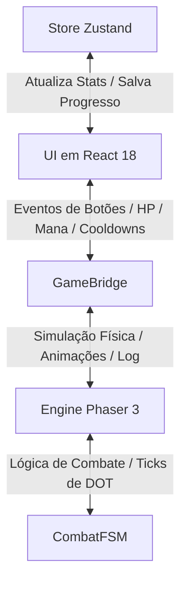
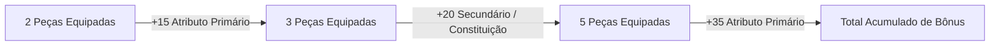
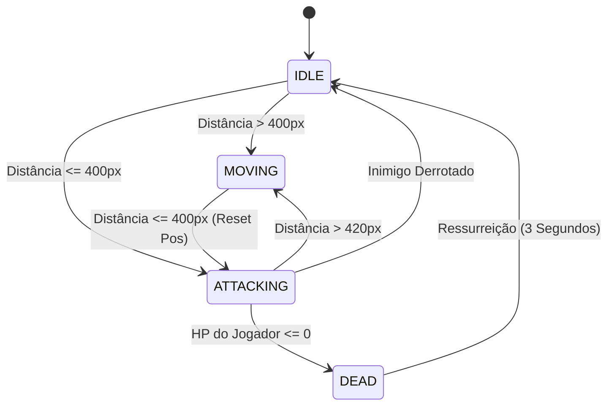

# Manual Técnico Definitivo - Amaro RPG Idle

Este documento serve como o manual interno oficial e especificação técnica para o projeto **Amaro RPG Idle**. Ele detalha todos os sistemas de jogo, fórmulas matemáticas, arquitetura de software, componentes de interface, mecânicas de progressão e o histórico de atualizações com base nas implementações reais contidas no código-fonte.

---

## 1. Visão Geral do Jogo

**Amaro RPG Idle** é um jogo de RPG incremental progressivo (*idle*) com elementos de *roguelite* (*ascensão*). O jogador gerencia um herói pertencente a uma de várias classes disponíveis, combatendo hordas de monstros e chefes em tempo real através de uma simulação gráfica 2D. O progresso é impulsionado pela aquisição de pontos de atributos, desbloqueio e aprimoramento de habilidades ativas e passivas, e equipagem de itens de raridades variadas com bônus de conjuntos (*sets*).

Ao encontrar barreiras de dificuldade causadas pelo escalonamento exponencial dos monstros, o jogador pode realizar a **Ascensão (Prestígio)**, trocando seu nível atual e progresso de fases por Pontos de Prestígio permanentes, que concedem aumentos robustos aos atributos primários para as rodadas seguintes.

---

## 2. Arquitetura e Engenharia de Software

O jogo é estruturado como uma aplicação web moderna que combina a renderização reativa com um motor de simulação de alta performance.

### A. Stack Tecnológica
*   **Front-End React (v18+)**: Responsável pela renderização de todas as janelas de menu, abas, árvores de upgrades, inventário e manipulação dos dados do personagem.
*   **Gerenciamento de Estado (Zustand)**: Toda a persistência, progresso do herói, inventário e níveis de classe são mantidos em uma store global reativa (`useGameStore`).
*   **Motor Gráfico (Phaser 3)**: Responsável pela cena gráfica 2D de combate, animações dos sprites dos personagens, renderização dos cenários (*parallax scroll*), efeitos visuais de habilidades, números flutuantes de dano e processamento do ciclo de combate físico.
*   **TypeScript (Strict Mode)**: Garante a tipagem estrita de todas as estruturas e interfaces do jogo, mitigando bugs de tempo de execução.

### B. O Canal de Comunicação: GameBridge
Para desacoplar a interface do usuário (React) do motor de simulação (Phaser), foi implementada uma ponte de comunicação assíncrona orientada a eventos chamada `GameBridge`.
O fluxo de dados ocorre através de um barramento de eventos compartilhado (`GameEvent`), garantindo que o Phaser saiba quando o jogador aciona uma habilidade e que o React atualize o HUD de HP/Mana em alta frequência sem re-renderizar componentes pesados.

#### Mapeamento de Eventos (`GameEvent`)
*   **Comandos da UI (React $\rightarrow$ Phaser)**:
    *   `ACTION_TRIGGERED`: Dispara o uso de uma habilidade ativa pelo jogador.
    *   `START_COMBAT`: Inicia ou retoma o loop de combate na cena.
    *   `END_COMBAT`: Pausa a simulação.
    *   `TOGGLE_AUTOCAST`: Ativa ou desativa a conjuração automática por IA das habilidades de ataque/cura.
*   **Feedback da Engine (Phaser $\rightarrow$ React / HUD)**:
    *   `PLAYER_HP_CHANGED`: Notifica a porcentagem, valor atual e valor máximo de HP do jogador (atualiza referências diretas na UI para evitar gargalos de renderização).
    *   `PLAYER_MANA_CHANGED`: Notifica a porcentagem, valor atual e valor máximo de mana do jogador.
    *   `LOG_EMITTED`: Envia mensagens de texto em tempo real sobre os eventos de combate para o console de logs de batalha.
    *   `COOLDOWNS_CHANGED`: Envia a tabela atualizada de recarga de habilidades ativas em milissegundos.
    *   `ENEMY_DEFEATED` e `STAGE_COMPLETED`: Atualizam o estado da fase e do bestiário no Zustand.

---

## 3. Interface do Usuário e Visual (UI/UX)

O jogo utiliza uma linguagem de design premium no estilo *Dark Mode* focada na legibilidade, organization de abas e usabilidade no desktop e dispositivos móveis.

### A. Paleta de Cores e Temática (WhatsApp Dark Style)
A interface é construída sobre uma paleta de tons escuros curados, proporcionando alto contraste para os elementos de RPG e cores vibrantes para indicar raridades e buffs:
*   **Fundo da Aplicação (`Background`)**: `#161717` (preto suave de baixo brilho).
*   **Superfícies e Painéis (`Surfaces`)**: `#1D1F1F` (cinza escuro para cards, abas e contêineres).
*   **Caixas de Texto e Inputs**: `#252727` (cinza médio para destacar elementos interativos secundários).
*   **Destaques de Dano e Recursos**:
    *   `HP / Vida`: Vermelho Vibrante (`#ef4444`)
    *   `Mana`: Azul Arcane (`#3b82f6`)
    *   `Cura / Restauração`: Verde Esmeralda (`#10b981`)
    *   `Dano Físico`: Laranja de Combate (`#f59e0b`)

### B. Elementos do HUD e Viewport
1.  **Combate Viewport (Phaser Canvas)**: Exibe em tempo real o herói do jogador e o monstro atual no cenário. Possui um `ZOOM_FACTOR` integrado de $1.5\times$ para dar maior clareza visual aos sprites de arte digital escura e efeitos visuais. A base do cenário (*ground*) é travada verticalmente para manter o alinhamento visual durante a movimentação.
2.  **HUD de Status**: Exibe duas barras horizontais (HP e Mana) com preenchimento colorido e contadores absolutos (`Valor Atual / Valor Máximo`), acompanhados da Fase Atual do jogo, progresso do Estágio (monstros eliminados de 15), velocidade da simulação e atalhos de controle de som.
3.  **Aceleração de Jogo**: Permite alterar o ritmo da simulação do Phaser entre as velocidades `1x`, `2x` e `3x` usando multiplicadores temporais no relógio interno da cena.

### C. Estrutura do Menu de Abas
O painel inferior/lateral de gerenciamento é dividido em abas com transições suaves (`animate-tabFade` para evitar saltos bruscos de tela):
*   **Combate**: Console de logs de batalha detalhados e botões de atalho rápido das habilidades desbloqueadas, com overlay cinza semitransparente indicando o tempo de cooldown restante e botão de alternância do Auto-Cast (IA).
*   **Atributos**: Painel com os pontos de atributos livres para distribuição (+5 a cada nível), listagem dos atributos finais do personagem calculados em tempo real (Força, Magia, Destreza, Constituição e Sorte) e bônus passivos de classe.
*   **Habilidades**: Árvore visualizada de forma hierárquica por conexões de dependência. Permite comprar ou aprimorar (até nível 5) habilidades ativas e passivas da classe atual utilizando Pontos de Habilidade adquiridos por nível.
*   **Equipamento**: Grade de inventário com 30 slots exibindo itens recolhidos por drop. Possui um conjunto de slots de equipagem ativa (`Cabeça`, `Torso`, `Pernas`, `Mãos` e `Arma`). Ao clicar em um item, abre-se um painel de detalhes local absoluto contendo atributos, raridade e bônus de conjunto.
*   **Ascensão**: Exibe estatísticas acumuladas, a quantidade de Pontos de Prestígio (PP) que o jogador ganhará se resetar agora, os requisitos mínimos de PP e o painel de Upgrades Permanentes de Ascensão.
*   **Bestiário**: Enciclopédia de monstros catalogados no jogo. Mostra a ilustração transparente de cada monstro e uma contagem de abates acumulados.
*   **Guia**: Central de documentação interna com regras e tutoriais.
*   **Saves**: Gerenciador de progresso com suporte a seis slots independentes e recursos de Importação/Exportação através de criptografia textual leve.

### D. Posicionamento Inteligente de Modais (Refatoração)
Os modais informativos de itens no inventário e detalhes de monstros no bestiário foram convertidos de contêineres fixos globais (comuns em interfaces web tradicionais que causam bloqueio de interatividade) para **modais locais com posicionamento absoluto**. Eles são renderizados diretamente dentro da hierarquia da aba ativa. Isso garante que o scroll continue funcionando normalmente, evita o transbordo visual (*clipping*) e assegura a usabilidade ideal em resoluções desktop comuns e telas mobile.

---

## 4. Sistema de Classes e Maestria

O jogo possui seis classes distintas: três classes primárias disponíveis desde o início e três classes secundárias avançadas desbloqueadas através do progresso.

### A. Desbloqueio de Classes Secundárias (Roguelite)
As classes secundárias requerem dedicação a uma classe primária específica e são desbloqueadas quando o jogador alcança pelo menos o **Nível 10** na classe base. 
Este progresso de classe é persistido globalmente através da chave `medieval_idle_global_class_levels` no armazenamento local do navegador. Quando o jogador realiza resets, ascensões ou cria novos jogos em slots alternativos, a permissão das classes avançadas é mantida.
*   **Paladino (`Paladin`)**: Requer Guerreiro (`Warrior`) Nível $\ge 10$.
*   **Clérigo (`Cleric`)**: Requer Mago (`Mage`) Nível $\ge 10$.
*   **Ladrão (`Rogue`)**: Requer Arqueiro (`Ranger`) Nível $\ge 10$.

### B. Atributos Iniciais e Taxas de Crescimento
Cada classe possui uma distribuição distinta de atributos base e ganha bônus diferentes automaticamente a cada passagem de nível (*Level Up*), conforme detalhado na tabela abaixo:

| Classe | Descrição de Combate | Principal Atributo | Força (Base / Cresc.) | Magia (Base / Cresc.) | Destreza (Base / Cresc.) | Const. (Base / Cresc.) | Sorte (Base / Cresc.) |
| :--- | :--- | :--- | :---: | :---: | :---: | :---: | :---: |
| **Guerreiro** | Combatente corpo a corpo robusto de alto dano físico e defesa. | Força | 12 / +2.0 | 4 / +0.5 | 8 / +1.0 | 14 / +2.5 | 5 / +0.5 |
| **Mago** | Conjurador arcano focado em magias explosivas elementais. | Magia | 4 / +0.5 | 15 / +3.0 | 7 / +1.0 | 8 / +1.0 | 5 / +0.5 |
| **Arqueiro** | Atirador ágil que aplica venenos e dispara flechas rápidas. | Destreza | 6 / +1.0 | 5 / +0.5 | 15 / +3.0 | 9 / +1.5 | 8 / +0.8 |
| **Paladino** | Protetor sagrado de altíssimo HP cuja força escala com defesa. | Constituição | 10 / +1.5 | 6 / +1.0 | 5 / +0.5 | 16 / +3.0 | 5 / +0.5 |
| **Clérigo** | Mestre sagrado especializado em curas massivas e expor inimigos. | Magia | 7 / +1.0 | 13 / +2.5 | 5 / +0.5 | 11 / +2.0 | 6 / +0.6 |
| **Ladrão** | Assassino ágil de acertos críticos com foco em venenos e força. | Destreza | 8 / +1.5 | 3 / +0.5 | 16 / +3.0 | 8 / +1.0 | 10 / +1.0 |

---

## 5. Sistema de Equipamentos e Inventário

O herói pode encontrar e equipar peças de equipamentos derrubados por monstros para somar atributos diretamente aos seus valores base.

### A. Raridades e Distribuição de Atributos
*   **Comum (`common`)**: Concede bônus em apenas **1 atributo** aleatório da lista de atributos viáveis para a classe do jogador. O nome recebe o sufixo "Rústico".
*   **Raro (`rare`)**: Concede bônus em **2 atributos** distintos. O nome é associado ao conjunto temático da classe ativa (ex: "Peitoral do Senhor da Guerra").
*   **Lendário (`legendary`)**: Concede bônus em **3 atributos** distintos. Possui multiplicador de escala alto e nome associado ao conjunto temático da classe.

O valor final de cada atributo concedido pelo item é calculado com base na Fase atual do combate onde o item caiu:
$$\text{Atributo do Item} = \max\left(1, \text{round}\left( \text{Fase} \times \text{Multiplicador Raridade} \times \text{Random}(0.8, 1.2) \right)\right)$$
*Onde o $\text{Multiplicador Raridade}$ é $1.0$ para Comum, $1.5$ para Raro e $2.5$ para Lendário.*

### B. Bônus de Conjunto (Sets)
Equipar múltiplos itens raros ou lendários pertencentes ao mesmo conjunto de classe ativa libera bônus adicionais de atributos acumulativos a partir de 2, 3 e 5 peças:

*   **Set do Senhor da Guerra (`warrior`)**:
    *   2 peças: $+15$ Força
    *   3 peças: $+20$ Constituição
    *   5 peças: $+35$ Força *(Total acumulado: +50 Str, +20 Con)*
*   **Set do Mestre Arcano (`mage`)**:
    *   2 peças: $+15$ Magia
    *   3 peças: $+20$ Constituição
    *   5 peças: $+35$ Magia *(Total acumulado: +50 Magic, +20 Con)*
*   **Set do Rastreador das Sombras (`ranger`)**:
    *   2 peças: $+15$ Destreza
    *   3 peças: $+20$ Constituição
    *   5 peças: $+35$ Destreza *(Total acumulado: +50 Dex, +20 Con)*
*   **Set do Guardião Divino (`paladin`)**:
    *   2 peças: $+15$ Constituição
    *   3 peças: $+20$ Força
    *   5 peças: $+35$ Constituição *(Total acumulado: +50 Con, +20 Str)*
*   **Set do Sumosacerdote (`cleric`)**:
    *   2 peças: $+15$ Magia
    *   3 peças: $+20$ Constituição
    *   5 peças: $+35$ Magia *(Total acumulado: +50 Magic, +20 Con)*
*   **Set do Assassino Fantasma (`rogue`)**:
    *   2 peças: $+15$ Destreza
    *   3 peças: $+20$ Força
    *   5 peças: $+35$ Destreza *(Total acumulado: +50 Dex, +20 Str)*

---

## 6. Árvores de Habilidades

Cada classe possui uma árvore com habilidades ativas e passivas exclusivas. Adicionalmente, a habilidade ativa de **Cura** está disponível para todas as classes.

### A. Custos de Recursos e Recargas (Cooldowns)
Os custos de mana e os tempos de cooldown são calculados de acordo com o nível exigido para desbloqueio da habilidade (`requiredLevel`):
*   **Custo de Mana**:
    *   *Slash (Guerreiro)*: $8$ Mana
    *   *Fireball (Mago)*: $15$ Mana
    *   *Cura (Comum)*: $12$ Mana
    *   *Outras Habilidades*: $10 + (\text{Nível Requerido} \times 1.5)$ Mana
*   **Tempo de Recarga (Cooldown) no Combate**:
    *   *Cura (Comum)*: $10.000$ ms (10.0 segundos)
    *   *Habilidades de Nível Requerido $\le 1$*: $6.000$ ms (6.0 segundos)
    *   *Habilidades de Nível Requerido $\le 3$*: $10.000$ ms (10.0 segundos)
    *   *Habilidades de Nível Requerido $\le 7$*: $16.000$ ms (16.0 segundos)
    *   *Habilidades de Nível Requerido $> 7$*: $24.000$ ms (24.0 segundos)

---

### B. Catálogo Detalhado de Habilidades por Classe

#### ⚔️ Guerreiro (Warrior)
Escala suas habilidades de ataque com **Força** (`strength`).
*   **Slash** (Ativa, Nível Requerido: 1, Mana: 8, Cooldown: 6s):
    *   *Mecânica*: Causa $150\%$ de dano físico base. O dano aumenta em $+15\%$ multiplicativo por nível da habilidade (até $240\%$ no nível 5).
    *   *Efeito Visual*: Executa um corte vermelho transversal sobre o monstro e treme levemente a câmera do jogo.
*   **Impacto de Escudo** (Ativa, Nível Requerido: 3, Mana: 14.5, Cooldown: 10s):
    *   *Mecânica*: Causa $120\%$ de dano físico base (até $192\%$ no nível 5) e **aplica Atordoamento por 2 segundos** no monstro.
    *   *Efeito Visual*: Golpe físico com impacto retangular cinza e forte tremor de tela.
*   **Fúria Berserk** (Passiva, Nível Requerido: 5):
    *   *Mecânica*: Aumento passivo de $+5$ em Força para cada nível da habilidade comprado (até $+25$ de Força no nível 5).
*   **Executar** (Ativa, Nível Requerido: 7, Mana: 20.5, Cooldown: 16s):
    *   *Mecânica*: Causa $300\%$ de dano físico base (até $480\%$ no nível 5). **Causa 50% de dano extra (totalizando 450% a 720%) se o HP do monstro estiver abaixo de 35%**.
    *   *Efeito Visual*: Animação de corte diagonal duplo em cor vermelha intensa com texto crítico flutuante "¡MISERICÓRDIA!".
*   **Grito de Guerra** (Passiva, Nível Requerido: 9):
    *   *Mecânica*: Aumento passivo de $+5$ em Constituição por nível da habilidade (até $+25$ de Constituição no nível 5).
*   **Tempestade de Aço** (Ativa, Nível Requerido: 11, Mana: 26.5, Cooldown: 24s):
    *   *Mecânica*: Redemoinho de golpes físicos que causa $400\%$ de dano físico base (até $640\%$ no nível 5).
    *   *Efeito Visual*: Efeito contínuo de cortes rápidos circulares ao redor do alvo e vibração severa.

#### 🔮 Mago (Mage)
Escala suas habilidades de ataque com **Magia** (`magic`).
*   **Fireball** (Ativa, Nível Requerido: 1, Mana: 15, Cooldown: 6s):
    *   *Mecânica*: Causa $250\%$ de dano mágico base (até $400\%$ no nível 5). **Aplica Queimadura por 3 segundos**, que causa $15\%$ do valor de Magia do jogador como dano de fogo a cada segundo.
    *   *Efeito Visual*: Círculo laranja brilhante voa do jogador e explode no monstro em uma área de fumaça e fogo.
*   **Raio de Gelo** (Ativa, Nível Requerido: 3, Mana: 14.5, Cooldown: 10s):
    *   *Mecânica*: Causa $150\%$ de dano mágico base (até $240\%$ no nível 5) e **aplica Lentidão por 4 segundos**, reduzindo a velocidade de ataque do monstro em 40%.
    *   *Efeito Visual*: Projétil azul-claro de gelo que colide gerando partículas azuis e o rótulo `[LENTO]` acima do alvo.
*   **Escudo de Mana** (Passiva, Nível Requerido: 5):
    *   *Mecânica*: Aumento passivo de $+5$ em Magia para cada nível da habilidade comprado (até $+25$ de Magia no nível 5).
*   **Relâmpago** (Ativa, Nível Requerido: 7, Mana: 20.5, Cooldown: 16s):
    *   *Mecânica*: Dispara uma descarga que causa $350\%$ de dano mágico base (até $560\%$ no nível 5).
    *   *Efeito Visual*: Feixe elétrico roxo descendente caindo diretamente do céu sobre o alvo com clarão na tela.
*   **Brilho Arcano** (Passiva, Nível Requerido: 9):
    *   *Mecânica*: Aumento passivo de $+5$ em Magia por nível da habilidade (até $+25$ de Magia no nível 5).
*   **Meteoro** (Ativa, Nível Requerido: 11, Mana: 26.5, Cooldown: 24s):
    *   *Mecânica*: Cataclismo que causa $500\%$ de dano mágico base (até $800\%$ no nível 5). **Aplica Atordoamento por 1.5s e Queimadura por 5s** (causando 15% de Magia por segundo).
    *   *Efeito Visual*: Meteoro gigante caindo diagonalmente com grande explosão de fogo que sacode a tela inteira.

#### 🏹 Arqueiro (Ranger)
Escala suas habilidades de ataque com **Destreza** (`dexterity`).
*   **Disparo Preciso** (Ativa, Nível Requerido: 1, Mana: 11.5, Cooldown: 6s):
    *   *Mecânica*: Causa $150\%$ de dano de perfuração base (até $240\%$ no nível 5).
    *   *Efeito Visual*: Flecha veloz cruza a tela colidindo com partículas vermelhas no monstro.
*   **Flecha Venenosa** (Ativa, Nível Requerido: 3, Mana: 14.5, Cooldown: 10s):
    *   *Mecânica*: Causa $100\%$ de dano de perfuração base (até $160\%$ no nível 5) e **aplica Veneno por 5 segundos**, causando dano contínuo equivalente a $20\%$ da Destreza do jogador por segundo.
    *   *Efeito Visual*: Projétil verde deixando rastro de partículas tóxicas e marcando o inimigo com o status `[ENVENENADO]`.
*   **Olho de Águia** (Passiva, Nível Requerido: 5):
    *   *Mecânica*: Aumento passivo de $+5$ em Destreza por nível da habilidade comprado (até $+25$ de Destreza no nível 5).
*   **Disparo Duplo** (Ativa, Nível Requerido: 7, Mana: 20.5, Cooldown: 16s):
    *   *Mecânica*: Dispara dois projéteis de alta velocidade causando $280\%$ de dano de perfuração base (até $448\%$ no nível 5).
    *   *Efeito Visual*: Dois projéteis paralelos rápidos atingindo o inimigo consecutivamente em curto intervalo.
*   **Passo Ligeiro** (Passiva, Nível Requerido: 9):
    *   *Mecânica*: Aumento passivo de $+3$ em Destreza e $+2$ em Constituição por nível da habilidade (até $+15$ Dex e $+10$ Con no nível 5).
*   **Chuva de Flechas** (Ativa, Nível Requerido: 11, Mana: 26.5, Cooldown: 24s):
    *   *Mecânica*: Causa $420\%$ de dano de perfuração base (até $672\%$ no nível 5).
    *   *Efeito Visual*: Uma tempestade de pequenas flechas descendo sobre o monstro causando tremidos de tela e múltiplos textos de dano.

#### 🛡️ Paladino (Paladin)
Escala suas habilidades de ataque com **Constituição** (`constitution`).
*   **Golpe Sagrado** (Ativa, Nível Requerido: 1, Mana: 11.5, Cooldown: 6s):
    *   *Mecânica*: Causa $150\%$ de dano sagrado baseado em Constituição (até $240\%$ no nível 5).
    *   *Efeito Visual*: Corte diagonal brilhante em tom dourado acompanhado de flash de luz.
*   **Escudo da Justiça** (Ativa, Nível Requerido: 3, Mana: 14.5, Cooldown: 10s):
    *   *Mecânica*: Causa $120\%$ de dano sagrado (até $192\%$ no nível 5) e **aplica Fraqueza por 5 segundos**, reduzindo todo o dano infligido pelo monstro em 30%.
    *   *Efeito Visual*: Explosão retangular dourada sobre o monstro marcando-o com o status `[ENFRAQUECIDO]`.
*   **Retribuição Aura** (Passiva, Nível Requerido: 5):
    *   *Mecânica*: Aumento passivo de $+5$ em Constituição por nível da habilidade comprado (até $+25$ de Constituição no nível 5).
*   **Punição da Luz** (Ativa, Nível Requerido: 7, Mana: 20.5, Cooldown: 16s):
    *   *Mecânica*: Golpe pesado de dano misto que causa $250\%$ base (até $400\%$ no nível 5) calculado sobre a **média de Constituição e Força** do personagem:
        $$\text{Dano Base} = (\text{Constituição} \times 1.25 + \text{Força} \times 1.25) \times \text{Multiplicador de Nível}$$
    *   *Efeito Visual*: Pilar de luz dourada brilhante cobrindo o monstro com partículas de energia que sobem.
*   **Dever Sagrado** (Passiva, Nível Requerido: 9):
    *   *Mecânica*: Aumento passivo de $+3$ em Força e $+3$ em Constituição por nível da habilidade (até $+15$ Str e $+15$ Con no nível 5).
*   **Consagração** (Ativa, Nível Requerido: 11, Mana: 26.5, Cooldown: 24s):
    *   *Mecânica*: Causa $380\%$ de dano sagrado ao monstro (até $608\%$ no nível 5) e **aplica Consagração (Regeneração) ao jogador por 6 segundos**, restaurando $15\%$ do valor de Constituição do herói como HP por segundo.
    *   *Efeito Visual*: Chão sob os combatentes brilha em tom dourado sagrado, com efeito de cura subindo nos pés do herói.

#### ✝️ Clérigo (Cleric)
Escala suas habilidades com **Magia** (`magic`).
*   **Golpe de Fé** (Ativa, Nível Requerido: 1, Mana: 11.5, Cooldown: 6s):
    *   *Mecânica*: Causa $150\%$ de dano sagrado base (até $240\%$ no nível 5).
    *   *Efeito Visual*: Esfera de energia dourada disparada em direção ao monstro, gerando explosão de faíscas.
*   **Bênção Divina** (Passiva, Nível Requerido: 3):
    *   *Mecânica*: Aumento passivo de $+5$ em Magia para cada nível da habilidade comprado (até $+25$ de Magia no nível 5).
*   **Escudo Sagrado** (Passiva, Nível Requerido: 5):
    *   *Mecânica*: Aumento passivo de $+5$ em Constituição para cada nível da habilidade comprado (até $+25$ de Constituição no nível 5).
*   **Ira do Céu** (Ativa, Nível Requerido: 7, Mana: 20.5, Cooldown: 16s):
    *   *Mecânica*: Causa $300\%$ de dano sagrado base (até $480\%$ no nível 5) e **aplica Exposto por 5 segundos**, aumentando todo o dano recebido pelo monstro em 20%.
    *   *Efeito Visual*: Relâmpago dourado caindo do céu diretamente sobre o monstro e gerando o rótulo `[EXPOSTO]`.
*   **Crescimento Espiritual** (Passiva, Nível Requerido: 9):
    *   *Mecânica*: Aumento passivo de $+3$ em Magia e $+3$ em Constituição por nível da habilidade (até $+15$ Magic e $+15$ Con no nível 5).
*   **Julgamento Final** (Ativa, Nível Requerido: 11, Mana: 26.5, Cooldown: 24s):
    *   *Mecânica*: Causa $450\%$ de dano sagrado base (até $720\%$ no nível 5).
    *   *Efeito Visual*: Grande explosão dourada (1.6x maior que o normal) com tremores intensos e múltiplos feixes de luz cruzando a tela.

#### 🗡️ Ladrão (Rogue)
Escala suas habilidades de ataque com **Destreza** (`dexterity`).
*   **Apunhalar** (Ativa, Nível Requerido: 1, Mana: 11.5, Cooldown: 6s):
    *   *Mecânica*: Causa $180\%$ de dano físico base (até $288\%$ no nível 5).
    *   *Efeito Visual*: Corte físico vermelho de alta velocidade em ângulo diagonal sobre o inimigo.
*   **Adaga de Veneno** (Ativa, Nível Requerido: 3, Mana: 14.5, Cooldown: 10s):
    *   *Mecânica*: Causa $120\%$ de dano de perfuração base (até $192\%$ no nível 5) e **aplica Veneno por 4 segundos**, causando dano contínuo equivalente a $25\%$ da Destreza do jogador por segundo.
    *   *Efeito Visual*: Corte de adaga acompanhado de névoa roxa, aplicando o rótulo `[TOXINA]` no monstro.
*   **Manto de Sombras** (Passiva, Nível Requerido: 5):
    *   *Mecânica*: Aumento passivo de $+5$ em Destreza por nível da habilidade comprado (até $+25$ de Destreza no nível 5).
*   **Ataque Furtivo** (Ativa, Nível Requerido: 7, Mana: 20.5, Cooldown: 16s):
    *   *Mecânica*: Golpe pelas costas causando $320\%$ de dano físico base (até $512\%$ no nível 5).
    *   *Efeito Visual*: O herói desaparece por uma fração de segundo e executa um corte transversal letal vermelho escuro com forte tremor de tela.
*   **Passo Sombrio** (Passiva, Nível Requerido: 9):
    *   *Mecânica*: Aumento passivo de $+3$ em Destreza e $+3$ em Força por nível da habilidade (até $+15$ Dex e $+15$ Str no nível 5).
*   **Florescer Letal** (Ativa, Nível Requerido: 11, Mana: 26.5, Cooldown: 24s):
    *   *Mecânica*: Redemoinho de adagas que causa $450\%$ de dano físico base (até $720\%$ no nível 5).
    *   *Efeito Visual*: Múltiplos cortes físicos vermelhos cruzados em alta velocidade no corpo do monstro, seguidos de grande explosão de poeira e forte tremor.

---

### C. Habilidade Comum: 💚 Cura (`heal`)
*   **Tipo**: Habilidade Ativa
*   **Nível Requerido**: 1
*   **Custo de Mana**: $12$ Mana
*   **Tempo de Recarga**: $10.000$ ms ($10$ segundos)
*   **Cálculo Matemático da Restauração**:
    $$\text{Valor da Cura} = \lfloor \text{HP Máximo} \times (0.30 + (\text{Nível da Habilidade} - 1) \times 0.05) \rfloor$$
    *Onde a cura recupera 30% do HP máximo no nível 1, aumentando +5% por nível adicional, até atingir 50% de cura máxima do HP total no nível 5.*
*   **Funcionamento de Inteligência Artificial (Auto-Cast)**:
    Quando a Conjuração Automática de Habilidades está habilitada (liberada após vencer a Fase 5) e o HP do herói cai abaixo de **50% de sua vida máxima**, o motor de combate prioriza imediatamente o uso de **Cura** antes de qualquer outra habilidade ofensiva, desde que haja mana suficiente e a habilidade não esteja em recarga.
*   **Efeito Visual no Phaser**:
    Cria um círculo concêntrico verde brilhante nos pés do herói. O círculo sobe verticalmente em direção ao peito e se expande até $1.3\times$ de tamanho antes de desaparecer gradualmente. Exibe um número flutuante verde brilhante `+<quantidade>` acima do herói.

---

## 7. Motor de Combate (CombatFSM) e Escalonamento

O loop de simulação principal roda sobre uma Máquina de Estados Finita (`CombatFSM`) acoplada ao Phaser.

### A. Estados de Combate (`CombatState`)
1.  **`IDLE`**: O herói e o monstro estão spawnados. Se houver alvo a uma distância superior a 400 pixels, o FSM transiciona para `MOVING`. Caso contrário, transiciona para `ATTACKING`.
2.  **`MOVING`**: O herói corre em direção ao monstro enquanto o cenário desliza ao fundo (*parallax scroll*). Ao atingir 400 pixels de distância, o movimento cessa e a simulação inicia a fase de combate ativo.
3.  **`ATTACKING`**: Herói e monstro desferem ataques básicos de forma cíclica baseados em seus tempos de recarga individuais, além de processarem habilidades e ticks de status.
4.  **`CASTING`**: Estado temporário durante a execução de habilidades ativas.
5.  **`DEAD`**: O herói foi derrotado. O progresso de monstros derrotados no estágio atual é resetado para zero. Após um período de 3 segundos, o herói ressuscita com HP e mana cheios e o FSM retorna para `IDLE` no início da mesma fase.

### B. Ciclos de Ataque e Velocidades
*   **Ataque Básico do Jogador**: Causa dano físico, mágico ou de perfuração equivalente a $1.0\times$ do Atributo Principal da classe ativa mais uma variação aleatória de $+0$ a $+3$. A recarga do ataque básico é calculada dinamicamente:
    $$\text{Velocidade de Ataque} = \left( 1 + \text{Destreza} \times 0.02 \right) \times \left(1 + \text{Ascensões} \times 0.02\right)$$
    $$\text{Recarga do Ataque} = \max\left( 800\text{ ms}, \frac{3000\text{ ms}}{\text{Velocidade de Ataque}} \right)$$
*   **Ataque do Inimigo**: O tempo de recarga base do ataque do monstro diminui com o nível da fase para torná-lo mais rápido, modificado por seu multiplicador intrínseco de velocidade:
    $$\text{Recarga Base} = 3600 - \left( \text{Fase} \times 30 \right)$$
    $$\text{Recarga do Inimigo} = \max\left( 1000\text{ ms}, \frac{\text{Recarga Base}}{\text{Multiplicador de Velocidade do Monstro}} \right)$$

### C. Escalonamento Exponencial de Dificuldade dos Inimigos
O jogo possui **20 fases** divididas em **4 tiers de dificuldade** e **5 temas cíclicos de inimigos**. Cada fase exige a derrota de **15 monstros normais** seguidos pela eliminação de um **Chefe de Fase** para permitir o avanço. Os temas e inimigos são os mesmos nas 5 primeiras fases e são reutilizados ciclicamente nos tiers seguintes, mas com multiplicadores de status progressivamente maiores.

#### Tiers de Dificuldade e Multiplicadores
| Tier | Fases | Fator de Dificuldade | Aumento vs. Normal |
| :--- | :---: | :---: | :--- |
| **Normal** | 1 – 5 | × 1.0 | — |
| **Pesadelo** 🔴 | 6 – 10 | × 2.5 | +150% de HP e Dano |
| **Inferno** 🟠 | 11 – 15 | × 5.0 | +400% de HP e Dano |
| **Apocalipse** 🟣 | 16 – 20 | × 10.0 | +900% de HP e Dano |

*Cada tier possui identidade visual exclusiva no HUD: cor do label, tint de background e tint do sprite do inimigo mudam conforme o tier ativo.*

*   **Fórmulas de Escalonamento de Dificuldade**:
    $$\text{Fator HP} = 1.65^{\text{Fase} - 1}$$
    $$\text{Fator Dano} = 1.30^{\text{Fase} - 1}$$
    $$\text{Fator Tier} = \begin{cases} 1.0 & \text{se Fase} \le 5 \\ 2.5 & \text{se } 6 \le \text{Fase} \le 10 \\ 5.0 & \text{se } 11 \le \text{Fase} \le 15 \\ 10.0 & \text{se } 16 \le \text{Fase} \le 20 \end{cases}$$
*   **Vida Máxima de Inimigo Comum**:
    $$\text{HP Máximo Normal} = \lfloor (120 + (\text{Fase} \times 35)) \times \text{Fator HP} \times \text{Multiplicador HP Monstro} \times \text{Fator Tier} \rfloor$$
*   **Vida Máxima de Chefe**:
    $$\text{HP Máximo Chefe} = \lfloor (120 + (\text{Fase} \times 35)) \times \text{Fator HP} \times \text{Multiplicador HP Chefe} \times 3.0 \times \text{Fator Tier} \rfloor$$
*   **Dano dos Ataques do Inimigo**:
    $$\text{Dano do Inimigo} = \lfloor (5 + \text{Fase} \times 2.0 + \text{Random}(0, 1)) \times \text{Fator Dano} \times \text{Multiplicador Dano Monstro} \times \text{Fator Tier} \rfloor$$

---

### D. Tabela de Configuração do Bestiário

O jogo possui 20 monstros catalogados de acordo com sua fase e tipo:

| Fase | Tipo | ID do Monstro | Nome do Monstro | Textura | Mult. HP | Mult. Dano | Mult. Vel. | XP Concedido |
| :---: | :--- | :--- | :--- | :--- | :---: | :---: | :---: | :---: |
| **1 / 6** | Normal | `goblin` | Goblin Ladino | `enemy_goblin` | 0.75 | 0.85 | 1.35 | 25 |
| **1 / 6** | Normal | `shadow_wolf` | Lobo das Sombras | `enemy_wolf` | 0.90 | 1.00 | 1.20 | 30 |
| **1 / 6** | Normal | `orc_warrior` | Guerreiro Orc | `enemy_orc` | 1.20 | 1.10 | 0.90 | 40 |
| **1 / 6** | **Chefe** | `boss_forest_golem` | Golem de Pedra Silvestre | `boss_forest_golem` | 2.50 | 1.40 | 0.70 | 120 |
| **2 / 7** | Normal | `sand_serpent` | Serpente da Areia | `enemy_sand_serpent` | 0.85 | 1.15 | 1.10 | 35 |
| **2 / 7** | Normal | `desert_bandit` | Bandido Nômade | `enemy_desert_bandit` | 1.00 | 1.00 | 1.25 | 35 |
| **2 / 7** | Normal | `desert_scorpion` | Escorpião de Fogo | `enemy_scorpion` | 0.90 | 1.20 | 1.15 | 38 |
| **2 / 7** | **Chefe** | `boss_sand_scorpion`| Rei Escorpião de Ouro | `enemy_scorpion` | 2.80 | 1.50 | 0.95 | 150 |
| **3 / 8** | Normal | `frost_wolf` | Lobo Invernal | `enemy_wolf` | 0.95 | 1.00 | 1.20 | 40 |
| **3 / 8** | Normal | `ice_elemental` | Elemental de Gelo | `enemy_ice_elemental` | 1.15 | 1.25 | 0.90 | 45 |
| **3 / 8** | Normal | `cave_yeti` | Yeti das Cavernas | `enemy_yeti` | 1.40 | 1.10 | 0.80 | 50 |
| **3 / 8** | **Chefe** | `boss_frost_dragon` | Dragão de Gelo Ancião | `boss_frost_dragon` | 3.20 | 1.60 | 0.85 | 200 |
| **4 / 9** | Normal | `skeleton_warrior` | Esqueleto Guerreiro | `enemy_skeleton` | 1.00 | 1.00 | 1.00 | 45 |
| **4 / 9** | Normal | `decaying_zombie` | Zumbi Putrefato | `enemy_zombie` | 1.30 | 0.90 | 0.80 | 48 |
| **4 / 9** | Normal | `tormented_ghost` | Fantasma Atormentado | `enemy_ghost` | 0.80 | 1.30 | 1.10 | 52 |
| **4 / 9** | **Chefe** | `boss_necromancer` | Necromante Sombrio | `enemy_necromancer` | 2.70 | 1.60 | 0.90 | 250 |
| **5 / 10**| Normal | `stone_gargoyle` | Gárgula de Pedra | `enemy_gargoyle` | 1.20 | 1.10 | 1.10 | 55 |
| **5 / 10**| Normal | `living_armor` | Armadura Possuída | `enemy_living_armor` | 1.50 | 1.25 | 0.85 | 60 |
| **5 / 10**| Normal | `demon_imp` | Diabrete Menor | `enemy_imp` | 0.90 | 1.35 | 1.30 | 58 |
| **5 / 10**| **Chefe** | `boss_archdemon` | Arquidemônio das Ruínas | `boss_archdemon` | 3.50 | 1.70 | 0.90 | 300 |

*Nota: O XP ganho é multiplicado a cada fase pela taxa acelerada de $\text{Fator XP} = 1.35^{\text{Fase} - 1}$ para equilibrar o aumento da barra de nível.*

---

### E. Fórmulas de Geração de Espólios (Drops)
Sempre que um inimigo é derrotado, há uma chance de gerar um equipamento no inventário do herói. A Sorte (`luck`) do jogador influencia tanto a probabilidade de ocorrer o drop quanto a qualidade da peça gerada.

1.  **Probabilidade de Drop**:
    *   *Monstro Comum*:
        $$\text{Chance de Drop} = \min\left(0.50, 0.05 + \text{Sorte} \times 0.002\right)$$
    *   *Chefe de Fase*:
        $$\text{Chance de Drop} = 1.00\quad (100\%)$$
2.  **Qualidade (Raridade) do Item**:
    O sistema realiza uma rolagem ponderada através de três pesos numéricos que variam dinamicamente com base na Sorte do herói:
    *   $\text{Peso Lendário} = \min\left(300, 50 + \text{Sorte} \times 2\right)$
    *   $\text{Peso Raro} = \min\left(600, 250 + \text{Sorte} \times 5\right)$
    *   $\text{Peso Comum} = \max\left(100, 700 - (\text{Peso Raro} - 250) - (\text{Peso Lendário} - 50)\right)$
    
    $$\text{Peso Total} = \text{Peso Lendário} + \text{Peso Raro} + \text{Peso Comum}$$
    A raridade é determinada jogando um valor de $0$ a $\text{Peso Total}$: se menor que $\text{Peso Lendário}$, o item é **Lendário**; se menor que $\text{Peso Lendário} + \text{Peso Raro}$, o item é **Raro**; caso contrário, é **Comum**.

---

## 8. Sistema de Status Effects (Buffs & Debuffs)

O combate processa efeitos de status temporários gerados por habilidades ativas, impactando os atributos, velocidade e vida de ambos os personagens em tempo real.

| Efeito | Sigla | Alvo | Duração | Funcionamento Mecânico | Cálculo de Dano ou Cura do Efeito |
| :--- | :---: | :---: | :---: | :--- | :--- |
| **Atordoamento** | `[ATORDADO]` | Inimigo | 1.5s - 2s | Congela todas as ações e temporizadores de ataque. Ao expirar, reinicia o tempo de carregamento de ataque baseado na velocidade. | -- |
| **Veneno** | `[ENVENENADO]` | Inimigo | 4s - 5s | Aplica dano contínuo (DOT) a cada tick de 1 segundo. | $20\%$ (Arqueiro) ou $25\%$ (Ladrão) de Destreza por segundo. |
| **Queimadura** | `[QUEIMANDO]` | Inimigo | 3s - 5s | Aplica dano contínuo (DOT) a cada tick de 1 segundo. | $15\%$ de Magia (Mago) por segundo. |
| **Lentidão** | `[LENTO]` | Inimigo | 4.0s | Reduz a velocidade de ataque do inimigo em 40%. | -- |
| **Fraqueza** | `[FRAQUEZA]` | Inimigo | 5.0s | Reduz em 30% todo o dano direto causado pelo monstro. | -- |
| **Exposto** | `[EXPOSTO]` | Inimigo | 5.0s | Aumenta em 20% todo o dano recebido pelo monstro. | -- |
| **Consagração** | `[REGEN]` | Herói | 6.0s | Restaura vida continuamente (HOT) a cada tick de 1 segundo. | $15\%$ de Constituição (Paladino) por segundo. |

### Regras de Processamento de Status
*   **Reaplicação**: Reconjurar uma habilidade cujos status correspondentes já estejam ativos no alvo reinicia o tempo de duração restante para o valor máximo original (não há empilhamento de intensidade, apenas atualização de duração).
*   **Tick Lógico**: Os danos e curas acumulados no tempo (DOT/HOT) realizam o cálculo de dano uma vez a cada 1000 ms com base nos atributos em tempo real do herói.
*   **Atraso Pós-Atordoamento**: Quando o atordoamento expira, a IA do inimigo é forçada a carregar seu tempo de ataque a partir do zero utilizando sua velocidade de ataque base. Isso impede que o monstro atropele o herói com ataques instantâneos acumulados e recompensa o uso tático de stuns.

---

## 9. Mecânica de Ascensão (Prestígio)

Ao atingir barreiras de avanço, o jogador pode realizar a Ascensão, zerando seu progresso imediato por bônus permanentes e cumulativos.

### A. Condições e Perda de Dados
*   **Requisito Mínimo**: Acumular XP suficiente para obter pelo menos o número de Pontos de Prestígio (PP) exigido pelo número de ascensões já efetuadas:
    $$\text{Requisito de PP} = \begin{cases} 1 & \text{se Ascensões} = 0 \\ 3 + 2 \times \text{Ascensões} & \text{se Ascensões} \ge 1 \end{cases}$$
*   **Elementos Resetados**: Nível do personagem (retorna a 1), XP acumulada (retorna a 0), fase ativa (retorna a 1), contagem de monstros derrotados no estágio (retorna a 0), pontos de atributos normais distribuídos e todos os equipamentos equipados ou guardados no inventário.
*   **Elementos Mantidos**: Nível das habilidades destravadas e upgrades adquiridos nas árvores, classe ativa e suas maestrias desbloqueadas, e melhorias permanentes de prestígio.

### B. Fórmulas de Recompensa de Prestígio
A XP total acumulada pelo personagem desde o nível 1 é calculada por:
$$\text{XP Total} = 50 \times \text{Nível} \times (\text{Nível} - 1) + \text{XP Atual na Barra}$$
O ganho de Pontos de Prestígio (PP) na ascensão é determinado por:
$$\text{PP Obtidos} = \lfloor \left( \frac{\text{XP Total}}{1000} \right)^{0.85} \rfloor$$

### C. Catálogo de Upgrades de Prestígio Permanente
Os pontos de prestígio obtidos são gastos no menu de Ascensão em bônus permanentes para os atributos iniciais da classe selecionada, aplicando-se de imediato nos resets seguintes:
*   **Força Divina (`perm_str`)**: $+6$ Strength permanente por nível. Custo inicial: $3\text{ PP} \times \text{Nível}$. Nível Máximo: 10.
*   **Mente Arcana (`perm_mag`)**: $+6$ Magic permanente por nível. Custo inicial: $3\text{ PP} \times \text{Nível}$. Nível Máximo: 10.
*   **Foco Ágil (`perm_dex`)**: $+3$ Dexterity permanente por nível. Custo inicial: $3\text{ PP} \times \text{Nível}$. Nível Máximo: 10.
*   **Vigor Eterno (`perm_con`)**: $+9$ Constitution permanente por nível. Custo inicial: $3\text{ PP} \times \text{Nível}$. Nível Máximo: 10.
*   **Bênção da Sorte (`perm_luk`)**: $+3$ Luck permanente por nível. Custo inicial: $3\text{ PP} \times \text{Nível}$. Nível Máximo: 10.

---

## 10. Sistema de Salvamento e Carregamento

A persistência do jogo é robusta, segura e segmentada em slots de uso livre.

### A. Persistência de Slots
O jogo oferece seis slots de salvamento independentes armazenados na memória local do navegador.
*   `medieval_idle_save_slot_1` até `medieval_idle_save_slot_6` contêm a serialização JSON dos dados do herói (`Character`), incluindo atributos, maestrias de classe, itens no inventário e abates de monstros.
*   `medieval_idle_save` contém o arquivo de carregamento rápido utilizado ao carregar o jogo na inicialização do menu principal.
*   `medieval_idle_current_slot` registra o índice do slot ativo no momento da sessão de jogo.

### B. Compartilhamento Base64 (Importação e Exportação)
Para permitir o compartilhamento de arquivos de salvamento entre dispositivos, o jogo implementa a codificação Base64:
*   **Exportação**: Lê a string JSON do slot especificado no localStorage e a converte em texto codificado Base64 através do método `btoa()`.
*   **Importação**: Lê a string textual fornecida pelo usuário, decodifica via `atob()`, valida a integridade da estrutura do herói (presença de atributos, classes e IDs válidos) e a salva no slot desejado, atualizando a store de jogo reativa se o slot importado for o selecionado.

---

## 11. Economia e Sistema de Ouro (Gold)

O ouro é a principal moeda de troca e progresso econômico no jogo, obtido através de vitórias contra monstros no ciclo de combate e utilizado nas fusões de equipamentos.

### A. Fórmulas de Drop e Recompensa por Combate
Cada inimigo derrotado concede uma quantidade de ouro calculada dinamicamente, escalando exponencialmente a cada estágio para acompanhar a curva de progressão.
*   **Fator de Escala de Estágio**:
    $$\text{Escala de Ouro} = 1.25^{\text{Stage} - 1}$$
*   **Recompensa Base da Fase**:
    $$\text{Ouro Base} = \lfloor (10 + \lfloor \text{Stage} \times 1.5 \rfloor) \times \text{Escala de Ouro} \rfloor$$
*   **Monstros Comuns vs. Chefes (Bosses)**:
    Se o monstro for o Chefe do Estágio (10º monstro derrotado na fase), ele concede um bônus multiplicador de $3.5\times$ sobre o valor base:
    $$\text{Ouro Inicial} = \begin{cases} \text{Ouro Base} \times 3.5 & \text{se for Chefe} \\ \text{Ouro Base} & \text{se for Monstro Comum} \end{cases}$$

### B. Influência do Atributo Sorte (Luck)
O atributo de Sorte (`Luck`) do herói aplica um multiplicador direto de ganho de ouro, calculando um bônus percentual:
$$\text{Bônus de Sorte} = 1 + \frac{\text{Sorte Final}}{100}$$
$$\text{Ouro Final Recebido} = \lfloor \text{Ouro Inicial} \times \text{Bônus de Sorte} \rfloor$$

### C. Comportamento no Prestígio (Ascensão)
Durante o ritual de Ascensão (Prestígio), o saldo de ouro acumulado pelo herói **é preservado** (não sofre reset). Isso permite que o jogador mantenha seu poder de compra para forjar novos equipamentos nas fases iniciais da nova jornada.

---

## 12. Altar de Forja Mística

O sistema de Forja permite combinar dois equipamentos compatíveis do inventário para criar itens de raridade **Mística** (Roxa/Lilás) mais poderosos.

### A. Condições de Fusão e Restrições
Para que dois itens possam ser fundidos no altar de forja, eles devem obrigatoriamente cumprir os seguintes critérios de compatibilidade:
*   **Mesmo Slot (Tipo)**: Os dois itens devem pertencer ao mesmo slot de equipamento (ex.: Arma com Arma, Luva com Luva).
*   **Mesma Categoria de Raridade**:
    *   **Fusão Não-Mística**: Dois itens normais/convencionais (Comum, Incomum, Raro, Épico ou Lendário). Eles não precisam ser da mesma raridade entre si (ex.: um Épico e um Lendário do mesmo tipo podem ser fundidos).
    *   **Fusão Mística**: Dois itens Místicos. Contudo, eles **devem ter exatamente o mesmo nível místico** (ex.: Místico +1 com Místico +1). Não é permitido fundir um item convencional com um místico, ou dois místicos de níveis diferentes.
*   **Nível Místico Máximo**: O nível místico máximo de destino permitido para qualquer item é **+5**.

### B. Custo de Fusão
A fusão exige o pagamento de uma taxa em Ouro que aumenta exponencialmente dependendo do nível místico resultante:
*   **Fusão Inicial** (Gera Místico +1): $100$ Ouro.
*   **Fusão de Itens Místicos** (Gera Místico $+2$ até $+5$):
    $$\text{Custo de Fusão Mística}(L) = 100 \times 5^L$$
    Onde $L$ representa o nível místico atual dos dois itens sendo fundidos.

| Nível de Origem | Nível Resultante | Custo em Ouro |
| :--- | :--- | :--- |
| Convencional + Convencional | Místico +1 | $100$ Ouro |
| Místico +1 + Místico +1 | Místico +2 | $500$ Ouro |
| Místico +2 + Místico +2 | Místico +3 | $2.500$ Ouro |
| Místico +3 + Místico +3 | Místico +4 | $12.500$ Ouro |
| Místico +4 + Místico +4 | Místico +5 | $62.500$ Ouro |

### C. Regras de Fusão — Fórmula Assimétrica de Atributos
Quando o Altar da Forja processa a fusão, os atributos dos dois itens de origem são combinados no novo item místico seguindo uma **fórmula assimétrica** que recompensa o uso de itens complementares em vez de penalizar o item mais valioso:

#### Fórmula Normal (probabilidade 95%)
Para cada atributo $K$ presente em pelo menos um dos dois itens de origem:

1.  **Atributo exclusivo** (presente em apenas um dos itens — o outro vale 0):
    $$\text{Atributo Resultante}(K) = \text{valor do portador}$$
    *O atributo é copiado integralmente, sem nenhuma penalidade.*

2.  **Atributo compartilhado** (ambos os itens possuem o atributo $K$):
    $$\text{Atributo Resultante}(K) = \text{Maior}(K) + \lceil \text{Menor}(K) \times 0.5 \rceil$$
    *O valor do item com maior atributo é preservado integralmente. O valor do item com menor atributo contribui com 50% do seu valor, arredondado para cima.*

**Exemplo de aplicação:**
| Slot | Item A (Força) | Item B (Força) | Cálculo | Resultado |
| :--- | :---: | :---: | :--- | :---: |
| Forja Normal | 50 | 5 | $50 + \lceil 5 \times 0.5 \rceil$ | **53** |
| Forja Normal | 20 | 20 | $20 + \lceil 20 \times 0.5 \rceil$ | **30** |
| Forja Normal (Exclusivo) | 0 | 12 | $12$ (portador único) | **12** |

#### Forja Lendária (probabilidade 5% — evento aleatório)
Há uma chance de **5%** de a fusão resultar em uma **Forja Lendária**. Neste caso, a fórmula assimétrica é completamente substituída por:
$$\text{Atributo Resultante}(K) = \lceil (\text{Item A}(K) + \text{Item B}(K)) \times 1.5 \rceil$$
*A soma total dos dois atributos é amplificada em +50%. O evento é sinalizado visualmente por um toast dourado com o texto "⚡ FORJA LENDÁRIA!" na tela.*

**Notas gerais:**
- Todos os resultados utilizam arredondamento para cima ($\lceil \rceil$) para evitar valores com casas decimais.
- A identidade do item (nome `[Slot] Místico +[Nível]`, raridade Mística lilás, `classId` e `spriteName`) é sempre herdada do Item A (primeiro slot).
- **Pertinência ao Conjunto (Set):** O campo `setName` do Item A é copiado integralmente para o item Místico resultante. Isso garante que a nova peça continue contando nos bônus de conjunto do `StatEngine` — um item *Luva Mística +1* do Set do Senhor da Guerra, por exemplo, ainda ativa os bônus de 2, 3 e 5 peças normalmente.
- **Indicação Visual de Nível:** Um número em fuchsia (`+1` a `+5`) é renderizado no canto superior esquerdo do ícone do item tanto na grade do inventário quanto nos slots de equipamento ativo, permitindo identificar o nível místico sem precisar abrir o painel de detalhes.

---

## 13. Histórico de Updates e Otimizações de Engenharia

Esta seção consolida as principais melhorias técnicas, balanceamentos e correções aplicados ao longo do ciclo de desenvolvimento do jogo:

### Versão 2.1.0 (Atual)
*   **🔥 Novos Tiers de Dificuldade (Inferno e Apocalipse)**:
    *   Expansão do sistema de fases de 10 para **20 fases totais**, divididas em 4 tiers de dificuldade.
    *   **Inferno** (Fases 11–15): Multiplicador de HP e Dano × 5.0 (+400%) com tint laranja flamejante nos backgrounds e inimigos.
    *   **Apocalipse** (Fases 16–20): Multiplicador de HP e Dano × 10.0 (+900%) com tint roxo sinistro.
    *   HUD do combate atualizado para exibir `FASE` / `PESADELO` / `INFERNO` / `APOCALIPSE` com paletas de cores exclusivas por tier.
    *   Prefixo no nome do inimigo (`[Pesadelo]` / `[Inferno]` / `[Apocalipse]`) exibido na tela de combate.
*   **⚖️ Rebalanceamento da Fórmula da Forja Mística**:
    *   A fórmula de fusão foi alterada de soma aritmética direta para **fórmula assimétrica**: o stat maior é 100% preservado; apenas o stat menor sofre redução de 50% ($\lceil \text{menor} \times 0.5 \rceil$).
    *   Stats exclusivos de um item são copiados integralmente sem penalidade.
    *   Adição da mecânica de **Forja Lendária** com 5% de probabilidade: em vez de reduzir, a fusão amplifica a soma total em +50% ($\lceil (A + B) \times 1.5 \rceil$), com feedback visual dourado exclusivo.
    *   O painel de **Resultado Estimado** na aba Forja agora espelha a fórmula real, mostrando qual stat é o maior (preservado), qual é o menor (com desconto de 50%) e o total final antes da fusão ser confirmada.
*   **🏷️ Preservação de Bônus de Conjunto nos Itens Místicos**:
    *   Correção de bug: o item Místico resultante da fusão agora herda o campo `setName` do Item A, garantindo que ele continue sendo contabilizado nos cálculos de bônus de conjunto do `StatEngine`.
    *   Exemplo: duas *Luvas Místicas +1* do "Set do Senhor da Guerra" ativam normalmente o bônus de 2 peças (+15 Força), igual a qualquer peça Lendária do mesmo conjunto.
*   **🔢 Badge Visual de Nível Místico**:
    *   Adicionado indicador numérico fuchsia (`+1` a `+5`) no canto superior esquerdo do ícone de cada item Místico, visível tanto na **grade do inventário** quanto nos **slots de equipamento ativo**.
    *   O badge complementa a bolinha pulsante roxo-lilás (canto superior direito) já existente, permitindo identificar o nível sem abrir o painel de detalhes.

### Versão 2.0.0
*   **🌋 Altar da Forja Mística**:
    *   Implementação do sistema de fusão de itens no painel "Forja". O jogador pode fundir duas peças de equipamento do mesmo slot (ex: luva com luva).
    *   **Mecânica de Atributos**: Os atributos repetidos entre as duas peças são somados, e atributos únicos são combinados no item resultante.
    *   **Raridade Mística (Lilás)**: O item resultante é transformado na raridade **Mística**, ganhando um nível místico incremental (ex: *Místico +1*, *Místico +2*), com efeitos visuais roxo/lilás especiais no inventário e gema pulsante.
*   **🪙 Economia de Ouro (Gold)**:
    *   Adição de moedas de ouro derrubadas ao derrotar monstros comuns e chefes de estágio.
    *   O ouro acumulado serve para pagar o custo das fusões de equipamentos no Altar da Forja (o custo aumenta proporcionalmente ao nível místico do item).
    *   O saldo de ouro foi incorporado ao cabeçalho superior do jogo, com uma gema amarela pulsante, substituindo o rótulo redundante "Painel do Herói".
*   **⏳ Nova Tela de Carregamento da Arena**:
    *   Implementação de uma tela de carregamento visual no container do Phaser (`#game-container`).
    *   Utiliza um plano de fundo estilizado em pixel art de masmorra medieval, um spinner roxo neon animado e mensagens descritivas de sincronização de sprites.
    *   Elimina a "tela cinza" visível nos primeiros segundos de inicialização do canvas do Phaser, garantindo uma transição visualmente polida para o combate.
*   **🎨 Polimento de UX e Correções de UI na Forja**:
    *   Indicação visual aprimorada nos slots da forja, apresentando uma borda dupla pulsante lilás nos slots vazios para facilitar o entendimento do usuário.
    *   Ajuste da geometria do Altar em desktop para exibir a visualização de atributos resultantes abaixo do altar e evitar cortes de textos.
    *   Confinamento do modal de seleção de itens dentro do contêiner da Forja, posicionado de forma absoluta local, para evitar conflitos de sobreposição com abas globais.

### Versão 1.1.5
*   **Correção do Vazamento de Estado na Criação de Personagens**:
    *   Sanado o bug crítico em que a criação de um novo personagem em um save slot vazio/limpo herdava incorretamente pontos de prestígio, upgrades permanentes, contagem de abates e nível de ascensão do personagem jogado anteriormente que permanecia na memória do Zustand. Agora, a inicialização cria um estado de personagem 100% limpo baseado no `DEFAULT_CHARACTER`.
*   **Otimização do Escala de Combate (Zoom do Phaser)**:
    *   Aplicação de uma escala multiplicadora de $1.5\times$ nos personagens, monstros e partículas de efeito visual para torná-los nítidos e visualmente proeminentes.
    *   Ajuste da posição base dos sprites na tela de combate para que permaneçam grounded no cenário.
    *   Correção de bugs na base do cenário `TileSprite` com rolagem horizontal infinita, assegurando que o solo permaneça alinhado na parte inferior do canvas sem sumir em telas de alta resolução.
*   **Interface Refatorada de Modais**:
    *   Conversão dos modais pop-up globais em modais posicionados de forma absoluta local nos wraps das abas de **Equipamento** e **Bestiário**, sanando gargalos de scroll e problemas de clipping em mobile.
    *   Substituição das animações intrusivas de subida e fading (`animate-slideUp`) nas abas de Guia e Saves por transições suaves de fade estático (`animate-tabFade`), reduzindo ruídos de movimento e otimizando a experiência do usuário.
*   **Melhoria Visual da Exibição de Atributos (Aba Equipamento)**:
    *   Separação visual completa dos atributos na seção "Atributos Totais & Conjuntos". O número principal em branco agora exibe estritamente o valor base puro do herói (atributo de nível + pontos distribuídos). Os bônus são discriminados entre parênteses: os bônus provindos de equipamentos são listados em verde (`+X`) e os bônus permanentes da Ascensão são listados em roxo/lilás (`+Y`), eliminando a exibição confusa onde o valor total e o bônus apareciam somados duplicadamente.
*   **Melhorias e Transparência do Bestiário**:
    *   Implementação de filtros dinâmicos de renderização baseados em canvas do lado do cliente. Isso remove cores de fundo sólidas dos sprites importados para os monstros (Goblin, Orc, Necromante, etc.), assegurando transparência alpha real integrada ao layout escuro da UI.

### Versão 1.1.4
*   **Controles de Áudio e Volumes**:
    *   Introdução de barras de volume deslizantes (*sliders*) individuais para efeitos sonoros (SFX) e música de fundo (BGM) no menu de Opções.
    *   Persistência contínua dos volumes e preferência ligada/desligada de áudio no localStorage do navegador.
    *   Inicialização automática silenciosa do áudio que cumpre as políticas de reprodução forçada dos navegadores, ativando os barramentos de som ao primeiro clique detectado na página.
*   **Seletores de Velocidade da Simulação**:
    *   Adição dos seletores `1x`, `2x` e `3x` no cabeçalho do HUD de simulação, permitindo acelerar ou desacelerar o ritmo dos combates.

### Versão 1.1.0
*   **Implementação do Sistema de Equipamentos**:
    *   Criação de grades de inventário reativas com 30 slots e suporte a equipamentos divididos em 5 categorias.
    *   Estruturação dos bônus de conjunto (*set bonuses*) cumulativos que recompensam jogadores que combinam peças do mesmo conjunto da classe.
    *   Cálculo automatizado do StatEngine para consolidar pontos de atributos finais a partir da base e itens equipados.

### Versão 1.0.5
*   **Otimização e Correção de Vazamentos de Memória (Mobile)**:
    *   Remoção de rotinas repetitivas de instanciação de eventos que causavam *memory leaks* e travamento de navegadores móveis.
    *   Refatoração do ciclo de atualização do HUD de HP e Mana no React para utilizar referências diretas (`useRef`) em vez de recriar estados reativos estritos do React a cada 30 ms.
    *   Ajuste da IA de Auto-Cast para disparar a cada 300 ms em vez de atuar no ciclo físico de renderização de 60 FPS do Phaser.
