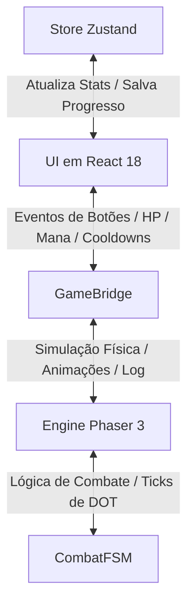
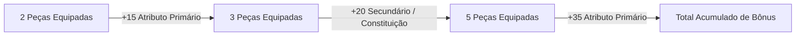
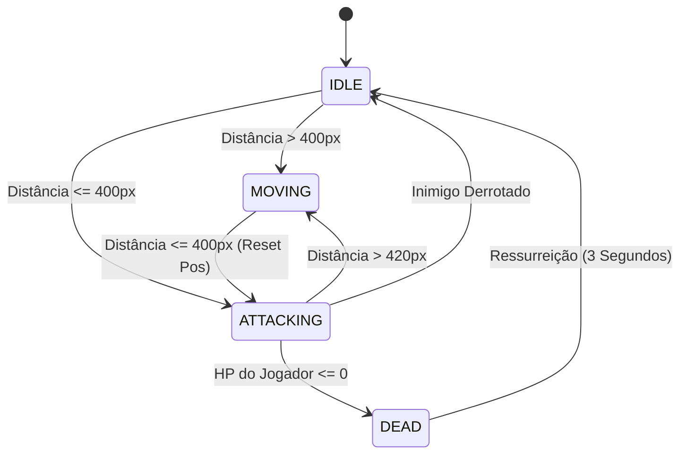

# Manual Técnico Definitivo - Amaro RPG Idle

Este documento serve como o manual interno oficial e especificação técnica para o projeto **Amaro RPG Idle**. Ele detalha todos os sistemas de jogo, fórmulas matemáticas, arquitetura de software, componentes de interface, mecânicas de progressão e o histórico de atualizações com base nas implementações reais contidas no código-fonte.

---

## 1. Visão Geral do Jogo

**Amaro RPG Idle** é um jogo de RPG incremental progressivo (*idle*) com elementos de *roguelite* (*ascensão*). O jogador gerencia um herói pertencente a uma de várias classes disponíveis, combatendo hordas de monstros e chefes em tempo real através de uma simulação gráfica 2D. O progresso é impulsionado pela aquisição de pontos de atributos, desbloqueio e aprimoramento de habilidades ativas e passivas, e equipagem de itens de raridades variadas com bônus de conjuntos (*sets*).

Ao encontrar barreiras de dificuldade causadas pelo escalonamento exponencial dos monstros, o jogador pode realizar a **Ascensão (Prestígio)**, trocando seu nível atual e progresso de fases por Pontos de Prestígio permanentes, que concedem aumentos robustos aos atributos primários para as rodadas seguintes.

---

## 2. Arquitetura e Engenharia de Software

O jogo é estruturado como uma aplicação web moderna que combina a renderização reativa com um motor de simulação de alta performance.

### A. Stack Tecnológica
*   **Front-End React (v18+)**: Responsável pela renderização de todas as janelas de menu, abas, árvores de upgrades, inventário e manipulação dos dados do personagem.
*   **Gerenciamento de Estado (Zustand)**: Toda a persistência, progresso do herói, inventário e níveis de classe são mantidos em uma store global reativa (`useGameStore`).
*   **Motor Gráfico (Phaser 3)**: Responsável pela cena gráfica 2D de combate, animações dos sprites dos personagens, renderização dos cenários (*parallax scroll*), efeitos visuais de habilidades, números flutuantes de dano e processamento do ciclo de combate físico.
*   **TypeScript (Strict Mode)**: Garante a tipagem estrita de todas as estruturas e interfaces do jogo, mitigando bugs de tempo de execução.

### B. O Canal de Comunicação: GameBridge
Para desacoplar a interface do usuário (React) do motor de simulação (Phaser), foi implementada uma ponte de comunicação assíncrona orientada a eventos chamada `GameBridge`.
O fluxo de dados ocorre através de um barramento de eventos compartilhado (`GameEvent`), garantindo que o Phaser saiba quando o jogador aciona uma habilidade e que o React atualize o HUD de HP/Mana em alta frequência sem re-renderizar componentes pesados.

#### Mapeamento de Eventos (`GameEvent`)
*   **Comandos da UI (React $\rightarrow$ Phaser)**:
    *   `ACTION_TRIGGERED`: Dispara o uso de uma habilidade ativa pelo jogador.
    *   `START_COMBAT`: Inicia ou retoma o loop de combate na cena.
    *   `END_COMBAT`: Pausa a simulação.
    *   `TOGGLE_AUTOCAST`: Ativa ou desativa a conjuração automática por IA das habilidades de ataque/cura.
*   **Feedback da Engine (Phaser $\rightarrow$ React / HUD)**:
    *   `PLAYER_HP_CHANGED`: Notifica a porcentagem, valor atual e valor máximo de HP do jogador (atualiza referências diretas na UI para evitar gargalos de renderização).
    *   `PLAYER_MANA_CHANGED`: Notifica a porcentagem, valor atual e valor máximo de mana do jogador.
    *   `LOG_EMITTED`: Envia mensagens de texto em tempo real sobre os eventos de combate para o console de logs de batalha.
    *   `COOLDOWNS_CHANGED`: Envia a tabela atualizada de recarga de habilidades ativas em milissegundos.
    *   `ENEMY_DEFEATED` e `STAGE_COMPLETED`: Atualizam o estado da fase e do bestiário no Zustand.

---

## 3. Interface do Usuário e Visual (UI/UX)

O jogo utiliza uma linguagem de design premium no estilo *Dark Mode* focada na legibilidade, organization de abas e usabilidade no desktop e dispositivos móveis.

### A. Paleta de Cores e Temática (WhatsApp Dark Style)
A interface é construída sobre uma paleta de tons escuros curados, proporcionando alto contraste para os elementos de RPG e cores vibrantes para indicar raridades e buffs:
*   **Fundo da Aplicação (`Background`)**: `#161717` (preto suave de baixo brilho).
*   **Superfícies e Painéis (`Surfaces`)**: `#1D1F1F` (cinza escuro para cards, abas e contêineres).
*   **Caixas de Texto e Inputs**: `#252727` (cinza médio para destacar elementos interativos secundários).
*   **Destaques de Dano e Recursos**:
    *   `HP / Vida`: Vermelho Vibrante (`#ef4444`)
    *   `Mana`: Azul Arcane (`#3b82f6`)
    *   `Cura / Restauração`: Verde Esmeralda (`#10b981`)
    *   `Dano Físico`: Laranja de Combate (`#f59e0b`)

### B. Elementos do HUD e Viewport
1.  **Combate Viewport (Phaser Canvas)**: Exibe em tempo real o herói do jogador e o monstro atual no cenário.
    *   **Escala e Tamanho**: Utiliza um `ZOOM_FACTOR` integrado de $1.35\times$ com tamanho base de sprites aumentado para $165\text{px}$ (personagem e monstros comuns) e $215\text{px}$ (chefes), proporcionando uma presença visual imponente na tela.
    *   **Textos de Identificação**: O nível do inimigo foi removido do nome flutuante acima do sprite para evitar redundâncias com o HUD de estágio.
    *   **Inimigos Elites**: O afixo de Elite (ex: `ELITE ENFURECIDO`) é renderizado centralizado em uma linha superior própria, imediatamente acima do nome do monstro.
    *   **Efeitos e Debuffs**: Debuffs ativos (como `[ATORDADO]` ou `[ENVENENADO]`) são posicionados dinamicamente no topo do título de Elite, garantindo leitura limpa da cena de combate.
    *   **Textos de Dano Flutuante**: O dano e efeitos são renderizados mais abaixo (sobre o corpo do alvo, deslocados $+65\text{px}$ em Y) e demoram mais tempo para sumir ($1.5\text{s}$ no dano de habilidades/ticks e $1.4\text{s}$ no dano de toques), subindo com velocidade reduzida para maior legibilidade.
    *   A base do cenário (*ground*) é travada verticalmente para manter o alinhamento visual durante a movimentação.
2.  **HUD de Status**: Exibe duas barras horizontais (HP e Mana) com preenchimento colorido e contadores absolutos (`Valor Atual / Valor Máximo`), acompanhados da Fase Atual do jogo, progresso do Estágio (monstros eliminados de 15), velocidade da simulação e atalhos de controle de som.
3.  **Controle de Velocidade e Pausa**: Permite alterar o ritmo da simulação do Phaser ou pausar o jogo completamente (velocidades `⏸`, `1x`, `2x` e `3x`) usando multiplicadores temporais no relógio interno da cena. As velocidades mais rápidas possuem travas de segurança: a velocidade 2x é liberada após a primeira ascensão (`ascensionCount >= 1`), e a velocidade 3x é liberada a partir da quinta ascensão (`ascensionCount >= 5`).

### C. Estrutura do Menu de Abas
O painel inferior/lateral de gerenciamento é dividido em abas com transições suaves (`animate-tabFade` para evitar saltos bruscos de tela):
*   **Combate**: Console de logs de batalha detalhados e botões de atalho rápido das habilidades desbloqueadas, com overlay cinza semitransparente indicando o tempo de cooldown restante e botão de alternância do Auto-Cast (IA).
*   **Atributos**: Painel com os pontos de atributos livres para distribuição (+5 a cada nível), listagem dos atributos finais do personagem calculados em tempo real (Força, Magia, Destreza, Constituição e Sorte) e bônus passivos de classe.
*   **Habilidades**: Árvore visualizada de forma hierárquica por conexões de dependência. Permite comprar ou aprimorar (até nível 5 por padrão, estendendo-se até o nível 10 nas dificuldades Inferno e Apocalipse) habilidades ativas e passivas da classe atual utilizando Pontos de Habilidade adquiridos por nível.
*   **Equipamento**: Grade de inventário com 30 slots exibindo itens recolhidos por drop. Possui um conjunto de slots de equipagem ativa (`Cabeça`, `Torso`, `Pernas`, `Mãos` e `Arma`). Ao clicar em um item, abre-se um painel de detalhes local absoluto contendo atributos, raridade e bônus de conjunto.
*   **Ascensão**: Exibe estatísticas acumuladas, a quantidade de Pontos de Prestígio (PP) que o jogador ganhará se resetar agora, os requisitos mínimos de PP e o painel de Upgrades Permanentes de Ascensão.
*   **Bestiário**: Enciclopédia de monstros catalogados no jogo. Mostra a ilustração transparente de cada monstro e uma contagem de abates acumulados.
*   **Guia**: Central de documentação interna com regras e tutoriais.
*   **Saves**: Gerenciador de progresso com suporte a seis slots independentes e recursos de Importação/Exportação através de criptografia textual leve.
*   **Opções**: Centraliza configurações do jogo e preferências de Qualidade de Vida (QoL) do jogador, incluindo áudio, console de combate, formatação de números, auto-venda de equipamentos dropados e controle do robô assistente.

### D. Posicionamento Inteligente de Modais (Refatoração)
Os modais informativos de itens no inventário e detalhes de monstros no bestiário foram convertidos de contêineres fixos globais (comuns em interfaces web tradicionais que causam bloqueio de interatividade) para **modais locais com posicionamento absoluto**. Eles são renderizados diretamente dentro da hierarquia da aba ativa. Isso garante que o scroll continue funcionando normalmente, evita o transbordo visual (*clipping*) e assegura a usabilidade ideal em resoluções desktop comuns e telas mobile.

### E. Opções do Jogo e Qualidade de Vida (QoL)
A aba **Opções** centraliza recursos voltados a personalizar a experiência de jogo e automatizar tarefas repetitivas, salvando as preferências do usuário localmente em `localStorage`.

1.  **Configurações de Áudio**:
    *   **Música de Fundo (BGM)**: Permite ligar ou desligar a música de fundo do jogo.
    *   **Efeitos Sonoros (SFX)**: Permite habilitar ou desabilitar todos os efeitos sonoros de cliques, golpes e magias.
    *   *Nota: Os controles rápidos de áudio foram retirados do cabeçalho principal e centralizados inteiramente nesta aba.*

2.  **Visual & Interface**:
    *   **Console de Combate**: Permite mostrar ou esconder os logs de combate em tempo real que aparecem no rodapé da aba Combate.
    *   **Abreviar Números Grandes**: Quando ativado, os números exibidos na interface (como ouro do jogador, valor de venda de itens) e no console de logs de combate (como danos físicos, mágicos, DOTs de veneno/queimadura e curas) são abreviados utilizando sufixos compactos (K para milhares, M para milhões, B para bilhões, T para trilhões). Quando desativado, os valores são exibidos inteiramente como números inteiros.
        *   *Exemplo*: `10.500` é formatado como `10.5K`; `1.000.000` é formatado como `1M`.

3.  **Automação & QoL**:
    *   **Auto-venda de Equipamentos Comuns**: Se habilitado, qualquer equipamento de raridade **Comum** dropado por monstros é vendido instantaneamente no momento do drop, adicionando seu valor correspondente em ouro diretamente à carteira do jogador, sem ocupar espaço no inventário.
    *   **Auto-venda de Equipamentos Raros**: Se habilitado, qualquer equipamento de raridade **Raro** dropado por monstros é vendido instantaneamente no momento do drop por ouro, otimizando o fluxo de esvaziamento do inventário.
    *   **Desativar Robô Assistente**: Permite desativar as ações de clique automático geradas pelo upgrade permanente de prestígio "Robô Assistente", permitindo que jogadores testem o desempenho puro de sua classe sem a interferência da automação ou joguem de forma estritamente ativa.

---

## 4. Sistema de Classes e Maestria

O jogo possui seis classes distintas: três classes primárias disponíveis desde o início e três classes secundárias avançadas desbloqueadas através do progresso.

### A. Desbloqueio de Classes Secundárias (Roguelite)
As classes secundárias requerem dedicação a uma classe primária específica e são desbloqueadas quando o jogador alcança pelo menos o **Nível 10** na classe base. 
Este progresso de classe é persistido globalmente através da chave `medieval_idle_global_class_levels` no armazenamento local do navegador. Quando o jogador realiza resets, ascensões ou cria novos jogos em slots alternativos, a permissão das classes avançadas é mantida.
*   **Paladino (`Paladin`)**: Requer Guerreiro (`Warrior`) Nível $\ge 10$.
*   **Clérigo (`Cleric`)**: Requer Mago (`Mage`) Nível $\ge 10$.
*   **Ladrão (`Rogue`)**: Requer Arqueiro (`Ranger`) Nível $\ge 10$.

### B. Atributos Iniciais e Taxas de Crescimento
Cada classe possui uma distribuição distinta de atributos base e ganha bônus diferentes automaticamente a cada passagem de nível (*Level Up*), conforme detalhado na tabela abaixo:

| Classe | Descrição de Combate | Principal Atributo | Força (Base / Cresc.) | Magia (Base / Cresc.) | Destreza (Base / Cresc.) | Const. (Base / Cresc.) | Sorte (Base / Cresc.) |
| :--- | :--- | :--- | :---: | :---: | :---: | :---: | :---: |
| **Guerreiro** | Combatente corpo a corpo robusto de alto dano físico e defesa. | Força | 12 / +2.0 | 4 / +0.5 | 8 / +1.0 | 14 / +2.5 | 5 / +0.5 |
| **Mago** | Conjurador arcano focado em magias explosivas elementais. | Magia | 4 / +0.5 | 15 / +3.0 | 7 / +1.0 | 8 / +1.0 | 5 / +0.5 |
| **Arqueiro** | Atirador ágil que aplica venenos e dispara flechas rápidas. | Destreza | 6 / +1.0 | 5 / +0.5 | 15 / +3.0 | 9 / +1.5 | 8 / +0.8 |
| **Paladino** | Protetor sagrado de altíssimo HP cuja força escala com defesa. | Constituição | 10 / +1.5 | 6 / +1.0 | 5 / +0.5 | 16 / +3.0 | 5 / +0.5 |
| **Clérigo** | Mestre sagrado especializado em curas massivas e expor inimigos. | Magia | 7 / +1.0 | 13 / +2.5 | 5 / +0.5 | 11 / +2.0 | 6 / +0.6 |
| **Ladrão** | Assassino ágil de acertos críticos com foco em venenos e força. | Destreza | 8 / +1.5 | 3 / +0.5 | 16 / +3.0 | 8 / +1.0 | 10 / +1.0 |

### C. Fórmulas de Atributos Derivados (Balanceamento de Utilidade)
Para garantir um combate equilibrado e incentivar a distribuição diversificada de pontos, o jogo aplica um sistema de **escalonamento dinâmico**. Atributos que servem como fonte primária de dano para uma classe concedem bônus reduzidos aos status secundários (como HP Máximo ou regenerações), enquanto as demais classes se beneficiam de uma escala amplificada nesses mesmos atributos.

#### 1. Vida Máxima (HP), Regeneração e Redução de Dano
A Vida Máxima, a Regeneração de HP e a resistência a danos escalam a partir do atributo **Constituição**:
*   **Classes Primárias de Constituição (Paladino)**:
    *   HP Máximo ganho por ponto de Constituição: $8\text{ HP}$
    *   Regeneração de HP ganha por ponto de Constituição: $0.03\text{ HP/s}$
*   **Outras Classes (Guerreiro, Mago, Arqueiro, Clérigo, Ladrão)**:
    *   HP Máximo ganho por ponto de Constituição: $18\text{ HP}$ (incentiva classes frágeis a investirem em sobrevivência)
    *   Regeneração de HP ganha por ponto de Constituição: $0.08\text{ HP/s}$
*   **Redução de Dano Recebido (Todas as Classes)**:
    *   Cada ponto de Constituição reduz em $0.05\%$ todo o dano recebido por ataques de monstros, com um limite máximo de $95\%$ de redução total para fins de equilíbrio de jogabilidade.

#### 2. Mana Máxima e Regeneração
A Mana Máxima e a Regeneração de Mana escalam a partir do atributo **Magia**:
*   **Classes Primárias de Magia (Mago, Clérigo)**:
    *   Mana Máxima ganha por ponto de Magia: $6\text{ Mana}$ (previne mana infinita e uso descontrolado de auto-cast)
    *   Regeneração de Mana ganha por ponto de Magia: $0.02\text{ Mana/s}$
*   **Outras Classes (Guerreiro, Arqueiro, Paladino, Ladrão)**:
    *   Mana Máxima ganha por ponto de Magia: $18\text{ Mana}$ (torna viável conjurar habilidades táticas com poucos pontos investidos)
    *   Regeneração de Mana ganha por ponto de Magia: $0.09\text{ Mana/s}$

#### 3. Velocidade de Ataque (Attack Speed) e Esquiva (Dodge)
A velocidade com que o herói realiza ataques básicos e sua chance de se esquivar de ataques inimigos escalam a partir do atributo **Destreza**:
*   **Classes Primárias de Destreza (Arqueiro, Ladrão)**:
    *   Aumento de Velocidade de Ataque por ponto de Destreza: $+1.0\%$
*   **Outras Classes (Guerreiro, Mago, Paladino, Clérigo)**:
    *   Aumento de Velocidade de Ataque por ponto de Destreza: $+3.5\%$
*   **Esquiva (Todas as Classes)**:
    *   Cada ponto de Destreza concede $+0.1\%$ de Chance de Esquiva contra ataques recebidos de monstros, com limite de até $75\%$ de esquiva máxima para fins de balanceamento do jogo.

#### 4. Drop, Ouro e Crítico (Sorte)
O atributo **Sorte** influencia a probabilidade e qualidade dos itens derrubados, o ouro ganho e também o desempenho em combate ativamente através do clique:
*   **Chance de Drop (Monstros Normais)**:
    $$\text{Chance} = \min\left(50\%, 5\% + \text{Sorte} \times 0.2\%\right)$$
*   **Multiplicador de Ouro**:
    $$\text{Bônus} = 1 + \frac{\text{Sorte Final}}{100}$$
*   **Chance de Crítico de Toque**:
    Cada ponto de Sorte adiciona $+0.05\%$ de Chance de Crítico ao toque do jogador (cumulativo com itens e upgrades de prestígio).
*   **Dano Crítico de Toque**:
    Cada ponto de Sorte adiciona $+0.2\%$ de Dano Crítico ao toque do jogador (cumulativo com itens e upgrades de prestígio).

#### 5. Penetração de Armadura e Dano Geral (Força)
Além dos modificadores de classe e bônus secundários em ataques físicos, o atributo **Força** concede um aumento passivo global de dano:
*   **Aumento de Dano (Todas as Classes)**:
    Cada ponto de Força adiciona $+0.05\%$ de aumento no dano final causado pelo jogador (penetração de armadura). Este bônus é multiplicativo e aplica-se tanto a ataques básicos quanto a todas as habilidades de ataque.

---

## 5. Sistema de Equipamentos e Inventário

O herói pode encontrar e equipar peças de equipamentos derrubados por monstros para somar atributos diretamente aos seus valores base.

### A. Raridades e Distribuição de Atributos
*   **Comum (`common`)**: Concede bônus em apenas **1 atributo** aleatório da lista de atributos viáveis para a classe do jogador. O nome recebe o sufixo "Rústico".
*   **Raro (`rare`)**: Concede bônus em **2 atributos** distintos. O nome é associado ao conjunto temático da classe ativa (ex: "Peitoral do Senhor da Guerra").
*   **Lendário (`legendary`)**: Concede bônus em **3 atributos** distintos. Possui multiplicador de escala alto e nome associado ao conjunto temático da classe.
*   **Ancestral (`ancestral`)**: Concede bônus em **3 atributos** de altíssima escala. Disponível apenas para jogadores que realizaram a primeira Ascensão (`ascensionCount >= 1`), com taxa de drop de 10% sob itens normais, gerando apenas o set temático da classe ativa no momento do combate. Atributos base gerados com multiplicador de escala místico de $4.5\times$ (superior ao $2.5\times$ lendário). Identificado visualmente por uma borda tracejada em tom violeta, brilho místico pulsante e indicador estelar no slot.

O valor final de cada atributo concedido pelo item é calculado com base na Fase atual do combate onde o item caiu:
$$\text{Atributo do Item} = \max\left(1, \text{round}\left( \text{Fase} \times \text{Multiplicador Raridade} \times \text{Random}(0.8, 1.2) \right)\right)$$
*Onde o $\text{Multiplicador Raridade}$ é $1.0$ para Comum, $1.5$ para Raro, $2.5$ para Lendário e $4.5$ para Ancestral.*

### B. Bônus de Conjunto (Sets)
Equipar múltiplos itens raros, lendários ou ancestrais pertencentes ao mesmo conjunto de classe ativa libera bônus adicionais de atributos acumulativos a partir de 2, 3 e 5 peças:

*   **Set do Senhor da Guerra (`warrior`)**:
    *   2 peças: $+15$ Força
    *   3 peças: $+20$ Constituição
    *   5 peças: $+35$ Força *(Total acumulado: +50 Str, +20 Con)*
*   **Set do Mestre Arcano (`mage`)**:
    *   2 peças: $+15$ Magia
    *   3 peças: $+20$ Constituição
    *   5 peças: $+35$ Magia *(Total acumulado: +50 Magic, +20 Con)*
*   **Set do Rastreador das Sombras (`ranger`)**:
    *   2 peças: $+15$ Destreza
    *   3 peças: $+20$ Constituição
    *   5 peças: $+35$ Destreza *(Total acumulado: +50 Dex, +20 Con)*
*   **Set do Guardião Divino (`paladin`)**:
    *   2 peças: $+15$ Constituição
    *   3 peças: $+20$ Força
    *   5 peças: $+35$ Constituição *(Total acumulado: +50 Con, +20 Str)*
*   **Set do Sumosacerdote (`cleric`)**:
    *   2 peças: $+15$ Magia
    *   3 peças: $+20$ Constituição
    *   5 peças: $+35$ Magia *(Total acumulado: +50 Magic, +20 Con)*
*   **Set do Assassino Fantasma (`rogue`)**:
    *   2 peças: $+15$ Destreza
    *   3 peças: $+20$ Força
    *   5 peças: $+35$ Destreza *(Total acumulado: +50 Dex, +20 Str)*

*   **Sets Ancestrais (Pós-Ascensão)**:
    Estes conjuntos são liberados apenas após a primeira ascensão do personagem e garantem bônus de atributos extremamente superiores:
    *   **Set Ancestral do Conquistador (`warrior`)**:
        *   2 peças: $+80$ Força
        *   3 peças: $+100$ Constituição, $+50$ Sorte
        *   5 peças: $+200$ Força *(Total acumulado: +280 Força, +100 Con, +50 Sorte)*
    *   **Set Ancestral do Arquimago (`mage`)**:
        *   2 peças: $+80$ Magia
        *   3 peças: $+100$ Constituição, $+50$ Sorte
        *   5 peças: $+200$ Magia *(Total acumulado: +280 Magia, +100 Con, +50 Sorte)*
    *   **Set Ancestral do Caçador Estelar (`ranger`)**:
        *   2 peças: $+80$ Destreza
        *   3 peças: $+100$ Constituição, $+50$ Sorte
        *   5 peças: $+200$ Destreza *(Total acumulado: +280 Destreza, +100 Con, +50 Sorte)*
    *   **Set Ancestral do Sentinela Eterno (`paladin`)**:
        *   2 peças: $+80$ Constituição
        *   3 peças: $+100$ Força, $+50$ Sorte
        *   5 peças: $+200$ Constituição *(Total acumulado: +280 Constituição, +100 For, +50 Sorte)*
    *   **Set Ancestral do Sábio Divino (`cleric`)**:
        *   2 peças: $+80$ Magia
        *   3 peças: $+100$ Constituição, $+50$ Sorte
        *   5 peças: $+200$ Magia *(Total acumulado: +280 Magia, +100 Con, +50 Sorte)*
    *   **Set Ancestral do Ceifador de Almas (`rogue`)**:
        *   2 peças: $+80$ Destreza
        *   3 peças: $+100$ Força, $+50$ Sorte
        *   5 peças: $+200$ Destreza *(Total acumulado: +280 Destreza, +100 For, +50 Sorte)*

*   **Sets Pandemoníacos (Exclusivos do Modo Pandemônio)**:
    Estes conjuntos de tier supremo são obtidos apenas derrotando inimigos na dificuldade Pandemônio (Fase 21+) e possuem atributos extraordinários:
    *   **Set Pandemoníaco do Destruidor (`warrior`)**:
        *   2 peças: $+250$ Força
        *   3 peças: $+300$ Constituição, $+150$ Sorte
        *   5 peças: $+600$ Força *(Total acumulado: +850 Força, +300 Con, +150 Sorte)*
    *   **Set Pandemoníaco do Feiticeiro do Vazio (`mage`)**:
        *   2 peças: $+250$ Magia
        *   3 peças: $+300$ Constituição, $+150$ Sorte
        *   5 peças: $+600$ Magia *(Total acumulado: +850 Magia, +300 Con, +150 Sorte)*
    *   **Set Pandemoníaco do Franco-Atirador (`ranger`)**:
        *   2 peças: $+250$ Destreza
        *   3 peças: $+300$ Constituição, $+150$ Sorte
        *   5 peças: $+600$ Destreza *(Total acumulado: +850 Destreza, +300 Con, +150 Sorte)*
    *   **Set Pandemoníaco do Vingador Sagrado (`paladin`)**:
        *   2 peças: $+250$ Constituição
        *   3 peças: $+300$ Força, $+150$ Sorte
        *   5 peças: $+600$ Constituição *(Total acumulado: +850 Constituição, +300 Força, +150 Sorte)*
    *   **Set Pandemoníaco do Sumo-Inquisidor (`cleric`)**:
        *   2 peças: $+250$ Magia
        *   3 peças: $+300$ Constituição, $+150$ Sorte
        *   5 peças: $+600$ Magia *(Total acumulado: +850 Magia, +300 Con, +150 Sorte)*
    *   **Set Pandemoníaco do Executor (`rogue`)**:
        *   2 peças: $+250$ Destreza
        *   3 peças: $+300$ Força, $+150$ Sorte
        *   5 peças: $+600$ Destreza *(Total acumulado: +850 Destreza, +300 Força, +150 Sorte)*

---

## 6. Árvores de Habilidades

Cada classe possui uma árvore com habilidades ativas e passivas exclusivas. Adicionalmente, a habilidade ativa de **Cura** está disponível para todas as classes.

### Regras de Progressão e Nível Máximo
*   **Limite de Nível Padrão**: Por padrão (Fases 1 a 10, dificuldades Normal e Pesadelo), cada habilidade comum pode ser aprimorada até o **Nível 5**.
*   **Expansão no End-Game (Inferno / Apocalipse)**: Ao alcançar a Fase 11 (dificuldades Inferno e Apocalipse), o limite máximo de nível de todas as habilidades comuns é expandido para o **Nível 10**.
*   **Expansão no End-Game (Modo Pandemônio)**: Ao alcançar a Fase 21 (dificuldade Pandemônio), o limite máximo de nível de todas as habilidades comuns é expandido para o **Nível 15**.
*   **Escalonamento**:
    *   *Habilidades Ativas*: O dano aumenta em $+15\%$ multiplicativo por nível da habilidade baseado no multiplicador original (ex: dano de $150\%$ vai para $240\%$ no nível 5, $315\%$ no nível 10 e até $465\%$ no nível 15).
    *   *Cura*: A porcentagem curada aumenta em $+5\%$ por nível (de $30\%$ no nível 1 para $50\%$ no nível 5, $75\%$ no nível 10 e até $100\%$ de cura no nível 15).
    *   *Habilidades Passivas*: Os bônus de atributos se acumulam linearmente por nível (ex: $+5$ de Força por nível resulta em $+25$ no nível 5, $+50$ no nível 10 e até $+75$ no nível 15).
    *   *Efeitos e Debuffs*: Os valores de dano ou durações dos efeitos secundários aplicados pelas habilidades escalam em $+15\%$ multiplicativo por nível adicional da habilidade:
        *   *Efeitos de Dano/Regeneração Periódica*: O dano/cura por tick aumenta a cada nível, mantendo a duração fixa (ex: o Veneno da *Flecha Venenosa* de $20\%$ da Destreza passa a causar $32\%$ no nível 5, $47\%$ no nível 10 e $62\%$ no nível 15).
        *   *Efeitos de Controle/Utilidade*: A duração (tempo do efeito) aumenta a cada nível, mantendo a potência fixa (ex: o Atordoamento de *Bater Escudo* de $2\text{s}$ dura $3.2\text{s}$ no nível 5, $4.7\text{s}$ no nível 10 e $6.2\text{s}$ no nível 15).

### Habilidades Ultimate (End-Game)
As habilidades Ultimate são técnicas extremamente poderosas exclusivas de cada classe, desbloqueadas sob condições estritas:
*   **Condições de Desbloqueio**: O personagem precisa estar na dificuldade **Inferno** ou superior (Fase 11+), ter alcançado pelo menos o **Nível 15** e possuir a habilidade tier 6 de sua classe desbloqueada (nível $\ge 1$).
*   **Limitação**: O limite máximo de nível de todas as habilidades Ultimate é fixado em **Nível 1**, não sendo possível aumentá-lo.
*   **Custo e Cooldown**: Possuem custos elevados de mana e tempos de recarga prolongados (50 a 80 segundos), refletindo seu impacto massivo no combate.

#### Catálogo de Habilidades Ultimate por Classe
1.  **Guerreiro**: *Cólera dos Titãs* (`ultimate_warrior`)
    *   *Dano*: Causa $1200\%$ de dano físico baseado em Força.
    *   *Custo de Mana*: $50$ Mana | *Tempo de Recarga*: $60.000$ ms (60s)
    *   *Efeito Visual*: Impacto titânico com grandes rachaduras de fogo e forte tremor contínuo de tela.
2.  **Mago**: *Supernova* (`ultimate_mage`)
    *   *Dano*: Causa $1500\%$ de dano mágico baseado em Magia.
    *   *Custo de Mana*: $80$ Mana | *Tempo de Recarga*: $70.000$ ms (70s)
    *   *Efeito Visual*: Explosão estelar expansiva cobrindo a tela inteira em tons brilhantes de azul e branco.
3.  **Arqueiro**: *Flecha do Juízo Final* (`ultimate_ranger`)
    *   *Dano*: Causa $1100\%$ de dano de perfuração baseado em Destreza.
    *   *Custo de Mana*: $45$ Mana | *Tempo de Recarga*: $55.000$ ms (55s)
    *   *Efeito Visual*: Raio de energia verde esmeralda de alta velocidade cortando a tela horizontalmente com múltiplos feixes adicionais.
4.  **Paladino**: *Julgamento Sagrado* (`ultimate_paladin`)
    *   *Dano*: Causa $1000\%$ de dano sagrado baseado em Constituição.
    *   *Custo de Mana*: $60$ Mana | *Tempo de Recarga*: $65.000$ ms (65s)
    *   *Efeito Visual*: Três pilares gigantes dourados atingindo o monstro consecutivamente com explosões de luz divina.
5.  **Clérigo**: *Ascensão Celestial* (`ultimate_cleric`)
    *   *Dano e Efeito*: Causa $900\%$ de dano sagrado baseado em Magia e **cura 100% da Vida Máxima** do herói.
    *   *Custo de Mana*: $70$ Mana | *Tempo de Recarga*: $80.000$ ms (80s)
    *   *Efeito Visual*: Anjos de luz cruzam a tela com ondas curativas verdejantes e chuva de faíscas brilhantes.
6.  **Ladrão**: *Lâmina da Aniquilação* (`ultimate_rogue`)
    *   *Dano*: Causa $1400\%$ de dano físico baseado em Destreza.
    *   *Custo de Mana*: $50$ Mana | *Tempo de Recarga*: $50.000$ ms (50s)
    *   *Efeito Visual*: Animação de corte sombrio em X na cor vermelha com desfoque de movimento, tremor e partículas de sombras.

### A. Custos de Recursos e Recargas (Cooldowns)
Os custos de mana e os tempos de cooldown são calculados de acordo com o nível exigido para desbloqueio da habilidade (`requiredLevel`):
*   **Custo de Mana**:
    *   *Slash (Guerreiro)*: $8$ Mana
    *   *Fireball (Mago)*: $15$ Mana
    *   *Cura (Comum)*: $12$ Mana
    *   *Habilidades Ultimate*: Custo fixado por classe (45 a 80 de Mana)
    *   *Outras Habilidades*: $10 + (\text{Nível Requerido} \times 1.5)$ Mana
*   **Tempo de Recarga (Cooldown) no Combate**:
    *   *Cura (Comum)*: $10.000$ ms (10.0 segundos)
    *   *Habilidades de Nível Requerido $\le 1$*: $6.000$ ms (6.0 segundos)
    *   *Habilidades de Nível Requerido $\le 3$*: $10.000$ ms (10.0 segundos)
    *   *Habilidades de Nível Requerido $\le 7$*: $16.000$ ms (16.0 segundos)
    *   *Habilidades de Nível Requerido $> 7$*: $24.000$ ms (24.0 segundos)
    *   *Habilidades Ultimate*: Cooldown fixado por classe (50s a 80s)

---

### B. Catálogo Detalhado de Habilidades por Classe

#### ⚔️ Guerreiro (Warrior)
Escala suas habilidades de ataque com **Força** (`strength`).
*   **Slash** (Ativa, Nível Requerido: 1, Mana: 8, Cooldown: 6s):
    *   *Mecânica*: Causa $150\%$ de dano físico base. O dano aumenta em $+15\%$ multiplicativo por nível da habilidade (até $240\%$ no nível 5).
    *   *Efeito Visual*: Executa um corte vermelho transversal sobre o monstro e treme levemente a câmera do jogo.
*   **Impacto de Escudo** (Ativa, Nível Requerido: 3, Mana: 14.5, Cooldown: 10s):
    *   *Mecânica*: Causa $120\%$ de dano físico base (até $192\%$ no nível 5) e **aplica Atordoamento por 2 segundos** no monstro.
    *   *Efeito Visual*: Golpe físico com impacto retangular cinza e forte tremor de tela.
*   **Fúria Berserk** (Passiva, Nível Requerido: 5):
    *   *Mecânica*: Aumento passivo de $+5$ em Força para cada nível da habilidade comprado (até $+25$ de Força no nível 5).
*   **Executar** (Ativa, Nível Requerido: 7, Mana: 20.5, Cooldown: 16s):
    *   *Mecânica*: Causa $300\%$ de dano físico base (até $480\%$ no nível 5). **Causa 50% de dano extra (totalizando 450% a 720%) se o HP do monstro estiver abaixo de 35%**.
    *   *Efeito Visual*: Animação de corte diagonal duplo em cor vermelha intensa com texto crítico flutuante "¡MISERICÓRDIA!".
*   **Grito de Guerra** (Passiva, Nível Requerido: 9):
    *   *Mecânica*: Aumento passivo de $+5$ em Constituição por nível da habilidade (até $+25$ de Constituição no nível 5).
*   **Tempestade de Aço** (Ativa, Nível Requerido: 11, Mana: 26.5, Cooldown: 24s):
    *   *Mecânica*: Redemoinho de golpes físicos que causa $400\%$ de dano físico base (até $640\%$ no nível 5).
    *   *Efeito Visual*: Efeito contínuo de cortes rápidos circulares ao redor do alvo e vibração severa.

#### 🔮 Mago (Mage)
Escala suas habilidades de ataque com **Magia** (`magic`).
*   **Fireball** (Ativa, Nível Requerido: 1, Mana: 15, Cooldown: 6s):
    *   *Mecânica*: Causa $250\%$ de dano mágico base (até $400\%$ no nível 5). **Aplica Queimadura por 3 segundos**, que causa $15\%$ do valor de Magia do jogador como dano de fogo a cada segundo.
    *   *Efeito Visual*: Círculo laranja brilhante voa do jogador e explode no monstro em uma área de fumaça e fogo.
*   **Raio de Gelo** (Ativa, Nível Requerido: 3, Mana: 14.5, Cooldown: 10s):
    *   *Mecânica*: Causa $150\%$ de dano mágico base (até $240\%$ no nível 5) e **aplica Lentidão por 4 segundos**, reduzindo a velocidade de ataque do monstro em 40%.
    *   *Efeito Visual*: Projétil azul-claro de gelo que colide gerando partículas azuis e o rótulo `[LENTO]` acima do alvo.
*   **Escudo de Mana** (Passiva, Nível Requerido: 5):
    *   *Mecânica*: Aumento passivo de $+5$ em Magia para cada nível da habilidade comprado (até $+25$ de Magia no nível 5).
*   **Relâmpago** (Ativa, Nível Requerido: 7, Mana: 20.5, Cooldown: 16s):
    *   *Mecânica*: Dispara uma descarga que causa $350\%$ de dano mágico base (até $560\%$ no nível 5).
    *   *Efeito Visual*: Feixe elétrico roxo descendente caindo diretamente do céu sobre o alvo com clarão na tela.
*   **Brilho Arcano** (Passiva, Nível Requerido: 9):
    *   *Mecânica*: Aumento passivo de $+5$ em Magia por nível da habilidade (até $+25$ de Magia no nível 5).
*   **Meteoro** (Ativa, Nível Requerido: 11, Mana: 26.5, Cooldown: 24s):
    *   *Mecânica*: Cataclismo que causa $500\%$ de dano mágico base (até $800\%$ no nível 5). **Aplica Atordoamento por 1.5s e Queimadura por 5s** (causando 15% de Magia por segundo).
    *   *Efeito Visual*: Meteoro gigante caindo diagonalmente com grande explosão de fogo que sacode a tela inteira.

#### 🏹 Arqueiro (Ranger)
Escala suas habilidades de ataque com **Destreza** (`dexterity`).
*   **Disparo Preciso** (Ativa, Nível Requerido: 1, Mana: 11.5, Cooldown: 6s):
    *   *Mecânica*: Causa $150\%$ de dano de perfuração base (até $240\%$ no nível 5).
    *   *Efeito Visual*: Flecha veloz cruza a tela colidindo com partículas vermelhas no monstro.
*   **Flecha Venenosa** (Ativa, Nível Requerido: 3, Mana: 14.5, Cooldown: 10s):
    *   *Mecânica*: Causa $100\%$ de dano de perfuração base (até $160\%$ no nível 5) e **aplica Veneno por 5 segundos**, causando dano contínuo equivalente a $20\%$ da Destreza do jogador por segundo.
    *   *Efeito Visual*: Projétil verde deixando rastro de partículas tóxicas e marcando o inimigo com o status `[ENVENENADO]`.
*   **Olho de Águia** (Passiva, Nível Requerido: 5):
    *   *Mecânica*: Aumento passivo de $+5$ em Destreza por nível da habilidade comprado (até $+25$ de Destreza no nível 5).
*   **Disparo Duplo** (Ativa, Nível Requerido: 7, Mana: 20.5, Cooldown: 16s):
    *   *Mecânica*: Dispara dois projéteis de alta velocidade causando $280\%$ de dano de perfuração base (até $448\%$ no nível 5).
    *   *Efeito Visual*: Dois projéteis paralelos rápidos atingindo o inimigo consecutivamente em curto intervalo.
*   **Passo Ligeiro** (Passiva, Nível Requerido: 9):
    *   *Mecânica*: Aumento passivo de $+3$ em Destreza e $+2$ em Constituição por nível da habilidade (até $+15$ Dex e $+10$ Con no nível 5).
*   **Chuva de Flechas** (Ativa, Nível Requerido: 11, Mana: 26.5, Cooldown: 24s):
    *   *Mecânica*: Causa $420\%$ de dano de perfuração base (até $672\%$ no nível 5).
    *   *Efeito Visual*: Uma tempestade de pequenas flechas descendo sobre o monstro causando tremidos de tela e múltiplos textos de dano.

#### 🛡️ Paladino (Paladin)
Escala suas habilidades de ataque com **Constituição** (`constitution`).
*   **Golpe Sagrado** (Ativa, Nível Requerido: 1, Mana: 11.5, Cooldown: 6s):
    *   *Mecânica*: Causa $150\%$ de dano sagrado baseado em Constituição (até $240\%$ no nível 5).
    *   *Efeito Visual*: Corte diagonal brilhante em tom dourado acompanhado de flash de luz.
*   **Escudo da Justiça** (Ativa, Nível Requerido: 3, Mana: 14.5, Cooldown: 10s):
    *   *Mecânica*: Causa $120\%$ de dano sagrado (até $192\%$ no nível 5) e **aplica Fraqueza por 5 segundos**, reduzindo todo o dano infligido pelo monstro em 30%.
    *   *Efeito Visual*: Explosão retangular dourada sobre o monstro marcando-o com o status `[ENFRAQUECIDO]`.
*   **Retribuição Aura** (Passiva, Nível Requerido: 5):
    *   *Mecânica*: Aumento passivo de $+5$ em Constituição por nível da habilidade comprado (até $+25$ de Constituição no nível 5).
*   **Punição da Luz** (Ativa, Nível Requerido: 7, Mana: 20.5, Cooldown: 16s):
    *   *Mecânica*: Golpe pesado de dano misto que causa $250\%$ base (até $400\%$ no nível 5) calculado sobre a **média de Constituição e Força** do personagem:
        $$\text{Dano Base} = (\text{Constituição} \times 1.25 + \text{Força} \times 1.25) \times \text{Multiplicador de Nível}$$
    *   *Efeito Visual*: Pilar de luz dourada brilhante cobrindo o monstro com partículas de energia que sobem.
*   **Dever Sagrado** (Passiva, Nível Requerido: 9):
    *   *Mecânica*: Aumento passivo de $+3$ em Força e $+3$ em Constituição por nível da habilidade (até $+15$ Str e $+15$ Con no nível 5).
*   **Consagração** (Ativa, Nível Requerido: 11, Mana: 26.5, Cooldown: 24s):
    *   *Mecânica*: Causa $380\%$ de dano sagrado ao monstro (até $608\%$ no nível 5) e **aplica Consagração (Regeneração) ao jogador por 6 segundos**, restaurando $15\%$ do valor de Constituição do herói como HP por segundo.
    *   *Efeito Visual*: Chão sob os combatentes brilha em tom dourado sagrado, com efeito de cura subindo nos pés do herói.

#### ✝️ Clérigo (Cleric)
Escala suas habilidades com **Magia** (`magic`).
*   **Golpe de Fé** (Ativa, Nível Requerido: 1, Mana: 11.5, Cooldown: 6s):
    *   *Mecânica*: Causa $150\%$ de dano sagrado base (até $240\%$ no nível 5).
    *   *Efeito Visual*: Esfera de energia dourada disparada em direção ao monstro, gerando explosão de faíscas.
*   **Bênção Divina** (Passiva, Nível Requerido: 3):
    *   *Mecânica*: Aumento passivo de $+5$ em Magia para cada nível da habilidade comprado (até $+25$ de Magia no nível 5).
*   **Escudo Sagrado** (Passiva, Nível Requerido: 5):
    *   *Mecânica*: Aumento passivo de $+5$ em Constituição para cada nível da habilidade comprado (até $+25$ de Constituição no nível 5).
*   **Ira do Céu** (Ativa, Nível Requerido: 7, Mana: 20.5, Cooldown: 16s):
    *   *Mecânica*: Causa $300\%$ de dano sagrado base (até $480\%$ no nível 5) e **aplica Exposto por 5 segundos**, aumentando todo o dano recebido pelo monstro em 20%.
    *   *Efeito Visual*: Relâmpago dourado caindo do céu diretamente sobre o monstro e gerando o rótulo `[EXPOSTO]`.
*   **Crescimento Espiritual** (Passiva, Nível Requerido: 9):
    *   *Mecânica*: Aumento passivo de $+3$ em Magia e $+3$ em Constituição por nível da habilidade (até $+15$ Magic e $+15$ Con no nível 5).
*   **Julgamento Final** (Ativa, Nível Requerido: 11, Mana: 26.5, Cooldown: 24s):
    *   *Mecânica*: Causa $450\%$ de dano sagrado base (até $720\%$ no nível 5).
    *   *Efeito Visual*: Grande explosão dourada (1.6x maior que o normal) com tremores intensos e múltiplos feixes de luz cruzando a tela.

#### 🗡️ Ladrão (Rogue)
Escala suas habilidades de ataque com **Destreza** (`dexterity`).
*   **Apunhalar** (Ativa, Nível Requerido: 1, Mana: 11.5, Cooldown: 6s):
    *   *Mecânica*: Causa $180\%$ de dano físico base (até $288\%$ no nível 5).
    *   *Efeito Visual*: Corte físico vermelho de alta velocidade em ângulo diagonal sobre o inimigo.
*   **Adaga de Veneno** (Ativa, Nível Requerido: 3, Mana: 14.5, Cooldown: 10s):
    *   *Mecânica*: Causa $120\%$ de dano de perfuração base (até $192\%$ no nível 5) e **aplica Veneno por 4 segundos**, causando dano contínuo equivalente a $25\%$ da Destreza do jogador por segundo.
    *   *Efeito Visual*: Corte de adaga acompanhado de névoa roxa, aplicando o rótulo `[TOXINA]` no monstro.
*   **Manto de Sombras** (Passiva, Nível Requerido: 5):
    *   *Mecânica*: Aumento passivo de $+5$ em Destreza por nível da habilidade comprado (até $+25$ de Destreza no nível 5).
*   **Ataque Furtivo** (Ativa, Nível Requerido: 7, Mana: 20.5, Cooldown: 16s):
    *   *Mecânica*: Golpe pelas costas causando $320\%$ de dano físico base (até $512\%$ no nível 5).
    *   *Efeito Visual*: O herói desaparece por uma fração de segundo e executa um corte transversal letal vermelho escuro com forte tremor de tela.
*   **Passo Sombrio** (Passiva, Nível Requerido: 9):
    *   *Mecânica*: Aumento passivo de $+3$ em Destreza e $+3$ em Força por nível da habilidade (até $+15$ Dex e $+15$ Str no nível 5).
*   **Florescer Letal** (Ativa, Nível Requerido: 11, Mana: 26.5, Cooldown: 24s):
    *   *Mecânica*: Redemoinho de adagas que causa $450\%$ de dano físico base (até $720\%$ no nível 5).
    *   *Efeito Visual*: Múltiplos cortes físicos vermelhos cruzados em alta velocidade no corpo do monstro, seguidos de grande explosão de poeira e forte tremor.

---

### C. Habilidade Comum: 💚 Cura (`heal`)
*   **Tipo**: Habilidade Ativa
*   **Nível Requerido**: 1
*   **Custo de Mana**: $12$ Mana
*   **Tempo de Recarga**: $10.000$ ms ($10$ segundos)
*   **Cálculo Matemático da Restauração**:
    $$\text{Valor da Cura} = \lfloor \text{HP Máximo} \times (0.30 + (\text{Nível da Habilidade} - 1) \times 0.05) \rfloor$$
    *Onde a cura recupera 30% do HP máximo no nível 1, aumentando +5% por nível adicional, até atingir 50% de cura máxima do HP total no nível 5.*
*   **Funcionamento de Inteligência Artificial (Auto-Cast)**:
    Quando a Conjuração Automática de Habilidades está habilitada (liberada definitivamente após a primeira ascensão, ou temporariamente ao vencer a Fase 5 na primeira rodada) e o HP do herói cai abaixo de sua vida máxima no percentual configurado pelo jogador (padrão de **50% de sua vida máxima**), o motor de combate prioriza imediatamente o uso de **Cura** antes de qualquer outra habilidade ofensiva, desde que haja mana suficiente e a habilidade não esteja em recarga.
*   **Efeito Visual no Phaser**:
    Cria um círculo concêntrico verde brilhante nos pés do herói. O círculo sobe verticalmente em direção ao peito e se expande até $1.3\times$ de tamanho antes de desaparecer gradualmente. Exibe um número flutuante verde brilhante `+<quantidade>` acima do herói.

---

## 7. Motor de Combate (CombatFSM) e Escalonamento

O loop de simulação principal roda sobre uma Máquina de Estados Finita (`CombatFSM`) acoplada ao Phaser.

### A. Estados de Combate (`CombatState`)
1.  **`IDLE`**: O herói e o monstro estão spawnados. Se houver alvo a uma distância superior a 400 pixels, o FSM transiciona para `MOVING`. Caso contrário, transiciona para `ATTACKING`.
2.  **`MOVING`**: O herói corre em direção ao monstro enquanto o cenário desliza ao fundo (*parallax scroll*). Ao atingir 400 pixels de distância, o movimento cessa e a simulação inicia a fase de combate ativo.
3.  **`ATTACKING`**: Herói e monstro desferem ataques básicos de forma cíclica baseados em seus tempos de recarga individuais, além de processarem habilidades e ticks de status.
4.  **`CASTING`**: Estado temporário durante a execução de habilidades ativas.
5.  **`DEAD`**: O herói foi derrotado. O progresso de monstros derrotados no estágio atual é resetado para zero. Após um período de 3 segundos, o herói ressuscita com HP e mana cheios e o FSM retorna para `IDLE` no início da mesma fase.

### B. Ciclos de Ataque e Velocidades
*   **Ataque Básico do Jogador**: Causa dano físico, mágico ou de perfuração equivalente a $3.0\times$ do Atributo Principal da classe ativa e seu bônus de Força secundário (com a adição de chance e dano crítico globalizados), mais uma variação aleatória de $+0$ a $+3$:
    $$\text{Dano Básico} = \lfloor ((\text{Atributo Principal} + \text{Bônus Secundário de Força}) \times 3.0 + \text{Random}(0, 2)) \times \text{Multiplicador de Crítico} \rfloor$$
    *   *Onde o bônus secundário de Força se aplica apenas a classes que não possuem a Força como atributo primário:*
        $$\text{Bônus Secundário de Força} = \begin{cases} 0 & \text{se Guerreiro} \\ \text{Força} \times 0.25 & \text{se Mago, Arqueiro, Paladino, Clérigo, Ladrão} \end{cases}$$
    A recarga do ataque básico é calculada dinamicamente:
    $$\text{Velocidade de Ataque} = \left( 1 + \text{Destreza} \times \text{Fator de Destreza} \right) \times \left(1 + \text{Ascensões} \times 0.02\right)$$
    *Onde o $\text{Fator de Destreza}$ depende do balanceamento de utilidade da classe:*
    *   *Se a classe for focada em Destreza (Arqueiro, Ladrão): $\text{Fator de Destreza} = 0.01$ ($1\%$ por ponto).*
    *   *Se a classe NÃO for focada em Destreza (Guerreiro, Mago, Paladino, Clérigo): $\text{Fator de Destreza} = 0.035$ ($3.5\%$ por ponto).*
    $$\text{Recarga do Ataque} = \max\left( 800\text{ ms}, \frac{3000\text{ ms}}{\text{Velocidade de Ataque}} \right)$$
*   **Ataque do Inimigo**: Causa dano com base no escalonamento da fase. Contudo, antes de aplicar o dano à vida do herói, o jogo calcula a chance de esquiva do jogador baseada em sua Destreza:
    $$\text{Chance de Esquiva} = \min\left(75\%, \text{Destreza} \times 0.1\%\right)$$
    Se a esquiva for bem-sucedida, o ataque é anulado, a mensagem de log relata o desvio e o texto flutuante **"Desviou!"** é disparado. O tempo de recarga base do ataque do monstro diminui com o nível da fase para torná-lo mais rápido, modificado por seu multiplicador de velocidade:
    $$\text{Recarga Base} = 3600 - \left( \text{Fase} \times 30 \right)$$
    $$\text{Recarga do Inimigo} = \max\left( 1000\text{ ms}, \frac{\text{Recarga Base}}{\text{Multiplicador de Velocidade do Monstro}} \right)$$

### C. Escalonamento Exponencial de Dificuldade dos Inimigos
O jogo possui **20 fases de campanha** divididas em **4 tiers de dificuldade** e um **Modo Infinito** chamado **Modo Pandemônio (Fase 21+)**. Cada fase exige a derrota de **15 monstros normais** seguidos pela eliminação de um **Chefe de Fase** para permitir o avanço. No Modo Pandemônio, a progressão é sem fim e a seleção de inimigos comuns e chefes torna-se inteiramente aleatória.

#### Tiers de Dificuldade e Multiplicadores
| Tier | Fases | Fator de Dificuldade | Aumento vs. Normal |
| :--- | :---: | :---: | :--- |
| **Normal** | 1 – 5 | × 1.0 | — |
| **Pesadelo** 🔴 | 6 – 10 | × 2.0 | +100% de HP e Dano |
| **Inferno** 🟠 | 11 – 15 | × 3.0 | +200% de HP e Dano |
| **Apocalipse** 🟣 | 16 – 20 | × 4.0 | +300% de HP e Dano |
| **Pandemônio** 💀 | 21+ (Infinito) | × 5.0 inicial | +400% de HP/Dano inicial (escalonamento exponencial padrão contínuo) |

*Cada tier possui identidade visual exclusiva no HUD: cor do label, tint de background e tint do sprite do inimigo mudam conforme o tier ativo. O Modo Pandemônio é representado por tons e brilhos vermelhos e pretos intensos.*

*   **Fórmulas de Escalonamento de Dificuldade**:
    $$\text{Fator HP} = 1.50^{\text{Fase} - 1}$$
    $$\text{Fator Dano} = 1.25^{\text{Fase} - 1}$$
    $$\text{Fator Tier} = \begin{cases} 1.0 & \text{se Fase} \le 5 \\ 2.0 & \text{se } 6 \le \text{Fase} \le 10 \\ 3.0 & \text{se } 11 \le \text{Fase} \le 15 \\ 4.0 & \text{se } 16 \le \text{Fase} \le 20 \\ 5.0 & \text{se Fase} \ge 21 \text{ (Pandemônio)} \end{cases}$$
*   **Vida Máxima de Inimigo Comum**:
    $$\text{HP Máximo Normal} = \lfloor (150 + (\text{Fase} \times 50)) \times \text{Fator HP} \times \text{Multiplicador HP Monstro} \times \text{Fator Tier} \rfloor$$
*   **Vida Máxima de Chefe**:
    $$\text{HP Máximo Chefe} = \lfloor (150 + (\text{Fase} \times 50)) \times \text{Fator HP} \times \text{Multiplicador HP Chefe} \times 3.0 \times \text{Fator Tier} \rfloor$$
*   **Dano dos Ataques do Inimigo**:
    $$\text{Dano do Inimigo} = \lfloor (10 + \text{Fase} \times 4.0 + \text{Random}(0, 1)) \times \text{Fator Dano} \times \text{Multiplicador Dano Monstro} \times \text{Fator Tier} \rfloor$$

---

### D. Tabela de Configuração do Bestiário

O jogo possui 20 monstros catalogados de acordo com sua fase e tipo:

| Fase | Tipo | ID do Monstro | Nome do Monstro | Textura | Mult. HP | Mult. Dano | Mult. Vel. | XP Concedido |
| :---: | :--- | :--- | :--- | :--- | :--- | :--- | :--- | :---: |
| **1 / 6** | Normal | `goblin` | Goblin Ladino | `enemy_goblin` | 0.75 | 0.85 | 1.35 | 25 |
| **1 / 6** | Normal | `shadow_wolf` | Lobo das Sombras | `enemy_wolf` | 0.90 | 1.00 | 1.20 | 30 |
| **1 / 6** | Normal | `orc_warrior` | Guerreiro Orc | `enemy_orc` | 1.20 | 1.10 | 0.90 | 40 |
| **1 / 6** | **Chefe** | `boss_forest_golem` | Golem de Pedra Silvestre | `boss_forest_golem` | 2.50 | 1.40 | 0.70 | 120 |
| **2 / 7** | Normal | `sand_serpent` | Serpente da Areia | `enemy_sand_serpent` | 0.85 | 1.15 | 1.10 | 35 |
| **2 / 7** | Normal | `desert_bandit` | Bandido Nômade | `enemy_desert_bandit` | 1.00 | 1.00 | 1.25 | 35 |
| **2 / 7** | Normal | `desert_scorpion` | Escorpião de Fogo | `enemy_scorpion` | 0.90 | 1.20 | 1.15 | 38 |
| **2 / 7** | **Chefe** | `boss_sand_scorpion`| Rei Escorpião de Ouro | `enemy_scorpion` | 2.80 | 1.50 | 0.95 | 150 |
| **3 / 8** | Normal | `frost_wolf` | Lobo Invernal | `enemy_wolf` | 0.95 | 1.00 | 1.20 | 40 |
| **3 / 8** | Normal | `ice_elemental` | Elemental de Gelo | `enemy_ice_elemental` | 1.15 | 1.25 | 0.90 | 45 |
| **3 / 8** | Normal | `cave_yeti` | Yeti das Cavernas | `enemy_yeti` | 1.40 | 1.10 | 0.80 | 50 |
| **3 / 8** | **Chefe** | `boss_frost_dragon` | Dragão de Gelo Ancião | `boss_frost_dragon` | 3.20 | 1.60 | 0.85 | 200 |
| **4 / 9** | Normal | `skeleton_warrior` | Esqueleto Guerreiro | `enemy_skeleton` | 1.00 | 1.00 | 1.00 | 45 |
| **4 / 9** | Normal | `decaying_zombie` | Zumbi Putrefato | `enemy_zombie` | 1.30 | 0.90 | 0.80 | 48 |
| **4 / 9** | Normal | `tormented_ghost` | Fantasma Atormentado | `enemy_ghost` | 0.80 | 1.30 | 1.10 | 52 |
| **4 / 9** | **Chefe** | `boss_necromancer` | Necromante Sombrio | `enemy_necromancer` | 2.70 | 1.60 | 0.90 | 250 |
| **5 / 10**| Normal | `stone_gargoyle` | Gárgula de Pedra | `enemy_gargoyle` | 1.20 | 1.10 | 1.10 | 55 |
| **5 / 10**| Normal | `living_armor` | Armadura Possuída | `enemy_living_armor` | 1.50 | 1.25 | 0.85 | 60 |
| **5 / 10**| Normal | `demon_imp` | Diabrete Menor | `enemy_imp` | 0.90 | 1.35 | 1.30 | 58 |
| **5 / 10**| **Chefe** | `boss_archdemon` | Arquidemônio das Ruínas | `boss_archdemon` | 3.50 | 1.70 | 0.90 | 300 |

*Nota: O XP ganho é multiplicado a cada fase pela taxa acelerada de $\text{Fator XP} = 1.35^{\text{Fase} - 1}$ para equilibrar o aumento da barra de nível.*

---

### E. Fórmulas de Geração de Espólios (Drops)
Sempre que um inimigo é derrotado, há uma chance de gerar um equipamento no inventário do herói. A Sorte (`luck`) do jogador influencia tanto a probabilidade de ocorrer o drop quanto a qualidade da peça gerada.

1.  **Probabilidade de Drop**:
    *   *Monstro Comum*:
        $$\text{Chance de Drop} = \min\left(0.50, 0.05 + \text{Sorte} \times 0.002\right)$$
    *   *Chefe de Fase*:
        $$\text{Chance de Drop} = 1.00\quad (100\%)$$
2.  **Qualidade (Raridade) do Item**:
    O sistema realiza uma rolagem ponderada através de três pesos numéricos que variam dinamicamente com base na Sorte do herói:
    *   $\text{Peso Lendário} = \min\left(300, 50 + \text{Sorte} \times 2\right)$
    *   $\text{Peso Raro} = \min\left(600, 250 + \text{Sorte} \times 5\right)$
    *   $\text{Peso Comum} = \max\left(100, 700 - (\text{Peso Raro} - 250) - (\text{Peso Lendário} - 50)\right)$
    
    $$\text{Peso Total} = \text{Peso Lendário} + \text{Peso Raro} + \text{Peso Comum}$$
    A raridade é determinada jogando um valor de $0$ a $\text{Peso Total}$: se menor que $\text{Peso Lendário}$, o item é **Lendário**; se menor que $\text{Peso Lendário} + \text{Peso Raro}$, o item é **Raro**; caso contrário, é **Comum**.

---

## 8. Sistema de Status Effects (Buffs & Debuffs)

O combate processa efeitos de status temporários gerados por habilidades ativas, impactando os atributos, velocidade e vida de ambos os personagens em tempo real.

| Efeito | Sigla | Alvo | Duração | Funcionamento Mecânico | Cálculo de Dano ou Cura do Efeito |
| :--- | :---: | :---: | :---: | :--- | :--- |
| **Atordoamento** | `[ATORDADO]` | Inimigo | 1.5s - 2s | Congela todas as ações e temporizadores de ataque. Ao expirar, reinicia o tempo de carregamento de ataque baseado na velocidade. | -- |
| **Veneno** | `[ENVENENADO]` | Inimigo | 4s - 5s | Aplica dano contínuo (DOT) a cada tick de 1 segundo. | $20\%$ (Arqueiro) ou $25\%$ (Ladrão) de Destreza por segundo. |
| **Queimadura** | `[QUEIMANDO]` | Inimigo | 3s - 5s | Aplica dano contínuo (DOT) a cada tick de 1 segundo. | $15\%$ de Magia (Mago) por segundo. |
| **Lentidão** | `[LENTO]` | Inimigo | 4.0s | Reduz a velocidade de ataque do inimigo em 40%. | -- |
| **Fraqueza** | `[FRAQUEZA]` | Inimigo | 5.0s | Reduz em 30% todo o dano direto causado pelo monstro. | -- |
| **Exposto** | `[EXPOSTO]` | Inimigo | 5.0s | Aumenta em 20% todo o dano recebido pelo monstro. | -- |
| **Consagração** | `[REGEN]` | Herói | 6.0s | Restaura vida continuamente (HOT) a cada tick de 1 segundo. | $15\%$ de Constituição (Paladino) por segundo. |

### Regras de Processamento de Status
*   **Reaplicação**: Reconjurar uma habilidade cujos status correspondentes já estejam ativos no alvo reinicia o tempo de duração restante para o valor máximo original (não há empilhamento de intensidade, apenas atualização de duração).
*   **Tick Lógico**: Os danos e curas acumulados no tempo (DOT/HOT) realizam o cálculo de dano uma vez a cada 1000 ms com base nos atributos em tempo real do herói.
*   **Atraso Pós-Atordoamento**: Quando o atordoamento expira, a IA do inimigo é forçada a carregar seu tempo de ataque a partir do zero utilizando sua velocidade de ataque base. Isso impede que o monstro atropele o herói com ataques instantâneos acumulados e recompensa o uso tático de stuns.

---

## 9. Mecânica de Ascensão (Prestígio)

Ao atingir barreiras de avanço, o jogador pode realizar a Ascensão, zerando seu progresso imediato por bônus permanentes e cumulativos.

### A. Condições e Perda de Dados
*   **Requisito de Progresso**:
    *   **Primeira Ascensão (`ascensionCount === 0`)**: Requer que a fase de nível 5 esteja totalmente completa (o jogador deve ter alcançado a fase 6, ou seja, `highestStageReached >= 6`). O requisito de nível 5 do personagem não se aplica.
    *   **Ascensões Subsequentes (`ascensionCount > 0`)**: Requer que o personagem tenha atingido pelo menos o nível 5 (`level >= 5`) na rodada atual.
*   **Requisito Mínimo de PP**: Acumular XP suficiente para obter pelo menos o número de Pontos de Prestígio (PP) exigido pelo número de ascensões já efetuadas:
    $$\text{Requisito de PP} = \begin{cases} 1 & \text{se Ascensões} = 0 \\ 3 + 2 \times \text{Ascensões} & \text{se Ascensões} \ge 1 \end{cases}$$
*   **Elementos Resetados**: Nível do personagem (retorna a 1), XP acumulada (retorna a 0), fase ativa (retorna a 1), contagem de monstros derrotados no estágio (retorna a 0), pontos de atributos normais distribuídos, saldo de ouro acumulado (retorna a 0) e os equipamentos do inventário. *Nota especial: se o Modo Pandemônio estiver desbloqueado, os equipamentos equipados no personagem NÃO sofrem reset na ascensão, apenas os itens do inventário de armazenamento.*
*   **Elementos Mantidos**: Nível das habilidades destravadas e upgrades adquiridos nas árvores, classe ativa e suas maestrias desbloqueadas, melhorias permanentes de prestígio e o estado de desbloqueio/ativação do Modo Pandemônio.

### B. Fórmulas de Recompensa de Prestígio
A XP total acumulada pelo personagem desde o nível 1 é calculada por:
$$\text{XP Total} = 50 \times \text{Nível} \times (\text{Nível} - 1) + \text{XP Atual na Barra}$$
O ganho de Pontos de Prestígio (PP) na ascensão é determinado por:
$$\text{PP Obtidos} = \lfloor \lfloor \left( \frac{\text{XP Total}}{1000} \right)^{0.45} \rfloor \times 1.5 \rfloor$$

### C. Catálogo de Upgrades de Prestígio Permanente
Os pontos de prestígio obtidos são gastos no menu de Ascensão em bônus permanentes para os atributos iniciais ou mecânicas de toque, aplicando-se de imediato nos resets seguintes:
*   **Força Divina (`perm_str`)**: $+12$ Strength permanente por nível. Custo inicial: $3\text{ PP} \times \text{Nível}$. Nível Máximo: 10 (Sem limite após Pandemônio).
*   **Mente Arcana (`perm_mag`)**: $+12$ Magic permanente por nível. Custo inicial: $3\text{ PP} \times \text{Nível}$. Nível Máximo: 10 (Sem limite após Pandemônio).
*   **Foco Ágil (`perm_dex`)**: $+6$ Dexterity permanente por nível. Custo inicial: $3\text{ PP} \times \text{Nível}$. Nível Máximo: 10 (Sem limite após Pandemônio).
*   **Vigor Eterno (`perm_con`)**: $+18$ Constitution permanente por nível. Custo inicial: $3\text{ PP} \times \text{Nível}$. Nível Máximo: 10 (Sem limite após Pandemônio).
*   **Bênção da Sorte (`perm_luk`)**: $+6$ Luck permanente por nível. Custo inicial: $3\text{ PP} \times \text{Nível}$. Nível Máximo: 10 (Sem limite após Pandemônio).
*   **Toque Divino (`perm_touch`)**: $+5$ Poder do Toque permanente por nível. Custo inicial: $2\text{ PP} \times \text{Nível}$. Nível Máximo: 10.
*   **Foco Crítico (`perm_touch_crit`)**: $+3\%$ Chance de Crítico global por nível. Custo inicial: $3\text{ PP} \times \text{Nível}$. Nível Máximo: 10.
*   **Poder Devastador (`perm_touch_crit_dmg`)**: $+15\%$ Dano Crítico global por nível. Custo inicial: $3\text{ PP} \times \text{Nível}$. Nível Máximo: 10.
*   **Robô Assistente (`perm_robot`)**: Desbloqueia e aprimora um robô de clique automático permanente que realiza $+2$ cliques por segundo por nível. Custo inicial: $5\text{ PP} \times \text{Nível}$. Nível Máximo: 5.

### D. Ativação Especial do Modo Pandemônio
*   **Requisito de Desbloqueio (Altar de Alma)**: O jogador precisa primeiro atingir o nível máximo (nível 10) nos 5 atributos permanentes de prestígio (Força Divina, Mente Arcana, Foco Ágil, Vigor Eterno e Bênção da Sorte).
*   **Custo e Ativação**: Ao satisfazer o requisito, a esfera central "Alma" na árvore de prestígio torna-se interativa. O desbloqueio permanente do Modo Pandemônio exige o pagamento de **100 Pontos de Prestígio (PP)**.
*   **Mecânica de Campanha e Loop Infinito**: O jogador avança normalmente pelas 20 fases da campanha padrão. Ao derrotar o chefe da Fase 20 (Arquidemônio das Ruínas na dificuldade Apocalipse) com o Modo Pandemônio ativado, o jogo entra em um **Loop Infinito (Fase 21+)**.
*   **Dificuldade e Recompensas no Pandemônio**: A partir da fase 21, o HP e Dano dos inimigos recebem um multiplicador de **5.0x** sobre a base escalonada (aumentando continuamente a cada estágio infinito). Os inimigos comuns e chefes são gerados aleatoriamente em todas as rodadas. Os drops de equipamentos no Modo Pandemônio possuem status **7.0x superiores** e recebem o prefixo "Pandemoníaco(a)".
*   **Retenção de Itens Equipados**: Estando com o Modo Pandemônio desbloqueado, todas as ascensões futuras do herói preservam as peças de armadura e armas equipadas ativamente nos slots de equipamento (`Cabeça`, `Torso`, `Pernas`, `Mãos` e `Arma`), destruindo apenas as sobras guardadas no inventário de 30 slots. Isso permite que o jogador reinicie rodadas rapidamente utilizando os bônus de seus melhores equipamentos.

---

## 10. Sistema de Salvamento e Carregamento

A persistência do jogo é robusta, segura e segmentada em slots de uso livre.

### A. Persistência de Slots
O jogo oferece seis slots de salvamento independentes armazenados na memória local do navegador.
*   `medieval_idle_save_slot_1` até `medieval_idle_save_slot_6` contêm a serialização JSON dos dados do herói (`Character`), incluindo atributos, maestrias de classe, itens no inventário e abates de monstros.
*   `medieval_idle_save` contém o arquivo de carregamento rápido utilizado ao carregar o jogo na inicialização do menu principal.
*   `medieval_idle_current_slot` registra o índice do slot ativo no momento da sessão de jogo.

### B. Compartilhamento Base64 (Importação e Exportação)
Para permitir o compartilhamento de arquivos de salvamento entre dispositivos, o jogo implementa a codificação Base64:
*   **Exportação**: Lê a string JSON do slot especificado no localStorage e a converte em texto codificado Base64 através do método `btoa()`.
*   **Importação**: Lê a string textual fornecida pelo usuário, decodifica via `atob()`, valida a integridade da estrutura do herói (presença de atributos, classes e IDs válidos) e a salva no slot desejado, atualizando a store de jogo reativa se o slot importado for o selecionado.

---

## 11. Economia e Sistema de Ouro (Gold)

O ouro é a principal moeda de troca e progresso econômico no jogo, obtido através de vitórias contra monstros no ciclo de combate e utilizado nas fusões de equipamentos.

### A. Fórmulas de Drop e Recompensa por Combate
Cada inimigo derrotado concede uma quantidade de ouro calculada dinamicamente, escalando exponencialmente a cada estágio para acompanhar a curva de progressão.
*   **Fator de Escala de Estágio**:
    $$\text{Escala de Ouro} = 1.25^{\text{Stage} - 1}$$
*   **Recompensa Base da Fase**:
    $$\text{Ouro Base} = \lfloor (10 + \lfloor \text{Stage} \times 1.5 \rfloor) \times \text{Escala de Ouro} \rfloor$$
*   **Monstros Comuns vs. Chefes (Bosses)**:
    Se o monstro for o Chefe do Estágio (10º monstro derrotado na fase), ele concede um bônus multiplicador de $3.5\times$ sobre o valor base:
    $$\text{Ouro Inicial} = \begin{cases} \text{Ouro Base} \times 3.5 & \text{se for Chefe} \\ \text{Ouro Base} & \text{se for Monstro Comum} \end{cases}$$

### B. Influência do Atributo Sorte (Luck)
O atributo de Sorte (`Luck`) do herói atua como um multiplicador direto de ganho de ouro e também influencia o desempenho em combate ativamente através do clique:
*   **Ganho de Ouro**:
    $$\text{Bônus de Sorte} = 1 + \frac{\sqrt{\text{Sorte Final}}}{10}$$
    $$\text{Ouro Final Recebido} = \lfloor \text{Ouro Inicial} \times \text{Bônus de Sorte} \rfloor$$
*   **Performance de Combate**:
    *   **Chance de Crítico (Global)**: Cada ponto de Sorte adiciona $+0.05\%$ de Chance de Crítico (anteriormente restrito ao Toque, agora aplicável globalmente a ataques e habilidades):
        $$\text{Bônus Crit Chance} = \text{Sorte Final} \times 0.05\%$$
    *   **Dano Crítico (Global)**: Cada ponto de Sorte adiciona $+0.2\%$ de Dano Crítico (anteriormente restrito ao Toque, agora aplicável globalmente a ataques e habilidades):
        $$\text{Bônus Crit Damage} = \text{Sorte Final} \times 0.2\%$$

### C. Comportamento no Prestígio (Ascensão)
Durante o ritual de Ascensão (Prestígio), o saldo de ouro acumulado pelo herói **é redefinido para zero** (sofre reset total junto com os demais recursos). Isso exige que o jogador recomece a acumular moedas em sua nova jornada de evolução para poder usufruir da forja.

### D. Venda de Equipamentos por Ouro
Para auxiliar na geração de ouro e na limpeza do inventário, o antigo sistema de "Descarte/Destruição" de equipamentos foi substituído por uma mecânica de **Venda por Ouro**. Os consumíveis (como baús e boosters) ainda podem ser descartados normalmente, mas os equipamentos agora possuem valor de mercado calculado em tempo real.

#### 1. Fórmulas de Precificação
O valor de venda em ouro de um equipamento é calculado com base em sua raridade, no estágio de obtenção (`stage`) e em eventuais bônus de conjunto ativos:

$$\text{Valor de Venda} = \lfloor \text{Valor Base} \times 1.25^{\text{stage} - 1} \times \text{Multiplicador de Set} \rfloor$$

*   **Valores Base por Raridade:**
    *   Comum (`common`): $15$ Ouro
    *   Raro (`rare`): $40$ Ouro
    *   Épico (`epic`): $100$ Ouro
    *   Lendário (`legendary`): $250$ Ouro
    *   Místico (`mystic`): $1000 \times \text{Nível Místico}$ Ouro
*   **Multiplicadores de Set:**
    *   Itens pertencentes a conjuntos **Ancestrais** (obtidos pós-ascensão) possuem um multiplicador de conjunto de **$1.5\times$** sobre o valor final.
    *   Itens pertencentes a conjuntos **Pandemoníacos** (obtidos no Modo Pandemônio) possuem um multiplicador de conjunto de **$3.0\times$** sobre o valor final.

#### 2. Venda em Lote (Batch Selling)
Para otimizar o gerenciamento do inventário de 30 slots, o jogador pode realizar a venda de itens em lote através de botões específicos integrados ao final do painel de inventário:
*   **Vender Comuns & Mágicos:** Realiza a venda instantânea de todos os itens do inventário de raridade Comum, Rara e Épica.
*   **Vender Lendários:** Realiza a venda instantânea de todos os itens do inventário de raridade Lendária (preservando itens Ancestrais e Místicos).

---

## 12. Altar de Forja Mística

O sistema de Forja permite combinar dois equipamentos compatíveis do inventário para criar itens de raridade **Mística** (Roxa/Lilás) mais poderosos.

### A. Condições de Fusão e Restrições
Para que dois itens possam ser fundidos no altar de forja, eles devem obrigatoriamente cumprir os seguintes critérios de compatibilidade:
*   **Mesmo Slot (Tipo)**: Os dois itens devem pertencer ao mesmo slot de equipamento (ex.: Arma com Arma, Luva com Luva).
*   **Mesmo Conjunto (Set)**: Os dois itens devem obrigatoriamente pertencer ao mesmo conjunto (`setName`). Isso garante a consistência das peças e impede a fusão acidental de conjuntos diferentes de uma mesma classe.
*   **Mesma Categoria de Raridade**:
    *   **Fusão Não-Mística**: Dois itens normais/convencionais (Comum, Incomum, Raro, Épico ou Lendário). Eles não precisam ser da mesma raridade entre si (ex.: um Épico e um Lendário do mesmo tipo podem ser fundidos).
    *   **Fusão Mística**: Dois itens Místicos. Contudo, eles **devem ter exatamente o mesmo nível místico** (ex.: Místico +1 com Místico +1). Não é permitido fundir um item convencional com um místico, ou dois místicos de níveis diferentes.
*   **Nível Místico Máximo**: O nível místico máximo de destino permitido para qualquer item é **+5**.

### B. Custo de Fusão
A fusão exige o pagamento de uma taxa em Ouro que aumenta exponencialmente dependendo do nível místico resultante:
*   **Fusão Inicial** (Gera Místico +1): $500$ Ouro.
*   **Fusão de Itens Místicos** (Gera Místico $+2$ até $+5$):
    *   Místico +1 para Místico +2: $1.000$ Ouro.
    *   Demais fusões: $100 \times 5^L$ Ouro (onde $L$ é o nível de origem).

| Nível de Origem | Nível Resultante | Custo em Ouro |
| :--- | :--- | :--- |
| Convencional + Convencional | Místico +1 | $500$ Ouro |
| Místico +1 + Místico +1 | Místico +2 | $1.000$ Ouro |
| Místico +2 + Místico +2 | Místico +3 | $2.500$ Ouro |
| Místico +3 + Místico +3 | Místico +4 | $12.500$ Ouro |
| Místico +4 + Místico +4 | Místico +5 | $62.500$ Ouro |

### C. Regras de Fusão — Fórmula Assimétrica de Atributos
Quando o Altar da Forja processa a fusão, os atributos dos dois itens de origem são combinados no novo item místico seguindo uma **fórmula assimétrica** que recompensa o uso de itens complementares em vez de penalizar o item mais valioso:

#### Fórmula Normal (probabilidade 95%)
Para cada atributo $K$ presente em pelo menos um dos dois itens de origem:

1.  **Atributo exclusivo** (presente em apenas um dos itens — o outro vale 0):
    $$\text{Atributo Resultante}(K) = \text{valor do portador}$$
    *O atributo é copiado integralmente, sem nenhuma penalidade.*

2.  **Atributo compartilhado** (ambos os itens possuem o atributo $K$):
    $$\text{Atributo Resultante}(K) = \text{Maior}(K) + \lceil \text{Menor}(K) \times 0.5 \rceil$$
    *O valor do item com maior atributo é preservado integralmente. O valor do item com menor atributo contribui com 50% do seu valor, arredondado para cima.*

**Exemplo de aplicação:**
| Slot | Item A (Força) | Item B (Força) | Cálculo | Resultado |
| :--- | :---: | :---: | :--- | :--- |
| Forja Normal | 50 | 5 | $50 + \lceil 5 \times 0.5 \rceil$ | **53** |
| Forja Normal | 20 | 20 | $20 + \lceil 20 \times 0.5 \rceil$ | **30** |
| Forja Normal (Exclusivo) | 0 | 12 | $12$ (portador único) | **12** |

#### Forja Lendária (probabilidade 5% — evento aleatório)
Há uma chance de **5%** de a fusão resultar em uma **Forja Lendária**. Neste caso, a fórmula assimétrica é completamente substituída por:
$$\text{Atributo Resultante}(K) = \lceil (\text{Item A}(K) + \text{Item B}(K)) \times 1.5 \rceil$$
*A soma total dos dois atributos é amplificada em +50%. O evento é sinalizado visualmente por um toast dourado com o texto "⚡ FORJA LENDÁRIA!" na tela.*

**Notas gerais:**
- Todos os resultados utilizam arredondamento para cima ($\lceil \rceil$) para evitar valores com casas decimais.
- **Identidade do Item Místico:** A identidade visual, raridade Mística lilás, `classId` e `spriteName` são herdadas do Item A (primeiro slot). Para evitar a perda de distinção visual das peças de uma classe, o nome do item místico resultante incorpora dinamicamente a identidade do conjunto original (ex: *Luva Mística do Senhor da Guerra +1* ou *Armadura Mística Ancestral do Conquistador +1*).
- **Pertinência ao Conjunto (Set):** O campo `setName` do Item A é copiado integralmente para o item Místico resultante. Isso garante que a nova peça continue contando nos bônus de conjunto do `StatEngine` — um item *Luva Mística do Senhor da Guerra +1*, por exemplo, ainda ativa os bônus de 2, 3 e 5 peças normalmente.
- **Indicação Visual de Nível:** Um número em fuchsia (`+1` a `+5`) é renderizado no canto superior esquerdo do ícone do item tanto na grade do inventário quanto nos slots de equipamento ativo, permitindo identificar o nível místico sem precisar abrir o painel de detalhes.

---

## 13. Loja e Sistema de Consumíveis

A Loja de Suprimentos fornece aos jogadores uma mecânica alternativa para adquirir equipamentos poderosos e impulsionar a progressão de combate através de recursos consumíveis temporários e instantâneos.

### A. Estrutura de Custos e Economia
Os itens na Loja são adquiridos estritamente utilizando o **Ouro (Gold)** acumulado pelo personagem no decorrer das batalhas.
*   **Boost de Toque (Touch Booster)**: Custa $1.000$ Ouro.
*   **Baú de Equipamento Lendário**: Custa $500$ Ouro.
*   **Baú de Equipamento Ancestral**: Custa $3.000$ Ouro.
*   **Boost de Toque x3 (Touch Booster x3)**: Custa $5.000$ Ouro.

### B. Funcionamento dos Consumíveis
Ao efetuar a compra de qualquer item na Loja, ele é adicionado diretamente ao inventário geral de equipamentos (com propriedade `slot: 'consumable'`), ocupando um slot livre. A compra é bloqueada caso o inventário do jogador esteja completamente cheio ($30$ itens).

#### 1. Baús de Equipamento (Lendário e Ancestral)
*   **Geração de Itens**: Ao abrir o baú, ele é consumido e removido do inventário, gerando aleatoriamente de **1 a 3 equipamentos** de classe correspondente à classe ativa do personagem.
*   **Raridade e Sets**: 
    *   *Baú Lendário*: Sorteia peças de raridade **Lendária** do conjunto padrão correspondente à classe atual.
    *   *Baú Ancestral*: Sorteia peças de raridade **Ancestral** (Set Ancestral pós-ascensão) correspondentes à classe ativa.
*   **Validação de Espaço**: Para abrir o baú, o sistema valida se há espaço suficiente no inventário para acomodar os novos equipamentos (até 3 slots livres). Caso contrário, a abertura é cancelada impedindo a perda de itens por falta de slots.

#### 2. Boost de Toque (Frenesi de 1 minuto ou 3 minutos)
*   **Efeito**: Ao ativar o booster de toque normal (`boost_touch`) ou a versão aprimorada (`boost_touch_x3`), o item correspondente é removido do inventário e emite um evento especial de ativação via `GameBridge` (`ACTIVATE_FRENZY_BOOST`) contendo a respectiva duração.
*   **Integração de Motor**: O evento é ouvido no motor Phaser (`CombatScene.ts`), que aciona o método `activateFrenzyBoost` no `CombatFSM`.
*   **Mecânica de Combate**: O FSM força o estado de **Frenesi** ativado independentemente do medidor de combos/toques, configurando o tempo restante do Frenesi para a duração especificada:
    *   *Boost de Toque normal*: $60$ segundos ($60.000$ ms).
    *   *Boost de Toque x3*: $180$ segundos ($180.000$ ms ou 3 minutos).
    Durante o período, garante $100\%$ de taxa de acerto crítico e cliques automáticos na arena.

---

## 14. Histórico de Updates e Otimizações de Engenharia

Esta seção consolida as principais melhorias técnicas, balanceamentos e correções aplicados ao longo do ciclo de desenvolvimento do jogo:

### Versão 4.0.0 (Atual)
*   **🌌 O Purgatório e as Relíquias (Major Update)**:
    *   **Território do Purgatório (Fases 21–30)**: Adicionado um novo bloco intermediário fixo de 10 fases temáticas de cristais partidos. Os inimigos possuem HP e Dano escalados em $4.5\times$ sobre a base do Apocalipse.
    *   **Chefe da Fase 30 ("Guardião dos Cacos")**: Primeiro chefe com combate de duas fases. Na Fase 2 (abaixo de 50% HP), o chefe entra em estado de Fúria Arcana (+50% velocidade de ataque, textura cristalina brilhante e conjuração contínua de relâmpagos).
    *   **Progresso Bloqueado**: Concluir o Purgatório derrotando o Guardião dos Cacos é o novo requisito mandatório para desbloquear o Modo Pandemônio. O avanço de fases é pausado e travado na Fase 30 até a ativação do ritual de alma.
    *   **Nova Classe Avançada: Necromante**:
        *   *Desbloqueio*: Requer **Clérigo Nível 10 + Ladrão Nível 10** (as duas classes avançadas, independente de save). O progresso de nível máximo por classe é rastreado globalmente via `medieval_idle_global_class_levels` no localStorage.
        *   *Atributos*: Dano principal escala com Magia; dano secundário e bônus escalam com Sorte (aumenta o dano de habilidades em $+0.1\%$ para cada 1 ponto de Sorte).
        *   *Habilidades*:
            1. *Toque da Morte* (Nvl. 1): Causa 160% de dano mágico e drena vida do inimigo com a fórmula: $\text{Cura de Drenagem} = \lfloor (\text{HP Máximo} - \text{HP Atual}) \times (0.20 + 0.05 \times \text{Nível}) \rfloor$.
            2. *Escudo Ósseo* (Nvl. 3): Reduz o dano recebido em 20% por 6 segundos e explode causando 150% de dano de Constituição ao expirar.
            3. *Sangue Frio* (Nvl. 5): +5 Magia e +2 Sorte por nível de habilidade (Passiva).
            4. *Sifão de Almas* (Nvl. 7): Causa 320% de dano mágico e regenera 20% da mana se o alvo expirar sob o efeito.
            5. *Ecos da Tumba* (Nvl. 9): +5 Constituição por nível de habilidade (Passiva).
            6. *Exército de Esqueletos* (Nvl. 11): Conjura dois servos que desferem 120% de dano por segundo por 8 segundos.
            7. *Ceifa das Almas Perdidas* (Nvl. 15 - Ultimate): Causa 1300% de dano mágico e ressuscita o último monstro comum derrotado como um lacaio aliado temporário por 10 segundos.
    *   **Expansão de Relíquias (8 Relíquias, Nível Máximo 5)**:
        *   Total de relíquias aumentado para 8, com novo limite máximo de nível 5. Atingir o nível máximo (5) destrava uma habilidade passiva única (Capstone):
            1. *Luz da Alma Partida*: +3% Dano Geral por nível | Capstone: +10% Multiplicador de Dano Crítico.
            2. *Moeda do Ciclo Eterno*: +4% Ouro Ganho por nível | Capstone: +5% de chance de monstros comuns derrubarem ouro em dobro.
            3. *Símbolo do Aprendizado*: +3% Chance de Drop por nível | Capstone: +10% de chance de o item dropado ser Raro ou superior.
            4. *Gema da Vontade*: +4 Força por nível | Capstone: +10% de penetração de armadura.
            5. *Núcleo do Pensamento*: +4 Magia por nível | Capstone: +15% de Regeneração de Mana.
            6. *Foco da Precisão*: +4 Destreza por nível | Capstone: +5% de Velocidade de Ataque.
            7. *Brasão da Devoção*: +6 Constituição por nível | Capstone: +2% do HP máximo como barreira de escudo no início do combate.
            8. *Olho da Sobrevivência*: +4 Sorte por nível | Capstone: Reduz o cooldown da habilidade de Cura em 1.5 segundos.
    *   **Filtro da Forja contra Consumíveis**: Corrigido bug crítico de fusão acidental. Consumíveis (baús, boosters e fragmentos) foram estritamente filtrados fora da lista da Forja.
    *   **Economia e Loja**:
        *   *Baú de Relíquias*: Adicionado à Loja de Ouro (custando 8.000 de ouro), garantindo 3 Fragmentos de Alma Instável ao ser consumido.
        *   *Desafio Diário*: Recompensa de Fragmentos de Alma Instável duplicada (2x) para compensar os drops adicionais obtidos de chefes normais de fases.

### Versão 3.7.0
*   **🏛️ Altar de Relíquias (Protótipo)**:
    *   Implementação do sistema básico de Relíquias e da nova moeda de *Fragmentos de Alma Instável*, obtida com **5% de chance** ao derrotar o **chefe de qualquer fase da campanha** (16º inimigo de cada estágio) e como recompensa dos desafios diários.
    *   Forja de relíquias a um custo de 10 Fragmentos por tentativa no Altar de Alma.
    *   Lançamento das 3 relíquias iniciais limitadas ao nível 3 (*Luz da Alma Partida*, *Moeda do Ciclo Eterno* e *Símbolo do Aprendizado*).

### Versão 3.6.0
*   **🔮 Painel de Prestígio e Trilha da Ascensão**:
    *   **Abas de Prestígio**: O painel `PrestigeTreePanel` foi refatorado para abrigar duas sub-abas: **Árvore de Almas** (Upgrades clássicos com PP e Esfera do Pandemônio) e a nova **Trilha da Ascensão** (Desafios Diários e Recordes).
    *   **Desafio Diário (Fase Espelho)**:
        *   **Seed determinística baseada na data**: A semente numérica do dia é calculada via `YYYYMMDD` (baseada no horário local do sistema do jogador), gerando modificadores diários e recompensas fixas.
        *   **Afixos Rotativos**: O desafio conta com modificadores especiais de dificuldade retirados do array `DAILY_MODIFIERS` (como bônus de CD, multiplicadores de dano ou debuffs de HP).
        *   **Reset Automático**: Ocorre diariamente à meia-noite (**00:00**) do fuso horário local do dispositivo do usuário.
        *   **Recompensas Especiais**: O desafio concede Ouro e o novo item consumível **Fragmento de Alma Instável** (essencial para futuras forjas de relíquias).
    *   **Painel de Recordes Pessoais**:
        *   Persistência local sob a chave `medieval_idle_personal_records` no `localStorage`. Rastreia: Maior Fase Alcançada, Maior ganho de PP em um único reset, Menor tempo de speedrun até a Fase 20 (Speedrun a 20) e Número Total de Ascensões.
        *   Dispara um toast dourado comemorativo com a mensagem de recorde batido.
*   **📜 Revelação Gradual da Lore de Abertura**:
    *   **Efeito Cinemático Temporizado**: Os parágrafos do modal da Lore de Abertura ("O Ciclo da Alma Partida") agora são revelados progressivamente com intervalos estritos de **2 segundos** entre cada um, gerando uma experiência de imersão literária.
    *   **Scroll Automático**: Inserida a referência `loreContainerRef` que aciona um scroll vertical suave a cada novo parágrafo exibido, garantindo que o texto em exibição permaneça legível.
    *   **Botão Dinâmico de Ação**: O botão de destino brilha em tons dourados pulsantes e muda de "Pular Introdução" para "Aceitar o Destino" somente após a revelação do 7º e último parágrafo do texto.
    *   **Bloqueio Estrito de Combate**: O loop de combate no Phaser (`CombatScene.ts`) permanece completamente travado enquanto a flag de lore de abertura (`character.introLoreShown`) for falsa, respeitando a narrativa do jogo.
*   **⚔️ Limpeza do HUD de Combate**:
    *   Remoção de prefixos repetitivos de fase (como `[Inferno]`) nos nomes dos monstros no HUD de combate superior da tela principal, otimizando o espaço da interface e a clareza para o jogador.

### Versão 3.5.0
*   **👾 Inimigos de Elite e Mecânica de Afixos**:
    *   **Spawn Procedural**: Introduzida $8\%$ de chance de spawn de inimigos de Elite na geração de monstros normais (`setupEnemyForLevel`) a partir das dificuldades Inferno ou superior (Fase $\ge 11$). No Modo Pandemônio (Fases 21+), a chance de Elite escala $+0,5\%$ por nível de fase adicional (ex: 10,5% de chance na Fase 25).
    *   **Vida e Dano Triplicados**: Inimigos Elite recebem um aumento de $3.0\times$ em seu HP Máximo (`enemyMaxHP`) e de $3.0\times$ em seu Dano base causado por ataque automático.
    *   **Bônus de Recompensas e Drops**: Eliminar um inimigo Elite concede $2.0\times$ mais Ouro (acumulável com multiplicador base de prestígio) e $2.0\times$ mais XP. Adicionalmente, garante $100\%$ de chance de drop de equipamentos (igual a um Chefe de Fase).
    *   **Cinco Afixos do Vazio**: Cada Elite recebe um dos seguintes modificadores de combate aleatoriamente no spawn:
        1.  *Enfurecido*: Aumenta a velocidade de ataque do monstro em $40\%$ (cooldown de ataque reduzido).
        2.  *Blindado*: Reduz em $25\%$ todo o dano direto recebido (toques do jogador, ataques básicos e habilidades de ataque).
        3.  *Vampírico*: Cura a si mesmo em $10\%$ do dano causado ao jogador por seus ataques físicos.
        4.  *Volátil*: Explode ao ser derrotado, causando dano explosivo equivalente a $20\%$ da Vida Máxima do herói (mitigado pelo status defensivo de Constituição).
        5.  *Regenerador*: Regenera passivamente $2\%$ de seu HP Máximo a cada segundo de combate.
    *   **Feedback Visual e Efeitos Especiais (Phaser)**:
        *   Modificador de escala de $+15\%$ no sprite do inimigo na arena.
        *   Efeito de pulsação suave contínua de escala de tamanho em loop de combate.
        *   Indicador de afixo prateado e nome especial exibido no HUD de combate (ex: `Gárgula de Pedra [Elite BLINDADO]`).
        *   Colorização metálica prateada com brilho pulsante dinâmico nos frames de renderização do sprite do monstro.
*   **📜 Introdução Narrativa Imersiva ("Ciclo da Alma Partida")**:
    *   **Modal de Lore Inicial**: Criação de modal cinemático com suporte a filtros de desfoque, efeitos de transição visual premium e textos descritivos da Lore oficial do jogo, exibido estritamente ao iniciar um novo save/personagem para prender e ambientar o jogador. A persistência de exibição é rastreada individualmente por save slot no Zustand.

### Versão 3.4.5
*   **⚖️ Balanceamento de Atributos Secundários (Força & Constituição)**:
    *   **Penetração de Armadura (Força)**: Cada ponto de Força agora concede $+0,05\%$ de aumento no dano final causado pelo herói (ataques básicos e todas as habilidades de ataque).
    *   **Redução de Dano (Constituição)**: Cada ponto de Constituição agora concede $+0,05\%$ de redução de dano recebido (proteção contra ataques de monstros, limitado a $95\%$ de redução máxima).
*   **🛡️ Nova Hierarquia Visual do Set Pandemoníaco**:
    *   **Pandemônio (Base)**: Itens de raridade convencional representados por bordas tracejadas verdes (`#10b981`), fundo verde suave e gema de conjunto.
    *   **Pandemônio (Místico)**: Itens refinados na forja de raridade mística contam com borda tracejada verde, fundo roxo escuro (`rgba(124, 58, 237, 0.2)`) e efeito de brilho pulsante verde.
    *   **Garantia de Raridade**: Forçada a raridade **Lendária** para os itens de conjuntos iniciais ("Set Inicial"), alinhando a progressão.

### Versão 3.4.0
*   **⚖️ Suavização do Escalamento de Dificuldade**:
    *   **Ajuste no Escalamento dos Monstros**: Curvas de escalonamento exponencial de HP e dano dos inimigos foram suavizadas significativamente para evitar hitkills e barreiras insuperáveis no endgame. A curva de HP do inimigo foi reduzida de $1.85^{\text{Fase} - 1}$ para $1.50^{\text{Fase} - 1}$ e a de dano de $1.45^{\text{Fase} - 1}$ para $1.25^{\text{Fase} - 1}$.
    *   **Aumento de Dano do Jogador**: O multiplicador de dano dos atributos principais nos ataques básicos e habilidades foi elevado de $1.0\times$ para $3.0\times$ para dar ao jogador ferramentas eficazes contra a vida elevada dos monstros.
*   **⚡ Unificação e Globalização da Mecânica de Crítico**:
    *   **Crítico Global**: A Chance de Crítico e o Dano Crítico (anteriormente limitados apenas ao clique manual do "Toque") foram unificados e agora aplicam-se a ataques básicos automáticos e a todas as habilidades de ataque.
    *   **Feedback Visual e Logs**: Adicionados indicadores visuais e mensagens de console que destacam quando um crítico é desferido (símbolo `⚡` e cor vermelha `#ef4444` no texto flutuante e logs).
*   **🏷️ Renomeação Visual e Alinhamento da Interface (UI)**:
    *   **Nomenclatura Consistente**: Os upgrades permanentes na tela de prestígio foram renomeados de "Toque Crítico" e "Toque Devastador" para "Foco Crítico" e "Poder Devastador", alinhando os nomes com a nova mecânica global de combate.
    *   **Rótulos de Atributos**: Os rótulos de atributos no menu de atributos do herói e no altar de forja foram atualizados de "Crítico de Toque" para "Chance de Crítico" e "Dano Crítico".

### Versão 3.3.0
*   **⚡ Habilidades de Fim de Jogo (Modo Pandemônio & Habilidades Ultimate)**:
    *   **Habilidades até Nível 15**: O limite máximo de todas as habilidades comuns foi expandido para o nível 15 na dificuldade Pandemônio (Fases 21+), permitindo um escalonamento de dano e cura até 100%.
    *   **Habilidades Ultimate de Classe**: Adicionada 1 habilidade de classe Ultimate ultra poderosa por personagem (limite fixado de Nível 1, desbloqueada a partir do nível 15 do herói na dificuldade Inferno+). Elas possuem custos elevados de mana e cooldowns longos de 50s a 80s:
        *   Guerreiro (*Cólera dos Titãs*): 1200% de dano de Força | 60s CD | 50 Mana.
        *   Mago (*Supernova*): 1500% de dano de Magia | 70s CD | 80 Mana.
        *   Arqueiro (*Flecha do Juízo Final*): 1100% de dano de Destreza | 55s CD | 45 Mana.
        *   Paladino (*Julgamento Sagrado*): 1000% de dano de Constituição | 65s CD | 60 Mana.
        *   Clérigo (*Ascensão Celestial*): 900% de dano de Magia e cura 100% de HP | 80s CD | 70 Mana.
        *   Ladrão (*Lâmina da Aniquilação*): 1400% de dano de Destreza | 50s CD | 50 Mana.
*   **🔊 Usabilidade Visual e Sonora**:
    *   **Confirmações de Transação**: Implementados pop-ups de confirmação antes de efetuar compras na Loja e ao clicar nos botões de venda em massa de equipamentos.
    *   **Efeitos Sonoros de Transações**: Integrados áudios de confirmação ao efetuar compras bem-sucedidas ou vender itens para prover feedback sonoro tátil imediato.
*   **⚖️ Correções de Interface e Balanceamento**:
    *   **Dano do Toque na Ascensão**: Ajustada a exibição do bônus de Dano de Toque na aba de Ascensão para relatar $+5$ por nível de upgrade, alinhando a informação visual com a fórmula de cálculo real interna.
    *   **Overhaul de Velocidade de Ataque**:
        *   *Redução do Cooldown Mínimo*: O limite de recarga de ataque do jogador foi drasticamente reduzido de 800ms para **200ms**, elevando o limite máximo de velocidade para até 5 ataques por segundo.
        *   *Curva de Destreza Não-Linear*: Substituída a fórmula linear simples por uma curva de raiz quadrada ($\sqrt{\text{Destreza}}$) para equilibrar a progressão de midgame e endgame (multiplicadores ajustados para $0.15$ para classes primárias e $0.40$ para secundárias), evitando saturação precoce ou quebra com valores de destreza extremamente elevados (500+ a 2000+).
        *   *Sincronização de DPS*: Acoplada limitação de multiplicador de 15x no DPS passivo (`CombatFSM.ts`) para sincronizá-lo fielmente com o limite real de 200ms simulado na arena.

### Versão 3.2.0
*   **🪙 Implementação do Sistema de Venda de Equipamentos**:
    *   **Substituição da Destruição**: Removida a opção de descarte/destruição para equipamentos e substituída por uma mecânica de venda por ouro em tempo real. Itens consumíveis ainda podem ser descartados.
    *   **Fórmulas de Precificação por Estágio**: O valor de venda em ouro agora escala de forma exponencial baseado na raridade e no estágio (`stage`) em que o item foi dropado ou gerado ($1.25^{\text{stage} - 1}$), incentivando a busca por itens in maiores dificuldades.
    *   **Bônus de Conjunto na Precificação**: Itens pertencentes a conjuntos Ancestrais ganham bônus de $1.5\times$ e conjuntos Pandemoníacos ganham $3.0\times$ em seu valor de venda.
    *   **Rastreamento do Estágio (`stage`)**: Atualizada a geração de drops em combate (`CombatFSM`), abertura de baús na Loja (`useConsumable`) e fusões na Forja para capturar e persistir o maior estágio de obtenção nos equipamentos.
    *   **Venda em Lote (Batch Selling)**: Adicionados os botões premium "Vender Comuns & Mágicos" e "Vender Lendários" no rodapé do painel de inventário na interface do usuário (`GameUI.tsx`) para agilizar a limpeza do inventário e a geração de ouro.

### Versão 3.1.0
*   **⚖️ Overhaul do Sistema de Ascensão e Prestígio**:
    *   **Ascensões Infinitas**: Removidas barreiras de progresso fictícias para suportar ascensões infinitas com total escalonamento de combate.
    *   **Multiplicador de PP Triplicado**: Ajustada a fórmula de ganho de Pontos de Prestígio (PP) em `useGameStore.ts` e `GameUI.tsx` alterando o multiplicador final de `0.5` para `1.5`, acelerando drasticamente o ganho de PP.
    *   **Remoção de Limite Base no Pandemônio**: O limite de nível 10 para os 5 atributos base de ascensão (`perm_str`, `perm_mag`, `perm_dex`, `perm_con`, `perm_luk`) é inteiramente removido (tornando-se infinito/ilimitado) assim que o jogador desbloqueia o Modo Pandemônio.
    *   **Bônus de Atributos Duplicados**: Os atributos ganhos por nível de upgrade nos 5 atributos de ascensão foram dobrados para acelerar a progressão tardia:
        *   Força Divina: $+12$ de Força por nível (antes $+6$)
        *   Mente Arcana: $+12$ de Magia por nível (antes $+6$)
        *   Foco Ágil: $+6$ de Destreza por nível (antes $+3$)
        *   Vigor Eterno: $+18$ de Constituição por nível (antes $+9$)
        *   Bênção da Sorte: $+6$ de Sorte por nível (antes $+3$)
    *   **Rebalanceamento e Novos Bônus de Alma**:
        *   Redução dos bônus originais de alma: Dano Geral reduzido para $+5\%$ por ascensão (antes $+10\%$), Velocidade de Ataque reduzido para $+1\%$ (antes $+2\%$), e HP/Mana Máximo reduzidos para $+2.5\%$ (antes $+5\%$).
        *   Novos atributos de clique e combate adicionados por nível de ascensão: $+5$ de Dano de Toque, $+0.1\%$ de Chance de Crítico de Toque, $+1\%$ de Dano Crítico de Toque e $+0.5\%$ de Esquiva.
    *   **Integração FSM de Combate**: Os novos bônus de ascensão foram acoplados nos cálculos de dano de toque, chance e multiplicador crítico do `StatEngine` e na chance de esquiva defensiva do jogador no `CombatFSM.ts`, atualizando dinamicamente a HUD.

### Versão 3.0.0
*   **💀 Modo Pandemônio (Dificuldade Extrema e Progresso Infinito)**:
    *   **Desbloqueio por Maestria**: Adicionado o Altar de Alma no painel de Ascensão. Quando todos os 5 atributos base da estrela de prestígio atingem o nível 10, o núcleo de Alma pode ser ativado gastando 100 PP para habilitar o Modo Pandemônio (`pandemoniumUnlocked`).
    *   **Dificuldade Inicial x5**: Ativar o modo força uma Ascensão especial e, ao concluir a campanha normal na Fase 20, transporta o combate para a Fase 21+ (Fase Infinita), onde o HP e Dano dos monstros e chefes recebem um multiplicador de 5.0x inicial escalonando infinitamente.
    *   **Spawn Aleatório Total**: Todos os monstros do bestiário e chefes passam a surgir de maneira imprevisível a cada rodada na arena a partir da Fase 21.
    *   **Sets Pandemoníacos**: Introdução de 6 novos conjuntos de equipamentos exclusivos de tier Pandemônio com multiplicadores de status de 7.0x superiores aos itens convencionais.
    *   **Retenção de Itens Equipados**: Estando com o Modo Pandemônio desbloqueado, todas as ascensões mantêm os equipamentos equipados ativamente no herói, eliminando apenas o inventário, otimizando muito o recomeço e avanço rápido das rodadas.

### Versão 2.4.4
*   **⚒️ Preservação e Validação de Sets na Forja**:
    *   **Restrição Estrita de Set**: A Forja agora valida se os dois itens pertencem ao mesmo conjunto (`setName`), impedindo a fusão de peças de conjuntos diferentes.
    *   **Nome Dinâmico de Item Místico**: O item místico resultante agora herda e exibe dinamicamente o nome do conjunto original no título do equipamento (ex: *Arma Mística do Senhor da Guerra +1* ou *Armadura Mística Ancestral do Conquistador +1*), eliminando o nome genérico que causava perda de identidade visual das peças.
*   **⚖️ Balanceamento e Escalonamento Dinâmico de Atributos**:
    *   **Ajuste no Atributo Sorte (Luck) no Combate**: O atributo Sorte agora também influencia o combate de forma direta. Cada ponto de Sorte concede $+0.05\%$ de Chance de Crítico de Toque e $+0.2\%$ de Dano Crítico de Toque, aumentando o retorno do investimento nesse atributo no final do jogo.
    *   **Escalonamento por Classe**: A progressão de atributos foi reformulada para ser dinâmica e dependente da classe do personagem.
    *   **Amplificação de Atributos Secundários**: Atributos que normalmente seriam ignorados por uma classe (como Magia para um Guerreiro ou Constituição para um Mago) agora fornecem bonificações significativamente maiores (como mais mana máxima e regeneração de mana amplificada), resolvendo o problema de escassez de recursos em classes físicas sem quebrar o balanceamento das classes de nicho.
    *   **Ajustes nos Tooltips**: Adicionados tooltips e fórmulas detalhadas na tela de atributos e guia para maior clareza visual dos status derivados.
    *   **Rebalanceamento do Dano de Toque**: Reduzido o escalonamento do dano de clique básico pela metade (`effectiveTouch = touch * 0.5`) para balanceamento da curva de dano no final do jogo.
    *   **Esquiva defensiva baseada em Destreza**: Introduzido bônus defensivo de $+0.1\%$ de chance de esquiva por ponto de Destreza (limite de $75\%$ de esquiva total) contra ataques de monstros.
    *   **Bônus secundário de Força**: A Força agora adiciona $+0.25$ de Dano Geral por ponto para todas as classes em que não seja o atributo primário de ataque.
*   **🤖 IA de Conjuração Automática Customizável (Auto-Cast Settings)**:
    *   **Configuração de Habilidades por Slot**: Adicionada interface modal acessada por botão de engrenagem (`⚙️`) que permite ao jogador escolher quais habilidades ativas serão conjuradas pela IA automática de combate.
    *   **Slider Dinâmico de HP para Cura**: Introduzida barra deslizante que permite configurar a porcentagem de vida exata ($5\%$ a $95\%$) na qual a habilidade de cura (`heal`) deve ser disparada, superando o antigo limite estático de $50\%$.

### Versão 2.3.0
*   **👑 Sets Ancestrais (Pós-Ascensão)**:
    *   Introdução de 6 novos conjuntos de equipamentos exclusivos de endgame, liberados após o jogador efetuar a primeira Ascensão (`ascensionCount >= 1`).
    *   **Chance de Drop e Restrição de Classe**: Possui 10% de chance de conversão de qualquer drop de item. Garante apenas o drop do set correspondente à classe ativa do herói.
    *   **Atributos de Alta Performance**: Multiplicador de escala inicial elevado para $4.5\times$ (superior a $2.5\times$ dos Lendários), priorizando 3 atributos principais do conjunto.
    *   **Identidade Visual Exclusiva**: Equipamentos ancestrais recebem uma borda tracejada em tom roxo (`#a78bfa`), brilho pulsante violeta e indicador místico no canto superior direito do slot.
    *   **Bônus de Conjunto Massivos**: Acumular 2, 3 ou 5 peças confere bônus de atributos extremamente superiores (ex: +80 atributo primário, +100 Const/For + 50 Sorte, +200 atributo primário).
*   **⚒️ Ajuste de Custos da Grande Forja**:
    *   A primeira fusão (fusão inicial de itens normais que resulta em Místico +1) teve seu custo ajustado de 100 para **500 Ouro**.
    *   A segunda fusão (de dois itens Místicos +1 para gerar um Místico +2) teve seu custo ajustado de 500 para **1.000 Ouro**.
*   **📱 Melhorias de Navegação & Ocultação de Interface**:
    *   **Ocultar Atributos Totais**: Adicionada uma seta expansível de controle na aba de Equipamento que permite recolher ou expandir a listagem de Atributos Totais e Conjuntos, salvando a preferência do jogador de forma persistente (`medieval_idle_hide_total_stats`).
    *   **Console de Combate Recolhível no Desktop**: O botão de fechar (seta) o console de logs de combate foi adicionado à versão desktop e a visibilidade agora respeita a configuração das Opções em ambas as plataformas.
    *   **Remoção de Scrolls Duplos**: Eliminados scrolls redundantes nas abas Habilidades e Ascensão no layout mobile para otimizar a experiência tátil e a rolagem fluida.

### Versão 2.2.0
*   **touch Combate Híbrido (Tap Combat)**:
    *   Implementação de um novo sistema de cliques e toques ativos sobre a tela de combate que ajuda diretamente no dano contra monstros e chefes.
    *   **Fórmula Híbrida de Dano**: Para garantir relevância do clique em fases avançadas do jogo, o dano do toque base foi balanceado para metade do seu valor: $\text{Dano do Toque} = (\text{Poder do Toque} \times 0.5) + (\text{DPS Passivo} \times (\text{Poder do Toque} \times 0.5) \times 0.0005)$.
    *   **Limitador Inteligente de Performance**: Inclusão de um throttle de entrada de até 20 cliques por segundo para evitar hacks ou sobrecarga do loop de renderização do Phaser.
*   **⚡ Modo Frenesi (Frenzy Mode) e Sistema de Combo**:
    *   Adicionados novos componentes de HUD de alta performance em `GameUI.tsx` (Frenzy Bar e Combo Badge) atualizados via barramento direto de eventos (`COMBO_STATE_CHANGED` e `FRENZY_STATE_CHANGED`) contornando re-renderizações de React para manter a simulação a 60 FPS estáveis.
    *   Cliques contínuos preenchem a barra de Frenesi; ao atingir 100%, o jogo entra no modo Frenesi acelerando o dano de clique e aumentando a velocidade do combate temporariamente.
*   **✨ Upgrades Permanentes de Toque na Ascensão**:
    *   Inclusão de 4 novos upgrades permanentes no painel de Ascensão (Prestígio):
        *   **Toque Divino (`perm_touch`)**: Aumenta o Poder do Toque base permanentemente.
        *   **Toque Crítico (`perm_touch_crit`)**: Melhora a probabilidade de cliques críticos.
        *   **Toque Devastador (`perm_touch_crit_dmg`)**: Multiplicador de dano crítico do toque amplificado.
        *   **Robô Assistente (`perm_robot`)**: Desbloqueia uma IA de clique automático permanente na arena que desfere cliques a cada segundo.
*   **🎨 Refinamento de UI/UX da Árvore de Prestígio (Desktop)**:
    *   Reformulação completa do painel de Ascensão no desktop para abrigar os novos upgrades de toque em uma linha horizontal centralizada e espaçada no rodapé, sem conexões SVG poluindo a estrela clássica de atributos.

### Versão 2.1.5
*   **🔥 Novos Tiers de Dificuldade (Inferno e Apocalipse)**:
    *   Expansão do sistema de fases de 10 para **20 fases totais**, divididas em 4 tiers de dificuldade.
    *   **Pesadelo** (Fases 6–10): Multiplicador de HP e Dano × 2.0 (+100%).
    *   **Inferno** (Fases 11–15): Multiplicador de HP e Dano × 3.0 (+200%) com tint laranja flamejante nos backgrounds e inimigos.
    *   **Apocalipse** (Fases 16–20): Multiplicador de HP e Dano × 4.0 (+300%) com tint roxo sinistro.
    *   HUD do combate atualizado para exibir `FASE` / `PESADELO` / `INFERNO` / `APOCALIPSE` com paletas de cores exclusivas por tier.
    *   Prefixo no nome do inimigo (`[Pesadelo]` / `[Inferno]` / `[Apocalipse]`) exibido na tela de combate.
*   **🛡️ Extensão de Nível de Habilidade**:
    *   Habilidades ativas e passivas agora podem ser aprimoradas até o **Nível 10** a partir da dificuldade Inferno (Fase 11+).
    *   Os multiplicadores de dano e os bônus de cura escalam linearmente até o nível 10 (+15% de dano por nível e +5% de cura por nível).
*   **⚖️ Rebalanceamento da Fórmula da Forja Mística**:
    *   A fórmula de fusão foi alterada de soma aritmética direta para **fórmula assimétrica**: o stat maior é 100% preservado; apenas o stat menor sofre redução de 50% ($\lceil \text{menor} \times 0.5 \rceil$).
    *   Stats exclusivos de um item são copiados integralmente sem penalidade.
    *   Adição da mecânica de **Forja Lendária** com 5% de probabilidade: em vez de reduzir, a fusão amplifica a soma total em +50% ($\lceil (A + B) \times 1.5 \rceil$), com feedback visual dourado exclusivo.
    *   O painel de **Resultado Estimado** na aba Forja agora espelha a fórmula real, mostrando qual stat é o maior (preservado), qual é o menor (com desconto de 50%) e o total final antes da fusão ser confirmada.
*   **🏷️ Preservação de Bônus de Conjunto nos Itens Místicos**:
    *   Correção de bug: o item Místico resultante da fusão agora herda o campo `setName` do Item A, garantindo que ele continue sendo contabilizado nos cálculos de bônus de conjunto do `StatEngine`.
    *   Exemplo: duas *Luvas Místicas +1* do "Set do Senhor da Guerra" ativam normalmente o bônus de 2 peças (+15 Força), igual a qualquer peça Lendária do mesmo conjunto.
*   **🔢 Badge Visual de Nível Místico**:
    *   Adicionado indicador numérico fuchsia (`+1` a `+5`) no canto superior esquerdo do ícone de cada item Místico, visível tanto na **grade do inventário** quanto nos **slots de equipamento ativo**.
    *   O badge complementa a bolinha pulsante roxo-lilás (canto superior direito) já existente, permitindo identificar o nível sem abrir o painel de detalhes.

### Versão 2.1.0
*   **⏸️ Sistema de Pausa da Simulação de Batalha**:
    *   Implementado controle de pausa no combate. O multiplicador de velocidade `0` (representado pelo símbolo `⏸`) congela o tempo, física, tweens e cronômetro interno de batalha em `CombatScene.ts`.
    *   Interface de usuário redesenhada para acomodar o botão `⏸` de forma simétrica a `1x`, `2x` e `3x` no seletor de velocidades em `GameUI.tsx`.
*   **📊 Feedback Visual Aprimorado no Combate (Barras de HP Flutuantes e Estáticas)**:
    *   Adicionadas barras de vida (HP) estáticas desenhadas diretamente abaixo dos nomes do jogador e do inimigo (e acima dos respectivos sprites de combate) no canvas do Phaser.
    *   A barra do jogador utiliza cor verde esmeralda (`#22c55e`), enquanto a do inimigo utiliza vermelho brilhante (`#ef4444`). A coordenada horizontal de combate do inimigo foi fixada estaticamente em `600` para garantir alinhamento perfeito com seu sprite parado.
*   **⭐ Barra de XP no Rodapé da Arena (Canvas Phaser)**:
    *   Migrada a barra de progresso de experiência do HUD React para o canvas do Phaser. Agora ela é desenhada como uma barra amarela/dourada brilhante (`#fbbf24`) de largura fixa (680px) posicionada de forma estática no rodapé do combate (abaixo dos sprites de jogador e inimigo).
    *   Inclui um texto informativo centralizado que exibe o nível atual do herói, os pontos de experiência acumulados, os necessários para subir de nível e o percentual exato de evolução com uma casa decimal (ex: `Alma Nvl. 1 • Experiência: 10 / 100 (10.0%)`).
    *   O painel HUD externo (React) foi simplificado para exibir apenas as barras de HP e Mana, mantendo a interface leve e focada.

### Versão 2.0.0
*   **🌋 Altar da Forja Mística**:
    *   Implementação do sistema de fusão de itens no painel "Forja". O jogador pode fundir duas peças de equipamento do mesmo slot (ex: luva com luva).
    *   **Mecânica de Atributos**: Os atributos repetidos entre as duas peças são somados, e atributos únicos são combinados no item resultante.
    *   **Raridade Mística (Lilás)**: O item resultante é transformado na raridade **Mística**, ganhando um nível místico incremental (ex: *Místico +1*, *Místico +2*), com efeitos visuais roxo/lilás especiais no inventário e gema pulsante.
*   **🪙 Economia de Ouro (Gold)**:
    *   Adição de moedas de ouro derrubadas ao derrotar monstros comuns e chefes de estágio.
    *   O ouro acumulado serve para pagar o custo das fusões de equipamentos no Altar da Forja (o custo aumenta proporcionalmente ao nível místico do item).
    *   O saldo de ouro foi incorporado ao cabeçalho superior do jogo, com uma gema amarela pulsante, substituindo o rótulo redundante "Painel do Herói".
*   **⏳ Nova Tela de Carregamento da Arena**:
    *   Implementação de uma tela de carregamento visual no container do Phaser (`#game-container`).
    *   Utiliza um plano de fundo estilizado em pixel art de masmorra medieval, um spinner roxo neon animado e mensagens descritivas de sincronização de sprites.
    *   Elimina a "tela cinza" visível nos primeiros segundos de inicialização do canvas do Phaser, garantindo uma transição visualmente polida para o combate.
*   **🎨 Polimento de UX e Correções de UI na Forja**:
    *   Indicação visual aprimorada nos slots da forja, apresentando uma borda dupla pulsante lilás nos slots vazios para facilitar o entendimento do usuário.
    *   Ajuste da geometria do Altar em desktop para exibir a visualização de atributos resultantes abaixo do altar e evitar cortes de textos.
    *   Confinamento do modal de seleção de itens dentro do contêiner da Forja, posicionado de forma absoluta local, para evitar conflitos de sobreposição com abas globais.

### Versão 1.1.5
*   **Correção do Vazamento de Estado na Criação de Personagens**:
    *   Sanado o bug crítico em que a criação de um novo personagem em um save slot vazio/limpo herdava incorretamente pontos de prestígio, upgrades permanentes, contagem de abates e nível de ascensão do personagem jogado anteriormente que permanecia na memória do Zustand. Agora, a inicialização cria um estado de personagem 100% limpo baseado no `DEFAULT_CHARACTER`.
*   **Otimização do Escala de Combate (Zoom do Phaser)**:
    *   Aplicação de uma escala multiplicadora de $1.5\times$ nos personagens, monstros e partículas de efeito visual para torná-los nítidos e visualmente proeminentes.
    *   Ajuste da posição base dos sprites na tela de combate para que permaneçam grounded no cenário.
    *   Correção de bugs na base do cenário `TileSprite` com rolagem horizontal infinita, assegurando que o solo permaneça alinhado na parte inferior do canvas sem sumir em telas de alta resolução.
*   **Interface Refatorada de Modais**:
    *   Conversão dos modais pop-up globais em modais posicionados de forma absoluta local nos wraps das abas de **Equipamento** e **Bestiário**, sanando gargalos de scroll e problemas de clipping em mobile.
    *   Substituição das animações intrusivas de subida e fading (`animate-slideUp`) nas abas de Guia e Saves por transições suaves de fade estático (`animate-tabFade`), reduzindo ruídos de movimento e otimizando a experiência do usuário.
*   **Melhoria Visual da Exibição de Atributos (Aba Equipamento)**:
    *   Separação visual completa dos atributos na seção "Atributos Totais & Conjuntos". O número principal em branco agora exibe estritamente o valor base puro do herói (atributo de nível + pontos distribuídos). Os bônus são discriminados entre parênteses: os bônus provindos de equipamentos são listados em verde (`+X`) e os bônus permanentes da Ascensão são listados em roxo/lilás (`+Y`), eliminando a exibição confusa onde o valor total e o bônus apareciam somados duplicadamente.
*   **Melhorias e Transparência do Bestiário**:
    *   Implementação de filtros dinâmicos de renderização baseados em canvas do lado do cliente. Isso remove cores de fundo sólidas dos sprites importados para os monstros (Goblin, Orc, Necromante, etc.), assegurando transparência alpha real integrada ao layout escuro da UI.

### Versão 1.1.4
*   **Controles de Áudio e Volumes**:
    *   Introdução de barras de volume deslizantes (*sliders*) individuais para efeitos sonoros (SFX) e música de fundo (BGM) no menu de Opções.
    *   Persistência contínua dos volumes e preferência ligada/desligada de áudio no localStorage do navegador.
    *   Inicialização automática silenciosa do áudio que cumpre as políticas de reprodução forçada dos navegadores, ativando os barramentos de som ao primeiro clique detectado na página.
*   **Seletores de Velocidade da Simulação**:
    *   Adição dos seletores `1x`, `2x` e `3x` no cabeçalho do HUD de simulação, permitindo acelerar ou desacelerar o ritmo dos combates.

### Versão 1.1.0
*   **Implementação do Sistema de Equipamentos**:
    *   Criação de grades de inventário reativas com 30 slots e suporte a equipamentos divididos em 5 categorias.
    *   Estruturação dos bônus de conjunto (*set bonuses*) cumulativos que recompensam jogadores que combinam peças do mesmo conjunto da classe.
    *   Cálculo automatizado do StatEngine para consolidar pontos de atributos finais a partir da base e itens equipados.

### Versão 1.0.5
*   **Otimização e Correção de Vazamentos de Memória (Mobile)**:
    *   Remoção de rotinas repetitivas de instanciação de eventos que causavam *memory leaks* e travamento de navegadores móveis.
    *   Refatoração do ciclo de atualização do HUD de HP e Mana no React para utilizar referências diretas (`useRef`) em vez de recriar estados reativos estritos do React a cada 30 ms.
    *   Ajuste da IA de Auto-Cast para disparar a cada 300 ms em vez de atuar no ciclo físico de renderização de 60 FPS do Phaser.

---

## 15. Modo de Teste (God Mode / Cheat de Desenvolvimento)

Esta seção documenta o **Modo de Teste (Multiplicador 5x)** implementado especificamente para testes internos e validação ágil de conteúdos de fim de jogo (*endgame*). Por se tratar de um recurso de trapaça temporário que **não deve constar na versão final do jogo**, todas as intervenções de código foram mapeadas abaixo para facilitar sua remoção completa no futuro.

### A. Mecânica de Funcionamento
Quando ativado na interface, o modo aplica as seguintes regras:
1. **Atributos de Personagem**: Todos os status finais consolidados do personagem (`strength`, `magic`, `dexterity`, `constitution`, `luck` e `touch`) são multiplicados por **5x** na engine de cálculo. Como consequência direta, a vida máxima (`playerMaxHP`), mana máxima (`playerMaxMana`) e as suas respectivas taxas de regeneração automática aumentam em exatamente **5x**.
2. **Dano Causado**: Todos os danos diretos desferidos pelo jogador contra monstros (ataques básicos automáticos, cliques físicos de toque na arena e dano de todas as habilidades ativas disparadas) recebem um multiplicador de **5x**.
3. **Recompensas**: Toda a experiência ganha ao derrotar monstros comuns ou chefes de estágio é multiplicada por **5x**.

### B. Mapeamento das Intervenções de Código (Guia de Remoção)

Para remover completamente este recurso no futuro, remova ou reverta as seguintes linhas de código:

#### 1. Tipos e Interfaces (`src/core/types.ts`)
*   **Arquivo**: `src/core/types.ts`
*   *O que remover*: A propriedade opcional `testMode?: boolean;` dentro da interface `Character`.

#### 2. Estado Global (`src/store/useGameStore.ts`)
*   **Arquivo**: `src/store/useGameStore.ts`
*   *O que remover*:
    *   A assinatura do método `toggleTestMode(): void;` na interface `GameState`.
    *   A inicialização da chave `testMode: false,` no objeto `DEFAULT_CHARACTER`.
    *   A implementação da ação `toggleTestMode` (que faz o toggle da flag e emite o log de ativação/desativação no chat).

#### 3. Motor de Atributos (`src/core/StatEngine.ts`)
*   **Arquivo**: `src/core/StatEngine.ts`
*   *O que remover*: O bloco condicional `if (character.testMode)` dentro do método `calculateFinalStats` que multiplica por 5 os atributos principais do personagem antes de retornar o objeto `finalStats`.

#### 4. Motor de Batalha e Regras de Combate (`src/core/CombatFSM.ts`)
*   **Arquivo**: `src/core/CombatFSM.ts`
*   *O que remover*:
    *   No método `performTap`: A condicional que multiplica `finalTouchDmg` por 5 se `this.characterData.testMode` for verdadeiro.
    *   No método `performPlayerAttack`: A condicional que multiplica `damage` por 5 se `this.characterData.testMode` for verdadeiro (lembre-se de reverter a palavra-chave `let damage` de volta para `const damage`).
    *   No método `handleEnemyDefeat`: A condicional que multiplica `gainedXp` por 5 se `char.testMode` for verdadeiro (lembre-se de reverter `let gainedXp` de volta para `const gainedXp`).
    *   No método `triggerSkill`: A condicional que multiplica `dmg` por 5 se `this.characterData.testMode` for verdadeiro.

#### 5. Interface Visual do Jogo (`src/components/GameUI.tsx`)
*   **Arquivo**: `src/components/GameUI.tsx`
*   *O que remover*: A marcação TSX do botão switch do Modo de Teste (bloco contendo o comentário `{/* Modo de Teste (Cheat Mode) */}` dentro do componente `ActiveSkillsPanel`).
