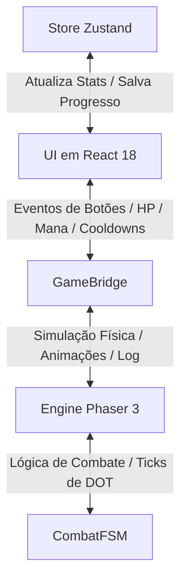
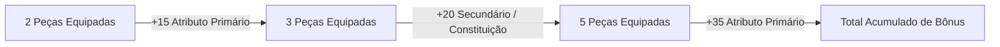
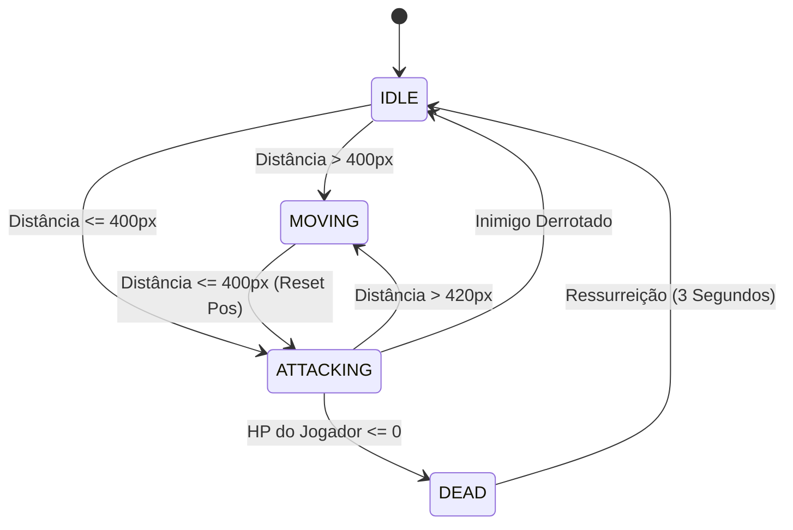

# Manual Técnico Definitivo - Amaro RPG Idle

Este documento serve como o manual interno oficial e especificação técnica para o projeto **Amaro RPG Idle**. Ele detalha todos os sistemas de jogo, fórmulas matemáticas, arquitetura de software, componentes de interface, mecânicas de progressão e o histórico de atualizações com base nas implementações reais contidas no código-fonte.

---

## 1. Visão Geral do Jogo

**Amaro RPG Idle** é um jogo de RPG incremental progressivo (*idle*) com elementos de *roguelite* (*ascensão*). O jogador gerencia um herói pertencente a uma de várias classes disponíveis, combatendo hordas de monstros e chefes em tempo real através de uma simulação gráfica 2D. O progresso é impulsionado pela aquisição de pontos de atributos, desbloqueio e aprimoramento de habilidades ativas e passivas, e equipagem de itens de raridades variadas com bônus de conjuntos (*sets*).

Ao encontrar barreiras de dificuldade causadas pelo escalonamento exponencial dos monstros, o jogador pode realizar a **Ascensão (Prestígio)**, trocando seu nível atual e progresso de fases por Pontos de Prestígio permanentes, que concedem aumentos robustos aos atributos primários para as rodadas seguintes.

---

## 2. Arquitetura e Engenharia de Software

O jogo é estruturado como uma aplicação web moderna que combina a renderização reativa com um motor de simulação de alta performance.

### A. Stack Tecnológica
*   **Front-End React (v18+)**: Responsável pela renderização de todas as janelas de menu, abas, árvores de upgrades, inventário e manipulação dos dados do personagem.
*   **Gerenciamento de Estado (Zustand)**: Toda a persistência, progresso do herói, inventário e níveis de classe são mantidos em uma store global reativa (`useGameStore`).
*   **Motor Gráfico (Phaser 3)**: Responsável pela cena gráfica 2D de combate, animações dos sprites dos personagens, renderização dos cenários (*parallax scroll*), efeitos visuais de habilidades, números flutuantes de dano e processamento do ciclo de combate físico.
*   **TypeScript (Strict Mode)**: Garante a tipagem estrita de todas as estruturas e interfaces do jogo, mitigando bugs de tempo de execução.

### B. O Canal de Comunicação: GameBridge
Para desacoplar a interface do usuário (React) do motor de simulação (Phaser), foi implementada uma ponte de comunicação assíncrona orientada a eventos chamada `GameBridge`.
O fluxo de dados ocorre através de um barramento de eventos compartilhado (`GameEvent`), garantindo que o Phaser saiba quando o jogador aciona uma habilidade e que o React atualize o HUD de HP/Mana em alta frequência sem re-renderizar componentes pesados.

#### Mapeamento de Eventos (`GameEvent`)
*   **Comandos da UI (React $\rightarrow$ Phaser)**:
    *   `ACTION_TRIGGERED`: Dispara o uso de uma habilidade ativa pelo jogador.
    *   `START_COMBAT`: Inicia ou retoma o loop de combate na cena.
    *   `END_COMBAT`: Pausa a simulação.
    *   `TOGGLE_AUTOCAST`: Ativa ou desativa a conjuração automática por IA das habilidades de ataque/cura.
*   **Feedback da Engine (Phaser $\rightarrow$ React / HUD)**:
    *   `PLAYER_HP_CHANGED`: Notifica a porcentagem, valor atual e valor máximo de HP do jogador (atualiza referências diretas na UI para evitar gargalos de renderização).
    *   `PLAYER_MANA_CHANGED`: Notifica a porcentagem, valor atual e valor máximo de mana do jogador.
    *   `LOG_EMITTED`: Envia mensagens de texto em tempo real sobre os eventos de combate para o console de logs de batalha.
    *   `COOLDOWNS_CHANGED`: Envia a tabela atualizada de recarga de habilidades ativas em milissegundos.
    *   `ENEMY_DEFEATED` e `STAGE_COMPLETED`: Atualizam o estado da fase e do bestiário no Zustand.


```mermaid
graph TD
    React[UI em React 18] <-->|Eventos de Botões / HP / Mana / Cooldowns| Bridge[GameBridge]
    Store[Store Zustand] <-->|Atualiza Stats / Salva Progresso| React
    Bridge <-->|Simulação Física / Animações / Log| Phaser[Engine Phaser 3]
    Phaser <-->|Lógica de Combate / Ticks de DOT| FSM[CombatFSM]
```

---

## 3. Interface do Usuário e Visual (UI/UX)

O jogo utiliza uma linguagem de design premium no estilo *Dark Mode* focada na legibilidade, organization de abas e usabilidade no desktop e dispositivos móveis.

### A. Paleta de Cores e Temática (WhatsApp Dark Style)
A interface é construída sobre uma paleta de tons escuros curados, proporcionando alto contraste para os elementos de RPG e cores vibrantes para indicar raridades e buffs:
*   **Fundo da Aplicação (`Background`)**: `#161717` (preto suave de baixo brilho).
*   **Superfícies e Painéis (`Surfaces`)**: `#1D1F1F` (cinza escuro para cards, abas e contêineres).
*   **Caixas de Texto e Inputs**: `#252727` (cinza médio para destacar elementos interativos secundários).
*   **Destaques de Dano e Recursos**:
    *   `HP / Vida`: Vermelho Vibrante (`#ef4444`)
    *   `Mana`: Azul Arcane (`#3b82f6`)
    *   `Cura / Restauração`: Verde Esmeralda (`#10b981`)
    *   `Dano Físico`: Laranja de Combate (`#f59e0b`)

### B. Elementos do HUD e Viewport
1.  **Combate Viewport (Phaser Canvas)**: Exibe em tempo real o herói do jogador e o monstro atual no cenário.
    *   **Escala e Tamanho**: Utiliza um `ZOOM_FACTOR` integrado de $1.35\times$ com tamanho base de sprites aumentado para $165\text{px}$ (personagem e monstros comuns) e $215\text{px}$ (chefes), proporcionando uma presença visual imponente na tela.
    *   **Textos de Identificação**: O nível do inimigo foi removido do nome flutuante acima do sprite para evitar redundâncias com o HUD de estágio.
    *   **Inimigos Elites**: O afixo de Elite (ex: `ELITE ENFURECIDO`) é renderizado centralizado em uma linha superior própria, imediatamente acima do nome do monstro.
    *   **Efeitos e Debuffs**: Debuffs ativos (como `[ATORDADO]` ou `[ENVENENADO]`) são posicionados dinamicamente no topo do título de Elite, garantindo leitura limpa da cena de combate.
    *   **Textos de Dano Flutuante**: O dano e efeitos são renderizados mais abaixo (sobre o corpo do alvo, deslocados $+65\text{px}$ em Y) e demoram mais tempo para sumir ($1.5\text{s}$ no dano de habilidades/ticks e $1.4\text{s}$ no dano de toques), subindo com velocidade reduzida para maior legibilidade.
    *   A base do cenário (*ground*) é travada verticalmente para manter o alinhamento visual durante a movimentação.
    *   **Cenários e Backgrounds (Mapeamento e Rolagem)**: O cenário de combate é renderizado em `TileSprite` de rolagem horizontal contínua (*sidescrolling*):
        *   *Mapeamento por Dificuldade/Fase*:
            *   Fases de Campanha Padrão (ciclo baseado no tema): Floresta (`medieval_background.png`), Deserto (`desert_background.png`), Neve (`snow_background.png`), Cemitério (`cemetery_background.png`) e Ruínas (`ruins_background.png`).
            *   Fases 21-30 (Purgatório): Cenário de cacos e cristais mágicos (`purgatory_background.png`).
            *   Fases 31+ (Pandemônio): Cenário vulcânico caótico sob medida de obsidiana e correntes arcanas (`pandemonium_background.png`).
            *   Modo Torre Infinita: Cenário da torre de tijolos cinza (`tower_background.png`).
        *   *Alinhamento do Chão*: Para garantir que os pés de heróis e monstros fiquem apoiados de forma natural, a linha de horizonte físico do solo na imagem original de `1024 x 1024` deve ser desenhada a exatamente **9% da borda inferior** (aproximadamente a 90 pixels de altura do rodapé), o que corresponde à altura de Y = 532.5 pixels renderizados no canvas (a 67.5 pixels do limite inferior do jogo).
        *   *Textura Seamless (Looping)*: A imagem deve possuir emendas perfeitas nas bordas laterais (loop contínuo) para que a rolagem por movimentação ocorra sem cortes.
2.  **HUD de Status**: Exibe duas barras horizontais (HP e Mana) com preenchimento colorido e contadores absolutos (`Valor Atual / Valor Máximo`), acompanhados da Fase Atual do jogo, progresso do Estágio (monstros eliminados de 20), velocidade da simulação e atalhos de controle de som. Os indicadores de evento sazonal ("🌕 LUA DE SANGUE" / "☄️ CONVERGÊNCIA: [boss]") vivem numa linha própria, visível tanto no layout desktop quanto no mobile simplificado (v9.0.0 — antes ficavam dentro de `.hud-header-row`, escondida por completo no mobile).
3.  **Controle de Velocidade e Pausa**: Permite alterar o ritmo da simulação do Phaser ou pausar o jogo completamente (velocidades `⏸`, `1x`, `2x` e `3x`) usando multiplicadores temporais no relógio interno da cena. As velocidades mais rápidas possuem travas de segurança: a velocidade 2x é liberada após a primeira ascensão (`ascensionCount >= 1`), e a velocidade 3x é liberada a partir da quinta ascensão (`ascensionCount >= 5`).
4.  **Bandeja de Buffs Ativos (v9.0.0)**: Overlay absoluto no canto superior esquerdo do viewport de combate (`ActiveBuffsTray.tsx`), listando Elixires do Mercador, Poções de Alquimia e buffs temporários da Relíquia Ativa em duração — cada ícone mostra contagem regressiva numérica e um "relógio" em `conic-gradient` que cobre progressivamente o ícone até ele sumir da bandeja. Alimentado por `GameEvent.ACTIVE_BUFFS_CHANGED`, emitido a cada frame por `CombatFSM.emitActiveBuffs()`.

### C. Estrutura do Menu de Abas
O painel inferior/lateral de gerenciamento é dividido em abas com transições suaves (`animate-tabFade` para evitar saltos bruscos de tela):
*   **Combate**: Console de logs de batalha detalhados e botões de atalho rápido das habilidades desbloqueadas, com overlay cinza semitransparente indicando o tempo de cooldown restante e botão de alternância do Auto-Cast (IA).
*   **Atributos**: Painel com os pontos de atributos livres para distribuição (+5 a cada nível), listagem dos atributos finais do personagem calculados em tempo real (Força, Magia, Destreza, Constituição e Sorte) e bônus passivos de classe. Inclui um seletor multiplicador de distribuição de pontos (`x1` / `x10` / `x100`) posicionado na mesma linha do cabeçalho "Atributos Primários" e alinhado perfeitamente com os botões de upgrades abaixo, permitindo investir pontos rapidamente com escala visual correspondente nos botões de ação. Os botões de distribuição suportam **pressionar e segurar** (hook `useHoldRepeat`): o primeiro clique aplica o valor imediatamente, após ~400ms de pressão contínua o incremento passa a repetir automaticamente a cada ~100ms (mouse ou toque), interrompendo assim que o botão é solto, sai do alcance do ponteiro ou os pontos disponíveis se esgotam.
*   **Habilidades**: Árvore visualizada de forma hierárquica por conexões de dependência. Permite comprar ou aprimorar (até nível 5 por padrão, estendendo-se até o nível 10 nas dificuldades Inferno e Apocalipse) habilidades ativas e passivas da classe atual utilizando Pontos de Habilidade adquiridos por nível. Assim como os botões de Atributos, os botões "Aprimorar" (tanto no modal desktop quanto na lista expansível mobile) suportam pressionar e segurar para aplicar múltiplos níveis em sequência sem cliques repetidos.
*   **Equipamento**: Grade de inventário com 30 slots exibindo itens recolhidos por drop. Possui um conjunto de slots de equipagem ativa (`Cabeça`, `Torso`, `Pernas`, `Mãos` e `Arma`). Ao clicar em um item, abre-se um painel de detalhes local absoluto contendo atributos, raridade e bônus de conjunto.
*   **Ascensão**: Exibe estatísticas acumuladas, a quantidade de Pontos de Prestígio (PP) que o jogador ganhará se resetar agora, os requisitos mínimos de PP e o painel de Upgrades Permanentes de Ascensão.
*   **Bestiário**: Enciclopédia de monstros catalogados no jogo. Mostra a ilustração transparente de cada monstro e uma contagem de abates acumulados.
*   **Guia**: Central de documentação interna com regras e tutoriais.
*   **Saves**: Gerenciador de progresso com suporte a seis slots independentes e recursos de Importação/Exportação através de criptografia textual leve.
*   **Opções**: Centraliza configurações do jogo e preferências de Qualidade de Vida (QoL) do jogador, incluindo áudio, console de combate, formatação de números, auto-venda de equipamentos dropados e controle do robô assistente. Desde a v6.1.0, é dividida em duas sub-abas internas (`⚙️ Opções` / `📊 Estatísticas`, estado `statsSubTab` em `OptionsPanel`) — a primeira preserva 100% do conteúdo pré-existente, a segunda expõe o painel de Estatísticas Completas (ver Seção 3.E.4).

### D. Posicionamento Inteligente de Modais (Refatoração)
Os modais informativos de itens no inventário e detalhes de monstros no bestiário foram convertidos de contêineres fixos globais (comuns em interfaces web tradicionais que causam bloqueio de interatividade) para **modais locais com posicionamento absoluto**. Eles são renderizados diretamente dentro da hierarquia da aba ativa. Isso garante que o scroll continue funcionando normalmente, evita o transbordo visual (*clipping*) e assegura a usabilidade ideal em resoluções desktop comuns e telas mobile.

### E. Opções do Jogo e Qualidade de Vida (QoL)
A aba **Opções** centraliza recursos voltados a personalizar a experiência de jogo e automatizar tarefas repetitivas, salvando as preferências do usuário localmente em `localStorage`.

1.  **Configurações de Áudio**:
    *   **Música de Fundo (BGM)**: Permite ligar ou desligar a música de fundo do jogo.
    *   **Efeitos Sonoros (SFX)**: Permite habilitar ou desabilitar todos os efeitos sonoros de cliques, golpes e magias.
    *   *Nota: Os controles rápidos de áudio foram retirados do cabeçalho principal e centralizados inteiramente nesta aba.*

2.  **Visual & Interface**:
    *   **Console de Combate**: Permite mostrar ou esconder os logs de combate em tempo real que aparecem no rodapé da aba Combate.
    *   **Abreviar Números Grandes**: Quando ativado, os números exibidos na interface (como ouro do jogador, valor de venda de itens) e no console de logs de combate (como danos físicos, mágicos, DOTs de veneno/queimadura e curas) são abreviados utilizando sufixos compactos (K para milhares, M para milhões, B para bilhões, T para trilhões). Quando desativado, os valores são exibidos inteiramente como números inteiros.
        *   *Exemplo*: `10.500` é formatado como `10.5K`; `1.000.000` é formatado como `1M`.
    *   **Modo de Economia**: Voltado para prolongar a bateria e reduzir o custo gráfico em sessões *idle* longas ou dispositivos mais fracos. Quando ativado (`economyModeEnabled`, persistido em `localStorage` como as demais preferências), a cena de combate (`CombatScene.ts`) para de renderizar completamente os textos flutuantes de dano (`spawnDamageText`) e o efeito de toque/crítico (`spawnTouchEffect`, incluindo o círculo de impacto), e o laço de renderização do Phaser é limitado a `targetFps = 2` (v10.9.0, reduzido do valor original de `15`; contra os `60`fps padrão) — mais agressivo que o teto de `15`fps aplicado quando alguma das duas Cidadelas (Astral ou Submersa) está em primeiro plano. A alternância é refletida em tempo real via `useGameStore.subscribe`, sem necessidade de reiniciar o combate.

3.  **Automação & QoL**:
    *   **Auto-venda de Equipamentos Comuns**: Se habilitado, qualquer equipamento de raridade **Comum** dropado por monstros é vendido instantaneamente no momento do drop, adicionando seu valor correspondente em ouro diretamente à carteira do jogador, sem ocupar espaço no inventário.
    *   **Auto-venda de Equipamentos Raros**: Se habilitado, qualquer equipamento de raridade **Raro** dropado por monstros é vendido instantaneamente no momento do drop por ouro, otimizando o fluxo de esvaziamento do inventário.
    *   **Desativar Robô Assistente**: Permite desativar as ações de clique automático geradas pelo upgrade permanente de prestígio "Robô Assistente", permitindo que jogadores testem o desempenho puro de sua classe sem a interferência da automação ou joguem de forma estritamente ativa.

4.  **Estatísticas Completas (sub-aba, v6.1.0)**: Sub-aba `📊 Estatísticas` dentro de Opções (componente `StatisticsPanel`, `src/components/GameUI.tsx`), reunindo em três blocos (`.stat-row` sobre `.panel`/`.section-title`, mesmo padrão visual do restante da UI) todos os recordes e acumuladores vitalícios do personagem:
    *   **Combate** — para cada valor, exibe o **atual** (recalculado em tempo real por `StatEngine.calculateFinalStats`, mesmo padrão de `useMemo` já usado no painel de Equipamento) lado a lado com o **recorde histórico**, persistido em `Character` e nunca decrescendo: Maior dano em um golpe (`bestDamageDealt`), Vida atual/recorde (`bestMaxHP`, com o valor atual replicando a fórmula de `CombatFSM.calculatePlayerMaxHP` — Constituição × 8 (Paladino) ou ×18 (demais classes) × boost de Ascensão × multiplicador de Vida Máxima de conjunto), Crítico (`bestCritChance`), Chance de Drop (`bestDropChancePct`), Redução de Dano (`bestDamageReductionPct`), maior Velocidade de Ataque (`bestAttackSpeedMultiplier`) e maior Chance de Esquiva (`bestDodgeChance`).
    *   **Progressão** — Fase mais alta, Ascensões, Transcendências, total de Inimigos Abatidos (`totalEnemiesKilledLifetime`), Equipamentos/Fragmentos/Chaves da Torre dropados no total (`totalEquipmentDropped`, `totalFragmentsDropped`, `totalTowerKeysDropped`), Ascensão mais rápida (`fastestAscensionSeconds`, medida a partir de `runStartTime` em `performPrestige`) e Fase 20 mais rápida (`minTimeToStage20`, já existente em `PersonalRecords` — ver Seção 9).
    *   **Economia e Cidadela** — Ouro e XP total ganhos (`totalGoldEarnedLifetime`, `totalXpEarnedLifetime` — este último nunca reseta na Ascensão, diferente de `totalXpEarned`), Pontos de Prestígio vitalícios (`lifetimePrestigePointsAccumulated`, já existente), gasto total na Forja em Ouro e Fragmentos (`totalGoldSpentInForge`, `totalForgeFragmentsSpent`, incrementados em `reforgeItems`) e os 4 materiais farmados pela Cidadela ao longo de toda a conta (`totalMaterialsFarmedByCitadel`, incrementado em `addMaterials` e no bloco de expedições de `tickCitadelProduction`).
    *   **Origem dos dados**: os novos campos são opcionais em `Character` (`src/core/types.ts`) e ganham defaults zerados em `DEFAULT_CHARACTER()`; saves anteriores à v6.1.0 carregam normalmente com todos os contadores em zero (ou "N/A" para `fastestAscensionSeconds`), sem nenhuma reconstrução retroativa de histórico. Os recordes de combate são atualizados via uma única ação nova no store, `updateBestCombatStats()` (`useGameStore.ts`), chamada a partir de `CombatFSM.ts` nos pontos de dano (toque, ataque básico, habilidades), no recálculo de status finais (crítico, drop, redução de dano, vida máxima) e nos cálculos de velocidade de ataque/esquiva — a ação só grava no `localStorage` quando pelo menos um valor supera o recorde anterior, evitando gravações desnecessárias a cada tick de combate.

### F. Navegação por Gestos (Mobile Swipe)
Para melhorar a experiência de usabilidade em dispositivos móveis, foi adicionado suporte a gestos de arrastar (*swipe*) horizontal no painel de interface principal (`game-ui-root`):
*   **Swipe para a Esquerda**: Avança para a próxima aba à direita (ex.: de *Combate* para *Atributos*).
*   **Swipe para a Direita**: Retorna para a aba anterior à esquerda (ex.: de *Atributos* para *Combate*).
*   **Trava de Segurança e Prevenção de Conflitos**: O sistema detecta se o gesto é predominantemente horizontal (variação horizontal pelo menos 1.5 vezes maior que a vertical) para não conflitar com a rolagem vertical de listas e tabelas. Adicionalmente, gestos iniciados em elementos interativos com arrasto próprio (como sliders de configuração e a árvore de habilidades rolável horizontalmente `.tree-container`) são ignorados automaticamente para preservar a jogabilidade e usabilidade nativas.

### G. Padrão Técnico e Visual para Sprites (Ativos Gráficos)
Para garantir a coesão visual e o funcionamento adequado dos efeitos de transparência dinâmica na engine Phaser, todas as artes de heróis e monstros devem seguir estritamente as especificações abaixo:
1.  **Estilo Artístico (Pixel Art de Alta Densidade - 512-bit / HD)**:
    *   Os sprites não devem utilizar pixels excessivamente grandes/rústicos (estilo 8-bit ou 16-bit clássicos) e também não devem ser ilustrações vetoriais completamente lisas.
    *   Devem adotar um estilo de pixel art moderno e de alta densidade (equivalente a 512-bit ou superior em uma grade 1024x1024), caracterizado por contornos pretos finos e nítidos, pelagens ou superfícies com texturas de micro-pixels feitas à mão, e transições de sombreamento/dithering bem definidas.
2.  **Dimensões da Imagem**:
    *   Tamanho padrão de arquivo: `1024 x 1024` pixels.
    *   A arte deve estar centralizada horizontalmente no canvas da imagem.
3.  **Fundo da Imagem (Tratamento de Transparência)**:
    *   O fundo deve ser **branco puro sólido (`#FFFFFF`)**, sem nenhum ruído, degradê ou variação de cor.
    *   **Evitar Branco Puro Interno**: Não use a cor branca pura (`#FFFFFF` ou RGB `255,255,255`) na parte interna do corpo, armaduras, armas, olhos ou dentes dos personagens/monstros. Como a engine remove o branco puro com uma tolerância de 30 para criar a transparência, usar `#FFFFFF` ou tons de off-white excessivamente claros internamente causará furos transparentes no meio do sprite em jogo. Use tons mais escuros, cinzas opacos ou off-white bem marcados (abaixo de 220 nos canais de cor) para as áreas internas de metal e brilhos.
    *   Não são permitidas auras, brilhos coloridos, efeitos de iluminação externa (*outer glow*) ou suavizações com anti-aliasing em tons de cinza na borda externa dos sprites, pois a função `makeTextureTransparent` remove o branco puro. Qualquer ruído causará uma borda branca desagradável ao redor do monstro no jogo.
4.  **Sombra Sob os Pés (Drop Shadow)**:
    *   Todo combatente deve conter uma **sombra elíptica preta sólida absoluta (`#000000`)** sob os pés/patas.
    *   A sombra não deve ter degradês, transparências (*opacidade reduzida*) ou bordas esfumaçadas. Deve ser preta 100% opaca.
    *   A elipse de sombra deve estar perfeitamente alinhada e em contato direto com a base dos pés do personagem, garantindo que o sprite pareça assentado corretamente no chão do cenário de combate.

### H. Persistência da Tela Ativa (Wake Lock)
Para evitar que o dispositivo móvel apague ou bloqueie a tela durante sessões longas de jogo *idle*, foi implementado o hook `useWakeLock` (`src/hooks/useWakeLock.ts`), consumido em `App.tsx`:
*   **Screen Wake Lock API Nativa**: Utiliza `navigator.wakeLock.request('screen')`, sem dependências externas, com checagem de suporte (`'wakeLock' in navigator`) para não quebrar em navegadores/versões que não implementam a API.
*   **Ativação Condicionada à Tela de Jogo**: O lock é solicitado apenas enquanto `screen === 'playing'`, sendo liberado (`sentinel.release()`) automaticamente ao retornar ao Menu, à Seleção de Classe ou aos Saves, evitando manter a tela ligada desnecessariamente fora do combate.
*   **Reaquisição em `visibilitychange`**: O sistema operacional libera o wake lock automaticamente sempre que a aba fica oculta (troca de app, tela bloqueada manualmente). O hook escuta o evento `visibilitychange` do documento e readquire o lock assim que a aba volta a ficar visível, sem exigir nenhuma ação do jogador.

### I. Sistema de Música de Fundo (BGM) Temática por Fase
A trilha sonora do jogo é inteiramente sintetizada em tempo real via Web Audio API (`AudioManager.ts`, `bgmThemes.ts`), sem uso de arquivos de áudio externos. Seis temas distintos, cada um com sua própria progressão de acordes, timbres de osciladores (`sine`/`triangle`/`square`/`sawtooth` por camada de baixo, arpejo e melodia) e andamento, são associados às fases de dificuldade da campanha:
*   **Normal (Fases 1-5)** — "Fantasia Sombria (Lá Menor)": tema original do jogo, arpejo sereno em Lá Menor Natural.
*   **Pesadelo (Fases 6-10)** — "Vigília Amaldiçoada (Lá Menor Diminuta)": progressão diminuta e dissonante, andamento levemente acelerado.
*   **Inferno (Fases 11-15)** — "Fornalha Abissal (Mi Menor Grave)": acordes graves e pesados com sub-bass reforçado, osciladores mais densos.
*   **Apocalipse (Fases 16-20)** — "Corrida do Juízo Final (Ré Menor Urgente)": staccato urgente e andamento acelerado, timbres em `square`/`sawtooth`.
*   **Purgatório (Fases 21-30)** — "Véu Suspenso (Sol Sus Etéreo)": intervalos abertos e suspensos (sus2/sus4), andamento mais lento e atmosfera etérea.
*   **Pandemônio (Fase 31+)** — "Caos Primordial (Cluster Dissonante)": clusters de semitons em dissonância máxima, andamento bem acelerado.
*   **Seleção de Fase**: a função `getPhaseForStage(character.currentStage)` (`bgmThemes.ts`) determina o tema ativo a partir do estágio de combate atual do personagem, usando os mesmos limiares de fase do `CombatFSM.ts` (Normal 1-5, Pesadelo 6-10, Inferno 11-15, Apocalipse 16-20, Purgatório 21-30, Pandemônio 31+). A troca de tema é detectada reativamente via `useGameStore.subscribe` dentro do `AudioManager`, reiniciando o loop de BGM (`stopBGM()` + `startBGM()`) sempre que a fase muda enquanto a música está tocando.
*   **Torre Infinita e Cidadela**: como a seleção de tema depende exclusivamente do `currentStage` do personagem — não da tela ativa — tanto a Torre Infinita quanto a Cidadela automaticamente herdam a música da fase vigente do jogador, sem trilha sonora própria.

---

## 4. Sistema de Classes e Maestria

### Criação de Personagem: Nome e Classe
Antes de iniciar uma nova jornada, o jogador define um **nome de personagem** (campo `name: string` na interface `Character`, `src/core/types.ts`) na tela de Seleção de Classe (`CharacterSelect.tsx`). O nome é digitado em um campo de texto (limite de 20 caracteres, obrigatório e sujeito a `trim()`) posicionado acima da grade/carrossel de classes; o botão "Iniciar Jornada" permanece desabilitado até que um nome válido seja informado. O valor é propagado via `startNewGame(classId, name)` até `DEFAULT_CHARACTER(classId, name)` na store, e substitui o nome da classe como identificação do herói no cabeçalho do painel de Atributos e no texto flutuante acima do sprite do jogador na cena de combate (`playerNameText`, `CombatScene.ts`). Personagens salvos antes da introdução deste campo (sem `name` persistido) recebem como *fallback* o nome da própria classe (`CLASS_CONFIGS[classId].name`), preservando a compatibilidade com saves antigos sem exigir migração de dados.

O jogo possui oito classes distintas: três classes primárias disponíveis desde o início, três classes secundárias avançadas desbloqueadas através do progresso de classe, uma classe avançada especial de endgame (Necromante) e uma classe suprema transcendental de pós-endgame (Avatar, detalhada na Seção 11.E).

### A. Desbloqueio de Classes Secundárias e Especiais (Roguelite)
As classes avançadas secundárias requerem dedicação a uma classe primária específica e são desbloqueadas quando o jogador alcança pelo menos o **Nível 50** na classe base correspondente. O progresso de classe é persistido globalmente através da chave `medieval_idle_global_class_levels` no armazenamento local do navegador. Quando o jogador realiza resets, ascensões ou cria novos jogos em slots alternativos, a permissão das classes avançadas é mantida.
*   **Paladino (`Paladin`)**: Requer Guerreiro (`Warrior`) Nível $\ge 50$.
*   **Clérigo (`Cleric`)**: Requer Mago (`Mage`) Nível $\ge 50$.
*   **Ladrão (`Rogue`)**: Requer Arqueiro (`Ranger`) Nível $\ge 50$.
*   **Necromante (`Necromancer`)**: Requer as duas classes secundárias avançadas, **Clérigo Nível 50 e Ladrão Nível 50**, independentemente do slot de salvamento ativo.
*   **Avatar (`avatar`)**: Requer possuir o talento *Avatar Pleno* na árvore de Transcendência (`transcendenceUpgrades.avatar_pleno > 0`) — não depende de nível de classe base nem de nenhum outro atalho. Ver Seção 11.E para a mecânica completa.

### B. Atributos Iniciais e Taxas de Crescimento
Cada classe possui uma distribuição distinta de atributos base e ganha bônus diferentes automaticamente a cada passagem de nível (*Level Up*), conforme detalhado na tabela abaixo:

| Classe | Descrição de Combate | Principal Atributo | Força (Base / Cresc.) | Magia (Base / Cresc.) | Destreza (Base / Cresc.) | Const. (Base / Cresc.) | Sorte (Base / Cresc.) |
| :--- | :--- | :--- | :---: | :---: | :---: | :---: | :---: |
| **Guerreiro** | Combatente corpo a corpo robusto de alto dano físico e defesa. | Força | 12 / +2.0 | 4 / +0.5 | 8 / +1.0 | 14 / +2.5 | 5 / +0.5 |
| **Mago** | Conjurador arcano focado em magias explosivas elementais. | Magia | 4 / +0.5 | 15 / +3.0 | 7 / +1.0 | 8 / +1.0 | 5 / +0.5 |
| **Arqueiro** | Atirador ágil que aplica venenos e dispara flechas rápidas. | Destreza | 6 / +1.0 | 5 / +0.5 | 15 / +3.0 | 9 / +1.5 | 8 / +0.8 |
| **Paladino** | Protetor sagrado de altíssimo HP cuja força escala com defesa. | Constituição | 10 / +1.5 | 6 / +1.0 | 5 / +0.5 | 16 / +3.0 | 5 / +0.5 |
| **Clérigo** | Mestre sagrado especializado em curas massivas e expor inimigos. | Magia | 7 / +1.0 | 13 / +2.5 | 5 / +0.5 | 11 / +2.0 | 6 / +0.6 |
| **Ladrão** | Assassino ágil de acertos críticos com foco em venenos e força. | Destreza | 8 / +1.5 | 3 / +0.5 | 16 / +3.0 | 8 / +1.0 | 10 / +1.0 |
| **Necromante** | Mestre da morte que drena os vivos e comanda lacaios profanos. | Magia | 5 / +0.8 | 15 / +3.2 | 6 / +0.8 | 10 / +1.8 | 12 / +1.5 |
| **Avatar** | Fusão de todas as energias; escala dinamicamente com o maior atributo ativo (ver Seção 11.E). | *Maior Atributo Ativo* | 15 / +2.5 | 15 / +2.5 | 15 / +2.5 | 15 / +2.5 | 15 / +2.5 |

### C. Fórmulas de Atributos Derivados (Balanceamento de Utilidade)
Para garantir um combate equilibrado e incentivar a distribuição diversificada de pontos, o jogo aplica um sistema de **escalonamento dinâmico**. Atributos que servem como fonte primária de dano para uma classe concedem bônus reduzidos aos status secundários (como HP Máximo ou regenerações), enquanto as demais classes se beneficiam de uma escala amplificada nesses mesmos atributos.

#### 1. Vida Máxima (HP), Regeneração e Redução de Dano
A Vida Máxima, a Regeneração de HP e a resistência a danos escalam a partir do atributo **Constituição**:
*   **Classes Primárias de Constituição (Paladino)**:
    *   HP Máximo ganho por ponto de Constituição: $8\text{ HP}$
    *   Regeneração de HP ganha por ponto de Constituição: $0.03\text{ HP/s}$
*   **Outras Classes (Guerreiro, Mago, Arqueiro, Clérigo, Ladrão)**:
    *   HP Máximo ganho por ponto de Constituição: $18\text{ HP}$ (incentiva classes frágeis a investirem em sobrevivência)
    *   Regeneração de HP ganha por ponto de Constituição: $0.08\text{ HP/s}$
*   **Redução de Dano Recebido (Todas as Classes)**:
    *   Cada ponto de Constituição reduz em $0.05\%$ todo o dano recebido por ataques de monstros, com um limite máximo de $95\%$ de redução total para fins de equilíbrio de jogabilidade.
    *   $\text{HP Máximo} = \text{Constituição} \times \text{HP por ponto} \times \text{hpBoost}_{\text{Ascensão/Transcendência}} \times (1 + \text{maxHpPct}) \times (1 + \text{Bônus Multiplicativo de Runas})$ — `CombatFSM.calculatePlayerMaxHP`. `maxHpPct` é o pool aditivo de Equipamento/Sets/Relíquias/Pesquisa da Academia; o **Bônus Multiplicativo de Runas** (v-next, Seção 18.L) é uma camada **separada e por fora** desse pool, alimentada pelas runas da família Vin e pela Palavra Rúnica CORAÇÃO DO LEVIATÃ — o mesmo padrão da redução de dano (`damage *= (1 - damageReductionPct)` seguido de `damage *= (1 - Bônus Multiplicativo de Runas Dol)`, ambos aplicados nos 4 pontos de dano recebido pelo jogador em `CombatFSM.ts`).

#### 2. Mana Máxima e Regeneração
A Mana Máxima e a Regeneração de Mana escalam a partir do atributo **Magia**:
*   **Classes Primárias de Magia (Mago, Clérigo, Necromante)**:
    *   Mana Máxima ganha por ponto de Magia: $6\text{ Mana}$ (previne mana infinita e uso descontrolado de auto-cast)
    *   Regeneração de Mana ganha por ponto de Magia: $0.10\text{ Mana/s}$ *(ajuste pós-lançamento da v9.0.0 — antes $0.02\text{ Mana/s}$; ver Histórico de Updates e Otimizações de Engenharia.md)*
*   **Outras Classes (Guerreiro, Arqueiro, Paladino, Ladrão)**:
    *   Mana Máxima ganha por ponto de Magia: $18\text{ Mana}$ (torna viável conjurar habilidades táticas com poucos pontos investidos)
    *   Regeneração de Mana ganha por ponto de Magia: $0.20\text{ Mana/s}$ *(ajuste pós-lançamento da v9.0.0 — antes $0.05\text{ Mana/s}$; ver Histórico de Updates e Otimizações de Engenharia.md)*
*   **Mana Máxima (fórmula completa)**: $\text{Mana Máxima} = \text{Magia} \times \text{Mana por ponto} \times \text{manaBoost}_{\text{Ascensão/Transcendência}} \times (1 + \text{maxManaPct}) \times (1 + \text{Bônus Multiplicativo de Runas Mar})$ (`manaFormulas.calculateMaxManaFromStats`). **Correção de bug (v-next)**: até então, `maxManaPct` (pool aditivo de Sets/Academia/Colar) e o bônus de runas Mar eram calculados em `StatEngine.ts` mas nunca lidos pela fórmula de Mana Máxima — pesquisas e runas de Mana não tinham nenhum efeito real no jogo. Corrigido para os dois fatores entrarem de fato no cálculo.

#### 3. Velocidade de Ataque (Attack Speed) e Esquiva (Dodge)
A velocidade com que o herói realiza ataques básicos e sua chance de se esquivar de ataques inimigos escalam a partir do atributo **Destreza**, através de uma **raiz quadrada** (para evitar crescimento linear descontrolado em fases avançadas):
$$\text{Velocidade de Ataque} = \left(1 + \sqrt{\text{Destreza}} \times \text{Fator de Destreza}\right) \times \text{Bônus de Velocidade de Habilidades} \times \left(1 + \text{Bônus de Set/Colar/Academia}\right) \times \left(1 + \text{Bônus Multiplicativo de Runas Lum}\right)$$
*   **Classes Primárias de Destreza (Arqueiro, Ladrão)**: $\text{Fator de Destreza} = 0.15$
*   **Outras Classes (Guerreiro, Mago, Paladino, Clérigo)**: $\text{Fator de Destreza} = 0.40$ (compensa a menor Destreza base dessas classes)
*   O bônus de runas Lum (v-next, Seção 18.L) é uma camada multiplicativa separada do pool `attackSpeedPct`, mas continua sujeita ao mesmo teto final de velocidade abaixo.
*   O multiplicador final de velocidade é limitado a um teto de **$15\times$**.
*   **Esquiva (Todas as Classes)**:
    $$\text{Chance de Esquiva} = \min\left(75\%,\ \text{Destreza} \times 0.1\% + \text{Ascensões} \times 0.5\%\right)$$
    Cada ponto de Destreza concede $+0.1\%$ de Chance de Esquiva, e cada Ascensão realizada soma $+0.5\%$ adicional, com limite de até $75\%$ de esquiva máxima para fins de balanceamento do jogo.

#### 4. Drop, Ouro e Crítico (Sorte)
O atributo **Sorte** influencia a probabilidade e qualidade dos itens derrubados, o ouro ganho e também o desempenho em combate ativamente através do clique:
*   **Chance de Drop (Monstros Normais)**:
    $$\text{Chance} = \min\left(50\%, 5\% + \text{Sorte} \times 0.2\% + \text{Bônus de Relíquia} + \text{Bônus de Colar (}dropChancePct\text{)}\right) \times \left(1 + \text{Bônus Multiplicativo de Runas Fen}\right)$$
    O bônus de runas Fen (v-next, Seção 18.L) é aplicado **depois** do teto de $50\%$ acima — mesmo padrão já usado pelo Elixir do Acumulador (`CombatFSM.ts`) — podendo levar a chance final além de $50\%$ em builds de runas de endgame (limitado apenas ao teto absoluto de $100\%$).
*   **Multiplicador de Ouro** (escala por raiz quadrada, ver também Seção 13.B):
    $$\text{Bônus} = \left(1 + \frac{\sqrt{\text{Sorte Final}}}{10}\right) \times (1 + \text{Bônus de Relíquia}) \times \left(1 + \text{Bônus Multiplicativo de Runas Sol}\right)$$
    Runas Sol (família "Fortuna") são a única fonte de `goldBonusPct` do jogo — desde a v-next, esse bônus passou a ser uma camada multiplicativa isolada (Seção 18.L) em vez de somar num pool aditivo compartilhado, sem outra fonte no jogo hoje.
*   **Chance de Crítico**:
    Cada ponto de Sorte adiciona $+0.05\%$ de Chance de Crítico (cumulativo com itens e upgrades de prestígio).
*   **Dano Crítico**:
    Cada ponto de Sorte adiciona $+0.2\%$ de Dano Crítico (cumulativo com itens e upgrades de prestígio).
*   **Multiplicador Especial do Necromante**: O Necromante possui um bônus que faz com que o dano de suas habilidades de combate aumente em $+0.1\%$ para cada 1 ponto de Sorte.

> **Nota de nomenclatura (histórico, resolvido na v6.0.0)**: as stats `critChance`/`critDamage` (`BaseStats`) se chamavam `touchCritChance`/`touchCritDamage` até a v6.0.0 — resquício de quando o crítico só existia no clique/tap. Elas sempre foram, na prática, o **único sistema de crítico do jogo**: o mesmo roll e o mesmo multiplicador são reutilizados literalmente nos três pontos de cálculo de dano em `CombatFSM.ts` (toque, ataque básico e habilidades), nunca existiu uma stat de crítico separada para ataque básico/habilidades. O prefixo "touch" foi removido de `BaseStats`, `StatEngine.ts`, `CombatFSM.ts`, `useGameStore.ts` (incluindo os upgrades de prestígio `perm_touch_crit`/`perm_touch_crit_dmg`, cujo campo `stat:` interno passou de `'touchCritChance'`/`'touchCritDamage'` para `'critChance'`/`'critDamage'`), `GameUI.tsx`, `ForgeView.tsx` e `VaultPanel.tsx` (rótulos e `PERCENT_STATS`) para refletir isso — sem migração de saves (decisão consciente do desenvolvedor, projeto ainda em fase de testes internos). Já `touchDamageMult` continua com o nome original por ser genuinamente exclusivo do toque (não entra na fórmula de ataque básico nem de habilidades).

#### 5. Penetração de Armadura e Dano Geral (Força)
Além dos modificadores de classe e bônus secundários em ataques físicos, o atributo **Força** concede um aumento passivo global de dano:
*   **Aumento de Dano (Todas as Classes)**:
    Cada ponto de Força adiciona $+0.05\%$ de aumento no dano final causado pelo jogador (penetração de armadura). Este bônus é multiplicativo e aplica-se tanto a ataques básicos quanto a todas as habilidades de ataque.

---

## 5. Sistema de Equipamentos e Inventário

O herói pode encontrar e equipar peças de equipamentos derrubados por monstros para somar atributos diretamente aos seus valores base.

### A. Raridades e Distribuição de Atributos
*   **Comum (`common`)**: Concede bônus em apenas **1 atributo** aleatório da lista de atributos viáveis para a classe do jogador. O nome recebe o sufixo "Rústico".
*   **Raro (`rare`)**: Concede bônus em **2 atributos** distintos. O nome é associado ao conjunto temático da classe ativa (ex: "Peitoral do Senhor da Guerra").
*   **Lendário (`legendary`)**: Concede bônus em **3 atributos** distintos. Possui multiplicador de escala alto e nome associado ao conjunto temático da classe.
*   **Ancestral (`ancestral`)**: Concede bônus em **3 atributos** de altíssima escala. Disponível apenas para jogadores que realizaram a primeira Ascensão (`ascensionCount >= 1`), com taxa de drop de 10% sob itens normais, gerando apenas o set temático da classe ativa no momento do combate. Atributos base gerados com multiplicador de escala místico de $4.5\times$ (superior ao $2.5\times$ lendário). Identificado visualmente por uma borda tracejada em tom violeta, brilho místico pulsante e indicador estelar no slot.
*   **Celestial (`celestial`)**: Equipamento de tier supremo disponível como drop especial na campanha do Purgatório apenas após derrotar o chefe da Fase 30 (`boss_crystal_guardian`) pela segunda vez em diante. Possui 10% de chance de substituir os drops normais. Concede bônus em **3 atributos** de escala divina com multiplicador de atributos de **$6.0\times$**. Os itens deste set recebem um bônus especial de **$2.0\times$** em seu valor de venda por ouro.

O valor final de cada atributo concedido pelo item é calculado com base na Fase atual do combate onde o item caiu:
$$\text{Atributo do Item} = \max\left(1, \text{round}\left( \text{Fase} \times \text{Multiplicador Raridade} \times \text{Random}(0.8, 1.2) \right)\right)$$
*Onde o $\text{Multiplicador Raridade}$ é $1.0$ para Comum, $1.5$ para Raro, $2.5$ para Lendário, $4.5$ para Ancestral e $6.0$ para Celestial.*

*   **Fase 31+ (Pandemônio) — Apenas Itens Lendários (ou superiores)**: A partir da Fase 31, itens de raridade Comum e Raro deixam de dropar por completo — todo drop de equipamento é obrigatoriamente Lendário (ou uma de suas variantes de conjunto: Ancestral, Pandemoníaco, Lua de Sangue, Celestial). Reflete o fato de que peças fracas deixam de ser relevantes no Pandemônio.
*   **Fim do Set do Senhor da Guerra (e equivalentes) no Pandemônio**: até a Fase 30, todo item Lendário sem outra condição especial recebe o set inicial da classe (ex.: *Set do Senhor da Guerra*). A partir da Fase 31, esse set inicial deixa de ser atribuído — o item passa a ser um "Lendário solto" (nome com o sufixo "Lendário", sem conjunto), abrindo espaço para os Sets Pandemoníaco/Ancestral/Celestial/Lua de Sangue dominarem o loot do endgame em vez de competirem com um conjunto obsoleto.

### B. Bônus de Conjunto (Sets)
Equipar múltiplos itens raros, lendários ou ancestrais pertencentes ao mesmo conjunto de classe ativa libera bônus adicionais de atributos acumulativos a partir de 2, 3 e 5 peças:


```mermaid
graph LR
    P2[2 Peças Equipadas] -->|+15 Atributo Primário| P3[3 Peças Equipadas]
    P3 -->|+20 Secundário / Constituição| P5[5 Peças Equipadas]
    P5 -->|+35 Atributo Primário| Final[Total Acumulado de Bônus]
```

*   **Set do Senhor da Guerra (`warrior`)**:
    *   2 peças: $+15$ Força
    *   3 peças: $+20$ Constituição
    *   5 peças: $+35$ Força *(Total acumulado: +50 Str, +20 Con)*
*   **Set do Mestre Arcano (`mage`)**:
    *   2 peças: $+15$ Magia
    *   3 peças: $+20$ Constituição
    *   5 peças: $+35$ Magia *(Total acumulado: +50 Magic, +20 Con)*
*   **Set do Rastreador das Sombras (`ranger`)**:
    *   2 peças: $+15$ Destreza
    *   3 peças: $+20$ Constituição
    *   5 peças: $+35$ Destreza *(Total acumulado: +50 Dex, +20 Con)*
*   **Set do Guardião Divino (`paladin`)**:
    *   2 peças: $+15$ Constituição
    *   3 peças: $+20$ Força
    *   5 peças: $+35$ Constituição *(Total acumulado: +50 Con, +20 Str)*
*   **Set do Sumosacerdote (`cleric`)**:
    *   2 peças: $+15$ Magia
    *   3 peças: $+20$ Constituição
    *   5 peças: $+35$ Magia *(Total acumulado: +50 Magic, +20 Con)*
*   **Set do Assassino Fantasma (`rogue`)**:
    *   2 peças: $+15$ Destreza
    *   3 peças: $+20$ Força
    *   5 peças: $+35$ Destreza *(Total acumulado: +50 Dex, +20 Str)*
*   **Set do Arauto da Ceifa (`necromancer`)**:
    *   2 peças: $+15$ Magia
    *   3 peças: $+20$ Constituição
    *   5 peças: $+35$ Magia *(Total acumulado: +50 Magic, +20 Con)*
*   **Set do Avatar Celestizado (`avatar`)** [Dropado na Ecoterra]:
    *   2 peças: $+10$ Força, $+10$ Magia, $+10$ Destreza
    *   3 peças: $+15$ Constituição, $+15$ Sorte
    *   5 peças: $+20$ em todos os atributos primários *(Total acumulado: +30 For/Mag/Des, +35 Con/Sor)*

*   **Sets Ancestrais (Pós-Ascensão)**:
    Estes conjuntos são liberados apenas após a primeira ascensão do personagem e garantem bônus de atributos extremamente superiores, além de mecânicas únicas de toque e combate:
    *   **Bônus Especiais de Conjunto**:
        *   **3 peças**: Multiplicador de dano de toque duplicado ($2.0\times$ Touch Damage).
        *   **5 peças**: $+15\%$ de Dano Final Global.
    *   **Set Ancestral do Conquistador (`warrior`)**:
        *   2 peças: $+80$ Força
        *   3 peças: $+100$ Constituição, $+50$ Sorte
        *   5 peças: $+200$ Força *(Total acumulado: +280 Força, +100 Con, +50 Sorte)*
    *   **Set Ancestral do Arquimago (`mage`)**:
        *   2 peças: $+80$ Magia
        *   3 peças: $+100$ Constituição, $+50$ Sorte
        *   5 peças: $+200$ Magia *(Total acumulado: +280 Magia, +100 Con, +50 Sorte)*
    *   **Set Ancestral do Caçador Estelar (`ranger`)**:
        *   2 peças: $+80$ Destreza
        *   3 peças: $+100$ Constituição, $+50$ Sorte
        *   5 peças: $+200$ Destreza *(Total acumulado: +280 Destreza, +100 Con, +50 Sorte)*
    *   **Set Ancestral do Sentinela Eterno (`paladin`)**:
        *   2 peças: $+80$ Constituição
        *   3 peças: $+100$ Força, $+50$ Sorte
        *   5 peças: $+200$ Constituição *(Total acumulado: +280 Constituição, +100 For, +50 Sorte)*
    *   **Set Ancestral do Sábio Divino (`cleric`)**:
        *   2 peças: $+80$ Magia
        *   3 peças: $+100$ Constituição, $+50$ Sorte
        *   5 peças: $+200$ Magia *(Total acumulado: +280 Magia, +100 Con, +50 Sorte)*
    *   **Set Ancestral do Ceifador de Almas (`rogue`)**:
        *   2 peças: $+80$ Destreza
        *   3 peças: $+100$ Força, $+50$ Sorte
        *   5 peças: $+200$ Destreza *(Total acumulado: +280 Destreza, +100 For, +50 Sorte)*
    *   **Set Ancestral do Senhor dos Ecos Perdidos (`necromancer`)**:
        *   2 peças: $+80$ Magia
        *   3 peças: $+100$ Constituição, $+50$ Sorte
        *   5 peças: $+200$ Magia *(Total acumulado: +280 Magia, +100 Con, +50 Sorte)*
    *   **Set Ancestral da Totalidade (`avatar`)** [Forjado no Altar de Fusão Mística]:
        *   2 peças: $+50$ Força, $+50$ Magia, $+50$ Destreza
        *   3 peças: $+80$ Constituição, $+80$ Sorte
        *   5 peças: $+120$ em todos os atributos primários *(Total acumulado: +170 For/Mag/Des, +200 Con/Sor)*

*   **Set da Lua de Sangue (Sanguinário — Exclusivo do Evento Semanal)** *(bônus adicionado como correção pós-lançamento da v9.0.0 — o conjunto existia como drop desde a v8.0.0, mas nunca teve nenhum bônus de conjunto configurado)*:
    Drop exclusivo de Domingo (Histórico de Updates e Otimizações de Engenharia.md, "Lua de Sangue"), com multiplicador de atributos ($5.5\times$) posicionado entre o Ancestral ($4.5\times$) e o Pandemoníaco ($6.0\times$) — os bônus de conjunto abaixo foram calculados por interpolação linear entre esses dois tiers.
    *   **Bônus Especiais de Conjunto**:
        *   **3 peças**: $+4.5\%$ de Roubo de Vida (Lifesteal) baseado em todo o dano direto infligido.
        *   **5 peças**: $+22\%$ de Dano Final Global e $+7\%$ de Vida Máxima.
    *   **Set da Lua de Sangue do Carrasco (`warrior`)**:
        *   2 peças: $+133$ Força
        *   3 peças: $+167$ Constituição, $+83$ Sorte
        *   5 peças: $+333$ Força *(Total acumulado: +466 Força, +167 Con, +83 Sorte)*
    *   **Set da Lua de Sangue do Arauto Rubro (`mage`)**:
        *   2 peças: $+133$ Magia
        *   3 peças: $+167$ Constituição, $+83$ Sorte
        *   5 peças: $+333$ Magia *(Total acumulado: +466 Magia, +167 Con, +83 Sorte)*
    *   **Set da Lua de Sangue do Predador Noturno (`ranger`)**:
        *   2 peças: $+133$ Destreza
        *   3 peças: $+167$ Constituição, $+83$ Sorte
        *   5 peças: $+333$ Destreza *(Total acumulado: +466 Destreza, +167 Con, +83 Sorte)*
    *   **Set da Lua de Sangue do Vingador Escarlate (`paladin`)**:
        *   2 peças: $+133$ Constituição
        *   3 peças: $+167$ Força, $+83$ Sorte
        *   5 peças: $+333$ Constituição *(Total acumulado: +466 Constituição, +167 For, +83 Sorte)*
    *   **Set da Lua de Sangue do Profeta Sangrento (`cleric`)**:
        *   2 peças: $+133$ Magia
        *   3 peças: $+167$ Constituição, $+83$ Sorte
        *   5 peças: $+333$ Magia *(Total acumulado: +466 Magia, +167 Con, +83 Sorte)*
    *   **Set da Lua de Sangue do Ceifeiro Vermelho (`rogue`)**:
        *   2 peças: $+133$ Destreza
        *   3 peças: $+167$ Força, $+83$ Sorte
        *   5 peças: $+333$ Destreza *(Total acumulado: +466 Destreza, +167 For, +83 Sorte)*
    *   **Set da Lua de Sangue do Devorador Rubro (`necromancer`)**:
        *   2 peças: $+133$ Magia
        *   3 peças: $+167$ Constituição, $+83$ Sorte
        *   5 peças: $+333$ Magia *(Total acumulado: +466 Magia, +167 Con, +83 Sorte)*
    *   **Set da Lua de Sangue do Eco Escarlate (`avatar`)**:
        *   2 peças: $+83$ Força, $+83$ Magia, $+83$ Destreza
        *   3 peças: $+127$ Constituição, $+127$ Sorte
        *   5 peças: $+207$ em todos os atributos primários *(Total acumulado: +290 For/Mag/Des, +334 Con/Sor)*

*   **Sets Pandemoníacos (Exclusivos do Modo Pandemônio)**:
    Estes conjuntos de tier supremo são obtidos apenas derrotando inimigos na dificuldade Pandemônio (Fase 21+) e possuem atributos extraordinários, além de mecânicas de sobrevivência e agressividade:
    *   **Bônus Especiais de Conjunto**:
        *   **3 peças**: $+5\%$ de Roubo de Vida (Lifesteal) baseado em todo o dano direto infligido.
        *   **5 peças**: $+25\%$ de Dano Final Global e $+10\%$ de Vida Máxima.
    *   **Set Pandemoníaco do Destruidor (`warrior`)**:
        *   2 peças: $+250$ Força
        *   3 peças: $+300$ Constituição, $+150$ Sorte
        *   5 peças: $+600$ Força *(Total acumulado: +850 Força, +300 Con, +150 Sorte)*
    *   **Set Pandemoníaco do Feiticeiro do Vazio (`mage`)**:
        *   2 peças: $+250$ Magia
        *   3 peças: $+300$ Constituição, $+150$ Sorte
        *   5 peças: $+600$ Magia *(Total acumulado: +850 Magia, +300 Con, +150 Sorte)*
    *   **Set Pandemoníaco do Franco-Atirador (`ranger`)**:
        *   2 peças: $+250$ Destreza
        *   3 peças: $+300$ Constituição, $+150$ Sorte
        *   5 peças: $+600$ Destreza *(Total acumulado: +850 Destreza, +300 Con, +150 Sorte)*
    *   **Set Pandemoníaco do Vingador Sagrado (`paladin`)**:
        *   2 peças: $+250$ Constituição
        *   3 peças: $+300$ Força, $+150$ Sorte
        *   5 peças: $+600$ Constituição *(Total acumulado: +850 Constituição, +300 Força, +150 Sorte)*
    *   **Set Pandemoníaco do Sumo-Inquisidor (`cleric`)**:
        *   2 peças: $+250$ Magia
        *   3 peças: $+300$ Constituição, $+150$ Sorte
        *   5 peças: $+600$ Magia *(Total acumulado: +850 Magia, +300 Con, +150 Sorte)*
    *   **Set Pandemoníaco do Executor (`rogue`)**:
        *   2 peças: $+250$ Destreza
        *   3 peças: $+300$ Força, $+150$ Sorte
        *   5 peças: $+600$ Destreza *(Total acumulado: +850 Destreza, +300 Força, +150 Sorte)*
    *   **Set Pandemoníaco do Devorador de Almas (`necromancer`)**:
        *   2 peças: $+250$ Magia
        *   3 peças: $+300$ Constituição, $+150$ Sorte
        *   5 peças: $+600$ Magia *(Total acumulado: +850 Magia, +300 Con, +150 Sorte)*
    *   **Set Pandemoníaco do Eco Supremo (`avatar`)** [Dropado no Modo Pandemônio (Fases 21+)]:
        *   2 peças: $+150$ Força, $+150$ Magia, $+150$ Destreza
        *   3 peças: $+200$ Constituição, $+200$ Sorte
        *   5 peças: $+350$ em todos os atributos primários *(Total acumulado: +500 For/Mag/Des, +550 Con/Sor)*

*   **Sets Celestiais (Tier Supremo - Pós-Purgatório Fase 30)**:
    Estes conjuntos representam a progressão máxima de endgame e são liberados após vencer o Guardião dos Cacos duas ou mais vezes no Purgatório. Possuem atributos celestiais e impulsionam ao extremo a velocidade e automação:
    *   **Bônus Especiais de Conjunto**:
        *   **3 peças**: $+2$ cliques por segundo adicionais gerados pelo Robô Assistente.
        *   **5 peças**: $+40\%$ de Dano Final Global, $+20\%$ de Vida Máxima e $+10\%$ de Velocidade de Ataque (Attack Speed).
    *   **Set Celestial do Semideus (`warrior`)**:
        *   2 peças: $+160$ Força
        *   3 peças: $+200$ Constituição, $+100$ Sorte
        *   5 peças: $+400$ Força *(Total acumulado: +560 Força, +200 Con, +100 Sorte)*
    *   **Set Celestial do Senhor do Tempo (`mage`)**:
        *   2 peças: $+160$ Magia
        *   3 peças: $+200$ Constituição, $+100$ Sorte
        *   5 peças: $+400$ Magia *(Total acumulado: +560 Magia, +200 Con, +100 Sorte)*
    *   **Set Celestial do Observador Estelar (`ranger`)**:
        *   2 peças: $+160$ Destreza
        *   3 peças: $+200$ Constituição, $+100$ Sorte
        *   5 peças: $+400$ Destreza *(Total acumulado: +560 Destreza, +200 Con, +100 Sorte)*
    *   **Set Celestial do Arcanjo (`paladin`)**:
        *   2 peças: $+160$ Constituição
        *   3 peças: $+200$ Força, $+100$ Sorte
        *   5 peças: $+400$ Constituição *(Total acumulado: +560 Constituição, +200 Força, +100 Sorte)*
    *   **Set Celestial do Serafim (`cleric`)**:
        *   2 peças: $+160$ Magia
        *   3 peças: $+200$ Constituição, $+100$ Sorte
        *   5 peças: $+400$ Magia *(Total acumulado: +560 Magia, +200 Con, +100 Sorte)*
    *   **Set Celestial do Espectro Astral (`rogue`)**:
        *   2 peças: $+160$ Destreza
        *   3 peças: $+200$ Força, $+100$ Sorte
        *   5 peças: $+400$ Destreza *(Total acumulado: +560 Destreza, +200 Força, +100 Sorte)*
    *   **Set Celestial do Ceifador de Estrelas (`necromancer`)**:
        *   2 peças: $+160$ Magia
        *   3 peças: $+200$ Constituição, $+100$ Sorte
        *   5 peças: $+400$ Magia *(Total acumulado: +560 Magia, +200 Con, +100 Sorte)*
    *   **Set Celestial do Avatar Supremo (`avatar`)** [Dropado do boss Guardião dos Cacos (2ª morte em diante)]:
        *   2 peças: $+100$ Força, $+100$ Magia, $+100$ Destreza
        *   3 peças: $+150$ Constituição, $+150$ Sorte
        *   5 peças: $+250$ em todos os atributos primários *(Total acumulado: +350 For/Mag/Des, +400 Con/Sor)*

### C. Desmonte de Equipamentos
*   **Reciclagem e Recompensas**: Para fornecer uma utilidade ecológica aos itens de equipamento sobressalentes acumulados, o jogador pode optar por desmontar qualquer peça diretamente a partir do modal de detalhes do inventário.
*   **Taxa de Retorno Estritamente Balanceada**: O desmonte de qualquer equipamento de qualquer slot (Cabeça, Peito, Pernas, Luvas, Arma, Colar, Amuleto, Anel — Seção 5.E) ou nível de raridade (Comum, Raro, Lendário, Ancestral, Místico) retorna estritamente **1 Fragmento de Forja** (`forgeFragments`). Itens do tipo consumível (como chaves ou baús) não possuem opção de desmonte.

### D. Slot de Colar (`necklace`) e Passivos Utilitários
Introduzido na v5.0.0, o Colar é o **sexto slot de equipamento** (junto a Cabeça, Peito, Pernas, Luvas e Arma), posicionado no topo direito do painel de equipamentos. Diferente dos demais slots, ele não concede atributos primários (Força, Magia, Destreza, Constituição, Sorte) — em vez disso, rola de **1 a 3 passivos utilitários** aleatórios de um pool fixo de 10 efeitos possíveis.

*   **Chance de Drop (Independente da Sorte)**: Ao derrotar qualquer inimigo, o jogo realiza uma rolagem **separada e adicional** à chance de drop normal (Seção 7.F): $5\%$ fixos, sem influência da Sorte, relíquias de drop ou do próprio `dropChancePct` de outros itens equipados. Essa rolagem é independente da rolagem de equipamento normal (Cabeça/Peito/Pernas/Luvas/Arma) — é possível o jogador receber um Colar e um item de outro slot no mesmo abate, já que ambas as rolagens ocorrem no mesmo kill sem se excluírem.
*   **Raridade e Tiers**: O Colar utiliza o **mesmo sistema de raridade e tiers** dos demais equipamentos (Comum, Raro, Lendário, Ancestral, Celestial, Pandemoníaco), incluindo os mesmos multiplicadores de escala (`mult`: $1.0$/$1.5$/$2.5$/$4.5$/$6.0$/$7.0$) e as mesmas condições de desbloqueio (Celestial após a 2ª morte do Guardião dos Cacos, Pandemoníaco na Fase 21+, Ancestral pós-Ascensão). Apenas o **conteúdo** dos atributos gerados é diferente (passivos utilitários em vez de atributos primários).
*   **Quantidade de Passivos por Raridade**:
    *   **Comum**: 1 passivo.
    *   **Raro**: 2 passivos.
    *   **Épico / Lendário / Místico**: 3 passivos (o teto de 3 passivos é compartilhado por todas as raridades superiores a Raro, não exclusivo de Lendário).
    *   Os passivos são sorteados sem repetição dentre os 10 disponíveis.
*   **Pool de Passivos Utilitários** (magnitude escala com a Fase de obtenção e o multiplicador de raridade `mult`, cada um com teto individual):
    | Passivo | Efeito | Fórmula Base | Teto |
    | :--- | :--- | :---: | :---: |
    | `damageMultiplierPct` | Dano Final Global | $0.02 \times (1 + \text{Fase} \times 0.015) \times \text{mult}$ | $20\%$ |
    | `maxHpPct` | Vida Máxima | $0.02 \times (1 + \text{Fase} \times 0.015) \times \text{mult}$ | $20\%$ |
    | `maxManaPct` | Mana Máxima | $0.02 \times (1 + \text{Fase} \times 0.015) \times \text{mult}$ | $20\%$ |
    | `attackSpeedPct` | Velocidade de Ataque | $0.01 \times (1 + \text{Fase} \times 0.01) \times \text{mult}$ | $10\%$ |
    | `damageReductionPct` | Redução de Dano Recebido (inclui dano de explosão de Elites Voláteis) | $0.01 \times (1 + \text{Fase} \times 0.01) \times \text{mult}$ | $12\%$ |
    | `lifesteal` | Roubo de Vida em dano direto | $0.005 \times (1 + \text{Fase} \times 0.01) \times \text{mult}$ | $4\%$ |
    | `touchDamageMult` | Multiplicador de Dano de Toque | $0.05 \times (1 + \text{Fase} \times 0.02) \times \text{mult}$ | $50\%$ |
    | `dropChancePct` | Bônus na Chance de Drop normal (Seção 7.F) | $0.01 \times (1 + \text{Fase} \times 0.015) \times \text{mult}$ | $15\%$ |
    | `frenzyChancePct` | Chance de Frenesi instantâneo por clique | $0.005 \times (1 + \text{Fase} \times 0.005) \times \text{mult}$ | $3\%$ |
    | `robotClicks` | Toques por segundo adicionais do Robô Assistente | $\max(1, \min(3, \lfloor 1 + \text{Fase} \times 0.01 \times \text{mult} \rfloor))$ | $3$ toques/s |

    *Nota: `dropChancePct` alimenta a fórmula normal de chance de drop (Seção 7.F) mas não afeta a rolagem fixa de $5\%$ do próprio Colar.*
*   **Participação em Bônus de Conjunto**: O Colar possui `setName` como qualquer outro equipamento e conta normalmente para os limiares de 2/3/5 peças descritos na Seção 5.B. Como o jogador agora possui **6 slots equipáveis** em vez de 5, é possível equipar 3 peças de um conjunto (ex: Cabeça, Peito, Pernas) e 3 peças de outro conjunto (ex: Luvas, Arma, Colar) simultaneamente, ativando **dois bônus de 3 peças distintos ao mesmo tempo** — algo impossível antes da v5.0.0, quando o máximo alcançável era 3+2 peças entre dois conjuntos.
*   **Fusão na Forja (Altar de Fusão Mística)**: O Colar pode ser fundido normalmente com outro Colar do mesmo conjunto (`setName`) na Grande Forja Arcana, seguindo as mesmas regras de custo, limite de Nível Místico ($+8$) e chance de "Forja Lendária" ($5\%$ de bônus de $+50\%$) dos demais slots. Diferente dos atributos primários (que são somados e arredondados para cima como inteiros), os passivos percentuais do Colar são somados e arredondados com **3 casas decimais de precisão**, exibindo corretamente a prévia de fusão em formato percentual.

### E. Slots de Amuleto (v7.0.0), Anel (v8.0.0) e Relíquia Ativa (v9.0.0)
*   **Amuleto (`amulet`, v7.0.0 "Ecos que Despertam")**: Sétimo slot de equipamento, mas classificado como **slot "leve"** — item de entrada disponível desde a Fase 1, com **exatamente 1 bônus passivo** sorteado da mesma pool de passivos utilitários do Colar (Seção 5.D). Drop com taxa **fixa de $8\%$**, sem influência da Sorte, sorteada separadamente da rolagem de equipamento normal (mesmo padrão do Colar).
*   **Anel (`ring`, v8.0.0 "O Espelho Faminto")**: Oitavo slot de equipamento, classificado como **slot "pesado" de itemização normal** — ao contrário do Amuleto/Colar, o Anel recebe **atributos primários de classe** (Força, Magia, Destreza, Constituição, Sorte, conforme a classe ativa) igual a Cabeça/Peito/Pernas/Luvas/Arma, entra na mesma rolagem de drop escalada por Sorte desses slots (sem taxa fixa dedicada) e participa normalmente de `setName`/Bônus de Conjunto e da Fusão Mística. Essa decisão de design (ao invés de replicar o padrão leve do Amuleto) foi deliberada para dar "mais decisões de build por classe e mais alvos para a fusão mística" — o jogador agora tem 6 peças "pesadas" candidatas a um mesmo conjunto, mas o tier máximo de bônus de set continua em 5 peças (Seção 5.B): o Anel pode ser a peça extra fora do set escolhido, ou substituir outra peça do mesmo conjunto na build.
*   **Relíquia Ativa (`activeRelic`, v9.0.0 "O Que Espera no Pandemônio")**: Nono slot, categoria própria — nem "leve" (sem stats de `BaseStats`) nem "pesado" (não participa de `setName`/Fusão Mística). Concede uma habilidade ativa com recarga (ver Histórico de Updates e Otimizações de Engenharia.md, entrada da v9.0.0, e Seção 7 para o fluxo de `skillCooldowns` reaproveitado). Drop independente, fixo em $2\%$ por abate fora da Torre; a raridade (`common`/`rare`/`legendary`) só afeta o range de roll do parâmetro da habilidade, nunca stats de atributo.
*   **Contagem de slots equipáveis ao longo das versões**: 5 (base) → 6 com o Colar (v5.0.0) → 7 com o Amuleto (v7.0.0) → 8 com o Anel (v8.0.0) → 9 com a Relíquia Ativa (v9.0.0). A desmontagem de equipamentos (Seção 5.C) e o desbloqueio de bônus de 2/3/5 peças (Seção 5.B) não se aplicam à Relíquia Ativa (fora do sistema de sets).

### F. Módulo Visual Compartilhado de Itens
A apresentação visual de um item (borda/glow por conjunto — Ancestral, Pandemoníaco, Celestial —, cor e fundo por raridade, overlay de nível de forja/místico `+N` e a tradução em português de todos os atributos, incluindo os passivos exclusivos do Colar) é centralizada em `src/components/shared/itemVisuals.ts`. Tanto a grade de Inventário/Equipamentos (`GameUI.tsx`) quanto o Depósito da Cidadela (`VaultPanel.tsx`, Seção 17.D) consomem este mesmo módulo, garantindo que um item guardado no Depósito seja exibido com exatamente a mesma fidelidade visual de um item no inventário ativo.

### G. Teto de Capacidade e Correção de Lentidão por Acúmulo (bugfix)
*   **Gate Único por Tamanho Total**: `addItemToInventory` (`useGameStore.ts`) bloqueia a adição de **qualquer** item — equipamento ou consumível — assim que `character.inventory.length >= character.inventorySlots`, retornando o estado inalterado (drop perdido, com log de "inventário cheio" quando aplicável). Esse teto único por tamanho total do array substitui um gate anterior que só contava itens de equipamento, permitindo que consumíveis (fragmentos de alma, poções, chaves, relíquias ativas etc.) se acumulassem sem limite durante farm prolongado.
*   **Sintoma Corrigido**: Sem o teto sobre consumíveis, `character.inventory` crescia indefinidamente durante sessões longas de farm (especialmente em Velocidade 2x/3x). Como a aba de Inventário (`EquipmentPanel` em `GameUI.tsx`) precisa reconciliar/renderizar toda a lista a cada atualização de personagem (que ocorre a cada abate), o custo de renderização crescia progressivamente junto com o tamanho do array — produzindo queda de FPS proporcional à quantidade de itens acumulados, que desaparecia ao sair da aba (desmontando a lista) ou ao esvaziar o inventário. Com o teto único aplicado, o tamanho máximo do array fica travado em `inventorySlots`, eliminando o crescimento ilimitado e, com ele, a lentidão progressiva.

---

## 6. Árvores de Habilidades

Cada classe possui uma árvore com habilidades ativas e passivas exclusivas. Adicionalmente, a habilidade ativa de **Cura** está disponível para todas as classes e já vem concedida e desbloqueada gratuitamente no Nível 1 (via `initialSkills`, sem custo de Pontos de Habilidade), da mesma forma que a primeira habilidade exclusiva de cada classe.

### Regras de Progressão e Nível Máximo
*   **Limite de Nível Padrão**: Por padrão (Fases 1 a 10, dificuldades Normal e Pesadelo), cada habilidade comum pode ser aprimorada até o **Nível 5**.
*   **Expansão no End-Game (Inferno / Apocalipse)**: Ao alcançar a Fase 11 (dificuldades Inferno e Apocalipse), o limite máximo de nível de todas as habilidades comuns é expandido para o **Nível 10**.
*   **Expansão no End-Game (Modo Pandemônio)**: Ao alcançar a Fase 21 (dificuldade Pandemônio), o limite máximo de nível de todas as habilidades comuns é expandido para o **Nível 15**, com **exceção das habilidades passivas de atributo puro**, cujos limites de nível são completamente removidos (**ilimitadas / `Infinity`**), permitindo que o jogador gaste pontos de habilidades excedentes infinitamente para aprimorar os bônus de atributos no endgame.
*   **Exceção — Passivas Mecânicas (a partir da v9.5.0)**: as 7 passivas que concedem uma mecânica em vez de (ou além de) um bônus de atributo puro — `battle_cry`, `mana_shield`, `fleet_footed`, `retribution`, `divine_shield`, `stealth`, `grave_echoes` (`MECHANIC_PASSIVE_SKILL_IDS`, `useGameStore.ts`) — **não** recebem a expansão `Infinity` da Fase 21. Ficam presas ao mesmo teto de Nível 15 das habilidades ativas comuns, porque seus efeitos são percentuais (reflexão de dano, esquiva, redução de dano do inimigo, cura por abate) sem um contrapeso natural equivalente ao de atributos brutos (que continuam proporcionais ao dano/HP do inimigo, que também escala). Além do teto de nível, cada efeito também tem um cap percentual de segurança aplicado diretamente na fórmula (Seção 6.B), para o caso de o nível investido ser elevado por qualquer outra via.
*   **Exceção — Habilidades Ativas do Avatar**: as 3 habilidades ativas exclusivas da classe Avatar têm esse teto estendido para o **Nível 25** em vez do Nível 15 (ver Seção 4.B, subseção Avatar, para a motivação de design e a lista completa).
*   **Escalonamento**:
    *   *Habilidades Ativas*: O dano aumenta em $+15\%$ multiplicativo por nível da habilidade baseado no multiplicador original (ex: dano de $150\%$ vai para $240\%$ no nível 5, $315\%$ no nível 10 e até $465\%$ no nível 15).
    *   *Cura*: A porcentagem curada aumenta em $+2.5\%$ por nível (de $15\%$ no nível 1 para $25\%$ no nível 5, $37.5\%$ no nível 10 e até $50\%$ de cura no nível 15).
    *   *Habilidades Passivas de Atributo*: Os bônus de atributos se acumulam linearmente por nível (ex: $+5$ de Força por nível resulta em $+25$ no nível 5, $+50$ no nível 10 e até $+75$ no nível 15). Quando desbloqueada a progressão ilimitada no endgame, a interface substitui o indicador numérico do nível máximo pelo símbolo de infinito (**`∞`**), renderizando o formato `Nível Atual / ∞`. *(A partir da v9.5.0, esses bônus deixaram de ser somados permanentemente em `baseStats` no momento do desbloqueio/upgrade — são recalculados dinamicamente a cada frame em `StatEngine.calculateFinalStats`, a partir de `character.skillLevels`, no mesmo pipeline usado por equipamentos e relíquias. Ver Histórico de Updates e Otimizações de Engenharia.md, entrada da v9.5.0, para a migração de saves antigos.)*
    *   *Habilidades Passivas Mecânicas (novo na v9.5.0)*: cada uma das 7 passivas listadas na exceção acima escala seu próprio efeito percentual/numérico por nível, com um cap de segurança embutido na fórmula — ver o detalhamento de cada uma na Seção 6.B, dentro da respectiva classe.
    *   *Efeitos e Debuffs*: Os valores de dano ou durações dos efeitos secundários aplicados pelas habilidades escalam em $+15\%$ multiplicativo por nível adicional da habilidade:
        *   *Efeitos de Dano/Regeneração Periódica*: O dano/cura por tick aumenta a cada nível, mantendo a duração fixa (ex: o Veneno da *Flecha Venenosa* de $20\%$ da Destreza passa a causar $32\%$ no nível 5, $47\%$ no nível 10 e $62\%$ no nível 15).
        *   *Efeitos de Controle/Utilidade*: A duração (tempo do efeito) aumenta a cada nível, mantendo a potência fixa (ex: o Atordoamento de *Bater Escudo* de $2\text{s}$ dura $3.2\text{s}$ no nível 5, $4.7\text{s}$ no nível 10 e $6.2\text{s}$ no nível 15).

### Habilidades Ultimate (End-Game)
As habilidades Ultimate são técnicas extremamente poderosas exclusivas de cada classe, desbloqueadas sob condições estritas:
*   **Condições de Desbloqueio**: O personagem precisa estar na dificuldade **Inferno** ou superior (Fase 11+), ter alcançado pelo menos o **Nível 15** e possuir a habilidade tier 6 de sua classe desbloqueada (nível $\ge 1$).
*   **Progressão de Nível**: As habilidades Ultimate possuem `maxLevel` base de **5** e seguem exatamente as mesmas regras de expansão de nível máximo descritas em "Regras de Progressão e Nível Máximo" acima — podendo ser aprimoradas até o **Nível 10** ao alcançar a Fase 11 (Inferno) e até o **Nível 15** ao alcançar a Fase 21 (Pandemônio). O dano escala em $+15\%$ multiplicativo por nível, como qualquer habilidade ativa comum. *Exceção*: a Ultimate do Avatar (*Coro da Alma Inteira*) segue o teto estendido de Nível 25 da classe (ver Seção 4.B).
*   **Custo e Cooldown**: Possuem os custos de mana mais elevados do jogo — $7.5\%$ a $13.75\%$ da mana máxima do jogador por uso (Seção 6.A) — e tempos de recarga prolongados (50 a 80 segundos), refletindo seu impacto massivo no combate.

#### Catálogo de Habilidades Ultimate por Classe
1.  **Guerreiro**: *Cólera dos Titãs* (`ultimate_warrior`)
    *   *Dano*: Causa $2400\%$ de dano físico baseado em Força.
    *   *Custo de Mana*: $7.5\%$ a $13.75\%$ da Mana Máxima, conforme o nível da habilidade (Seção 6.A) | *Tempo de Recarga*: $60.000$ ms (60s)
    *   *Efeito Visual*: Impacto titânico com grandes rachaduras de fogo e forte tremor contínuo de tela.
2.  **Mago**: *Supernova* (`ultimate_mage`)
    *   *Dano*: Causa $3000\%$ de dano mágico baseado em Magia.
    *   *Custo de Mana*: $7.5\%$ a $13.75\%$ da Mana Máxima, conforme o nível da habilidade (Seção 6.A) | *Tempo de Recarga*: $70.000$ ms (70s)
    *   *Efeito Visual*: Explosão estelar expansiva cobrindo a tela inteira em tons brilhantes de azul e branco.
3.  **Arqueiro**: *Flecha do Juízo Final* (`ultimate_ranger`)
    *   *Dano*: Causa $2200\%$ de dano de perfuração baseado em Destreza. **+30% de dano contra Elites e Chefes** (v9.5.0), reforçando o tema de "perfurar" do projétil.
    *   *Custo de Mana*: $7.5\%$ a $13.75\%$ da Mana Máxima, conforme o nível da habilidade (Seção 6.A) | *Tempo de Recarga*: $55.000$ ms (55s)
    *   *Efeito Visual*: Raio de energia verde esmeralda de alta velocidade cortando a tela horizontalmente com múltiplos feixes adicionais.
4.  **Paladino**: *Julgamento Sagrado* (`ultimate_paladin`)
    *   *Dano*: Causa $2000\%$ de dano sagrado baseado em Constituição.
    *   *Custo de Mana*: $7.5\%$ a $13.75\%$ da Mana Máxima, conforme o nível da habilidade (Seção 6.A) | *Tempo de Recarga*: $65.000$ ms (65s)
    *   *Efeito Visual*: Três pilares gigantes dourados atingindo o monstro consecutivamente com explosões de luz divina.
5.  **Clérigo**: *Ascensão Celestial* (`ultimate_cleric`)
    *   *Dano e Efeito*: Causa $1800\%$ de dano sagrado baseado em Magia e **cura 100% da Vida Máxima** do herói.
    *   *Custo de Mana*: $7.5\%$ a $13.75\%$ da Mana Máxima, conforme o nível da habilidade (Seção 6.A) | *Tempo de Recarga*: $80.000$ ms (80s)
    *   *Efeito Visual*: Anjos de luz cruzam a tela com ondas curativas verdejantes e chuva de faíscas brilhantes.
6.  **Ladrão**: *Lâmina da Aniquilação* (`ultimate_rogue`)
    *   *Dano*: Causa $2800\%$ de dano físico baseado em Destreza.
    *   *Custo de Mana*: $7.5\%$ a $13.75\%$ da Mana Máxima, conforme o nível da habilidade (Seção 6.A) | *Tempo de Recarga*: $50.000$ ms (50s)
    *   *Efeito Visual*: Animação de corte sombrio em X na cor vermelha com desfoque de movimento, tremor e partículas de sombras.
7.  **Necromante**: *Ceifa das Almas Perdidas* (`ultimate_necromancer`)
    *   *Dano*: Não causa dano direto — ressuscita o último monstro comum derrotado como um lacaio aliado temporário por 10 segundos, cujos ataques causam o **dobro** do dano que o monstro causava em vida.
    *   *Custo de Mana*: $7.5\%$ a $13.75\%$ da Mana Máxima, conforme o nível da habilidade (Seção 6.A) | *Tempo de Recarga*: $60.000$ ms (60s)
    *   *Efeito Visual*: Foice gigante que corta a tela com explosão de névoa escura e invoca um monstro lacaio.
8.  **Avatar**: *Coro da Alma Inteira* (`ultimate_avatar`)
    *   *Dano*: Causa dano imediato calculado sobre a soma de todos os atributos primários: $(\text{Str} + \text{Mag} + \text{Dex} + \text{Con} + \text{Luk}) \times 10.0$.
    *   *Custo de Mana*: $7.5\%$ a $13.75\%$ da Mana Máxima, conforme o nível da habilidade (Seção 6.A) | *Tempo de Recarga*: $60.000$ ms (60s)
    *   *Efeito Visual*: Reúne a força de todos os cacos de memórias passadas do herói em um único golpe unificado.

### A. Custos de Recursos e Recargas (Cooldowns)

*   **Custo de Mana — Percentual da Mana Máxima** *(ajuste pós-lançamento da v9.0.0, `manaFormulas.ts`)*: o custo de mana de cada habilidade não é mais um valor fixo (que ficava irrisório assim que a mana máxima do jogador crescia via atributos de sets/equipamento — era possível chegar a milhares de mana logo no início do jogo, enquanto o custo das habilidades continuava na casa das dezenas). Em vez disso, o custo é calculado como uma **porcentagem da mana máxima atual do jogador** (`calculateMaxMana`), reavaliada a cada uso — assim ele nunca "fica para trás", não importa a fonte do crescimento de mana (nível de personagem, atributos de sets, ascensão):
    *   *Habilidades Comuns*: $\text{Custo} = \text{Mana Máxima} \times (0.01125 + \text{Nível Requerido} \times 0.0015) \times (1 + (\text{Nível da Habilidade} - 1) \times 0.12)$. Ex.: uma habilidade de Tier 1 (`requiredLevel: 1`) no nível 1 custa $\approx 1.3\%$ da mana máxima; no nível máximo (15), $\approx 3.4\%$. Uma habilidade de Tier 6 (`requiredLevel: 11`) no nível 15 chega a $\approx 7.4\%$ da mana máxima por uso.
    *   *Habilidades Ultimate*: $\text{Custo} = \text{Mana Máxima} \times \min(0.075 + (\text{Nível da Habilidade} - 1) \times 0.005,\ 0.1375)$ — de $7.5\%$ da mana máxima no nível 1 até um teto de $13.75\%$ em níveis avançados, refletindo o altíssimo poder de uma Ultimate.
    *   *Cura (Comum)*: **Gratuita ($0$ Mana)**, sempre — sai de fora do escalonamento por completo *(antes custava $12$ Mana fixos; ver Seção 6.C)*. Decisão de design para a habilidade concedida gratuitamente a todas as classes nunca ficar inutilizável por falta de mana.
    *   Substitui uma tentativa anterior (ainda dentro da v9.0.0) de escalonamento puramente linear por nível da habilidade ($+15\%$/nível sobre um valor base fixo), que se mostrou insuficiente: mesmo escalado, o custo continuava desprezível frente a pools de mana da ordem de milhares.
    *   **Ajustes de balanceamento (feedback pós-lançamento)**: a primeira versão percentual (Tier 1/Nível 1 $\approx 5.1\%$, Ultimates $30\%$ a $55\%$) se mostrou alta demais na prática. Os percentuais-base foram reduzidos pela metade uma primeira vez (Tier 1/Nível 1 $\approx 2.6\%$, Ultimates $15\%$ a $27.5\%$) e depois **reduzidos pela metade novamente**, chegando aos valores atuais listados acima — $25\%$ do percentual da versão original.
*   **Exibição em Tempo Real na UI** *(ajuste pós-lançamento da v9.0.0)*: o custo de mana calculado passou a ser exibido tanto na Barra de Habilidades em combate (`ActiveSkillsPanel`, `GameUI.tsx`) quanto na Árvore de Habilidades (`SkillsTreePanel`), que agora mostra o custo de mana do nível atual **e** uma prévia do custo no próximo nível (linha "Próx. Nível Mana"), no mesmo padrão já usado para prever dano/cura do próximo nível.
*   **Tempo de Recarga (Cooldown) no Combate**:
    *   *Cura (Comum)*: $10.000$ ms (10.0 segundos)
    *   *Habilidades de Nível Requerido $\le 1$*: $6.000$ ms (6.0 segundos)
    *   *Habilidades de Nível Requerido $\le 3$*: $10.000$ ms (10.0 segundos)
    *   *Habilidades de Nível Requerido $\le 7$*: $16.000$ ms (16.0 segundos)
    *   *Habilidades de Nível Requerido $> 7$*: $24.000$ ms (24.0 segundos)
    *   *Habilidades Ultimate*: Cooldown fixado por classe (50s a 80s)

---

### B. Catálogo Detalhado de Habilidades por Classe

*Nota: o custo de mana de cada habilidade não é mais listado por skill nesta seção — desde o ajuste pós-lançamento da v9.0.0 (Seção 6.A), o custo é dinâmico (% da mana máxima atual do jogador), derivado do "Nível Requerido" já indicado ao lado de cada habilidade e do nível investido pelo jogador. Ver Seção 6.A para a fórmula completa e valores de exemplo.*

#### ⚔️ Guerreiro (Warrior)
Escala suas habilidades de ataque com **Força** (`strength`).
*   **Slash** (Ativa, Nível Requerido: 1, Cooldown: 6s):
    *   *Mecânica*: Causa $150\%$ de dano físico base. O dano aumenta em $+15\%$ multiplicativo por nível da habilidade (até $240\%$ no nível 5).
    *   *Efeito Visual*: Executa um corte vermelho transversal sobre o monstro e treme levemente a câmera do jogo.
*   **Impacto de Escudo** (Ativa, Nível Requerido: 3, Cooldown: 10s):
    *   *Mecânica*: Causa $120\%$ de dano físico base (até $192\%$ no nível 5) e **aplica Atordoamento por 2 segundos** no monstro.
    *   *Efeito Visual*: Golpe físico com impacto retangular cinza e forte tremor de tela.
*   **Fúria Berserk** (Passiva de Atributo, Nível Requerido: 5):
    *   *Mecânica*: Aumento passivo de $+5$ em Força e $+2$ em Constituição para cada nível da habilidade comprado (até $+25$ Força e $+10$ Con no nível 5). *(v9.5.0: passou a incluir Constituição, além de Força.)*
*   **Executar** (Ativa, Nível Requerido: 7, Cooldown: 16s):
    *   *Mecânica*: Causa $300\%$ de dano físico base (até $480\%$ no nível 5). **Causa 50% de dano extra (totalizando 450% a 720%) se o HP do monstro estiver abaixo de 35%**.
    *   *Efeito Visual*: Animação de corte diagonal duplo em cor vermelha intensa com texto crítico flutuante "¡MISERICÓRDIA!".
*   **Grito de Guerra** (Passiva Mecânica, Nível Requerido: 9):
    *   *Mecânica (v9.5.0)*: No início de cada combate (`setupEnemyForLevel`, `CombatFSM.ts`), aplica o status **Fraqueza** ("Intimidado") no inimigo, reduzindo o dano dele em $\min(60\%,\ 4\% \times \text{Nível})$ por $4 + \text{Nível}$ segundos. Antes da v9.5.0, era uma passiva de atributo (+5 Constituição/nível); a descrição de "intimidar oponentes" já existia, mas não tinha nenhuma implementação real.
    *   *Rebalanceamento (v9.5.1)*: A taxa original de $10\%/\text{nível}$ atingia o teto de $60\%$ já no nível 6, deixando os níveis 7 a 15 (extensão de nível máximo para passivas mecânicas — ver Seção 6, "Regras de Progressão") completamente sem efeito adicional. Reduzida para $4\%/\text{nível}$, de forma que o teto de $60\%$ só é atingido exatamente no nível máximo 15, aproveitando todo ponto de habilidade investido.
*   **Tempestade de Aço** (Ativa, Nível Requerido: 11, Cooldown: 24s):
    *   *Mecânica*: Redemoinho de golpes físicos que causa $400\%$ de dano físico base (até $640\%$ no nível 5).
    *   *Efeito Visual*: Efeito contínuo de cortes rápidos circulares ao redor do alvo e vibração severa.

#### 🔮 Mago (Mage)
Escala suas habilidades de ataque com **Magia** (`magic`).
*   **Fireball** (Ativa, Nível Requerido: 1, Cooldown: 6s):
    *   *Mecânica*: Causa $250\%$ de dano mágico base (até $400\%$ no nível 5). **Aplica Queimadura por 3 segundos**, que causa $15\%$ do valor de Magia do jogador como dano de fogo a cada segundo.
    *   *Efeito Visual*: Círculo laranja brilhante voa do jogador e explode no monstro em uma área de fumaça e fogo.
*   **Raio de Gelo** (Ativa, Nível Requerido: 3, Cooldown: 10s):
    *   *Mecânica*: Causa $150\%$ de dano mágico base (até $240\%$ no nível 5) e **aplica Lentidão por 4 segundos**, reduzindo a velocidade de ataque do monstro em 40%.
    *   *Efeito Visual*: Projétil azul-claro de gelo que colide gerando partículas azuis e o rótulo `[LENTO]` acima do alvo.
*   **Escudo de Mana** (Passiva Mecânica, Nível Requerido: 5):
    *   *Mecânica (v9.5.0)*: A cada $6$ segundos em combate (`update()`, `CombatFSM.ts`), converte $\min(70\%,\ 10\% + 3\% \times \text{Nível})$ da mana atual em um escudo de absorção (`playerShield`) do **dobro** do valor de mana convertida. Antes da v9.5.0, era uma passiva de atributo (+5 Magia/nível) — a descrição "converte mana em barreira" já existia, mas nunca teve implementação real; agora converte mana em barreira de fato.
*   **Relâmpago** (Ativa, Nível Requerido: 7, Cooldown: 16s):
    *   *Mecânica*: Dispara uma descarga que causa $350\%$ de dano mágico base (até $560\%$ no nível 5).
    *   *Efeito Visual*: Feixe elétrico roxo descendente caindo diretamente do céu sobre o alvo com clarão na tela.
*   **Brilho Arcano** (Passiva de Atributo, Nível Requerido: 9):
    *   *Mecânica*: Aumento passivo de $+5$ em Magia por nível da habilidade (até $+25$ de Magia no nível 5). Continua sendo a passiva "âncora" de atributo do Mago.
*   **Meteoro** (Ativa, Nível Requerido: 11, Cooldown: 24s):
    *   *Mecânica*: Cataclismo que causa $500\%$ de dano mágico base (até $800\%$ no nível 5). **Aplica Atordoamento por 1.5s e Queimadura por 5s** (causando 15% de Magia por segundo).
    *   *Efeito Visual*: Meteoro gigante caindo diagonalmente com grande explosão de fogo que sacode a tela inteira.

#### 🏹 Arqueiro (Ranger)
Escala suas habilidades de ataque com **Destreza** (`dexterity`).
*   **Disparo Preciso** (Ativa, Nível Requerido: 1, Cooldown: 6s):
    *   *Mecânica*: Causa $150\%$ de dano de perfuração base (até $240\%$ no nível 5).
    *   *Efeito Visual*: Flecha veloz cruza a tela colidindo com partículas vermelhas no monstro.
*   **Flecha Venenosa** (Ativa, Nível Requerido: 3, Cooldown: 10s):
    *   *Mecânica*: Causa $100\%$ de dano de perfuração base (até $160\%$ no nível 5) e **aplica Veneno por 5 segundos**, causando dano contínuo equivalente a $20\%$ da Destreza do jogador por segundo.
    *   *Efeito Visual*: Projétil verde deixando rastro de partículas tóxicas e marcando o inimigo com o status `[ENVENENADO]`.
*   **Olho de Águia** (Passiva de Atributo, Nível Requerido: 5):
    *   *Mecânica*: Aumento passivo de $+5$ em Destreza e $+2$ em Constituição por nível da habilidade comprado (até $+25$ Dex e $+10$ Con no nível 5). *(v9.5.0: passou a incluir Constituição, tornando-se a passiva "âncora" de atributo do Arqueiro.)*
*   **Disparo Duplo** (Ativa, Nível Requerido: 7, Cooldown: 16s):
    *   *Mecânica*: Dispara dois projéteis de alta velocidade causando $280\%$ de dano de perfuração base (até $448\%$ no nível 5).
    *   *Efeito Visual*: Dois projéteis paralelos rápidos atingindo o inimigo consecutivamente em curto intervalo.
*   **Passo Ligeiro** (Passiva Mecânica, Nível Requerido: 9):
    *   *Mecânica (v9.5.0)*: Concede $\min(30\%,\ 2\% \times \text{Nível})$ de Chance de Esquiva permanente (`dodgeChancePct`, `BaseStats`), somada à fórmula de esquiva em `CombatFSM.ts` (que continua limitada a $75\%$/$95\%$ no total). Antes da v9.5.0, era uma passiva de atributo (+3 Dex/+2 Con por nível).
    *   *Rebalanceamento (v9.5.1)*: A taxa original de $3\%/\text{nível}$ atingia o teto de $30\%$ já no nível 10, deixando os níveis 11 a 15 sem efeito adicional. Reduzida para $2\%/\text{nível}$, de forma que o teto de $30\%$ só é atingido exatamente no nível máximo 15.
*   **Chuva de Flechas** (Ativa, Nível Requerido: 11, Cooldown: 24s):
    *   *Mecânica*: Causa $420\%$ de dano de perfuração base (até $672\%$ no nível 5). **Aplica Sangramento por 4 segundos** (v9.5.0), causando dano contínuo equivalente a $20\%$ da Destreza do jogador por segundo, escalado pelo mesmo multiplicador de nível da habilidade.
    *   *Efeito Visual*: Uma tempestade de pequenas flechas descendo sobre o monstro causando tremidos de tela e múltiplos textos de dano.

#### 🛡️ Paladino (Paladin)
Escala suas habilidades de ataque com **Constituição** (`constitution`).
*   **Golpe Sagrado** (Ativa, Nível Requerido: 1, Cooldown: 6s):
    *   *Mecânica*: Causa $150\%$ de dano sagrado baseado em Constituição (até $240\%$ no nível 5).
    *   *Efeito Visual*: Corte diagonal brilhante em tom dourado acompanhado de flash de luz.
*   **Escudo da Justiça** (Ativa, Nível Requerido: 3, Cooldown: 10s):
    *   *Mecânica*: Causa $120\%$ de dano sagrado (até $192\%$ no nível 5) e **aplica Fraqueza por 5 segundos**, reduzindo todo o dano infligido pelo monstro em 30%.
    *   *Efeito Visual*: Explosão retangular dourada sobre o monstro marcando-o com o status `[ENFRAQUECIDO]`.
*   **Retribuição Aura** (Passiva Mecânica, Nível Requerido: 5):
    *   *Mecânica (v9.5.0)*: Reflete $\min(45\%,\ 3\% \times \text{Nível})$ de todo dano recebido de volta ao inimigo (`reflectDamagePct`, `BaseStats`), aplicado após a absorção de qualquer escudo ativo. Antes da v9.5.0, era uma passiva de atributo (+5 Constituição/nível) — a descrição "aura passiva" já existia, mas sem nenhum efeito de retribuição real; agora reflete dano de fato.
    *   *Rebalanceamento (v9.5.1)*: A taxa/teto originais ($4\%/\text{nível}$, teto $50\%$) atingiam o teto já no nível 13, deixando os níveis 14-15 sem efeito adicional. Ajustado para $3\%/\text{nível}$ com teto reduzido para $45\%$ (em vez de manter $50\%/15 = 3.33\overline{3}\%$, um valor fracionário), de forma que o teto seja atingido exatamente no nível máximo 15 com um número redondo por nível.
*   **Punição da Luz** (Ativa, Nível Requerido: 7, Cooldown: 16s):
    *   *Mecânica*: Golpe pesado de dano misto que causa $250\%$ base (até $400\%$ no nível 5) calculado sobre a **média de Constituição e Força** do personagem:
        $$\text{Dano Base} = (\text{Constituição} \times 1.25 + \text{Força} \times 1.25) \times \text{Multiplicador de Nível}$$
    *   *Efeito Visual*: Pilar de luz dourada brilhante cobrindo o monstro com partículas de energia que sobem.
*   **Dever Sagrado** (Passiva, Nível Requerido: 9):
    *   *Mecânica*: Aumento passivo de $+3$ em Força e $+3$ em Constituição por nível da habilidade (até $+15$ Str e $+15$ Con no nível 5).
*   **Consagração** (Ativa, Nível Requerido: 11, Cooldown: 24s):
    *   *Mecânica*: Causa $380\%$ de dano sagrado ao monstro (até $608\%$ no nível 5) e **aplica Consagração (Regeneração) ao jogador por 6 segundos**, restaurando $15\%$ do valor de Constituição do herói como HP por segundo.
    *   *Efeito Visual*: Chão sob os combatentes brilha em tom dourado sagrado, com efeito de cura subindo nos pés do herói.

#### ✝️ Clérigo (Cleric)
Escala suas habilidades com **Magia** (`magic`).
*   **Golpe de Fé** (Ativa, Nível Requerido: 1, Cooldown: 6s):
    *   *Mecânica*: Causa $150\%$ de dano sagrado base (até $240\%$ no nível 5).
    *   *Efeito Visual*: Esfera de energia dourada disparada em direção ao monstro, gerando explosão de faíscas.
*   **Bênção Divina** (Passiva de Atributo, Nível Requerido: 3):
    *   *Mecânica*: Aumento passivo de $+5$ em Magia e $+2$ em Constituição para cada nível da habilidade comprado (até $+25$ Magia e $+10$ Con no nível 5). *(v9.5.0: passou a incluir Constituição.)* O Clérigo é a única classe com 3 slots de passiva, então mantém 2 passivas de atributo (esta e Crescimento Espiritual, abaixo) além da mecânica.
*   **Escudo Sagrado** (Passiva Mecânica, Nível Requerido: 5):
    *   *Mecânica (v9.5.0)*: A cada $10$ segundos em combate (`update()`, `CombatFSM.ts`), gera um escudo de absorção (`playerShield`) equivalente a $\min(50\%,\ 5\% + 2\% \times \text{Nível})$ do HP Máximo, sem consumir nenhum recurso. Antes da v9.5.0, era uma passiva de atributo (+5 Constituição/nível) — a descrição "barreira passiva" já existia, mas sem nenhuma barreira real; agora gera escudo de fato.
*   **Ira do Céu** (Ativa, Nível Requerido: 7, Cooldown: 16s):
    *   *Mecânica*: Causa $300\%$ de dano sagrado base (até $480\%$ no nível 5) e **aplica Exposto por 5 segundos**, aumentando todo o dano recebido pelo monstro em 20%.
    *   *Efeito Visual*: Relâmpago dourado caindo do céu diretamente sobre o monstro e gerando o rótulo `[EXPOSTO]`.
*   **Crescimento Espiritual** (Passiva, Nível Requerido: 9):
    *   *Mecânica*: Aumento passivo de $+3$ em Magia e $+3$ em Constituição por nível da habilidade (até $+15$ Magic e $+15$ Con no nível 5).
*   **Julgamento Final** (Ativa, Nível Requerido: 11, Cooldown: 24s):
    *   *Mecânica*: Causa $450\%$ de dano sagrado base (até $720\%$ no nível 5).
    *   *Efeito Visual*: Grande explosão dourada (1.6x maior que o normal) com tremores intensos e múltiplos feixes de luz cruzando a tela.

#### 🗡️ Ladrão (Rogue)
Escala suas habilidades de ataque com **Destreza** (`dexterity`).
*   **Apunhalar** (Ativa, Nível Requerido: 1, Cooldown: 6s):
    *   *Mecânica*: Causa $180\%$ de dano físico base (até $288\%$ no nível 5).
    *   *Efeito Visual*: Corte físico vermelho de alta velocidade em ângulo diagonal sobre o inimigo.
*   **Adaga de Veneno** (Ativa, Nível Requerido: 3, Cooldown: 10s):
    *   *Mecânica*: Causa $120\%$ de dano de perfuração base (até $192\%$ no nível 5) e **aplica Veneno por 4 segundos**, causando dano contínuo equivalente a $25\%$ da Destreza do jogador por segundo.
    *   *Efeito Visual*: Corte de adaga acompanhado de névoa roxa, aplicando o rótulo `[TOXINA]` no monstro.
*   **Manto de Sombras** (Passiva Mecânica, Nível Requerido: 5):
    *   *Mecânica (v9.5.0)*: Garante crítico nos primeiros **N** golpes de cada combate, onde **N = nível da passiva** (`stealthCritsRemaining`, resetado a cada novo inimigo em `setupEnemyForLevel`, `CombatFSM.ts`, e consumido a cada habilidade ativa usada). Antes da v9.5.0, era uma passiva de atributo (+5 Destreza/nível) — a descrição "furtividade passiva" já existia, mas sem nenhum efeito de furtividade real. Diferente das demais passivas mecânicas, não tem cap percentual porque o efeito é binário (crítico garantido) — o teto de nível (Seção 6, "Regras de Progressão") já limita o número máximo de golpes garantidos.
*   **Ataque Furtivo** (Ativa, Nível Requerido: 7, Cooldown: 16s):
    *   *Mecânica*: Golpe pelas costas causando $320\%$ de dano físico base (até $512\%$ no nível 5). **Sempre crítico** (v9.5.0), independente de Chance de Crítico ou da passiva Manto de Sombras.
    *   *Efeito Visual*: O herói desaparece por uma fração de segundo e executa um corte transversal letal vermelho escuro com forte tremor de tela.
*   **Passo Sombrio** (Passiva de Atributo, Nível Requerido: 9):
    *   *Mecânica*: Aumento passivo de $+3$ em Destreza e $+3$ em Força por nível da habilidade (até $+15$ Dex e $+15$ Str no nível 5).
*   **Florescer Letal** (Ativa, Nível Requerido: 11, Cooldown: 24s):
    *   *Mecânica*: Redemoinho de adagas que causa $450\%$ de dano físico base (até $720\%$ no nível 5). **Aplica Sangramento por 4 segundos** (v9.5.0), causando dano contínuo equivalente a $20\%$ da Destreza do jogador por segundo.
    *   *Efeito Visual*: Múltiplos cortes físicos vermelhos cruzados em alta velocidade no corpo do monstro, seguidos de grande explosão de poeira e forte tremor.

#### 💀 Necromante (Necromancer)
Escala suas habilidades de ataque com **Magia** (`magic`) e bônus de dano com **Sorte** (`luck`).
*   **Toque da Morte** (Ativa, Nível Requerido: 1, Cooldown: 6s):
    *   *Mecânica*: Causa $160\%$ de dano mágico base. Cura o herói através da mecânica de Cura de Drenagem:
        $$\text{Cura de Drenagem} = \lfloor (\text{HP Máximo} - \text{HP Atual}) \times (0.20 + 0.05 \times \text{Nível}) \rfloor$$
    *   *Efeito Visual*: Dreno de energia verde/sombria do inimigo em direção ao herói.
*   **Escudo Ósseo** (Ativa, Nível Requerido: 3, Cooldown: 10s):
    *   *Mecânica*: Reduz o dano recebido em 20% por 6 segundos (checado diretamente contra o status `bone_shield` em `performEnemyAttack`, `CombatFSM.ts`). Ao expirar, causa 150% de dano baseado na Constituição do personagem.
    *   *Efeito Visual*: Órgãos/ossos giratórios que envolvem o herói e explodem ao final.
*   **Sangue Frio** (Passiva de Atributo, Nível Requerido: 5):
    *   *Mecânica*: Aumento passivo de $+5$ em Magia e $+2$ em Sorte por nível da habilidade comprado (até $+25$ de Magia e $+10$ de Sorte no nível 5). Mantida como a passiva "âncora" do Necromante — Sorte em vez de Constituição, por já ser tematicamente ligada ao bônus de dano do Necromante (Seção 6.B, nota de classe).
*   **Sifão de Almas** (Ativa, Nível Requerido: 7, Cooldown: 16s):
    *   *Mecânica*: Causa $320\%$ de dano mágico base. Se o inimigo morrer sob o efeito, restaura 20% da mana total do personagem.
    *   *Efeito Visual*: Feixe de almas que viaja do monstro para o jogador.
*   **Ecos da Tumba** (Passiva Mecânica, Nível Requerido: 9):
    *   *Mecânica (v9.5.0)*: Ao derrotar um inimigo (`handleEnemyDefeat`, `CombatFSM.ts`), cura o herói em $\min(50\%,\ 3\% \times \text{Nível})$ do HP Máximo — um "eco espectral" da vítima. Antes da v9.5.0, era uma passiva de atributo (+5 Constituição/nível).
*   **Exército de Esqueletos** (Ativa, Nível Requerido: 11, Cooldown: 24s):
    *   *Mecânica*: Conjura um esqueleto que ataca continuamente causando $120\%$ de dano por segundo por 8 segundos. **Empilhável (v9.5.0)**: invocar de novo antes do fim da instância anterior soma outro esqueleto ao exército (cada instância tem seu próprio timer de dano por segundo, `enemyEffects` do tipo `skeleton_army` deixou de ser sobrescrito por `id` e passou a aceitar múltiplas instâncias simultâneas) — o exército cresce de verdade a cada recast, em vez de só resetar a duração de um único DoT.
    *   *Efeito Visual*: Esqueletos que emergem e atacam o inimigo; cada instância empilhada desenha seu texto de dano por tick com um pequeno deslocamento horizontal (`stackIndex × 22px`, `CombatFSM.ts`), para múltiplos esqueletos ativos não sobreporem o texto de dano no mesmo ponto da tela.

#### 🌌 Avatar (`avatar`)
Classe suprema transcendental (ver Seção 11.E para desbloqueio e mecânica completa). Diferente das demais classes, todas as suas 4 habilidades são concedidas e desbloqueadas imediatamente já no Nível 1 (via `initialSkills`, sem custo de desbloqueio nem árvore de dependências entre elas) — mas continuam evoluindo normalmente de nível com Pontos de Habilidade, como qualquer outra classe. As 3 habilidades ativas escalam com o **Maior Atributo Ativo** do personagem (`max(Força, Magia, Destreza, Constituição, Sorte)`) em vez de um único atributo fixo.
*   **Eco Unificado** (Ativa):
    *   *Mecânica*: Causa $250\%$ do maior atributo ativo como dano do tipo elemental do inimigo.
*   **Barreira Prismática** (Ativa):
    *   *Mecânica*: Concede um escudo de absorção equivalente a $30\%$ do maior atributo ativo por 5 segundos.
*   **Coro da Alma Inteira** (Ultimate) — ver Seção 6, Catálogo de Habilidades Ultimate, item 8.
*   **Convergência das Cinco Almas** (Passiva, Nível Requerido: 1, adicionada na v5.9.0):
    *   *Mecânica*: Aumento passivo de $+5$ em Força, Magia, Destreza, Constituição **e** Sorte simultaneamente por nível da habilidade (todos os 5 atributos primários de uma vez, ao contrário das passivas das demais classes que bonificam 1 a 2 atributos).
    *   *Motivação de Design*: Corrige o excedente de Pontos de Habilidade que sobrava ocioso no Avatar — a classe possuía apenas 3 habilidades (todas ativas), então ao atingirem o teto de nível não havia mais onde investir pontos. Sendo uma habilidade passiva, ela se beneficia da mesma regra de progressão ilimitada (`∞`) que as passivas de outras classes ganham a partir da Fase 21 (ver "Regras de Progressão e Nível Máximo" acima).

**Exceção de Teto de Nível — Habilidades Ativas do Avatar até Nível 25**: a partir da Fase 21 (Pandemônio), as 3 habilidades ativas exclusivas do Avatar (Eco Unificado, Barreira Prismática, Coro da Alma Inteira) têm seu teto de nível estendido para **Nível 25**, em vez do Nível 15 padrão aplicado às demais classes (`getSkillMaxLevel`, `src/store/useGameStore.ts`). Essa exceção existe pelo mesmo motivo da nova passiva: poucas habilidades para escoar o excedente de pontos. A **Cura** (`heal`), disponível a todas as classes, está deliberadamente fora dessa exceção — ela já atinge $50\%$ de eficácia no Nível 15 e não se beneficiaria de níveis adicionais.

---

### C. Habilidade Comum: 💚 Cura (`heal`)
*   **Tipo**: Habilidade Ativa
*   **Nível Requerido**: 1
*   **Desbloqueio**: Concedida gratuitamente no Nível 1 para todas as classes (via `initialSkills`, já no Rank 1 desde a criação do personagem), sem custo de Pontos de Habilidade — o mesmo tratamento dado à primeira habilidade exclusiva de cada classe.
*   **Custo de Mana**: Gratuita ($0$ Mana) *(ajuste pós-lançamento da v9.0.0 — antes custava $12$ Mana fixos; ver Seção 6.A)*
*   **Tempo de Recarga**: $10.000$ ms ($10$ segundos)
*   **Cálculo Matemático da Restauração**:
    $$\text{Valor da Cura} = \lfloor \text{HP Máximo} \times (0.15 + (\text{Nível da Habilidade} - 1) \times 0.025) \rfloor$$
    *Onde a cura recupera 15% do HP máximo no nível 1, aumentando +2.5% por nível adicional, até atingir 50% de cura máxima do HP total no nível 15 (teto máximo da habilidade).*
*   **Funcionamento de Inteligência Artificial (Auto-Cast)**:
    Quando a Conjuração Automática de Habilidades está habilitada (liberada definitivamente após a primeira ascensão, ou temporariamente ao vencer a Fase 5 na primeira rodada) e o HP do herói cai abaixo de sua vida máxima no percentual configurado pelo jogador (padrão de **50% de sua vida máxima**), o motor de combate prioriza imediatamente o uso de **Cura** antes de qualquer outra habilidade ofensiva, desde que haja mana suficiente e a habilidade não esteja em recarga.
*   **Efeito Visual no Phaser**:
    Cria um círculo concêntrico verde brilhante nos pés do herói. O círculo sobe verticalmente em direção ao peito e se expande até $1.3\times$ de tamanho antes de desaparecer gradualmente. Exibe um número flutuante verde brilhante `+<quantidade>` acima do herói.

---

## 7. Motor de Combate (CombatFSM) e Escalonamento

O loop de simulação principal roda sobre uma Máquina de Estados Finita (`CombatFSM`) acoplada ao Phaser.


```mermaid
stateDiagram-v2
    [*] --> IDLE
    IDLE --> MOVING: Distância > 400px
    IDLE --> ATTACKING: Distância <= 400px
    MOVING --> ATTACKING: Distância <= 400px (Reset Pos)
    ATTACKING --> MOVING: Distância > 420px
    ATTACKING --> DEAD: HP do Jogador <= 0
    ATTACKING --> IDLE: Inimigo Derrotado
    DEAD --> IDLE: Ressurreição (3 Segundos)
```

### A. Estados de Combate (`CombatState`)
1.  **`IDLE`**: O herói e o monstro estão spawnados. Se houver alvo a uma distância superior a 400 pixels, o FSM transiciona para `MOVING`. Caso contrário, transiciona para `ATTACKING`.
2.  **`MOVING`**: O herói corre em direção ao monstro enquanto o cenário desliza ao fundo (*parallax scroll*). Ao atingir 400 pixels de distância, o movimento cessa e a simulação inicia a fase de combate ativo.
3.  **`ATTACKING`**: Herói e monstro desferem ataques básicos de forma cíclica baseados em seus tempos de recarga individuais, além de processarem habilidades e ticks de status.
4.  **`CASTING`**: Estado temporário durante a execução de habilidades ativas.
5.  **`DEAD`**: O herói foi derrotado. O progresso de monstros derrotados no estágio atual é resetado para zero. Após um período de 3 segundos, o herói ressuscita com HP e mana cheios e o FSM retorna para `IDLE` no início da mesma fase.

### B. Ciclos de Ataque e Velocidades
*   **Ataque Básico do Jogador**: Causa dano físico, mágico ou de perfuração equivalente a $3.0\times$ do Atributo Principal da classe ativa e seu bônus de Força secundário (com a adição de chance e dano crítico globalizados), mais uma variação aleatória de $+0$ a $+3$, multiplicado por uma cadeia completa de modificadores globais:
    $$\text{Dano Básico} = \left\lfloor \left((\text{Atributo Principal} + \text{Bônus Secundário de Força}) \times 3.0 + \text{Random}(0, 3)\right) \times \text{Exposto} \times \text{Boost de Dano} \times \text{Crítico} \times \text{Força}_{\text{pen.}} \times (1 + \text{Relíquia Luz da Alma}) \times \text{Penetração de Armadura (Relíquia)} \times \text{Bônus de Set/Colar/Academia} \right\rfloor$$
    *   *Onde o bônus secundário de Força se aplica apenas a classes que não possuem a Força como atributo primário:*
        $$\text{Bônus Secundário de Força} = \begin{cases} 0 & \text{se Guerreiro} \\ \text{Força} \times 0.25 & \text{se Mago, Arqueiro, Paladino, Clérigo, Ladrão} \end{cases}$$
    *   *Força$_{\text{pen.}}$ (penetração de armadura por Força, Seção 4.C.5): $1 + \text{Força} \times 0.0005$.*
    *   *Boost de Dano* agrega os bônus de Ascensão e do Bestiário (Seção 7.E); *Exposto* é o multiplicador do debuff aplicado por certas habilidades (ex.: Ira do Céu do Clérigo).
    A recarga do ataque básico é calculada dinamicamente a partir da Velocidade de Ataque (fórmula por raiz quadrada, ver Seção 4.C.3):
    $$\text{Recarga do Ataque} = \max\left( 200\text{ ms}, \frac{3000\text{ ms}}{\text{Velocidade de Ataque}} \right)$$
*   **Ataque do Inimigo**: Causa dano com base no escalonamento da fase. Contudo, antes de aplicar o dano à vida do herói, o jogo calcula a chance de esquiva do jogador baseada em sua Destreza e no número de Ascensões (fórmula completa na Seção 4.C.3):
    $$\text{Chance de Esquiva} = \min\left(75\%, \text{Destreza} \times 0.1\% + \text{Ascensões} \times 0.5\%\right)$$
    Se a esquiva for bem-sucedida, o ataque é anulado, a mensagem de log relata o desvio e o texto flutuante **"Desviou!"** é disparado. O tempo de recarga base do ataque do monstro diminui com o nível da fase para torná-lo mais rápido, modificado por seu multiplicador de velocidade:
    $$\text{Recarga Base} = 3600 - \left( \text{Fase} \times 30 \right)$$
    $$\text{Recarga do Inimigo} = \max\left( 1000\text{ ms}, \frac{\text{Recarga Base}}{\text{Multiplicador de Velocidade do Monstro}} \right)$$

### C. Escalonamento Exponencial de Dificuldade dos Inimigos
O jogo possui **30 fases fixas de campanha** — as 20 fases clássicas divididas em 4 tiers de dificuldade, seguidas pelo bloco intermediário do **Purgatório (Fases 21-30)** — e, após vencer o chefe da Fase 30, um **Modo Infinito** chamado **Modo Pandemônio (Fase 31+)**. Cada fase exige a derrota de **20 monstros normais** (`ENEMIES_PER_STAGE`, `src/core/types.ts`, elevado de 15 para 20) seguidos pela eliminação de um **Chefe de Fase** para permitir o avanço. No Modo Pandemônio, a progressão é sem fim e a seleção de inimigos comuns e chefes torna-se inteiramente aleatória.

#### Tiers de Dificuldade e Multiplicadores
| Tier | Fases | Fator de Dificuldade | Aumento vs. Normal |
| :--- | :---: | :---: | :--- |
| **Normal** | 1 – 5 | × 1.0 | — |
| **Pesadelo** 🔴 | 6 – 10 | × 2.0 | +100% de HP e Dano |
| **Inferno** 🟠 | 11 – 15 | × 3.0 | +200% de HP e Dano |
| **Apocalipse** 🟣 | 16 – 20 | × 4.0 | +300% de HP e Dano |
| **Purgatório** 💎 | 21 – 30 | × 5.0 | +400% de HP e Dano |
| **Pandemônio** 💀 | 31+ (Infinito) | × 6.0 inicial | +500% de HP/Dano inicial (escalonamento exponencial padrão contínuo) |

*Cada tier possui identidade visual exclusiva no HUD: cor do label, tint de background e tint do sprite do inimigo mudam conforme o tier ativo. O Modo Pandemônio é representado por tons e brilhos vermelhos e pretos intensos.*

*   **Fórmulas de Escalonamento de Dificuldade**:
    $$\text{Fator HP} = 1.30^{\text{Fase} - 1}$$
    $$\text{Fator Dano} = 1.18^{\text{Fase} - 1}$$
    *(O Fator Dano usa um expoente mais conservador que o Fator HP para conter o crescimento do dano recebido em fases avançadas, mantendo o combate jogável sem exigir redução de dano desproporcional.)*
    $$\text{Fator Tier} = \begin{cases} 1.0 & \text{se Fase} \le 5 \text{ (Normal)} \\ 2.0 & \text{se } 6 \le \text{Fase} \le 10 \text{ (Pesadelo)} \\ 3.0 & \text{se } 11 \le \text{Fase} \le 15 \text{ (Inferno)} \\ 4.0 & \text{se } 16 \le \text{Fase} \le 20 \text{ (Apocalipse)} \\ 5.0 & \text{se } 21 \le \text{Fase} \le 30 \text{ (Purgatório)} \\ 6.0 & \text{se Fase} \ge 31 \text{ (Pandemônio)} \end{cases}$$
    *O Fator Tier é idêntico para HP e Dano — ambos escalam simetricamente em todos os tiers, incluindo a transição do Purgatório para o Pandemônio.*
*   **Vida Máxima de Inimigo Comum**:
    $$\text{HP Máximo Normal} = \lfloor (150 + (\text{Fase} \times 50)) \times \text{Fator HP} \times \text{Multiplicador HP Monstro} \times \text{Fator Tier} \rfloor$$
*   **Vida Máxima de Chefe**:
    $$\text{HP Máximo Chefe} = \lfloor (150 + (\text{Fase} \times 50)) \times \text{Fator HP} \times \text{Multiplicador HP Chefe} \times 3.0 \times \text{Fator Tier} \rfloor$$
*   **Dano dos Ataques do Inimigo**:
    $$\text{Dano do Inimigo} = \lfloor (10 + \text{Fase} \times 4.0 + \text{Random}(0, 2)) \times \text{Fator Dano} \times \text{Multiplicador Dano Monstro} \times \text{Fator Tier} \times \text{Redução por Constituição} \rfloor$$
    *(Na Torre Infinita, a fórmula usa base $10 + \text{Andar} \times 3.0$ e um Fator Dano exponencial próprio de $1.10^{\text{Andar}-1}$, sem o Fator Tier — ver Seção 10 sobre a Torre.)*

---

### D. Tabela de Configuração do Bestiário

O jogo possui 24 monstros catalogados de acordo com sua fase e tipo:

| Fase | Tipo | ID do Monstro | Nome do Monstro | Textura | Mult. HP | Mult. Dano | Mult. Vel. | XP Concedido |
| :---: | :--- | :--- | :--- | :--- | :--- | :--- | :--- | :---: |
| **1 / 6** | Normal | `goblin` | Goblin Ladino | `enemy_goblin` | 0.75 | 0.85 | 1.35 | 25 |
| **1 / 6** | Normal | `shadow_wolf` | Lobo das Sombras | `enemy_wolf` | 0.90 | 1.00 | 1.20 | 30 |
| **1 / 6** | Normal | `orc_warrior` | Guerreiro Orc | `enemy_orc` | 1.20 | 1.10 | 0.90 | 40 |
| **1 / 6** | **Chefe** | `boss_forest_golem` | Golem de Pedra Silvestre | `boss_forest_golem` | 2.50 | 1.40 | 0.70 | 120 |
| **2 / 7** | Normal | `sand_serpent` | Serpente da Areia | `enemy_sand_serpent` | 0.85 | 1.15 | 1.10 | 35 |
| **2 / 7** | Normal | `desert_bandit` | Bandido Nômade | `enemy_desert_bandit` | 1.00 | 1.00 | 1.25 | 35 |
| **2 / 7** | Normal | `desert_scorpion` | Escorpião de Fogo | `enemy_scorpion` | 0.90 | 1.20 | 1.15 | 38 |
| **2 / 7** | **Chefe** | `boss_sand_scorpion`| Rei Escorpião de Ouro | `enemy_scorpion` | 2.80 | 1.50 | 0.95 | 150 |
| **3 / 8** | Normal | `frost_wolf` | Lobo Invernal | `enemy_wolf` | 0.95 | 1.00 | 1.20 | 40 |
| **3 / 8** | Normal | `ice_elemental` | Elemental de Gelo | `enemy_ice_elemental` | 1.15 | 1.25 | 0.90 | 45 |
| **3 / 8** | Normal | `cave_yeti` | Yeti das Cavernas | `enemy_yeti` | 1.40 | 1.10 | 0.80 | 50 |
| **3 / 8** | **Chefe** | `boss_frost_dragon` | Dragão de Gelo Ancião | `boss_frost_dragon` | 3.20 | 1.60 | 0.85 | 200 |
| **4 / 9** | Normal | `skeleton_warrior` | Esqueleto Guerreiro | `enemy_skeleton` | 1.00 | 1.00 | 1.00 | 45 |
| **4 / 9** | Normal | `decaying_zombie` | Zumbi Putrefato | `enemy_zombie` | 1.30 | 0.90 | 0.80 | 48 |
| **4 / 9** | Normal | `tormented_ghost` | Fantasma Atormentado | `enemy_ghost` | 0.80 | 1.30 | 1.10 | 52 |
| **4 / 9** | **Chefe** | `boss_necromancer` | Necromante Sombrio | `enemy_necromancer` | 2.70 | 1.60 | 0.90 | 250 |
| **5 / 10**| Normal | `stone_gargoyle` | Gárgula de Pedra | `enemy_gargoyle` | 1.20 | 1.10 | 1.10 | 55 |
| **5 / 10**| Normal | `living_armor` | Armadura Possuída | `enemy_living_armor` | 1.50 | 1.25 | 0.85 | 60 |
| **5 / 10**| Normal | `demon_imp` | Diabrete Menor | `enemy_imp` | 0.90 | 1.35 | 1.30 | 58 |
| **5 / 10**| **Chefe** | `boss_archdemon` | Arquidemônio das Ruínas | `boss_archdemon` | 3.50 | 1.70 | 0.90 | 300 |
| **21-30** | Normal | `purgatory_specter` | Espectro do Purgatório | `enemy_shadow_reflection` | 3.80 | 3.20 | 1.20 | 60 |
| **21-30** | Normal | `lost_soul` | Alma Perdida | `enemy_mirror_illusion` | 4.20 | 2.80 | 1.00 | 65 |
| **21-30** | Normal | `crystal_shatterer` | Quebrador de Cristais | `enemy_glass_shard` | 4.60 | 3.50 | 0.85 | 70 |
| **21-30** | **Chefe** | `boss_crystal_guardian` | Guardião dos Cacos | `boss_crystal_guardian` | 8.00 | 4.50 | 1.10 | 500 |

*Nota: O XP ganho é multiplicado a cada fase pela taxa acelerada de $\text{Fator XP} = 1.35^{\text{Fase} - 1}$ para equilibrar o aumento da barra de nível.*

*   **Custo de XP para Subir de Nível**: Para acompanhar o crescimento exponencial do ganho de XP acima, o custo de XP necessário para o próximo nível também escala pelo mesmo fator, com base na Fase atual do personagem:
    $$\text{XP Necessário} = \left\lfloor (\text{Nível} + 80) \times 3.25 \times 1.35^{\text{Fase} - 1} \right\rfloor$$
    Como o mesmo fator exponencial multiplica tanto o ganho quanto o custo, a proporção entre XP ganho por abate e XP necessário para o próximo nível permanece constante ao longo de todo o jogo, evitando que o ganho de XP ultrapasse disparadamente o custo em fases avançadas. O piso constante de **+80** somado ao Nível (`LEVEL_COST_OFFSET`) pesa proporcionalmente mais nos níveis baixos — freando a subida vertiginosa nos primeiros abates da Fase 1 — e se torna praticamente irrelevante em níveis altos, preservando o ritmo de progressão do mid/endgame (Fase 20+). Ver Versão 5.5.0 no Histórico de Updates para o contexto da mudança.

---

### E. Sistema de Bônus de Dano do Bestiário

O Bestiário concede um bônus passivo e permanente de **Dano Geral** ao herói com base na derrota acumulada de monstros comuns e chefes. Para que um monstro seja considerado "concluído" no Bestiário, o jogador deve alcançar a meta de eliminação exigida:
*   **Monstros Comuns**: 100 abates.
*   **Chefes (Bosses)**: 50 abates, exceto o **Guardião dos Cacos** (`boss_crystal_guardian`, chefe da Fase 30), cuja meta foi reduzida para **20 abates** (ver Versão 5.5.0 no Histórico de Updates).

O cálculo do multiplicador de dano é efetuado na classe `StatEngine` (através do método `calculateBestiaryDamageMultiplier`) com base nas seguintes regras de acúmulo de bônus:
1.  **Bônus Individual por Monstro**:
    *   **Fases 1 a 5** (Floresta, Deserto, Neve, Cemitério, Ruínas): Cada monstro concluído concede **+1% de Dano Geral**.
    *   **Fase 6** (Purgatório): Cada monstro concluído concede **+2% de Dano Geral**.
2.  **Bônus por Fase Concluída** (derrotar a quantidade exigida dos 4 monstros correspondentes àquela fase):
    *   **Fases 1 a 5**: Concluir a fase concede **+2% de Dano Geral adicional**.
    *   **Fase 6** (Purgatório): Concluir a fase concede **+7% de Dano Geral adicional**.
3.  **Bônus de Completude do Álbum**:
    *   Caso todas as 6 fases estejam completamente preenchidas (todos os 24 monstros catalogados e concluídos), o jogador recebe um bônus adicional extra de **+20% de Dano Geral**.

#### Multiplicador Máximo Possível:
$$\text{Bônus Máximo} = \underbrace{(5 \text{ fases} \times 4 \text{ monstros} \times 1\%)}_{20\%} + \underbrace{(1 \text{ fase} \times 4 \text{ monstros} \times 2\%)}_{8\%} + \underbrace{(5 \text{ fases} \times 2\%)}_{10\%} + \underbrace{(1 \text{ fase} \times 7\%)}_{7\%} + \underbrace{20\%}_{\text{Completude}} = \mathbf{65\% \text{ de Dano Geral}}$$

---

### F. Fórmulas de Geração de Espólios (Drops)
Sempre que um inimigo é derrotado, há uma chance de gerar um equipamento no inventário do herói. A Sorte (`luck`) do jogador influencia tanto a probabilidade de ocorrer o drop quanto a qualidade da peça gerada.

1.  **Probabilidade de Drop**:
    *   *Monstro Comum*:
        $$\text{Chance de Drop} = \min\left(0.50,\ 0.05 + \text{Sorte} \times 0.002 + \text{Bônus da Relíquia Símbolo do Aprendizado} + \text{Bônus }dropChancePct\text{ do Colar}\right)$$
        *(Os bônus de Relíquia e do passivo `dropChancePct` do Colar — Seção 5.D — somam-se antes da fórmula base ser limitada ao teto de $50\%$.)*
    *   *Chefe de Fase*:
        $$\text{Chance de Drop} = 1.00\quad (100\%)$$
2.  **Qualidade (Raridade) do Item**:
    O sistema realiza uma rolagem ponderada através de três pesos numéricos que variam dinamicamente com base na Sorte do herói:
    *   $\text{Peso Lendário} = \min\left(300, 50 + \text{Sorte} \times 2\right)$
    *   $\text{Peso Raro} = \min\left(600, 250 + \text{Sorte} \times 5\right)$
    *   $\text{Peso Comum} = \max\left(100, 700 - (\text{Peso Raro} - 250) - (\text{Peso Lendário} - 50)\right)$
    
    $$\text{Peso Total} = \text{Peso Lendário} + \text{Peso Raro} + \text{Peso Comum}$$
    A raridade é determinada jogando um valor de $0$ a $\text{Peso Total}$: se menor que $\text{Peso Lendário}$, o item é **Lendário**; se menor que $\text{Peso Lendário} + \text{Peso Raro}$, o item é **Raro**; caso contrário, é **Comum**.

*Nota: A rolagem acima cobre apenas os slots normais (Cabeça, Peito, Pernas, Luvas, Arma). O Colar (Seção 5.D) possui uma rolagem de drop totalmente separada e fixa em $5\%$, independente da Sorte — ela não substitui nem compete com a chance de drop normal, podendo ambas ocorrerem no mesmo abate.*

---

## 8. Sistema de Status Effects (Buffs & Debuffs)

O combate processa efeitos de status temporários gerados por habilidades ativas, impactando os atributos, velocidade e vida de ambos os personagens em tempo real.

| Efeito | Sigla | Alvo | Duração | Funcionamento Mecânico | Cálculo de Dano ou Cura do Efeito |
| :--- | :---: | :---: | :---: | :--- | :--- |
| **Atordoamento** | `[ATORDADO]` | Inimigo | 1.5s - 2s | Congela todas as ações e temporizadores de ataque. Ao expirar, reinicia o tempo de carregamento de ataque baseado na velocidade. | -- |
| **Veneno** | `[ENVENENADO]` | Inimigo | 4s - 5s | Aplica dano contínuo (DOT) a cada tick de 1 segundo. | $20\%$ (Arqueiro) ou $25\%$ (Ladrão) de Destreza por segundo. |
| **Queimadura** | `[QUEIMANDO]` | Inimigo | 3s - 5s | Aplica dano contínuo (DOT) a cada tick de 1 segundo. | $15\%$ de Magia (Mago) por segundo. |
| **Lentidão** | `[LENTO]` | Inimigo | 4.0s | Reduz a velocidade de ataque do inimigo em 40%. | -- |
| **Fraqueza** | `[FRAQUEZA]` | Inimigo | 5.0s | Reduz em 30% todo o dano direto causado pelo monstro. | -- |
| **Exposto** | `[EXPOSTO]` | Inimigo | 5.0s | Aumenta em 20% todo o dano recebido pelo monstro. | -- |
| **Consagração** | `[REGEN]` | Herói | 6.0s | Restaura vida continuamente (HOT) a cada tick de 1 segundo. | $15\%$ de Constituição (Paladino) por segundo. |

### Regras de Processamento de Status
*   **Reaplicação**: Reconjurar uma habilidade cujos status correspondentes já estejam ativos no alvo reinicia o tempo de duração restante para o valor máximo original (não há empilhamento de intensidade, apenas atualização de duração).
*   **Tick Lógico**: Os danos e curas acumulados no tempo (DOT/HOT) realizam o cálculo de dano uma vez a cada 1000 ms com base nos atributos em tempo real do herói.
*   **Atraso Pós-Atordoamento**: Quando o atordoamento expira, a IA do inimigo é forçada a carregar seu tempo de ataque a partir do zero utilizando sua velocidade de ataque base. Isso impede que o monstro atropele o herói com ataques instantâneos acumulados e recompensa o uso tático de stuns.

---

## 9. Mecânica de Ascensão (Prestígio)

Ao atingir barreiras de avanço, o jogador pode realizar a Ascensão, zerando seu progresso imediato por bônus permanentes e cumulativos.

### A. Condições e Perda de Dados
*   **Requisito de Progresso**:
    *   **Primeira Ascensão (`ascensionCount === 0`)**: Requer que a fase de nível 5 esteja totalmente completa (o jogador deve ter alcançado a fase 6, ou seja, `highestStageReached >= 6`). O requisito de nível 5 do personagem não se aplica.
    *   **Ascensões Subsequentes (`ascensionCount > 0`)**: Requer que a fase de nível 5 esteja totalmente completa (o jogador deve ter alcançado a fase 6, ou seja, `highestStageReached >= 6`).
*   **Requisito Mínimo de PP**: Acumular XP suficiente para obter pelo menos o número de Pontos de Prestígio (PP) exigido pelo número de ascensões já efetuadas:
    $$\text{Requisito de PP} = \begin{cases} 1 & \text{se Ascensões} = 0 \\ 3 + 2 \times \text{Ascensões} & \text{se Ascensões} \ge 1 \end{cases}$$
*   **Elementos Resetados**: Nível do personagem (retorna a 1), XP acumulada (retorna a 0), fase ativa (retorna a 1), contagem de monstros derrotados no estágio (retorna a 0), pontos de atributos normais distribuídos, saldo de ouro acumulado (retorna a 0) e os equipamentos do inventário. *Nota especial: se o Modo Pandemônio estiver desbloqueado, os equipamentos equipados no personagem NÃO sofrem reset na ascensão, apenas os itens do inventário de armazenamento.*
*   **Redução de Materiais de Expedição**: Os recursos farmados via Quartel de Expedições da Cidadela (Madeira, Pedra, Carne e Insígnia de Estudo) não são zerados, mas têm seu saldo reduzido para **apenas 2% do valor acumulado** na Ascensão, evitando o acúmulo exagerado desses materiais ao longo de múltiplas runs. Essa redução se aplica somente à Ascensão — a Transcendência (Seção 11) possui suas próprias regras de retenção, descritas separadamente.
*   **Redução de Pérolas Abissais e Coral Vivo**: Diferente dos materiais de Expedição acima, Pérolas e Coral Vivo (moeda/recurso do Abismo, Seção 18) retêm **50% do valor acumulado** na Ascensão — bem mais que os 2% dos materiais comuns, já que são drops raros do Litoral/Profundezas, mas ainda cortados pela metade para não acumular sem limite entre runs (revisão da v10.7.0; antes sobreviviam 100% intactos). A Transcendência continua zerando ambos por completo, como qualquer outro "poder do ciclo".
*   **Elementos Mantidos**: Nível das habilidades destravadas e upgrades adquiridos nas árvores, classe ativa e suas maestrias desbloqueadas, melhorias permanentes de prestígio e o estado de desbloqueio/ativação do Modo Pandemônio.

### B. Fórmulas de Recompensa de Prestígio
A XP total acumulada pelo personagem desde o nível 1 (`totalXpEarned`) é um contador vitalício persistido, incrementado diretamente a cada ganho de XP (independente de quantos níveis esse ganho cruza), e resetado a 0 apenas na Ascensão. Isso substitui a antiga fórmula fechada $50 \times \text{Nível} \times (\text{Nível} - 1) + \text{XP Atual}$, que só era válida enquanto o custo de XP por nível era puramente linear (ver Seção 7.C sobre a curva de custo de XP escalada por fase). Saves antigos sem o contador são migrados automaticamente no carregamento, reconstruindo uma aproximação via essa fórmula legada.

O ganho de Pontos de Prestígio (PP) na ascensão é determinado por:
$$\text{PP Obtidos} = \lfloor \lfloor \left( \frac{\text{XP Total}}{1000} \right)^{0.45} \rfloor \times 1.5 \rfloor$$

### C. Catálogo de Upgrades de Prestígio Permanente
Os pontos de prestígio obtidos são gastos no menu de Ascensão em bônus permanentes para os atributos iniciais ou mecânicas de toque, aplicando-se de imediato nos resets seguintes:
*   **Força Divina (`perm_str`)**: $+12$ Strength permanente por nível. Custo inicial: $3\text{ PP} \times \text{Nível}$. Nível Máximo: 10 (Sem limite após Pandemônio).
*   **Mente Arcana (`perm_mag`)**: $+12$ Magic permanente por nível. Custo inicial: $3\text{ PP} \times \text{Nível}$. Nível Máximo: 10 (Sem limite após Pandemônio).
*   **Foco Ágil (`perm_dex`)**: $+6$ Dexterity permanente por nível. Custo inicial: $3\text{ PP} \times \text{Nível}$. Nível Máximo: 10 (Sem limite após Pandemônio).
*   **Vigor Eterno (`perm_con`)**: $+18$ Constitution permanente por nível. Custo inicial: $3\text{ PP} \times \text{Nível}$. Nível Máximo: 10 (Sem limite após Pandemônio).
*   **Bênção da Sorte (`perm_luk`)**: $+6$ Luck permanente por nível. Custo inicial: $3\text{ PP} \times \text{Nível}$. Nível Máximo: 10 (Sem limite após Pandemônio).
*   **Toque Divino (`perm_touch`)**: $+8$ Poder do Toque permanente por nível. Custo inicial: $3\text{ PP} \times \text{Nível}$. Nível Máximo: 10.
*   **Foco Crítico (`perm_touch_crit`)**: $+3\%$ Chance de Crítico global por nível. Custo inicial: $3\text{ PP} \times \text{Nível}$. Nível Máximo: 10.
*   **Poder Devastador (`perm_touch_crit_dmg`)**: $+15\%$ Dano Crítico global por nível. Custo inicial: $3\text{ PP} \times \text{Nível}$. Nível Máximo: 10.
*   **Robô Assistente (`perm_robot`)**: Desbloqueia e aprimora um robô de clique automático permanente que realiza $+1$ Toque por segundo por nível. Custo inicial: $5\text{ PP} \times \text{Nível}$. Nível Máximo: 5.

### D. Ativação Especial do Modo Pandemônio
*   **Requisito de Desbloqueio (Altar de Alma)**:
    1.  **Vencer o Purgatório (Fase 30)**: O jogador precisa completar o Purgatório derrotando o chefe da Fase 30 ("Guardião dos Cacos"). Sem o Modo Pandemônio desbloqueado, o progresso fica travado na Fase 30 (o jogador retorna para a Fase 21 ao vencer o estágio para continuar coletando recursos).
    2.  **Atributos de Prestígio**: O jogador precisa atingir o nível máximo (nível 10) nos 5 atributos permanentes de prestígio (Força Divina, Mente Arcana, Foco Ágil, Vigor Eterno e Bênção da Sorte).
*   **Custo e Ativação**: Ao satisfazer todos os requisitos, a esfera central "Alma" na árvore de prestígio torna-se interativa. O desbloqueio permanente do Modo Pandemônio exige o pagamento de **100 Pontos de Prestígio (PP)**, executando uma Ascensão especial imediata.
*   **Mecânica de Campanha e Loop Infinito**: Com o Modo Pandemônio desbloqueado, o jogador avança pelas 20 fases normais e depois pelas 10 fases do Purgatório (Fases 21 a 30). Ao derrotar o Guardião dos Cacos na Fase 30, o bloqueio é quebrado e o jogo entra no **Loop Infinito do Pandemônio (Fase 31+)**.
*   **Dificuldade e Recompensas no Pandemônio**: A partir da fase 21, o HP e Dano dos inimigos recebem um multiplicador de **5.0x** sobre a base escalonada (aumentando continuamente a cada estágio infinito). Os inimigos comuns e chefes são gerados aleatoriamente em todas as rodadas. Os drops de equipamentos no Modo Pandemônio possuem status **7.0x superiores** e recebem o prefixo "Pandemoníaco(a)".
*   **Retenção de Itens Equipados**: Estando com o Modo Pandemônio desbloqueado, todas as ascensões futuras do herói preservam as peças de armadura e armas equipadas ativamente nos slots de equipamento (`Cabeça`, `Torso`, `Pernas`, `Mãos` e `Arma`), destruindo apenas as sobras guardadas no inventário de 30 slots. Isso permite que o jogador reinicie rodadas rapidamente utilizando os bônus de seus melhores equipamentos.

---

## 10. A Torre Infinita

O modo **Torre Infinita** (v4.1.0) consiste em uma arena de desafios verticais com batalhas estáticas e progressão de andares por transições fluidas de tela.

### A. Renderização Estática e Alinhamento do Cenário
*   **Asset Exclusivo:** O cenário utiliza a imagem estática `tower_background.png` (resolução base de $800 \times 600$ adaptada dinamicamente para o canvas de $1024 \times 1024$), retratando o interior de uma torre de pedra com escadarias ao fundo.
*   **Ausência de Sidescrolling:** Como se trata de uma escalada de andares, a rolagem de tela lateral (parallax) utilizada nas fases normais é desativada por completo neste modo.
*   **Grounding Preciso:** Para garantir a correta aderência visual de heróis e inimigos sobre o chão de pedra da Torre, o nível vertical do solo foi calibrado e fixado na coordenada exata $Y = 532.5$, eliminando offsets manuais e inconsistências visuais na física de gravidade da arena.

### B. Fluxo de Combate e Transições de Andar
*   **Posicionamento Inicial:** O personagem do jogador inicia parado diretamente no centro esquerdo da arena (coordenada $X = 180$), aguardando a entrada do inimigo.
*   **Chegada do Inimigo:** O monstro surge caminhando a partir do canto direito da tela até alcançar sua coordenada final de combate ($X = 600$). A inteligência artificial de combate e o relógio de habilidades permanecem congelados e só iniciam as ações de agressão quando o inimigo atinge sua posição final.
*   **Avanço e Fade-Out/Fade-In:** Ao derrotar o oponente, o monstro é removido imediatamente da HUD para evitar informações fantasmas, e o herói corre em direção ao canto direito da tela. É disparada uma transição suave e rápida de fade-out e fade-in no canvas do Phaser (com duração calibrada para não sobrecarregar as animações).
*   **Reset de Posição:** Durante a opacidade máxima do fade-out (tela preta), o herói é transportado de volta para a sua coordenada inicial ($X = 180$) no estado parado (`idle`), dando a percepção de que ele subiu para o próximo andar e está aguardando a chegada do próximo inimigo assim que o fade-in é concluído.
*   **Retorno em Caso de Derrota:** Se o herói for derrotado, a simulação o transporta de volta para as fases normais da campanha. Para corrigir o bug visual no qual o personagem aparecia virado de costas (devido à transição abrupta de morte), a engine força o reset imediato do sprite e da animação de morte para a orientação padrão voltada à direita.

### C. Acompanhamento Dinâmico da HUD de Combate
*   As barras flutuantes de vida (HP) e os nomes do jogador e do inimigo são calculados e renderizados de forma dinâmica baseada no bounding box do sprite, permitindo que a vida e o nome acompanhem suavemente o herói enquanto ele corre pela arena ao final de cada andar.

### D. Chaves da Torre e Restrições de Entrada
*   **Consumo Obrigatório**: A entrada no modo Torre Infinita exige e consome 1 **Chave da Torre** (`tower_key`) por tentativa. O botão "INICIAR SUBIDA" no painel da Torre Infinita permanece desabilitado se o herói não possuir nenhuma chave em seu inventário.
*   **Drop na Campanha**: Chaves da Torre são adquiridas derrotando monstros ao longo da campanha normal (fases 1-30), desde que a subida da Torre Infinita e o Desafio Diário não estejam ativos no momento do abate. A taxa de drop é **fixa** dependendo do monstro derrotado: monstros comuns possuem **0.625%** de chance de drop, monstros Elites possuem **1.875%** e Chefes de fase possuem **3.75%** de chance (ver Versão 5.5.0 no Histórico de Updates). O drop destas chaves **não** sofre influência da estatística de **Sorte** do herói.
*   **Proteção no Inventário**: As chaves são armazenadas na aba de Consumíveis do inventário. Por segurança, elas possuem restrição estrita de uso direto: ao tentar consumi-las no inventário, o jogador é impedido e instruído a utilizá-las diretamente no painel da Torre Infinita, evitando desperdícios e erros de uso.
*   **Chave da Torre Evoluída (`tower_key_evolved`)**: Variante superior consumida no lugar da Chave da Torre comum. Ao entrar com ela (`useTowerStore.startTowerAttempt('evolved')`), a subida inteira concede **3x Ouro, XP e Fragmentos de Forja** enquanto durar a tentativa (`activeKeyType === 'evolved'` em `CombatFSM.ts` e `useTowerStore.ts`). Não possui taxa de drop em combate — é obtida exclusivamente através da produção passiva da **Torre de Vigia Astral** da Cidadela (Seção 17.F) ou da compra do consumível **Chave da Fenda Temporal** na Loja Celestial (Seção 11.D), que concede +2 unidades imediatas por 20 Essências de Transcendência.
*   **Preservação em Resets de Prestígio**: Diferente do restante do inventário (que é zerado nesses eventos), as Chaves da Torre Evoluídas **sobrevivem** à Ascensão, ao desbloqueio do Pandemônio e à Transcendência (`performPrestige`, `unlockPandemonium` e `performTranscendence` em `useGameStore.ts` preservam especificamente os itens com `consumableType === 'tower_key_evolved'`). A Chave da Torre comum continua sendo zerada normalmente nesses resets.

### E. Recompensas: Fragmentos de Forja
*   **Recompensa de Progresso**: Ao derrotar inimigos e superar andares na Torre Infinita, o jogador é recompensado com uma nova moeda especial chamada **Fragmentos de Forja** (`forgeFragments`).
*   **Escalonamento**: A quantidade de Fragmentos de Forja concedida cresce progressivamente a cada andar superado, incentivando o avanço vertical e a progressão contínua.
*   **Exibição na HUD**: O saldo acumulado de Fragmentos de Forja é persistido no save do jogador e exibido dinamicamente no cabeçalho superior do jogo (ao lado do Ouro e das Chaves), provendo feedback visual constante sobre a economia do herói.

### F. Economia de Combate: XP Fixo e Ausência de Outros Drops
*   **XP Fixo por Inimigo**: Diferente da campanha normal (onde o XP escala com `xpValue` do inimigo e a fase atual do herói), cada inimigo comum derrotado dentro da Torre Infinita concede um XP fixo equivalente a **1% do XP necessário para o próximo nível** do herói (`XpEngine.getXpNeededForLevel(nível, fase) × 0.01`, calculado em `CombatFSM.ts`). Isso desacopla o ganho de XP na Torre da fase/nível do personagem fora dela, evitando que a farm da Torre acelere artificialmente a curva de evolução do herói.
*   **Nível Congelado no Início da Subida (correção de bug)**: O "nível" usado na fórmula acima **não** é o nível ao vivo do personagem (`char.level`), e sim um snapshot capturado em `savedLevelBeforeTower` (`useTowerStore.ts`) no exato momento em que `startTowerAttempt` é chamado. Antes desta correção, a fórmula usava o nível ao vivo, que sobe durante a própria subida — como o XP necessário para o próximo nível escala linearmente com o nível atual, isso criava um loop de retroalimentação positiva (quanto mais o personagem subia de nível dentro da Torre, mais níveis o próximo abate concedia), permitindo saltos de centenas ou milhares de níveis em uma única sessão de farm prolongada, especialmente na Ramificação de Maldições com Velocidade 2x/3x. Congelar a base no nível de entrada elimina essa retroalimentação, mantendo o ritmo de XP da Torre estável durante toda a subida.
*   **Multiplicadores Mantidos**: Sobre essa base de 1%, os multiplicadores especiais de XP continuam se aplicando normalmente: Chefe de andar concede **3x**, inimigos Elite concedem **2x** adicional, e a Chave da Torre Evoluída mantém seu bônus de **3x** XP (ver Seção 13.D).
*   **Nenhum Drop de Equipamento, Consumível ou Material**: Dentro da Torre Infinita, inimigos **não** dropam equipamentos (elmo, armadura, arma, colar etc.), consumíveis (incluindo o raro Fragmento de Alma Instável) nem materiais da Cidadela (Madeira, Pedra, Carne). A única recompensa de combate na Torre, além do XP fixo acima, são os **Fragmentos de Forja** concedidos por andar superado (Seção 10.E) — o objetivo é que a Torre sirva como fonte dedicada de Fragmentos de Forja, sem inflar o inventário do jogador com itens redundantes.

### G. Ramificação de Maldições (v8.0.0 "O Espelho Faminto")
*   **Seleção de Ramificação**: Ao iniciar uma subida (com Chave normal ou Evoluída), o jogador escolhe entre a **Torre Normal** e a **Ramificação de Maldições** (`branch: 'normal' | 'curse'`, parâmetro novo de `startTowerAttempt` em `useTowerStore.ts`) — não é necessário nenhum consumível/chave adicional, é uma escolha de modo independente do tipo de chave usado.
*   **Acúmulo de Maldições por Andar (rebalanceado)**: A cada andar concluído na Ramificação de Maldições, `advanceTowerFloor` sorteia uma nova maldição via `rollCurse()` (`useTowerStore.ts`) e a empilha em `activeCurses: TowerCurse[]`. Cada maldição aumenta **1 atributo** em $20\%$ (`buffStat`/`CURSE_BUFF_PCT`) e reduz **2 outros atributos distintos** em $10\%$ cada (`debuffStats: [keyof BaseStats, keyof BaseStats]`/`CURSE_DEBUFF_PCT`) — os 3 atributos são sorteados de forma uniforme dentre os 5 possíveis (Força/Magia/Destreza/Constituição/Sorte) via `StatEngine.pickRandomElements`, sem pool fixo de combinações pré-definidas, maximizando a variedade de resultados possíveis. *Desenho original de lançamento: 1 atributo aumentado / 1 atributo reduzido — trocado para 1 aumentado / 2 reduzidos para equilibrar melhor o ganho total contra a perda total.* As maldições continuam acumulando (não substituem as anteriores) até o jogador sair da Torre.
*   **Aplicação Temporária, Não Permanente**: As maldições **nunca alteram os itens de equipamento reais** do jogador — são aplicadas via a função compartilhada `applyCursesToStats(stats, curses)` (`useTowerStore.ts`) sobre os stats finais já calculados por `StatEngine.calculateFinalStats`, dentro de `CombatFSM.updateStatsFromStore()` (que passou a assinar mudanças em `useTowerStore` além do `useGameStore`, recalculando sempre que `activeCurses` muda de referência). Ao sair da Torre (`exitTower`), `activeCurses` é zerado e `towerBranch` volta a `'normal'`.
*   **Compensação de Recompensa**: Em troca do risco progressivo, Ouro e Fragmentos de Forja recebem $+50\%$ (`CURSE_BRANCH_REWARD_MULT`) durante toda a subida amaldiçoada — multiplicativo com o bônus de $3\times$ da Chave da Torre Evoluída (ex: subida Evoluída + Maldições = $4.5\times$ Ouro/Fragmentos).
*   **Recordes e Títulos Independentes**: A Ramificação de Maldições possui seus próprios recordes semanal/histórico (`curseWeeklyHighestFloor`/`curseHistoricalHighestFloor`) e seu próprio pool de 6 títulos honoríficos temáticos (`CURSE_TITLE_MILESTONES`: Tocado pela Sombra → Andarilho do Espelho Faminto → Herdeiro da Maldição → Senhor das Cicatrizes → Devorador de Bênçãos → Avatar do Vazio Eterno), inteiramente separados dos da Torre Normal. O reset semanal (Domingo) continua sendo um relógio único e global, zerando os dois recordes semanais ao mesmo tempo.
*   **Interface**: `TowerPanel.tsx` exibe um seletor de ramificação logo abaixo do cabeçalho da aba; ao selecionar a Ramificação de Maldições, toda a aba muda de tema visual (cobre/dourado → vermelho-escuro). O box de "Título Honorífico Equipado" é um componente compartilhado (`src/components/tower/EquippedTitleBox.tsx`) entre as duas ramificações, recebendo os dados corretos via props conforme a ramificação selecionada — evitando duplicação de lógica ou estado divergente entre os dois modos.
*   **Exibição da Maldição Atual (ajuste)**: Em vez de listar o histórico completo de todas as maldições acumuladas (ilegível depois de poucos andares), a UI mostra apenas a **maldição do andar mais recente** (com a contagem total ao lado) e uma lista de **"Atributos Afetados (valor atual)"** — o valor real (pós-todas as maldições acumuladas) de cada atributo tocado por pelo menos uma maldição, calculado por `applyCursesToStats(StatEngine.calculateFinalStats(character), activeCurses)` diretamente em `TowerPanel.tsx`.

### H. Provações do Vácuo (v9.0.0 "O Que Espera no Pandemônio")
*   **3ª Ramificação, Zero Mudança no Motor de Combate**: `towerBranch` estendido para `'normal' | 'curse' | 'voidTrials'`. Como o cálculo de HP/dano em `CombatFSM.ts` já chaveia exclusivamente por `useTowerStore.getState().currentFloor` (sem nunca ler `towerBranch` para a curva base), a ramificação reaproveita **integralmente** a mesma escala exponencial sem teto da Torre Normal — nenhuma linha do motor de combate precisou ser tocada.
*   **Gate de Transcendência**: `startTowerAttempt` recusa a entrada (com log de erro) se `(character.transcendenceCount || 0) < 1` — mesmo gate já usado por `toggleEcoterra`, garantindo que o conteúdo só se abra depois do jogador já ter passado pelo menos uma vez pelo Rito de Transcendência (Seção 11.B).
*   **Sem Recorde Semanal Público, Sem Títulos**: diferente das outras duas ramificações, `advanceTowerFloor` pula por completo o bloco de desbloqueio de título quando a ramificação é `voidTrials` (em vez de gravar um array de títulos vazio por cima do existente — o que sobrescreveria incorretamente os títulos da Torre Normal, já que os dois usam a mesma chave computada `titlesKey`). Só o recorde histórico pessoal (`voidTrialsHistoricalHighestFloor`) é exposto na UI.
*   **PT com Teto Semanal Fixo (design deliberadamente restritivo)**: Pontos de Transcendência são a moeda mais escassa do jogo — hoje só vêm do reset quase total de `performTranscendence` (fórmula fortemente sub-linear, Seção 11.B). Para as Provações do Vácuo não virarem uma fonte alternativa de farm, o ganho segue o mesmo padrão de "recompensa só além do recorde" que a Torre normal já usa para Ouro, mas com um teto adicional: a cada `VOID_TRIALS_PT_FLOOR_INTERVAL` (40) andares batidos **nesta semana** (`voidTrialsWeeklyHighestFloor`, campo interno — nunca exibido como recorde público), +1 PT, até `VOID_TRIALS_WEEKLY_PT_CAP` (3) no total por semana. A cada andar-recorde da semana, `advanceTowerFloor` calcula `candidateTotal = min(CAP, floor(andar / INTERVAL))` e credita só a **diferença** contra `voidTrialsPtGrantedThisWeek` (nunca duplica o mesmo PT). Ambos os campos semanais resetam junto do `checkWeeklyReset` global que a Torre já tinha. Nova ação `addTranscendencePoints(amount)` em `useGameStore.ts` — único ponto de concessão de PT fora do hard-reset de Transcendência.
*   **Interface**: `TowerPanel.tsx` ganhou um 3º botão de ramificação com tema visual roxo/cósmico próprio (`isVoidTheme`), exibido com ícone de cadeado e aviso textual quando `transcendenceCount < 1`; o card que normalmente mostra "Máximo da Semana" passa a mostrar "PT desta Semana X/3"; e a galeria de Títulos Honoríficos é ocultada por inteiro para essa ramificação (`{!isVoidTheme && (...)}`).

---

## 11. O Segundo Ciclo: Transcendência, Loja Celestial e a Ecoterra

A atualização **v5.0.0 "Transcendência e o Segundo Ciclo"** introduz mecânicas avançadas de fim de jogo (*endgame*) destinadas a jogadores que superaram o Modo Pandemônio e buscam a evolução suprema de sua alma. Nesta versão, a interface de Transcendência foi completamente desacoplada do Altar de Ascensão e recebeu uma **Aba Dedicada de Navegação** própria, incluindo a nova **Loja Celestial** e a classe transcendental **Avatar**.

### A. Aba de Transcendência Cósmica (Interface Dedicada)
A mecânica de Transcendência agora é acessada diretamente pelo menu principal através da aba **Transcendência (🌌)**, que se torna visível assim que as condições de desbloqueio são atingidas. Esta aba é subdividida em duas seções de gerenciamento:
1.  **🌌 Talentos & Ritual**: Concentra o painel do Ritual de Transcendência, a Árvore de Talentos de Transcendência (onde os PT são gastos) e o switch de ativação do espelho da Ecoterra.
2.  **🛒 Loja Celestial**: Nova loja exclusiva que permite trocar a **Essência de Transcendência (ET)** obtida na Ecoterra por itens consumíveis transcendentais de alto impacto.

### B. Mecânica de Transcendência (Segundo Ciclo de Prestígio)
*   **Condições de Desbloqueio do Rito** (`performTranscendence`, `useGameStore.ts`): as três precisam ser verdadeiras simultaneamente, e o herói não pode estar dentro da Torre Infinita nem do Desafio Diário no momento:
    1.  **Modo Pandemônio** já desbloqueado (`pandemoniumUnlocked`).
    2.  **Fase 50** alcançada no Loop Infinito (`highestStageReached >= 50`).
    3.  O cálculo de PT (fórmula abaixo) resultar em pelo menos **1 PT** — na prática, isso exige **500 Pontos de Prestígio (PP) vitalícios acumulados** (`lifetimePrestigePointsAccumulated`) desde a última Transcendência (ou desde o início, na primeira vez).
*   **Fórmula de Conversão PP → PT**:
    $$\text{PT Obtidos} = \left\lfloor \left( \frac{\text{PP Vitalício Acumulado}}{500} \right)^{0.75} \right\rfloor$$
    O "PP Vitalício Acumulado" é a soma de todos os Pontos de Prestígio já obtidos em **todas** as Ascensões realizadas desde a última Transcendência (`lifetimePrestigePointsAccumulated`, que nunca diminui quando PP é gasto na árvore de prestígio — só é zerado ao transcender). Não é o saldo de PP disponível no momento, e sim o total histórico do ciclo. Por segurança de migração, o jogo usa `max(lifetimePrestigePointsAccumulated, PP_atual + PP_já_gasto_na_árvore)` como valor efetivo, caso o contador vitalício esteja ausente em saves antigos.
    *   Referência de escala: são necessários **380.886 PP vitalícios** para 145 PT (o suficiente para maximizar os 4 talentos principais da árvore, após o aumento de custo pós-lançamento) e **398.497 PP** para os 150 PT que fecham a árvore inteira, incluindo o capstone Avatar Pleno.
*   **Reset de Transcendência**: é um reset mais profundo que a Ascensão comum — zera nível, XP (atual e o contador vitalício `totalXpEarned`), ouro, Fragmentos de Forja, atributos base e taxas de crescimento (voltam ao padrão da classe), habilidades desbloqueadas/níveis, Pontos de Prestígio e upgrades de prestígio, contagem de Ascensões, fase atual e fase máxima alcançada, e **equipamentos e inventário (sempre, sem exceção — diferente da Ascensão, que preserva o equipamento vestido se o Pandemônio já estiver desbloqueado)** — exceto as **Chaves da Torre Evoluídas**, que sobrevivem mesmo a este reset mais profundo (ver Seção 13.D) —, e também **redesbloqueia o Modo Pandemônio do zero** (`pandemoniumUnlocked` volta a `false`, exigindo repetir o Altar de Alma na Seção 9.D). O **Depósito/Almoxarifado da Cidadela também é esvaziado** neste reset — diferente da Ascensão, cujos itens guardados no Depósito sobrevivem (ver Seção 17.D); as demais construções da Cidadela (Torre de Vigia, Quartel, Oficina, etc.) não são afetadas.
*   **O que é mantido**: os **Pontos de Transcendência** acumulados (somam com o novo ganho), a **árvore de Talentos de Transcendência** já comprada, o contador `transcendenceCount`, e as construções da Cidadela (exceto o conteúdo do Depósito).
*   **Árvore de Upgrades de Transcendência**: os PT obtidos são distribuídos em uma árvore de talentos exclusivos (`TRANSCENDENCE_UPGRADES_CATALOG`, acessível na sub-aba *Talentos & Ritual*). Ao contrário da árvore de Prestígio, o custo por nível aqui é **fixo** (não escala com o nível atual):
    1.  *Mana Suprema* (`mana_suprema`): $+10\%$ de Mana Máxima por nível. Custo: 4 PT/nível *(ajuste pós-lançamento — antes 1 PT/nível)*. Nível máximo: 10 (40 PT para maximizar).
    2.  *Domínio do Vazio* (`dominio_vazio`): $+5\%$ de Dano contra Elites por nível. Custo: 4 PT/nível *(ajuste pós-lançamento — antes 1 PT/nível)*. Nível máximo: 10 (40 PT para maximizar).
    3.  *Foco Temporal* (`foco_temporal`): Reduz o tempo de recarga de todas as habilidades em $3\%$ por nível. Custo: 4 PT/nível *(ajuste pós-lançamento — antes 1 PT/nível)*. Nível máximo: 10 (40 PT para maximizar).
    4.  *Alma do Avatar* (`alma_avatar`): Aumento multiplicativo de $+2\%$ nos atributos base por nível. Custo: 5 PT/nível *(ajuste pós-lançamento — antes 2 PT/nível)*. Nível máximo: 5 (25 PT para maximizar).
    5.  *Avatar Pleno* (`avatar_pleno`): Desbloqueia a classe Suprema Avatar. Custo: 5 PT (nível único, inalterado). Exige que os outros 4 talentos estejam no nível máximo (5+) antes de poder ser comprado.
    *   **Total para maximizar os 4 talentos principais**: 145 PT. **Total incluindo Avatar Pleno**: 150 PT.
    *   **Respec**: `resetTranscendenceUpgrades` devolve integralmente todo o PT já investido na árvore e a zera, ao custo de **10 Essências de Transcendência (ET)** — moeda diferente do PT, obtida separadamente na Ecoterra (ver Seção 11.C).
*   **Bônus Permanente por Ciclo**: `StatEngine.getTranscendenceBoost(character) = 1 + transcendenceCount × 0.05` — cada Transcendência concede +5% multiplicativo permanente de Dano/Vida Máxima/Mana Máxima, empilhando indefinidamente por ciclo (2 ciclos = +10%, 3 = +15%...). Aplicado **por fora** do pool aditivo de `damageMultiplierPct`/`maxHpPct`/`maxManaPct` (mesmo espírito de `alma_avatar`/da Runa Primordial Ecoh), nas 3 cadeias de `setDamageMultiplier` e no `hpBoost`/`manaBoost` do `CombatFSM.ts` — garante que o bônus continue valendo mesmo depois do reset de equipamento e Ascensões causado pela própria Transcendência.

### C. A Zona Espelho: Ecoterra
*   **Ativação e Acesso**: Após realizar a primeira Transcendência (`transcendenceCount >= 1`), o switch de ativação **Espelho da Ecoterra** é exibido sob a aba *Talentos & Ritual*. Quando ativado, as Fases 1 a 20 da campanha normal são convertidas em suas variantes espectrais da Ecoterra.
*   **Modificadores e Status dos Inimigos**: Para representar a distorção temporal do ciclo espelhado, todos os monsters gerados na Ecoterra (Fases 1–20) recebem buffs de status significativos:
    *   **HP Máximo**: Aumentado em **$+30\%$** de forma multiplicativa.
    *   **Velocidade de Ataque**: Aumentada em **$+20\%$** (reduzindo o tempo de recarga base do oponente).
*   **Penalidades Ambientais (Instabilidade da Alma)**:
    Enquanto o herói estiver combatendo na Ecoterra, ele sofre com a instabilidade da fresta temporal:
    *   *Drenagem de Mana*: Perda contínua de $1.5\%$ da Mana Máxima do jogador por segundo.
    *   *Erosão Temporal*: O tempo de recarga (cooldown) de todas as habilidades ativas é aumentado em $+15\%$.
*   **Recompensa: Essência de Transcendência (ET)**:
    Monstros derrotados na Ecoterra concedem **Essência de Transcendência** (`transcendenceEssence`), um recurso de alta raridade utilizado na Loja Celestial. **Chance de drop (v9.6.0, `CombatFSM.ts`)**: 25% de chance por inimigo derrotado, concedendo +1 ET por drop — chance fixa, sem influência de Sorte, tipo de inimigo (Elite/Chefe) ou qualquer outro modificador de drop.
*   **Estética Visual no Phaser**:
    *   O motor gráfico altera o rótulo de indicação de zona no HUD superior de combate para **"ECOTERRA"**, com uma paleta de cores ciano brilhante (`#00e5ff`).
    *   A velocidade de rolagem paralaxe do cenário e a tintura dos sprites dos monstros são ajustadas para tons neon-espectrais azulados e cianos para representar a atmosfera etérea da zona espelhada.

### D. A Loja Celestial (Consumíveis de Transcendência)
A Loja Celestial (acessível na sub-aba *Loja Celestial*) permite ao jogador gastar suas Essências de Transcendência (ET) coletadas nos seguintes consumíveis de elite:
1.  **Elixir Transcendental (🧪)** [Custo: 15 ET]: Concede instantaneamente +10 Níveis ao personagem ativo, somando +50 Pontos de Atributo e +10 Pontos de Habilidade correspondentes permanentes na rodada corrente.
2.  **Cristal de Forja Eterna (💎)** [Custo: 25 ET]: Um cristal que, ao ser quebrado, adiciona imediatamente +25 Fragmentos de Forja ao saldo do jogador, acelerando a fabricação e refinamento de equipamentos.
3.  **Chave da Fenda Temporal (🔑)** [Custo: 20 ET]: Concede imediatamente +2 Chaves da Torre Infinita ao inventário de consumíveis do jogador, permitindo mais entradas no desafio.
*   **Correção do Fluxo de Compra**: O botão de compra da Loja Celestial usava `alert()` nativo do navegador como confirmação, interrompendo o fluxo da interface. Corrigido para seguir o mesmo padrão "clique para armar → clique novamente para confirmar" (com auto-reset em 3s e troca de cor para verde) já usado em `ShopPanel.tsx` (Loja de Suprimentos) e nos botões de Vender/Desmontar do inventário — o resultado da compra agora aparece como uma mensagem inline temporária, sem bloquear a UI.

### E. Classe Suprema: Avatar
*   **Desbloqueio**: Desbloqueada de forma definitiva e exclusiva ao comprar o talento *Avatar Pleno* na árvore de Transcendência (Seção 11.B) — o que por sua vez exige ter os outros 4 talentos (Mana Suprema, Domínio do Vazio, Foco Temporal, Alma do Avatar) no Nível 5, e mais 5 PT para o próprio Avatar Pleno (30 PT no total pelo caminho mínimo). Não existe mais um atalho alternativo por quantidade de PT acumulado — essa era uma condição paralela e inconsistente com o requisito de nível 5 nos talentos, corrigida na Versão 5.5.0 (ver Histórico de Updates).
*   **Mecânica de Atributo Único**: O Avatar não possui uma escala de atributo principal pré-definida. Todo o seu poder ofensivo e defensivo escala dinamicamente a partir do **Maior Atributo Ativo** no momento do tick de cálculo:
    $$\text{Atributo Efetivo} = \max(\text{Strength}, \text{Magic}, \text{Dexterity}, \text{Constitution}, \text{Luck})$$
*   **Habilidades Integradas**:
    1.  *Eco Unificado* (Ativa): Causa $250\%$ do maior atributo como dano do tipo elemental do inimigo.
    2.  *Barreira Prismática* (Ativa): Concede um escudo de absorção equivalente a $30\%$ do maior atributo por 5 segundos.
    3.  *Coro da Alma Inteira* (Ultimate): Reúne a força de todos os cacos de memórias passadas, desferindo dano imediato calculado sobre a soma de todos os atributos primários:
        $$\text{Dano do Coro} = (\text{Str} + \text{Mag} + \text{Dex} + \text{Con} + \text{Luk}) \times 10.0$$
        *Custo: 100 Mana | Cooldown: 60 segundos*
*   **Conjuntos de Equipamento Especiais**:
    O Avatar possui quatro conjuntos de equipamentos customizados e integrados ao sistema de bônus do `StatEngine`:
    *   **Set do Avatar Celestizado (Comum/Raro/Lendário)** [Dropado na Ecoterra]:
        *   *2 Peças*: $+10$ Força, $+10$ Magia, $+10$ Destreza.
        *   *3 Peças*: $+15$ Constituição, $+15$ Sorte.
        *   *5 Peças*: $+20$ em todos os atributos primários (For, Mag, Des, Con, Sor).
    *   **Set Ancestral da Totalidade (Ancestral)** [Forjado no Altar de Fusão Mística]:
        *   *2 Peças*: $+50$ Força, $+50$ Magia, $+50$ Destreza.
        *   *3 Peças*: $+80$ Constituição, $+80$ Sorte.
        *   *5 Peças*: $+120$ em todos os atributos primários (For, Mag, Des, Con, Sor).
    *   **Set Pandemoníaco do Eco Supremo (Pandemoníaco)** [Dropado no Modo Pandemônio (Fases 21+)]:
        *   *2 Peças*: $+150$ Força, $+150$ Magia, $+150$ Destreza.
        *   *3 Peças*: $+200$ Constituição, $+200$ Sorte.
        *   *5 Peças*: $+350$ em todos os atributos primários (For, Mag, Des, Con, Sor).
    *   **Set Celestial do Avatar Supremo (Celestial)** [Dropado do boss Guardião dos Cacos (2ª morte em diante)]:
        *   *2 Peças*: $+100$ Força, $+100$ Magia, $+100$ Destreza.
        *   *3 Peças*: $+150$ Constituição, $+150$ Sorte.
        *   *5 Peças*: $+250$ em todos os atributos primários (For, Mag, Des, Con, Sor).

---

## 12. Sistema de Salvamento e Carregamento

A persistência do jogo é robusta, segura e segmentada em slots de uso livre.

### A. Persistência de Slots
O jogo oferece seis slots de salvamento independentes armazenados na memória local do navegador.
*   `medieval_idle_save_slot_1` até `medieval_idle_save_slot_6` contêm a serialização JSON dos dados do herói (`Character`), incluindo atributos, maestrias de classe, itens no inventário e abates de monstros.
*   `medieval_idle_save` contém o arquivo de carregamento rápido utilizado ao carregar o jogo na inicialização do menu principal.
*   `medieval_idle_current_slot` registra o índice do slot ativo no momento da sessão de jogo.

### B. Compartilhamento Base64 (Importação e Exportação)
Para permitir o compartilhamento de arquivos de salvamento entre dispositivos, o jogo implementa a codificação Base64. A camada de dados (`useGameStore.ts`) não mudou desde a v6.1.0 — apenas a forma como a interface (`SavesMenu.tsx`) entrega/recebe esse conteúdo do usuário, que passou de área de transferência/caixa de texto para arquivo baixado/selecionado:
*   **Exportação**: A ação `exportSave(slotIndex)` lê a string JSON do slot especificado no localStorage e a converte em texto codificado Base64 através do método `btoa()`, retornando a string para a UI. `SavesMenu.tsx` empacota esse texto num `Blob` e aciona o download de um arquivo `.sav` (nomeado `amaro-rpg-idle_slot{N}_{classe}_{data}.sav`) via um elemento `<a download>` temporário e `URL.createObjectURL` — não há mais botão de "copiar código" nem exibição do texto Base64 na tela.
*   **Importação**: Um único `<input type="file">` oculto e compartilhado entre os slots (`accept=".sav,.txt,text/plain,application/octet-stream"`, aceitando também o formato `.txt` usado antes da mudança) é acionado ao clicar em "Importar"; o conteúdo do arquivo escolhido é lido via `FileReader.readAsText()` e passado para `importSave(slotIndex, conteúdo)`, que decodifica via `atob()`, valida a integridade da estrutura do herói (presença de atributos, classes e IDs válidos) e a salva no slot desejado, atualizando a store de jogo reativa se o slot importado for o selecionado. Não há mais caixa de texto para colar o código manualmente.

---

## 13. Economia e Sistema de Ouro (Gold)

O ouro é a principal moeda de troca e progresso econômico no jogo, obtido através de vitórias contra monstros no ciclo de combate e utilizado nas fusões de equipamentos.

### A. Fórmulas de Drop e Recompensa por Combate
Cada inimigo derrotado concede uma quantidade de ouro calculada dinamicamente, escalando exponencialmente a cada estágio para acompanhar a curva de progressão.
*   **Fator de Escala de Estágio**:
    $$\text{Escala de Ouro} = 1.085^{\text{Stage} - 1}$$
*   **Recompensa Base da Fase** (inclui um fator adicional de **redução de 50%** aplicado sobre o valor bruto, para conter o acúmulo em fases avançadas):
    $$\text{Ouro Base} = \lfloor (10 + \lfloor \text{Stage} \times 1.5 \rfloor) \times \text{Escala de Ouro} \times 0.5 \rfloor$$
*   **Monstros Comuns vs. Chefes (Bosses)**:
    Se o monstro for o Chefe do Estágio (20º monstro derrotado na fase), ele concede um bônus multiplicador de $3.5\times$ sobre o valor base:
    $$\text{Ouro Inicial} = \begin{cases} \text{Ouro Base} \times 3.5 & \text{se for Chefe} \\ \text{Ouro Base} & \text{se for Monstro Comum} \end{cases}$$

### B. Influência do Atributo Sorte (Luck)
O atributo de Sorte (`Luck`) do herói atua como um multiplicador direto de ganho de ouro e também influencia o desempenho em combate ativamente através do clique:
*   **Ganho de Ouro**:
    $$\text{Bônus de Sorte} = 1 + \frac{\sqrt{\text{Sorte Final}}}{10}$$
    $$\text{Ouro Final Recebido} = \lfloor \text{Ouro Inicial} \times \text{Bônus de Sorte} \rfloor$$
*   **Performance de Combate**:
    *   **Chance de Crítico (Global)**: Cada ponto de Sorte adiciona $+0.05\%$ de Chance de Crítico (anteriormente restrito ao Toque, agora aplicável globalmente a ataques e habilidades):
        $$\text{Bônus Crit Chance} = \text{Sorte Final} \times 0.05\%$$
    *   **Dano Crítico (Global)**: Cada ponto de Sorte adiciona $+0.2\%$ de Dano Crítico (anteriormente restrito ao Toque, agora aplicável globalmente a ataques e habilidades):
        $$\text{Bônus Crit Damage} = \text{Sorte Final} \times 0.2\%$$

### C. Comportamento no Prestígio (Ascensão)
Durante o ritual de Ascensão (Prestígio), o saldo de ouro acumulado pelo herói **é redefinido para zero** (sofre reset total junto com os demais recursos). Isso exige que o jogador recomece a acumular moedas em sua nova jornada de evolução para poder usufruir da forja.

### D. Venda de Equipamentos por Ouro
Para auxiliar na geração de ouro e na limpeza do inventário, o antigo sistema de "Descarte/Destruição" de equipamentos foi substituído por uma mecânica de **Venda por Ouro**. Os consumíveis (como baús e boosters) ainda podem ser descartados normalmente, mas os equipamentos agora possuem valor de mercado calculado em tempo real.

#### 1. Fórmulas de Precificação
O valor de venda em ouro de um equipamento é calculado com base em sua raridade, no estágio de obtenção (`stage`) e em eventuais bônus de conjunto ativos:

$$\text{Valor de Venda} = \lfloor \text{Valor Base} \times 1.25^{\text{stage} - 1} \times \text{Multiplicador de Set} \rfloor$$

*   **Valores Base por Raridade:**
    *   Comum (`common`): $15$ Ouro
    *   Raro (`rare`): $40$ Ouro
    *   Épico (`epic`): $100$ Ouro
    *   Lendário (`legendary`): $250$ Ouro
    *   Místico (`mystic`): $1000 \times \text{Nível Místico}$ Ouro
*   **Multiplicadores de Set:**
    *   Itens pertencentes a conjuntos **Ancestrais** (obtidos pós-ascensão) possuem um multiplicador de conjunto de **$1.5\times$** sobre o valor final.
    *   Itens pertencentes a conjuntos **Pandemoníacos** (obtidos no Modo Pandemônio) possuem um multiplicador de conjunto de **$3.0\times$** sobre o valor final.

#### 2. Ações em Lote (Batch Selling / Dismantling)
Para otimizar o gerenciamento do inventário de 30 slots, o jogador pode aplicar uma ação a **todos** os equipamentos do inventário de uma vez através de dois botões integrados ao final do painel de inventário — ambos operam sobre qualquer raridade/tipo de equipamento (Comum a Místico), sem segmentação por raridade (ajuste da v9.0.0; ver Histórico de Updates e Otimizações de Engenharia.md, changelog da v9.0.0, para o desenho anterior segmentado):
*   **Vender Todos os Equipamentos** (`sellAllEquipment`, `useGameStore.ts`): venda instantânea de todos os itens de `inventory` com `slot !== 'consumable'`, pela mesma fórmula de `calculateItemSellValue` já usada na venda individual — soma o valor de todos antes de creditar o Ouro de uma vez.
*   **Desmontar Todos os Equipamentos** (`dismantleAllEquipment`, `useGameStore.ts`): equivalente em lote do `dismantleItem` — desmonta todos os equipamentos do inventário em Fragmentos de Forja, à mesma taxa fixa de **+1 Fragmento por item** da desmontagem individual.
*   Os dois botões usam o mesmo padrão de dupla confirmação (primeiro clique arma um estado de "confirmar", que expira sozinho em 3s se não for clicado de novo) já usado por outras ações destrutivas do inventário.

### E. Organização em Abas do Inventário (Equipamentos, Consumíveis e Runas)
Para otimizar o espaço visual da interface (especialmente em dispositivos móveis) e garantir a segurança dos recursos mais raros obtidos pelo jogador, o inventário geral foi reestruturado em três abas principais de navegação:
1.  **Aba de Equipamentos**: Destinada a abrigar armas, armaduras, manoplas, elmos e perneiras que podem ser equipados ativamente pelo personagem. É nesta aba que estão posicionados os botões de **Ações em Lote** ("Vender Todos os Equipamentos" e "Desmontar Todos os Equipamentos"), facilitando a limpeza rápida de slots.
2.  **Aba de Consumíveis**: Destinada a abrigar itens de uso imediato ou moedas em forma de item, como Baús de Equipamentos Lendários/Ancestrais, Baús de Relíquias, Chaves da Torre e Fragmentos de Alma Instável.
    *   *Proteção contra Vendas*: Todos os itens contidos na aba de Consumíveis são protegidos por travas de sistema contra vendas em massa ou rápidas, prevenindo que o jogador venda acidentalmente moedas raras ou consumíveis de alto valor estratégico adquiridos na Loja ou como recompensas.
3.  **Aba de Runas** (`RuneInventoryPanel.tsx`, v10.5.0): mostruário **somente leitura** do cofre de runas (`character.runeInventory`) — mostra cada runa possuída (ícone + quantidade via `RuneChip`) sem nenhuma ação de venda, uso ou equipagem. Clicar numa runa abre um modal local (mesmo padrão de posicionamento da Seção 3.D) com nome, tier/Primordial e descrição do efeito (`describeRuneEffect`, função compartilhada com a Câmara de Gravação, ver Seção 18.L).
    *   *Abas com label recolhível*: para economizar espaço horizontal (mobile), as 3 abas passaram a esconder o texto do nome quando não estão selecionadas — o ícone e o badge de contagem permanecem sempre visíveis, e o nome completo só aparece na aba atualmente ativa.

### F. Sistema de Relíquias (Altar da Alma)
Paralelamente ao ouro, o jogo possui uma segunda economia de progressão permanente baseada em **Fragmentos de Alma Instável** (`unstableSoulFragments`), persistidos independentemente do personagem ativo na chave `medieval_idle_relics` (compartilhados entre todos os slots de save).

*   **Obtenção de Fragmentos**: Chefes de Fase possuem **5% de chance** de derrubar 1 unidade de "Fragmento de Alma Instável" ao serem derrotados (`CombatFSM.ts`).
*   **Forja de Relíquia**: Por $10$ Fragmentos, o jogador pode forjar no Altar da Alma, o que sorteia **aleatoriamente uma relíquia elegível** (nível atual $<$ nível máximo $5$) dentre as 8 disponíveis e a desbloqueia ou aprimora em +1 nível. Não é possível escolher qual relíquia será sorteada.
*   **Catálogo de Relíquias** (todas com Nível Máximo 5, bônus linear por nível + efeito especial exclusivo no Nível 5, o "Capstone"):

| Relíquia | Bônus por Nível | Efeito Capstone (Nível 5) |
| :--- | :--- | :--- |
| Luz da Alma Partida (`luz_alma`) | $+3\%$ Dano Geral | $+10\%$ Dano Crítico |
| Moeda do Ciclo Eterno (`moeda_ciclo`) | $+4\%$ Ouro Ganho | $+5\%$ de chance de Ouro em Dobro |
| Símbolo do Aprendizado (`simbolo_aprendizado`) | $+3\%$ Chance de Drop | $+10\%$ de chance de promover um drop Comum para Raro/Lendário |
| Gema da Vontade (`gema_vontade`) | $+4$ Força | $+10\%$ de Penetração de Armadura |
| Núcleo do Pensamento (`nucleo_pensamento`) | $+4$ Magia | $+15\%$ de Regeneração de Mana |
| Foco da Precisão (`foco_precisao`) | $+4$ Destreza | $+5\%$ de Velocidade de Ataque |
| Brasão da Devoção (`brasao_devoacao`) | $+6$ Constituição | $+2\%$ de HP Máximo como barreira ao iniciar/reviver em combate |
| Olho da Sobrevivência (`olho_sobrevivencia`) | $+4$ Sorte | Reduz o Cooldown de Cura em $1.5\text{s}$ |

*   **Superaquecimento de Alma (Cidadela — Laboratório de Relíquias)**: Uma vez que uma relíquia atinja o Nível 5, ela pode ser submetida ao Superaquecimento no **Laboratório de Relíquias Místicas** da Cidadela Astral (Seção 17.G), amplificando seu efeito Capstone em aproximadamente $2.5\times$ (ex.: o Dano Crítico da Luz da Alma Partida sobe de $+10\%$ para $+25\%$).
*   **Bônus Final do Altar (Conjunto Completo)**: Ao atingir o Nível 5 simultaneamente nas **8 relíquias**, o jogador recebe um bônus permanente adicional, calculado em `StatEngine.calculateFinalStats` (verificação `allRelicsMaxed`): **+25% de Dano Geral** (`damageMultiplierPct`), **+10% de HP Máximo** e **+10% de Mana Máxima** (`maxHpPct`/`maxManaPct`) e **+20% de Dano de Toque** (`touchDamageMult`, multiplicativo). O painel do Altar (`GameUI.tsx`) exibe a descrição do bônus antes do desbloqueio e troca para um indicativo "✅ Desbloqueado!" assim que a condição é satisfeita — o mesmo padrão visual já usado para talentos maximizados de Transcendência.

---

## 14. Altar de Forja Mística

O sistema de Forja permite combinar dois equipamentos compatíveis do inventário para criar itens de raridade **Mística** (Roxa/Lilás) mais poderosos.

### A. Condições de Fusão e Restrições
Para que dois itens possam ser fundidos no altar de forja, eles devem obrigatoriamente cumprir os seguintes critérios de compatibilidade:
*   **Mesmo Slot (Tipo)**: Os dois itens devem pertencer ao mesmo slot de equipamento (ex.: Arma com Arma, Luva com Luva).
*   **Mesmo Conjunto (Set)**: Os dois itens devem obrigatoriamente pertencer ao mesmo conjunto (`setName`). Isso garante a consistência das peças e impede a fusão acidental de conjuntos diferentes de uma mesma classe.
*   **Mesma Categoria de Raridade**:
    *   **Fusão Não-Mística**: Dois itens normais/convencionais (Comum, Incomum, Raro, Épico ou Lendário). Eles não precisam ser da mesma raridade entre si (ex.: um Épico e um Lendário do mesmo tipo podem ser fundidos).
    *   **Fusão Mística**: Dois itens Místicos. Contudo, eles **devem ter exatamente o mesmo nível místico** (ex.: Místico +1 com Místico +1). Não é permitido fundir um item convencional com um místico, ou dois místicos de níveis diferentes.
*   **Nível Místico Máximo**: O nível místico máximo de destino permitido para qualquer item é **+8** (elevado de +5 para +8 na Versão 4.2.0 — ver Histórico de Updates).
*   **Itens Não-Elegíveis**: Consumíveis e Relíquias Ativas (`activeRelic`, Seção 5.E) nunca são elegíveis para fusão — nem aparecem como opção de seleção no altar, nem passam pela validação de `reforgeItems`. Relíquias Ativas foram adicionadas a essa exclusão como correção pós-lançamento da v9.0.0 (antes, duas relíquias do mesmo slot podiam ser fundidas indevidamente, já que `activeRelic` é tratado como um `slot` de equipamento comum na validação de compatibilidade).

### B. Custo de Fusão
A fusão exige o pagamento de uma taxa combinada de Ouro e **Fragmentos de Forja** que aumenta progressivamente dependendo do nível místico resultante:
*   **Fusão Inicial** (Gera Místico +1): $500$ Ouro e $250$ Fragmentos de Forja.
*   **Fusão de Itens Místicos até +5** (Místico $+2$ até $+5$): custos fixos em tabela (abaixo).
*   **Fusão de Itens Místicos +6 a +8**: Ouro escalado pela fórmula $100 \times 5^L$ (onde $L$ é o nível místico de origem) e Fragmentos de Forja fixos por patamar (12.500 / 25.000 / 50.000).

| Nível de Origem | Nível Resultante | Custo em Ouro | Custo em Fragmentos de Forja |
| :--- | :--- | :--- | :--- |
| Convencional + Convencional | Místico +1 | $500$ Ouro | $250$ Fragmentos |
| Místico +1 + Místico +1 | Místico +2 | $1.000$ Ouro | $625$ Fragmentos |
| Místico +2 + Místico +2 | Místico +3 | $2.500$ Ouro | $1.250$ Fragmentos |
| Místico +3 + Místico +3 | Místico +4 | $12.500$ Ouro | $2.500$ Fragmentos |
| Místico +4 + Místico +4 | Místico +5 | $62.500$ Ouro | $6.250$ Fragmentos |
| Místico +5 + Místico +5 | Místico +6 | $312.500$ Ouro | $12.500$ Fragmentos |
| Místico +6 + Místico +6 | Místico +7 | $1.562.500$ Ouro | $25.000$ Fragmentos |
| Místico +7 + Místico +7 | Místico +8 | $7.812.500$ Ouro | $50.000$ Fragmentos |

### C. Regras de Fusão — Fórmula Assimétrica de Atributos
Quando o Altar da Forja processa a fusão, os atributos dos dois itens de origem são combinados no novo item místico seguindo uma **fórmula assimétrica** que recompensa o uso de itens complementares em vez de penalizar o item mais valioso:

#### Fórmula Normal (probabilidade 95%)
Para cada atributo $K$ presente em pelo menos um dos dois itens de origem:

1.  **Atributo exclusivo** (presente em apenas um dos itens — o outro vale 0):
    $$\text{Atributo Resultante}(K) = \text{valor do portador}$$
    *O atributo é copiado integralmente, sem nenhuma penalidade.*

2.  **Atributo compartilhado** (ambos os itens possuem o atributo $K$):
    $$\text{Atributo Resultante}(K) = \text{Maior}(K) + \lceil \text{Menor}(K) \times 0.5 \rceil$$
    *O valor do item com maior atributo é preservado integralmente. O valor do item com menor atributo contribui com 50% do seu valor, arredondado para cima.*

**Exemplo de aplicação:**
| Slot | Item A (Força) | Item B (Força) | Cálculo | Resultado |
| :--- | :---: | :---: | :--- | :--- |
| Forja Normal | 50 | 5 | $50 + \lceil 5 \times 0.5 \rceil$ | **53** |
| Forja Normal | 20 | 20 | $20 + \lceil 20 \times 0.5 \rceil$ | **30** |
| Forja Normal (Exclusivo) | 0 | 12 | $12$ (portador único) | **12** |

#### Forja Lendária (probabilidade 5% — evento aleatório)
Há uma chance de **5%** de a fusão resultar em uma **Forja Lendária**. Neste caso, a fórmula assimétrica é completamente substituída por:
$$\text{Atributo Resultante}(K) = \lceil (\text{Item A}(K) + \text{Item B}(K)) \times 1.5 \rceil$$
*A soma total dos dois atributos é amplificada em +50%. O evento é sinalizado visualmente por um toast dourado com o texto "⚡ FORJA LENDÁRIA!" na tela.*

**Notas gerais:**
- Todos os resultados utilizam arredondamento para cima ($\lceil \rceil$) para evitar valores com casas decimais.
- **Identidade do Item Místico:** A identidade visual, raridade Mística lilás, `classId` e `spriteName` são herdadas do Item A (primeiro slot). Para evitar a perda de distinção visual das peças de uma classe, o nome do item místico resultante incorpora dinamicamente a identidade do conjunto original (ex: *Luva Mística do Senhor da Guerra +1* ou *Armadura Mística Ancestral do Conquistador +1*).
- **Pertinência ao Conjunto (Set):** O campo `setName` do Item A é copiado integralmente para o item Místico resultante. Isso garante que a nova peça continue contando nos bônus de conjunto do `StatEngine` — um item *Luva Mística do Senhor da Guerra +1*, por exemplo, ainda ativa os bônus de 2, 3 e 5 peças normalmente.
- **Indicação Visual de Nível:** Um número em fuchsia (`+1` a `+5`) é renderizado no canto superior esquerdo do ícone do item tanto na grade do inventário quanto nos slots de equipamento ativo, permitindo identificar o nível místico sem precisar abrir o painel de detalhes.

### D. Drops Pré-Fundidos na Campanha (Fase 40+)
Para aliviar a dificuldade de progressão manual no Altar em fases altas (custo de Ouro/Fragmentos cresce exponencialmente — Seção 14.B), a partir da **Fase 40** os drops de equipamento da campanha (já garantidamente Lendários, Seção 5.A) têm **10% de chance** de vir **já pré-fundidos** em Místico +N, sem passar pelo Altar:

*   **Nível de fusão por fase**: $\text{Nível Místico} = \min\left(8,\ \left\lfloor \frac{\text{Fase} - 40}{10} \right\rfloor + 1\right)$ — ou seja, +1 na Fase 40+, +2 na Fase 50+, +3 na Fase 60+, e assim sucessivamente a cada 10 fases, até o teto de **+8** (mesmo limite máximo do Altar, Seção 14.A).
*   **Simulação de N fusões consecutivas**: os atributos do item são recalculados aplicando, uma vez por nível de fusão, a mesma rolagem probabilística do Altar (Seção 14.C) — 95% de chance da Fórmula Normal, 5% de chance de Forja Lendária — como se o item tivesse sido fundido manualmente N vezes com uma cópia idêntica de si mesmo.
*   **Set preservado**: o `setName` do item (Senhor da Guerra, Pandemoníaco, Ancestral, Celestial ou Lua de Sangue, conforme o que já teria dropado) é mantido integralmente, e o nome final recebe o sufixo ` +N`, no mesmo padrão visual do Altar.
*   **Restrito a equipamentos de fases padrão**: a mecânica só se aplica aos 8 slots de equipamento normais (Cabeça, Peito, Pernas, Luvas, Arma, Colar, Amuleto, Anel) dropados na campanha (Purgatório/Pandemônio) — não afeta Relíquias Ativas, Runas ou Consumíveis, nem os drops de outros modos (Torre Infinita, Profundezas/Abismo, Leviatã), que têm economia de recompensa própria e nunca passam por esse trecho do gerador de loot.

---

## 15. Loja e Sistema de Consumíveis

A Loja de Suprimentos fornece aos jogadores uma mecânica alternativa para adquirir equipamentos poderosos, expandir seu inventário e impulsionar a progressão de combate através de recursos consumíveis temporários, instantâneos ou permanentes.

### A. Estrutura de Custos e Economia
Os itens na Loja são adquiridos estritamente utilizando o **Ouro (Gold)** acumulado pelo personagem no decorrer das batalhas.
*   **Baú de Equipamento Lendário**: Custa $500$ Ouro.
*   **Boost de Toque (Touch Booster)**: Custa $1.000$ Ouro.
*   **Baú de Equipamento Ancestral**: Custa $3.000$ Ouro.
*   **Boost de Toque x3 (Touch Booster x3)**: Custa $5.000$ Ouro.
*   **Baú de Relíquias (Relic Chest)**: Custa $2.000.000$ Ouro (reajustado de $500.000$ para refletir a facilidade de acúmulo de Ouro no *endgame*).
*   **Espaço no Inventário (Inventory Slot Upgrade)**: Preço **escalonado**: a 1ª compra custa $100.000$ Ouro, e cada compra seguinte soma **+$100.000$** sobre a anterior — `getInventorySlotCost(slotsAtuais) = 100.000 × (slotsComprados + 1)`, onde `slotsComprados = slotsAtuais - 30`. A última (70ª) compra, rumo ao teto de 100 slots, custa $7.000.000$ Ouro. Antes desse ajuste, o preço era fixo em $100.000$ Ouro por slot, tornando os 100 slots triviais de alcançar no *endgame*.
*   **Cristal da Velocidade Suprema (`speed_unlock_3x`)**: Custa $100.000.000$ Ouro, compra única e permanente. Ao ser adquirido, seta `character.speedUnlock3xPurchased = true` diretamente (sem gerar item físico no inventário) e libera a **Velocidade do Jogo 3x** no seletor de velocidade (Seção 15.C). Substitui totalmente o antigo requisito de **5 Ascensões** para desbloquear 3x — a Velocidade 2x continua exigindo apenas 1 Ascensão, inalterada.

### B. Funcionamento dos Consumíveis e Upgrades
Ao efetuar a compra de qualquer item na Loja, ele é processado de acordo com seu tipo de efeito (físico ou de melhoria direta):

#### 1. Upgrades Diretos (Espaço no Inventário)
*   **Espaço no Inventário**: Ao ser comprado, o efeito é consumido instantaneamente de forma permanente. Ele adiciona $+1$ slot de capacidade máxima ao inventário de equipamentos do personagem (`inventorySlots`), sem gerar um item físico. O custo é escalonado (`getInventorySlotCost`, `useGameStore.ts`, compartilhado com a prévia de preço em `ShopPanel.tsx`), subindo $+100.000$ Ouro por compra já realizada.
*   **Limitação**: O inventário inicial conta com $30$ slots base. Compras na loja podem adicionar até $+70$ slots adicionais, com um limite máximo final travado em **$100$ slots**. O botão de compra é desabilitado e sinaliza "Limite Atingido" ao alcançar essa capacidade.

#### 2. Baús de Equipamento e Relíquias (Lendário, Ancestral e Relíquia)
*   **Baús de Equipamentos (Lendário e Ancestral)**: Ao serem abertos, são consumidos e geram aleatoriamente de **1 a 3 equipamentos** de classe correspondente à classe ativa do personagem. Ocupam um slot físico temporário como consumível até a abertura.
    *   *Baú Lendário*: Sorteia peças de raridade **Lendária** do conjunto padrão correspondente à classe atual.
    *   *Baú Ancestral*: Sorteia peças de raridade **Ancestral** (Set Ancestral pós-ascensão) correspondentes à classe ativa.
    *   *Validação de Espaço*: Para abrir o baú, o sistema valida se há espaço suficiente no inventário para acomodar os novos equipamentos (até 3 slots livres). Caso contrário, a abertura é cancelada impedindo a perda de itens por falta de slots.
*   **Baú de Relíquias (Relic Chest)**: Ao ser aberto, é consumido e concede instantaneamente **3 Fragmentos de Alma Instável** (usados no Altar de Relíquias para forjar e evoluir relíquias), exigindo apenas 1 slot livre no inventário (o slot do próprio baú ao ser liberado).

#### 3. Boost de Toque (Frenesi de 1 minuto ou 3 minutos)
*   **Efeito**: Ao ativar o booster de toque normal (`boost_touch`) ou a versão aprimorada (`boost_touch_x3`), o item correspondente é removido do inventário e emite um evento especial de ativação via `GameBridge` (`ACTIVATE_FRENZY_BOOST`) contendo a respectiva duração.
*   **Integração de Motor**: O evento é ouvido no motor Phaser (`CombatScene.ts`), que aciona o método `activateFrenzyBoost` no `CombatFSM`.
*   **Mecânica de Combate**: O FSM força o estado de **Frenesi** ativado independentemente do medidor de combos/toques, configurando o tempo restante do Frenesi para a duração especificada:
    *   *Boost de Toque normal*: $60$ segundos ($60.000$ ms).
    *   *Boost de Toque x3*: $180$ segundos ($180.000$ ms ou 3 minutos).
    Durante o período, garante $100\%$ de taxa de acerto crítico e cliques automáticos na arena.

### C. Seletor de Velocidade do Jogo
*   **Posicionamento na UI**: O seletor de Velocidade do Jogo (1x/2x/3x/pausa) é renderizado em `GameUI.tsx` (`ActiveSkillsPanel`) **acima** do bloco de Conjuração Automática, no painel de habilidades ativas.
*   **Gates de Desbloqueio**: `2x` requer `ascensionCount >= 1` (1 Ascensão); `3x` requer `character.speedUnlock3xPurchased === true`, obtido exclusivamente através da compra do **Cristal da Velocidade Suprema** na Loja (Seção 15.A). O gate é validado em dois pontos que precisam permanecer sincronizados: a UI (`GameUI.tsx`, feedback visual de cadeado/tooltip) e a ação autoritativa `setGameSpeed` (`useGameStore.ts`), que recusa a troca mesmo que a UI seja contornada.
*   **Revalidação em Trocas de Personagem (correção de bug)**: `gameSpeed` é um campo solto do store (sem persistência em `localStorage`), então antes desta correção ele podia permanecer em 2x/3x mesmo após trocar de save/slot, importar um save, realizar uma Ascensão ou uma Transcendência — mesmo quando o personagem resultante não tinha o desbloqueio correspondente. A função utilitária `clampGameSpeedToUnlocks(character, gameSpeed)` (`useGameStore.ts`) agora é chamada logo após cada uma dessas cinco transições (`loadSavedGame`, `loadGameFromSlot`, `importSave`, `performPrestige`, `performTranscendence`), reduzindo `gameSpeed` para `1` sempre que o valor atual deixar de ser válido para o personagem carregado/resultante.

---

## 16. Modo de Teste (God Mode / Cheat de Desenvolvimento)

Esta seção documenta o **Modo de Teste (Multiplicador 5x)** implementado especificamente para testes internos e validação ágil de conteúdos de fim de jogo (*endgame*). Por se tratar de um recurso de trapaça temporário que **não deve constar na versão final do jogo**, todas as intervenções de código foram mapeadas abaixo para facilitar sua remoção completa no futuro.

### A. Mecânica de Funcionamento
Quando ativado na interface, o modo aplica as seguintes regras:
1. **Atributos de Personagem**: Todos os status finais consolidados do personagem (`strength`, `magic`, `dexterity`, `constitution`, `luck` e `touch`) são multiplicados por **5x** na engine de cálculo. Como consequência direta, a vida máxima (`playerMaxHP`), mana máxima (`playerMaxMana`) e as suas respectivas taxas de regeneração automática aumentam em exatamente **5x**.
2. **Dano Causado**: Todos os danos diretos desferidos pelo jogador contra monstros (ataques básicos automáticos, cliques físicos de toque na arena e dano de todas as habilidades ativas disparadas) recebem um multiplicador de **5x**.
3. **Recompensas**: Toda a experiência ganha ao derrotar monstros comuns ou chefes de estágio é multiplicada por **5x**.

### B. Mapeamento das Intervenções de Código (Guia de Remoção)

Para remover completamente este recurso no futuro, remova ou reverta as seguintes linhas de código:

#### 1. Tipos e Interfaces (`src/core/types.ts`)
*   **Arquivo**: `src/core/types.ts`
*   *O que remover*: A propriedade opcional `testMode?: boolean;` dentro da interface `Character`.

#### 2. Estado Global (`src/store/useGameStore.ts`)
*   **Arquivo**: `src/store/useGameStore.ts`
*   *O que remover*:
    *   A assinatura do método `toggleTestMode(): void;` na interface `GameState`.
    *   A inicialização da chave `testMode: false,` no objeto `DEFAULT_CHARACTER`.
    *   A implementação da ação `toggleTestMode` (que faz o toggle da flag e emite o log de ativação/desativação no chat).

#### 3. Motor de Atributos (`src/core/StatEngine.ts`)
*   **Arquivo**: `src/core/StatEngine.ts`
*   *O que remover*: O bloco condicional `if (character.testMode)` dentro do método `calculateFinalStats` que multiplica por 5 os atributos principais do personagem antes de retornar o objeto `finalStats`.

#### 4. Motor de Batalha e Regras de Combate (`src/core/CombatFSM.ts`)
*   **Arquivo**: `src/core/CombatFSM.ts`
*   *O que remover*:
    *   No método `performTap`: A condicional que multiplica `finalTouchDmg` por 5 se `this.characterData.testMode` for verdadeiro.
    *   No método `performPlayerAttack`: A condicional que multiplica `damage` por 5 se `this.characterData.testMode` for verdadeiro (lembre-se de reverter a palavra-chave `let damage` de volta para `const damage`).
    *   No método `handleEnemyDefeat`: A condicional que multiplica `gainedXp` por 5 se `char.testMode` for verdadeiro (lembre-se de reverter `let gainedXp` de volta para `const gainedXp`).
    *   No método `triggerSkill`: A condicional que multiplica `dmg` por 5 se `this.characterData.testMode` for verdadeiro.

#### 5. Interface Visual do Jogo (`src/components/GameUI.tsx`)
*   **Arquivo**: `src/components/GameUI.tsx`
*   *O que remover*: A marcação TSX do botão switch do Modo de Teste (bloco contendo o comentário `{/* Modo de Teste (Cheat Mode) */}` dentro do componente `ActiveSkillsPanel`).

---

## 17. A Cidadela Astral (v5.1.0 – v5.4.0): Expansão de Gerenciamento de Base

A expansão **"O Despertar da Cidadela"** introduz um módulo completo de gerenciamento de base fora do combate sidescrolling, distribuído em quatro atualizações incrementais (v5.1.0 a v5.4.0). A Cidadela adiciona uma nova camada econômica (materiais, produção passiva e construções evolutivas) que retroalimenta o combate principal, a Torre Infinita, a Forja e o sistema de Relíquias, sem alterar a lógica central desses sistemas.

### A. Arquitetura da Tela Cheia e Comunicação com o Phaser
A Cidadela é renderizada como um *overlay* React de tela cheia (`src/components/citadel/CitadelPanel.tsx`, `position: fixed; inset: 0; z-index: 100`) sobreposto ao Canvas do Phaser, evitando a destruição e recriação do contexto WebGL (o que causaria *overhead* de recarregamento de texturas). Ao entrar na aba **Cidadela (🌌)** — visível apenas quando `character.citadel.unlocked === true` —, o `GameUI.tsx` emite o evento `GameEvent.TAB_CHANGED` pela `GameBridge`. O `CombatScene.ts` assina esse evento e reduz o custo gráfico (`this.game.loop.targetFps = 15` e suspensão do *scroll* de fundo em `scrollWorld`), mas **não pausa a `CombatFSM`**: o combate, os drops e o ganho de XP/Ouro continuam avançando normalmente em segundo plano, como esperado em um jogo *idle*, restaurando o desempenho total (`targetFps = 60`) ao retornar à aba Combate. **A partir da v10.9.0**, a mesma redução também se aplica ao abrir a Cidadela Submersa (aba Abismo, `payload.tab === 'abyss' && sunkenEntered`) — antes a condição só verificava a Cidadela Astral, deixando a Submersa sem o throttle de FPS.

### B. Modelo de Dados (`src/core/types.ts` / `src/store/useGameStore.ts`)
O estado da Cidadela é serializado dentro do nó do personagem ativo, em dois novos campos opcionais de `Character`:
```typescript
interface CitadelBuildingState {
  level: number;
  lastTick: number; // Timestamp Unix do último processamento de produção offline
  upgradeInProgress?: { targetLevel: number; startedAt: number; completesAt: number }; // Upgrade em tempo real (v6.1.0+), ver Seção 17.I
}

interface CitadelState {
  unlocked: boolean;
  commandCenter: CitadelBuildingState;
  vault: CitadelBuildingState & { storedItems: EquipmentItem[] };
  expeditions: CitadelBuildingState & { allocatedClassIds: string[] };
  academy: CitadelBuildingState & { researchDmgLevel: number; researchHpLevel: number; researchSpeedLevel: number };
  watchTower: CitadelBuildingState & { storedKeys: number };
  forgeWorkshop: CitadelBuildingState;
  cosmicSiphon: CitadelBuildingState;
  synchronyAltar: CitadelBuildingState;
  relicLab: CitadelBuildingState & { overheatedRelicIds: string[] };
  alchemyLab: CitadelBuildingState; // v8.0.0 "O Espelho Faminto" — ver Seção 17.J
}

// Character passa a incluir:
materials?: { wood: number; stone: number; meat: number; studyInsignias: number };
citadel?: CitadelState;
```
Todos os campos são opcionais e mesclados com valores padrão (`DEFAULT_CITADEL()`, `DEFAULT_MATERIALS()`) pela função compartilhada `mergeLoadedCharacter()` (`useGameStore.ts`), chamada pelos três pontos de carregamento de save (`loadSavedGame`, `loadGameFromSlot`, `importSave`) — antes da auditoria de engenharia pós-6.1.0 essa lógica de merge era duplicada inline em cada um dos três, o que já havia causado divergência de comportamento entre eles (ver Histórico de Updates e Otimizações de Engenharia.md) —, preservando total retrocompatibilidade com saves anteriores à v5.1.0. A produção passiva de todas as estruturas é centralizada na ação `tickCitadelProduction()`, chamada uma vez ao montar `GameUI.tsx` (recuperando o tempo offline via delta de `Date.now()` contra `lastTick`) e repetida a cada 60 segundos enquanto o jogo está aberto.

### C. Desbloqueio e o Centro de Comando (v5.1.0; construção evoluível desde a v6.0.0)
A aba da Cidadela é liberada automaticamente na primeira Ascensão do jogador (`ascensionCount` passa de 0 para 1 dentro de `performPrestige`), iniciando com o **Centro de Comando no Nível 1** liberado gratuitamente. Três novos materiais passam a ser dropados por monstros da campanha, sem influência da Sorte:
$$\text{Quantidade Ganha} = \max(1, \lfloor \text{Fase} \times 0.5 \rfloor) \times \text{Multiplicador de Elite } (2.0 \text{ ou } 1.0) \times \big(1 + \text{Nível do Centro de Comando} \times 0.10\big)$$
*   **Madeira (`wood`)**: Inimigos de terreno Floresta e Deserto.
*   **Pedra (`stone`)**: Golens, Gárgulas e Armaduras Possuídas.
*   **Carne (`meat`)**: Lobos, Serpentes e Escorpiões.
Cada entrada de `ENEMY_TYPES` (`CombatFSM.ts`) recebeu uma tag opcional `materialDrops?: ('wood'|'stone'|'meat')[]`, permitindo que um mesmo monstro conceda mais de um material simultaneamente.

Diferente das outras 8 construções, o Centro de Comando **nunca fica "não construído"** — começa direto no Nível 1 e pode ser melhorado até o Nível 5 (`buildOrUpgradeCommandCenter`, `useGameStore.ts`; custo base 80 Madeira / 80 Pedra / 80 Carne, escalando em `80 × 1.7^(nível-1)`, `COMMAND_CENTER_UPGRADE_COST` em `citadelFormulas.ts`). Ele cumpre duas funções centrais na economia da Cidadela:
1.  **Bônus de coleta**: cada nível concede **+10% na quantidade de Madeira/Pedra/Carne** dropada em combate (fórmula acima, `COMMAND_CENTER_MATERIAL_DROP_BONUS`), até **+50%** no Nível 5 — aplicado em `CombatFSM.ts` no momento do drop de material.
2.  **Teto de nível das demais construções**: o nível do Centro de Comando limita o nível máximo que **qualquer uma das outras 8 construções** pode alcançar (ex.: o Depósito só sobe ao Nível 2 depois que o Centro de Comando chegar ao Nível 2). Cada `buildOrUpgrade*` (Depósito, Quartel, Academia, Torre de Vigia, Oficina, Sifão, Altar, Laboratório) rejeita a melhoria com a mensagem "Requer o Centro de Comando no Nível X primeiro." quando esse teto é o fator limitante, e cada painel de construção (`VaultPanel.tsx` e os demais) desabilita o botão de melhoria e exibe esse aviso na UI. `CitadelOverview.tsx` ganhou um card dedicado ao Centro de Comando, com sprite, nível, bônus atual/próximo e botão de melhoria — já que ele não possui sub-aba própria na barra de navegação (fica hospedado na sub-aba "Visão Geral").

### D. Depósito / Almoxarifado
*   **Custo**: 50 Madeira + 50 Pedra (construção); custos subsequentes escalam em `50 × 1.8^(nível-1)`.
*   **Função**: Protege equipamentos Comuns, Raros, Épicos e Lendários do reset de inventário causado pela Ascensão. Itens Místicos (refinados na Forja) são bloqueados do depósito.
*   **Capacidade**: `nível × 5` slots (`VAULT_SLOTS`, `citadelFormulas.ts`) — de 5 (Nível 1, ao desbloquear) a 25 (Nível 5), ganhando +5 slots a cada melhoria.
*   Os itens guardados residem em `citadel.vault.storedItems` (array independente do `inventory`), portanto **sobrevivem** ao reset de `performPrestige` (Ascensão), que zera apenas `inventory` e `equipment`. **Não sobrevivem**, porém, ao Rito de Transcendência (`performTranscendence`, Seção 11.B): por ser um reset mais profundo, `storedItems` é esvaziado nesse momento, mesmo com as demais construções da Cidadela permanecendo intactas.

### E. Quartel de Expedições e Academia Militar (v5.2.0)
**Quartel de Expedições** — Custo base 150 Madeira / 200 Pedra / 100 Carne:
*   Permite alocar classes já desbloqueadas e com nível registrado (`classLevels` local ou `medieval_idle_global_class_levels` global) — exceto a classe atualmente ativa (`character.classId`) — em expedições passivas.
*   **Duração da Alocação**: cada classe enviada fica em expedição por **8 horas** (`EXPEDITION_ALLOCATION_DURATION_MS`), custando `20.000 × nível_do_Quartel` de Ouro no ato do envio. Ao expirar, a classe retorna automaticamente ao Quartel (liberando o slot) e um log de conclusão é emitido.
*   Slots simultâneos: 1 (Nível 1) → 2 (Nível 3) → 3 (Nível 5).
*   Produção base por hora e por classe alocada: 20 Madeira / 20 Pedra / 20 Carne / 5 Insígnias de Estudo, multiplicada por `1 + (nível-1) × 0.15` (ou seja, **+15% de produção por nível do Quartel**, além do aumento de slots) e pelo bônus de grupo de atributo da classe:
    *   *Força* (Guerreiro, Paladino): +25% Pedra/h.
    *   *Destreza* (Arqueiro, Ladrão): +25% Madeira e Carne/h.
    *   *Magia* (Mago, Clérigo, Necromante, Avatar): +30% Insígnias de Estudo/h.
*   **Confirmação obrigatória** (v6.0.0): tanto alocar uma classe (gasta Ouro) quanto retirá-la manualmente antes do prazo (perde o tempo restante) exigem um segundo clique de confirmação em `ExpeditionPanel.tsx` — o cartão da classe se transforma temporariamente em um par de botões Cancelar/Confirmar (estado local `pendingAction`) em vez de agir no primeiro toque, evitando gasto ou perda acidental por toque duplo no celular.
*   **Identidade por Save**: cada entrada de classe elegível/alocada na expedição é identificada pelo par (classe, slot de save) — não apenas pela classe — permitindo que a mesma classe apareça múltiplas vezes na lista quando nivelada em saves diferentes, cada uma rotulada com o nome do personagem de origem (ex.: "Amaro (Guerreiro)"). Um novo registro `medieval_idle_global_class_characters` (paralelo ao registro de níveis globais existente, que segue sendo usado para o gating de desbloqueio de classes) mantém, por slot, o nome do personagem e o nível mais recente de cada classe jogada.

**Academia Militar** — Custo base 200 Madeira / 300 Pedra / 50 Insígnias de Estudo:
*   Consome a nova moeda **Insígnias de Estudo** (`materials.studyInsignias`) em sete pesquisas permanentes e universais (válidas para qualquer classe do save), injetadas em `StatEngine.calculateFinalStats` como um novo passo "4.6" (as quatro últimas, adicionadas na v6.0.0, cobrem sistemas antes fora do alcance da Academia — dano de Toque e as duas raridades de drop mais raras do jogo):
    1.  *Táticas de Combate Avançadas*: `+1.5%` de Dano Geral por nível (`damageMultiplierPct`).
    2.  *Condicionamento Físico Extremo*: `+2%` de Vida Máxima por nível (`maxHpPct`).
    3.  *Exercícios de Agilidade*: `+1%` de Velocidade de Ataque por nível (`attackSpeedPct`).
    4.  *Precisão de Toque*: `+2%` de Dano de Toque por nível, aplicado multiplicativamente (`touchDamageMult *= 1 + nível × 0.02`) — afeta qualquer fonte de dano de Toque (clique/tap base, Robô Assistente, etc.), igual ao multiplicador de Toque de equipamentos e relíquias.
    5.  *Fúria Crítica*: `+2` pontos percentuais de **Dano Crítico** por nível, somado direto a `critDamage` (`researchCritDmgLevel` em `citadel.academy`) — vale para toque, ataque básico e habilidades por igual, já que é o único sistema de crítico do jogo (ver nota de nomenclatura na Seção 4). Não afeta a *chance* de crítico, só a magnitude do dano quando ele ocorre.
    6.  *Cartografia da Torre*: `+2%` relativo na chance de drop da **Chave da Torre** comum (a dropada em combate na campanha, `CombatFSM.ts`, distinta da Chave da Torre Evoluída fabricada pela Torre de Vigia) por nível, multiplicando a chance base (`finalKeyChance = keyDropChance × (1 + nível × 0.02)`).
    7.  *Ressonância de Almas*: `+2%` relativo na chance de drop do **Fragmento de Alma Instável** (base 5% em Chefes de Fase) por nível, mesma fórmula multiplicativa (`soulFragmentChance = 0.05 × (1 + nível × 0.02)`).
*   O teto de nível de cada pesquisa é `nível_da_Academia × 5` (de 5 no Nível 1 até 25 no Nível 5); custo de pesquisa: `20 × próximo_nível` Insígnias — mesma fórmula para as sete pesquisas.
*   **Indicador de Bônus Total**: `AcademyPanel.tsx` exibe, junto da descrição de cada pesquisa, o bônus total atualmente acumulado no nível vigente (`nível × valor_por_nível`, calculado por `getResearchTotalBonusLabel` em `citadelFormulas.ts`) — não apenas o valor por nível, facilitando ver de imediato o efeito real já obtido em cada pesquisa.

### F. Torre de Vigia Astral e Oficina de Automação da Forja (v5.3.0)
**Torre de Vigia Astral** — Custo base 500 Madeira / 500 Pedra / 300 Carne:
*   Fabrica **Chaves da Torre Evoluída** (`tower_key_evolved` — ver Seção 13.D) de forma passiva (mesmo offline), a uma taxa de 24h/chave (Nível 1-2), 12h/chave (Nível 3-4) e 6h/chave (Nível 5).
*   Possui um buffer interno de capacidade 1 (Nível 1-2), 2 (Nível 3-4) e 4 (Nível 5) chaves, garantindo uma janela de segurança de até 24h de ausência sem desperdício de produção em qualquer tier. **Coleta manual (v9.1.0)**: diferente do fluxo original, as chaves acumuladas **não** são mais transferidas automaticamente para o inventário — elas ficam aguardando na aba da Torre até o jogador clicar em "Coletar Chaves" (`collectWatchTowerKeys`, `useGameStore.ts`), que move para o inventário a quantidade que couber nos slots livres. Enquanto o buffer estiver cheio, a produção pausa até haver coleta.

**Oficina de Automação da Forja** — Custo base 600 Madeira / 800 Pedra / 150 Insígnias de Estudo:
*   Converte Ouro e Madeira excedentes em **Fragmentos de Forja** através de "ordens de serviço" passivas de 1 hora (50.000 Ouro + 50 Madeira → 15 Fragmentos por ordem), com o nível da Oficina determinando quantas ordens paralelas podem ser processadas por hora. A resolução das ordens concluídas acontece dentro de `tickCitadelProduction()` (`useGameStore.ts`), que avança `forgeWorkshop.lastTick` apenas pelas **horas inteiras já processadas** (`lastTick += horasInteiras × 3600000`) em vez de saltar direto para `Date.now()` — preserva a fração de hora ainda em andamento entre chamadas consecutivas (a própria `GameUI.tsx` chama essa função a cada 60 segundos com o jogo aberto), garantindo que uma ordem complete assim que sua hora se esgota, tanto em sessão contínua quanto após um período offline.
*   **Nível 5 "Mestre Forjador"** desbloqueia o **Desmonte Automatizado**: equipamentos de raridade Comum ou Rara "puros" (sem pertencer a um conjunto Ancestral, Pandemoníaco ou Celestial) dropados em combate são convertidos instantaneamente em +1 Fragmento de Forja em segundo plano, sem nunca ocupar um slot do inventário (`CombatFSM.ts`, fluxo de drop de equipamento).
*   **Barra de Progresso da Ordem de Serviço**: `ForgeWorkshopPanel.tsx` exibe um indicador visual do ciclo de 1h em andamento, via o hook `useForgeOrderProgress` (`src/hooks/useForgeOrderProgress.ts`) — reativo a cada segundo (mesmo padrão de `useCountdown`, calculando o resto da divisão do tempo decorrido pelo tamanho do ciclo, já que a ordem se repete indefinidamente em vez de ter um único `completesAt`). Mostra percentual preenchido e tempo restante até a próxima ordem; se Ouro ou Madeira forem insuficientes para a próxima ordem, o painel troca a barra por um aviso de "produção pausada".

### G. Sistemas de Fim de Jogo: Sifão, Altar e Laboratório (v5.4.0)
**Sifão de Essência Cósmica** — Custo base 1500 Pedra / 1000 Madeira / 50 Essências de Transcendência:
*   Mitiga as duas penalidades ambientais da Ecoterra (ver Seção 11.C) de forma linear por nível: a drenagem de mana de `1.5%/s` cai para `max(0, 1.5% - nível × 0.3%)`, e a erosão de recarga de `+15%` cai para `max(0, 15% - nível × 3%)`.
*   No **Nível 5 "Sincronia Perfeita"**, ambas as penalidades são completamente neutralizadas, permitindo lutar na Ecoterra com 100% da capacidade técnica original.

**Altar de Sincronia Elemental** — Custo base 2000 Pedra / 200 Essências de Transcendência / 500 Insígnias de Estudo:
*   Eleva o teto de dano da classe Avatar, injetando uma fração dos atributos secundários no cálculo do Maior Atributo Ativo (ver Seção 11.E), centralizado no método `CombatFSM.getAvatarEffectiveAttribute()`:
$$\text{Atributo Efetivo Final} = \max(\text{Str}, \text{Mag}, \text{Dex}, \text{Con}, \text{Luk}) + \lfloor \text{Soma dos Demais Atributos} \times (\text{Nível do Altar} \times 0.03) \rfloor$$
*   No Nível 5, o Avatar soma **+15%** de toda a pontuação de seus atributos secundários ao valor do seu atributo principal ativo.

**Laboratório de Relíquias Místicas** — Custo base 3000 Pedra / 2000 Madeira / 100 Fragmentos de Alma Instável:
*   Libera 2 vagas de **Superaquecimento de Alma** por nível (até 10 vagas no Nível 5, cobrindo as 8 relíquias existentes), permitindo submeter qualquer relíquia já no Nível máximo (5) a um processo de amplificação de seu efeito Capstone, ao custo de 50.000 Ouro + 20 Fragmentos de Alma Instável por relíquia (`useRelicStore.spendFragments`).
*   O Superaquecimento amplifica em ~2.5× a magnitude do bônus Capstone de cada uma das 8 relíquias, incluindo o exemplo de referência do design original — a *Luz da Alma Partida*, cujo Capstone de Multiplicador de Dano Crítico sobe de `+10%` para `+25%` — bem como Moeda do Ciclo Eterno, Símbolo do Aprendizado, Gema da Vontade, Núcleo do Pensamento, Foco da Precisão, Brasão da Devoção e Olho da Sobrevivência.

### H. Sprites de Evolução das Construções (`EvolutionSprite.tsx`)
A arte definitiva já está integrada (Versão 5.7.0), tanto em `CitadelSpriteStage.tsx` (pátio clicável, com background real) quanto em `CitadelOverview.tsx` (lista de status).
*   **Componente**: `EvolutionSprite.tsx` recorta o quadrante correto de uma spritesheet **1024×1024 em grid 2×2** com base no nível atual da construção. A ordem do grid **não é leitura em linha** — foi confirmada visualmente nas artes geradas pela IA (a mesma construção fica mais elaborada ao longo de uma diagonal, não ao longo das linhas/colunas):
    *   `[0,1]` (inferior-esquerdo) → **Bloqueado/Nível 1** — versão mais simples.
    *   `[0,0]` (superior-esquerdo) → **Básico**.
    *   `[1,1]` (inferior-direito) → **Avançado**.
    *   `[1,0]` (superior-direito) → **Supremo** — versão mais elaborada.
    O corte por terços de `maxLevel` (`getEvolutionTier`) segue o mesmo padrão de breakpoints já usado pela Torre de Vigia (níveis 1-2 / 3-4 / 5), mantendo a linguagem visual consistente mesmo entre construções com tetos de nível diferentes. Desde a v6.0.0, o Centro de Comando também segue esse cálculo normalmente (`maxLevel = 5`, como as outras construções) em vez de ficar fixo num quadrante — a prop `fixedTier`, usada até então para fixá-lo sempre no quadrante Avançado, foi removida de `EvolutionSprite.tsx` por não ter mais nenhum consumidor.
*   **Fallback automático**: enquanto o arquivo de uma construção não existir (ou falhar ao carregar), o componente recua sozinho para o ícone emoji atual — nenhuma outra parte do app precisa saber se a arte definitiva já foi adicionada.
*   **Convenção de arquivos e nomes** (`citadelBuildingSprites.ts`, compartilhado pelos dois componentes): cada construção usa um arquivo próprio 1024×1024 em `public/assets/`, todos em grid 2×2 (inclusive o Centro de Comando):
    | Construção | Arquivo |
    | :--- | :--- |
    | Centro de Comando | `citadel_command_center.png` |
    | Depósito | `citadel_vault.png` |
    | Quartel de Expedições | `citadel_expeditions.png` |
    | Academia Militar | `citadel_academy.png` |
    | Torre de Vigia Astral | `citadel_watch_tower.png` |
    | Oficina de Automação | `citadel_forge_workshop.png` |
    | Sifão de Essência Cósmica | `citadel_cosmic_siphon.png` |
    | Altar de Sincronia Elemental | `citadel_synchrony_altar.png` |
    | Laboratório de Relíquias | `citadel_relic_lab.png` |
    | Background do pátio | `citadel_background.png` (imagem única, sem grid — carregada diretamente em `CitadelSpriteStage.tsx`, não passa por `EvolutionSprite`) |
*   **Remoção automática de fundo** (`imageBackgroundStrip.ts`): como as construções são renderizadas em React/DOM (não em Phaser), `EvolutionSprite` processa cada imagem por um canvas antes de exibir. Usa **chroma key explícito** (cor de chave fixa `DEFAULT_CHROMA_KEY = { r: 254, g: 2, b: 1 }`, o vermelho `#FE0201` usado nas artes atuais, com tolerância de soma-de-diferenças 50) em vez de auto-detectar a cor pela borda da imagem como `CombatScene.makeTextureTransparent` faz no Phaser — a auto-detecção por linha y=0 não funciona aqui porque as spritesheets 2x2 de evolução têm um contorno preto fino ao redor e entre os quadrantes, então a "cor de fundo" amostrada na borda seria esse preto do contorno, apagando todo o contorno preto real da arte pixel art (a maior parte do desenho) em vez do fundo vermelho. `getTransparentImageUrl(src, keyColor?, tolerance?)` aceita cor e tolerância customizadas para o caso de uma arte futura usar outra cor de fundo. O resultado é cacheado por `src`+`keyColor`+`tolerance` (`getTransparentImageUrl`), então cada imagem só é processada uma vez mesmo com múltiplos re-renders. Pode ser desligado por construção via a prop `stripBackground={false}` (útil se, no futuro, algum arquivo já vier com canal alfa real). O background do pátio (`citadel_background.png`) **não** passa por essa remoção — é opaco por natureza, cobrindo toda a área atrás dos marcadores.
*   **Posições dos marcadores**: grid 3×3 (20%/50%/80% em cada eixo) calibrado para as 8 clareiras + 1 espaço central de `citadel_background.png`, definido em `buildings` dentro de `CitadelSpriteStage.tsx`. Se o background for regerado com um layout diferente, ajuste os valores `top`/`left` de cada entrada para acompanhar — nenhuma outra mudança de código é necessária.

### I. Tempo Real de Construção e Melhoria das Estruturas
A partir da v6.1.0, toda melhoria de estrutura da Cidadela (as 9 construções, incluindo o Centro de Comando) passou a levar um tempo real para ser concluída, em vez de aplicar o novo nível instantaneamente:
*   **Fórmula de Duração** (`getStructureUpgradeDurationMs`, `citadelFormulas.ts`):
    *   **Centro de Comando** (já começa no Nível 1): melhorar para o Nível 2 leva **5h**, e cada melhoria seguinte soma **+2h** (Nível 2→3 = 7h, 3→4 = 9h, 4→5 = 11h).
    *   **Demais 8 construções** (começam "não construídas", Nível 0): construir/melhorar para o Nível 1 leva **1h**, e cada nível seguinte soma **+1h** (1→2 = 2h, 2→3 = 3h, 3→4 = 4h, 4→5 = 5h).
*   **Fluxo**: ao clicar em "Melhorar"/"Construir", a ação correspondente (`buildOrUpgrade*`, `useGameStore.ts`) valida os requisitos e deduz o custo em materiais normalmente, mas em vez de aplicar `level: nextLevel` de imediato, grava `upgradeInProgress: { targetLevel, startedAt, completesAt }` na construção. O nível efetivo (e todos os benefícios que dependem dele) só muda quando o upgrade é resolvido.
*   **Resolução (Offline-Safe)**: a resolução dos upgrades concluídos é feita no início de `tickCitadelProduction()` — a mesma ação já responsável pela produção passiva de Expedições, Torre de Vigia e Oficina de Forja (Seção 17.B), chamada automaticamente ao carregar a Cidadela e a cada 60 segundos. Qualquer construção cujo `completesAt` já tenha passado (inclusive por tempo decorrido enquanto o jogador estava offline) tem seu nível aplicado e o `upgradeInProgress` removido nesse momento, com um log de conclusão (`🏗️ <Construção> alcançou o Nível X!`) emitido via `GameBridge`. Os efeitos colaterais de nível 5 que antes disparavam no clique do botão (Desmonte Automatizado da Oficina de Forja; neutralização das penalidades da Ecoterra pelo Sifão Cósmico) agora só são aplicados quando o upgrade correspondente efetivamente é resolvido.
*   **Upgrades Paralelos entre Construções**: como cada construção tem seu próprio campo `upgradeInProgress`, o jogador pode ter melhorias em andamento em várias construções diferentes ao mesmo tempo (ex.: Depósito e Academia melhorando simultaneamente). Uma mesma construção, porém, só permite **1 melhoria em andamento por vez** — uma nova tentativa de melhoria é rejeitada com a mensagem "já está em melhoria" enquanto o timer não conclui.
*   **Sem Aceleração**: não há mecanismo de gasto de recursos para concluir um upgrade instantaneamente — o jogador precisa aguardar o tempo real passar (a contagem prossegue normalmente mesmo com o jogo fechado).
*   **Interface**: cada painel de construção (`CitadelOverview.tsx` para o Centro de Comando e os 8 `*Panel.tsx` das demais) usa o hook compartilhado `useCountdown` (`src/hooks/useCountdown.ts`) para exibir uma contagem regressiva (`🏗️ Melhorando para Nível X... (Yh Zm)`) no lugar do botão de melhoria enquanto `upgradeInProgress` está ativo naquela construção específica.
*   **Retrocompatibilidade**: como `upgradeInProgress` é um campo opcional, saves anteriores à v6.1.0 continuam carregando normalmente (nenhuma construção é interpretada como "em melhoria" até que o jogador inicie um novo upgrade).

### J. Laboratório de Alquimia (v8.0.0 "O Espelho Faminto") e o Pátio em 2 Páginas
*   **Décima Construção da Cidadela**: `alchemyLab: CitadelBuildingState`, seguindo o mesmo modelo de dados/upgrade em tempo real das demais 9 construções (Seção 17.B/I) — custo em Madeira/Carne/Insígnias de Estudo, gated pelo nível do Centro de Comando.
*   **Preparo Manual com Espera, Não Produção por Tick**: diferente da Oficina de Automação da Forja (ordens de serviço horárias automáticas), o Laboratório usa a ação `brewAlchemyPotion(potionType)` — preparo sob demanda que consome Madeira/Pedra/Carne na hora e agenda uma entrega em `citadel.alchemyLab.pendingBrews`. **Espera de 10 minutos (v9.1.0)**: diferente da entrega instantânea original, o preparo leva `ALCHEMY_BREW_DURATION_MS` (10 minutos) para concluir; a entrega ao inventário (1 a 3 poções, escalando com o nível do laboratório no momento da entrega) é automática assim que o tempo passa e há espaço no inventário, resolvida dentro de `tickCitadelProduction()` no mesmo padrão da produção passiva da Torre/Oficina — não exige coleta manual do jogador.
*   **5 Receitas (3 novas na v9.7.0)**: cada uma com receita própria em `ALCHEMY_POTION_RECIPE` (`citadelFormulas.ts`) e nome/ícone em `POTION_LABELS` (`AlchemyLabPanel.tsx`), todas ativadas instantaneamente ao consumir, reaproveitando o mecanismo de flag+duração já usado pelos Elixires do Mercador Ambulante (v7.0.0):
    1.  Poção de Fúria Alquímica (`potion_damage`, 🔥): +25% de Dano por 3 minutos.
    2.  Poção de Regeneração Alquímica (`potion_regen`, 💧): regeneração de HP acelerada por 2 minutos.
    3.  **Poção de Velocidade Alquímica** (`potion_speed`, 🌪️): +25% de Velocidade de Ataque por 1 minuto — soma-se ao bônus do Elixir do Velocista (mesma variável `elixirSpeedBoost` em `CombatFSM.getPassiveDPS`/cálculo de DPS, os dois empilham).
    4.  **Poção de Clareza Alquímica** (`potion_manaregen`, 🔷): dobra a taxa de regeneração de Mana por 2 minutos (`regenPctBoost` em `CombatFSM.update()`, multiplicado junto do bônus já existente do Núcleo do Pensamento Superaquecido).
    5.  **Poção de Sobrecarga do Robô** (`potion_robotclick`, 🤖): concede +1 Clique automático do Robô Assistente por 1 minuto, somado a `playerFinalStats.robotClicks` só no cálculo do intervalo de auto-toque (não altera o stat base, então não afeta a UI de atributos fora de combate).
    As 3 novas flags (`isPotionSpeedActive`, `isPotionManaRegenActive`, `isPotionRobotClickActive`) e seus ícones aparecem na `ActiveBuffsTray` (canto superior esquerdo do combate) junto dos elixires e das duas poções originais.
*   **Pátio Visual em 2 Páginas**: como o sprite do pátio (`citadel_background.png`) só comporta um grid fixo de 9 marcadores (8 clareiras + Centro de Comando), o Laboratório de Alquimia motivou a introdução de um carrossel de 2 páginas em `CitadelSpriteStage.tsx` (`transform: translateX` + `transition`, mesma técnica já usada no carrossel mobile de abas), com uma 2ª página de arte própria (`citadel_background_2.png`) contendo o Laboratório de Alquimia e 8 posições reservadas para construções futuras.

### K. Santuário de Contratos de Caça (v9.0.0 "O Que Espera no Pandemônio")
*   **Décima Primeira Construção da Cidadela**: `huntSanctuary: CitadelBuildingState & { activeContracts: HuntContract[]; rotationId: number; bonusClaimedForRotation: boolean }`, ocupando a 2ª posição livre da 2ª página do pátio (ao lado do Laboratório de Alquimia, Seção 17.J) — `PAGE_2_SUB_TABS` em `CitadelTabsBar.tsx` estendido para incluir `'huntSanctuary'`.
*   **Evolução do Bestiário, não substituição**: o bônus passivo por marco de mortes (`StatEngine.calculateBestiaryDamageMultiplier`, `Character.killCount`) continua funcionando exatamente como antes. O Santuário adiciona uma camada de gerenciamento ativo por cima: **contratos de caça rotativos**, gerados de forma pura e determinística (`generateHuntContracts`, `citadelFormulas.ts`) por uma seed de janela de 8h (`getHuntContractRotationId`), com contador de progresso próprio por contrato (`HuntContract.currentKills`, atualizado em `registerEnemyKill`) — nunca compartilhado com o `killCount` vitalício do Bestiário.
*   **Rotação e recompensas**: 2 contratos ativos a partir do Nível 1, 3 a partir do Nível 3 (`HUNT_CONTRACT_SLOTS`); cada um pede a morte de N unidades de um inimigo sorteado de um pool de 28 ids (`HUNT_CONTRACT_ENEMY_POOL`, duplicado de `ENEMY_TYPES` para evitar import circular entre `CombatFSM.ts` e `citadelFormulas.ts`). **Sem recompensa em Ouro (v9.1.0)**: a recompensa é apenas em material, escalando com o nível do Santuário e a dificuldade do alvo — o campo `goldReward` foi removido de `HuntContract` e do crédito em `claimHuntContract`; completar toda a rotação concede Fragmentos de Alma Instável extras via `useRelicStore`.

---

## 18. A Cidadela Submersa (v10.0.0): Litoral, Profundezas e o Trono Afundado

Maior expansão de conteúdo do jogo, construída como um arco paralelo à campanha/Cidadela Astral. Desbloqueada ao alcançar a **Fase 50** (`isFullDepthsUnlocked`), acessada pela nova aba de topo 🌊 Abismo (`AbyssPanel.tsx`, três sub-abas: Litoral/Profundezas/Cidadela). Roda sobre uma economia própria e isolada (Pérolas Abissais, Coral Vivo, Runas) que nunca contamina XP/Ouro/equipamento normal da campanha — os 21 ids de inimigo exclusivos do Abismo (`ABYSS_ENEMY_IDS`, `CombatFSM.ts`) também nunca aparecem nos sorteios aleatórios de inimigo comum/chefe da Torre Infinita nem do Pandemônio.

### A. O Litoral Naufragado (`CoastalPanel.tsx`, `abyssFormulas.ts`)
Desbloqueado ao completar a Fase 2 (`character.coastal.unlocked`). **Doca de Pesca** (`EvolutionSprite`, 5 níveis, `getCoastalDockUpgradeCost`): pesca passiva com buffer (`getFishingBufferCap` por nível) que pausa ao encher, coleta manual movendo o que couber no inventário (mesmo padrão "Coletar Chaves" da Torre de Vigia); pesca ativa via minigame de timing 100% React (janela verde de acerto, 20% central de acerto perfeito, sem nenhum envolvimento do Phaser). Três iscas craftáveis com Carne (`BAIT_DEFINITIONS`) mudam os pesos da tabela de captura (`getFishingTable`) — o peso do Fragmento de Batisfera no pool de 100 é 9 (isca de Carne), 18 (Luminosa) ou 36 (Abissal), tornando o viés de cada isca claramente perceptível. Acertos perfeitos alimentam o contador vitalício da Runa Primordial **Faro** (`FARO_PERFECT_CATCHES_REQUIRED = 100`; ver Seção 18.L para a regra de concessão). Fragmentos de Batisfera pescados (5 por Chave, `BATHYSPHERE_FRAGMENTS_PER_KEY`) montam Chaves de Mergulho.

**Litoral como bloco de fase**: em vez de interromper combates da campanha aleatoriamente, um dos 3 blocos elegíveis de 5 fases (Floresta 6-10, Deserto 11-15, Gelo 16-20 — o Bosque Sussurrante, Fases 1-5, fica fora do sorteio porque o Litoral só desbloqueia na Fase 2) vira tema Litoral **por inteiro**, sorteado deterministicamente a cada Ascensão (`CAMPAIGN_BIOME_BLOCKS`/`getLitoralBlockIndexForAscension`, `abyssFormulas.ts` — mesmo personagem/Ascensão sempre sorteia o mesmo bloco). Dentro do bloco sorteado, o pool de inimigos comuns vira `wreck_crab`/`drift_jelly`/`slime_moray` e o Eco Afogado (`drowned_echo`) é o chefe garantido da 5ª fase do bloco, substituindo o chefe normal daquele bioma; `CombatFSM.ts` (pool de inimigos/chefe) e `CombatScene.ts` (background) consomem a mesma fórmula, nunca divergindo entre si.

### B. As Profundezas — Mergulho Vertical Push-Your-Luck (`useDiveStore.ts`)
Modo inteiramente separado da campanha/Torre (exclusividade mútua enforçada em `CombatFSM.setupEnemyForLevel`: Torre > Leviatã > Mergulho > campanha). Gasta 1 Chave de Mergulho (2 nos checkpoints 26/51/81, `getDiveKeyCost`). **Fôlego** é o único relógio de sessão: `getBreathDrainPerSecond = 0.008 × (1 − 0.04×nível do Traje)` — deliberadamente **sem** termo de profundidade, para manter o Fôlego como puro "risco de sessão" em vez de escalar com poder. Morte por Fôlego zerado ("Afogamento") aplica `DROWNING_DAMAGE_MULT = 2.0×` e mantém 50% do acumulado (`DIVE_DROWNED_KEEP_FRACTION`); morte comum mantém 75%; subir num Bolsão de Ar banca 100%. Bolsões de Ar a cada 5 profundidades (`AIR_POCKET_INTERVAL`) oferecem 3 escolhas (Fôlego/Runa da zona/Pérolas bônus), suspendendo o FSM como o encontro do Mercador.

**Zonas e Pressão**: `getZoneForDepth` (Zona 1: 1-25, Zona 2: 26-50, Zona 3: 51-80, Zona 4: 81+, infinita) multiplica HP/Dano dos inimigos por `ZONE_FACTORS` próprios, com o expoente de crescimento de HP por profundidade em `getDiveEnemyHP` fixado em `1.09`. Pressão (`getPressureMultiplier = 1 + 0.04×profundidade × (1 − 0.06×nível do Traje)`) se aplica como redução de dano recebido do jogador, mitigada pelo Traje de Mergulho — ver Seção 18.E para o upgrade completo do Traje (custo, níveis, tempo real).

### C. Guardiões de Zona (`ZONE_GUARDIANS`)
3 chefes fixos nas profundidades 25/50/80 (Aracnídeo do Recife, A Coisa Entre as Algas, O Castelão Afundado), fora do pool de sorteio comum, com escudo periódico de 20% do HP (`GUARDIAN_SHIELD_PCT`, reconstrução a cada 15s sem escudo). O Guardião da Zona 1 (Aracnídeo do Recife, prof. 25) usa `hpMult: 3.0`/`dmgMult: 1.5`; os Guardiões das Zonas 2 e 3 (A Coisa Entre as Algas, O Castelão Afundado) usam `hpMult: 6.0`/`dmgMult: 1.8`. Combinados com o expoente de HP da Seção 18.B, o Guardião da Zona 1 gira em torno de ~7× o HP de um inimigo comum de campanha na mesma fase — os das Zonas 2-3 são proporcionalmente mais duros, refletindo o avanço de profundidade. Cada 1ª morte garante uma Runa Primordial de zona (Thal/Vrak/Morvo — ver Seção 18.L). Vencer um Guardião libera o checkpoint da profundidade seguinte (Seção 18.B). 6 títulos honoríficos (`PROFUNDEZAS_TITLE_MILESTONES`, marcos de recorde histórico de profundidade: 10/25/50/80/120/200), concedidos pela mesma infraestrutura de títulos da Torre Infinita (`useTowerStore.unlockTitle`).

### D. A Cidadela Submersa — Estrutura Comum aos 6 Distritos (`sunkenCitadelFormulas.ts`, `SubmersaPanel.tsx`)
Desbloqueada ao alcançar a **Fase 50** (`isFullDepthsUnlocked`, mesma condição que libera As Profundezas completas). Pátio 2×3 clicável (`SubmersaSpriteStage.tsx`, mesmo esqueleto de `CitadelSpriteStage.tsx`, com overlay de água CSS animando a altura durante a drenagem em tempo real). 6 distritos (`DISTRICT_IDS`, cada um documentado em detalhe nas Seções 18.E a 18.J): Doca Batial (⚓), Salão dos Ecos (🏛️), Forja Encharcada (⚒️), Arquivo Submerso (📚), Templo da Maré (🕍), Trono Afundado (👑) — com adjacência ortogonal fixa (`DISTRICT_ADJACENCY`, usada na fórmula de eficácia de Eco da Seção 18.K):

| Distrito | Drenagem (Pérolas/Coral/horas) | Restauração II (50%) | Restauração III (100%) | Vizinhos |
| :--- | :--- | :--- | :--- | :--- |
| Doca Batial | 100 / 50 / 8h | 50 / 25 | 100 / 50 | Salão dos Ecos, Templo |
| Salão dos Ecos | 250 / 125 / 16h | 125 / 63 | 250 / 125 | Doca, Forja, Arquivo |
| Forja Encharcada | 400 / 200 / 24h | 200 / 100 | 400 / 200 | Salão dos Ecos, Trono |
| Arquivo Submerso | 600 / 300 / 36h | 300 / 150 | 600 / 300 | Salão dos Ecos, Templo, Trono |
| Templo da Maré | 900 / 450 / 48h | 450 / 225 | 900 / 450 | Doca, Arquivo |
| Trono Afundado | 1500 / 750 / 72h | 750 / 375 | 1500 / 750 | Forja, Arquivo |

Cada distrito segue o mesmo fluxo (`SunkenDistrictState`): **Alagado** → drenagem paga o custo acima e leva as horas indicadas → **Restaurado I** automático (função principal do distrito ativa + 1º slot de Eco) → **Restauração II/III** opcionais, cada uma custando exatamente metade (II) ou o total (III) do custo de drenagem original daquele distrito (`getRestorationCost`), com timer **uniforme** entre os 6 distritos (`getRestorationDurationMs`: 1h para II, 1h30 para III — não escala com o tier do distrito, ao contrário da drenagem inicial). Slots de Eco por nível de restauração (`getDistrictSlotCount`): **0 → 1 → 2 → 2** (Restauração III não adiciona um 3º slot, só o bônus de distrito). A compra de qualquer melhoria grava `drainUpgrade`/`restoreUpgrade: { targetLevel, completesAt }` no distrito, resolvido offline por `tickSunkenCitadelProduction` a cada 60s e ao carregar o jogo. Modal de distrito (`DistrictModal.tsx`) mostra soquetes circulares de Eco (vazio = tracejado, ocupado = glifo de vocação).

### E. Doca Batial ⚓ — Traje de Mergulho e Produção de Fragmentos
Além do fluxo comum da Seção 18.D, a Doca Batial hospeda o controle de upgrade do **Traje de Mergulho** (`DistrictPanel.tsx`, bloco `id === 'dock'`, ativo a partir da Restauração I) — 10 níveis (`getDiveSuitUpgradeCost(n) = { pérolas: round(60×1.6^(n-1)), coral: 50×n }`), cada nível levando **30 minutos fixos** para concluir (`DIVE_SUIT_UPGRADE_DURATION_MS`, campo `abyss.divingSuitUpgrade`, resolvido pelo mesmo `tickSunkenCitadelProduction` — funciona offline, duração que **não** escala com o nível, ao contrário do custo). A aba Profundezas (`AbyssPanel.tsx`) mostra só um card de status com o nível atual e um atalho para a Cidadela — o controle de compra em si vive exclusivamente no painel da Doca. A partir da Restauração I, a Doca também produz passivamente **1 Fragmento de Batisfera por Eco alocado por dia** (ciclo fixo de 24h, não escalável por nível), potencializado por uma Bênção de Maré "Produção Submersa" ativa (Seção 18.I).

### F. Salão dos Ecos 🏛️ — Bônus de Eficácia e Cap do Elenco
Além do fluxo comum da Seção 18.D, o Salão dos Ecos concede um bônus direto à fórmula de eficácia de todo Eco alocado nele (Seção 18.K): **+6% por Eco alocado no Salão** (12% se aquele Eco tiver o traço Voz do Coro), com teto de **24%**. A partir da Restauração III, Ecos "descansando" (sem distrito atribuído) somam mais **+2% cada, até +8%** — elevando o teto combinado do bônus de Salão para 32%. O Salão também define o **cap do elenco de Ecos**: `getEchoRosterCap(nível do Salão) = 12 + 2×nível` (12 no Nível 0, subindo a 14/16/18 nas Restaurações I/II/III).

### G. Forja Encharcada ⚒️ — Economia de Runas
Além do fluxo comum da Seção 18.D, a eficácia da Forja Encharcada (`forgeEfficacy`, Seção 18.K) reduz o custo em Pérolas de duas ações da Câmara de Gravação (Seção 18.L): a **fusão de runas** (`fuseCost = custoBase × (1 − min(0.5, forgeEfficacy))`) e a **gravação de Palavra Rúnica** (mesma fórmula de redução, ambas com teto de 50% de desconto). A fusão de runas também ganha uma chance de devolver uma das runas consumidas em vez de gastá-la: `min(0.08, 0.03 + forgeEfficacy × 0.25)` — de 3% (Forja recém-restaurada) até 8% no teto.

### H. Arquivo Submerso 📚 — Produção de Pérolas e Revelação de Palavras Rúnicas
Além do fluxo comum da Seção 18.D, o Arquivo Submerso produz passivamente **Pérolas Abissais** por Eco alocado (2/dia por Eco, dobrando para 4/dia na Restauração III), potencializado pela mesma Bênção "Produção Submersa" da Doca Batial. Sua eficácia (`archiveEfficacy`) também concede uma chance (`Math.random() < archiveEfficacy`) de revelar antecipadamente uma Palavra Rúnica ainda bloqueada do catálogo (Seção 18.L). Duas Palavras Rúnicas são reveladas **automaticamente** por marcos de restauração do próprio Arquivo, independente de sorte: **PULMÃO DE FERRO** assim que o distrito termina de drenar (alcança Restaurado I), e **CORO SUBMERSO** ao alcançar a Restauração II (`runeFormulas.ts`).

### I. Templo da Maré 🕍 — Ciclo de Marés e Bênçãos
`getTidePhase`: relógio determinístico de 6h real (`Date.now()`), 3h Maré Baixa/3h Maré Alta — acelerado para um ciclo de 1h nas sextas-feiras (`isMareVivaActive`, evento "Maré Viva", completando o calendário semanal ao lado da Lua de Sangue/domingo e da Convergência/quarta). Maré Baixa: +50% pesca, −20% custo de drenagem, −10% Pressão nas Profundezas. Maré Alta: −25% pesca, +50% Coral de inimigos aquáticos, ativa as Bênçãos do Templo (3 cards de escolha única: dano/drop/produção, `TIDE_BLESSINGS`). Além do fluxo comum da Seção 18.D, o Templo hospeda a compra única da Runa Primordial **Nereh** (200 Pérolas, disponível a partir da Restauração I — ver Seção 18.L) e, a partir da Restauração III, permite escolher uma **2ª Bênção simultânea a 50% de força**.

### J. Trono Afundado 👑 — O Leviatã do Ciclo (`leviathanFormulas.ts`, `useLeviathanStore.ts`)
Além do fluxo comum da Seção 18.D, o Trono Afundado hospeda o chefe mundial semanal a partir da Restauração I. Escala com `p_Lev = max(90, recorde histórico de profundidade × 0.9)`. `getLeviathanAttemptsPerWeek`: 3 tentativas/semana (4 na Restauração III do Trono) — reset semanal preguiçoso via `getWeeklySeed()` (mesmo padrão da Torre). Progresso (`leviathanWeeklyProgress`) persiste durante a semana: perder só custa a fase atual, fases já vencidas não se refazem.

**5 fases**, cada uma com pool de HP **próprio** (não uma fração decrescente de um único pool): `getLeviathanPhaseHP(p_Lev) = HP_ab(p_Lev) × 8`; dano base `getLeviathanBaseDamage(p_Lev) = Dano_ab(p_Lev) × 4.5`.
1.  **Despertar** — Vagalhão canalizado a cada 20s (canal de 3s, dano ×4, interrompível por Atordoamento, passa pelo mesmo pipeline de esquiva/redução de dano de qualquer golpe de inimigo).
2.  **A Prole** — Escudo de Prole (25% do HP da fase, reconstrói a cada 15s sem escudo); a fase conta como Elite (`isElite = true`, bônus de Nix/Caçador de Elites valem) e o excedente de dano que atravessa o escudo ainda leva −50%.
3.  **A Inundação** — [ENCHARCADO] permanente (imune via Dol T3/Ciss/Set Abissal 5pc) + Correnteza aplicando [LENTO] a cada 12s por 4s (−40% de velocidade de ataque, lido do campo `value` do efeito em vez de um multiplicador fixo).
4.  **O Olhar do Abismo** — Ciclo Bioluminescente (janelas de 6s, Aceso +50%/Apagado −70% com reflexo de 15%) + Canto Abissal canalizado a cada 30s (canal de 5s, cura 3% do HP da fase, interrompível).
5.  **O Coração do Ciclo** — Fúria do Ciclo (+2%/10s de dano e velocidade, cap +200%) + Vagalhão a cada 15s **não-interrompível**, com 30% de chance de atordoar o jogador por 2s ao completar (`LEVIATHAN_PHASE5_STUN_CHANCE`) — o único stun aplicado ao jogador em todo o jogo, alvo real da imunidade da Palavra Rúnica ÂNCORA DO MUNDO.

Recompensas: banca Pérolas/runa por fase vencida (mesmo em derrota, 1x/semana); 1ª morte na vida revela CORAÇÃO DO LEVIATÃ, concede a Runa Primordial Levh e um título honorífico, dispara a cutscene (Seção 18.N); mortes seguintes garantem peça(s) do Set Abissal (Seção 18.M); full clear em 1 tentativa concede bônus extra de Pérolas (`leviathanFastestFullClear`).

### K. Os Ecos Afogados — Simulação de População
Resgate (`rescueEcho`): 10%/profundidade concluída na Zona 3+ (máx. 2/descida, `ECHO_RESCUE_CHANCE_PER_DEPTH`/`ECHO_RESCUE_MAX_PER_DIVE`), ou 100% ao concluir uma drenagem de distrito. Cada `DrownedEcho` tem uma vocação (`EchoVocation`: `fisher`/`diver`/`scribe`/`warden` — afinidade ×1.5 no distrito primário via `VOCATION_PRIMARY_DISTRICT`, ×1.25 no secundário) e um traço (`EchoTraitId`, 12 traços, raridade 60/30/10%: Constante, Insone, Contador de Histórias, Tímido, Nostálgico da Maré, Filho da Tempestade, Gêmeo de Eco, Mão Dupla, Memória de Ferro, Farol Humano, Voz do Coro, Coração Partido). **Fórmula de eficácia** (`calculateEchoEfficacies`): `Base(distrito) × Afinidade × (1+Contribuição Própria) × (1+Soma dos Vizinhos) × (1+Bônus do Salão)`, multiplicador com teto `EFFICACY_MULTIPLIER_CAP = 2.5` — o "Base(distrito)" varia por distrito (Templo 0.20, Arquivo 0.10, Doca 0.08, Salão 0.06, Forja 0.05, Trono 0.03) e o "Bônus do Salão" é o bônus descrito na Seção 18.F. **Coração Partido**: 7 dias de descanso (`BROKEN_HEART_HEAL_MS`) antes de voltar a contribuir; realocar um Eco com esse traço para um distrito diferente reinicia o prazo (aviso explícito na UI antes de confirmar). O cap do elenco é definido pelo nível do Salão dos Ecos (Seção 18.F).

### L. Câmara de Gravação, Runas Abissais e Palavras Rúnicas (`runeFormulas.ts`)
12ª construção da Cidadela Astral (`EngravingChamberPanel.tsx`, 5 níveis) — perfuração de soquetes em equipamento pesado (`getMaxSocketsForSlot`, cabeça atinge 3 soquetes no Nível 5) e engaste de runas dropadas nas Profundezas (8% flat por abate, sem influência de Sorte, `DIVE_RUNE_DROP_CHANCE`). **9 famílias base** (`RUNE_FAMILIES`, 3 tiers cada — Ur/Kar/Sol/Vin/Mar/Nix/Lum/Dol/Fen, cada uma com um efeito secundário exclusivo de Tier III consumido em `CombatFSM.ts` via `hasRuneSecondaryFlag`). **Palavras Rúnicas** (`RUNEWORD_CATALOG`, 9 receitas, só na Câmara Nível 5): gravar a sequência exata de runas certa (`engraveRuneword`) num item com soquetes suficientes sobrescreve `item.socketedRunes` e ativa `activeRuneword` — `StatEngine.ts` passo 4.7 checa `getActiveRuneword(item)` antes de somar runas individuais, aplicando o efeito fixo da Palavra **mais** 50% do bônus individual das runas da sequência (ver "Meia-Runa" abaixo). `undoRuneword` devolve as runas ao cofre intactas. O custo de fusão/gravação e a chance de retorno de runa são reduzidos pela Forja Encharcada (Seção 18.G); a revelação antecipada de receitas ainda bloqueadas é influenciada pelo Arquivo Submerso (Seção 18.H).

**Camada Multiplicativa de Runas (v-next, `runeMultiplierPct`)**: até esta revisão, o bônus percentual de família de runa somava direto nos mesmos pools aditivos (`maxHpPct`, `damageMultiplierPct` etc.) que Equipamento/Sets/Relíquias/Pesquisa da Academia já alimentavam — como esses pools já acumulam valores grandes no endgame (Sets de topo chegam a +40% Dano/+20% Vida, Relíquias +25%/+10%), o ganho relativo de cada nova runa ficava cada vez menor, apesar do custo crescente de perfuração/fusão. Corrigido isolando o bônus de família em um campo separado (`FinalStats.runeMultiplierPct`, `src/core/types.ts`), aplicado como um **multiplicador independente por fora do pool** — mesmo espírito do bônus permanente de Transcendência (Seção 11.B) e do `alma_avatar`:

$$\text{Stat Final} = \text{Base} \times (1 + \text{Pool Aditivo}_{\text{Sets/Relíquias/Academia/Equip.}}) \times (1 + \text{Bônus Multiplicativo de Runas})$$

Aplicado às **9 famílias base**, cada uma com seu próprio cap de família (`RUNE_FAMILY_CAPS`, calculado antes de virar multiplicador) e ponto de consumo em `CombatFSM.ts`: Vin (Vida, `calculatePlayerMaxHP`), Kar (Dano Geral, dentro de `getRuneConditionalDamageMultiplier()`, chamado nos 3 pontos de cálculo de dano), Mar (Mana Máxima, `calculatePlayerMaxMana`/`manaFormulas.ts`), Lum (Velocidade de Ataque, `getSpeedMultiplier`), Dol (Redução de Dano, novo helper `getRuneDamageReductionMultiplier()`, chamado nos 4 pontos de dano recebido pelo jogador), Fen (Chance de Drop, aplicado **após** o teto de 50%, podendo superá-lo), Sol (Bônus de Ouro) e Nix (Dano vs. Elite/Chefe) — essas duas últimas já eram as únicas fontes de suas respectivas stats no jogo, então a mudança nelas é só organizacional. **Ur (Lifesteal)** segue uma variante: como o roubo de vida é uma taxa aplicada direto sobre o dano causado (não um "(1+x) sobre uma base"), o bônus de Ur amplifica multiplicativamente o lifesteal já acumulado de Sets (`Pandemônio`/`Celestial`/`Lua de Sangue`): $\text{Lifesteal Efetivo} = \text{lifesteal (pool de Sets)} \times (1 + \text{Bônus Multiplicativo de Runas Ur})$.

**Palavras Rúnicas também migradas seletivamente**: das 9 receitas, só as 2 cujo `statBonuses` corresponde ao mesmo tipo de uma família de runa base entraram na camada multiplicativa — **FOME DO ABISMO** (Lifesteal +8%, mesmo tipo que Ur) e **CORAÇÃO DO LEVIATÃ** (+20% Vida Máx., mesmo tipo que Vin). **ÂNCORA DO MUNDO** (`reflectDamagePct`, mesmo stat da Retribuição do Paladino) permanece aditiva por não ter família de runa equivalente; as demais 6 Palavras não têm `statBonuses` numéricos e não são afetadas. As **Runas Primordiais** (Thal/Ecoh/Morvo e as demais) permanecem 100% aditivas, fora do escopo desta mudança.

**Bônus "Meia-Runa" das Palavras Rúnicas (v-next)**: o usuário observou que gravar uma Palavra Rúnica era sempre uma perda líquida de poder frente a manter as runas soltas nos mesmos soquetes, já que o efeito fixo/condicional da Palavra **substituía por completo** a soma individual das runas da sequência — para receitas sem `statBonuses` numérico (6 das 9), isso zerava 100% do bônus percentual normal daquelas runas. Corrigido em `StatEngine.ts` (passo 4.7): além do efeito nomeado da Palavra (inalterado), o item agora concede **50% do valor individual de cada runa da sequência**, arredondado para cima no ponto percentual inteiro mais próximo (`roundUpPercent`, `Math.ceil(fração×100)/100` — evita números quebrados como 1,75%). Runas base entram na mesma soma-por-família e teto de `RUNE_FAMILY_CAPS` já usados pelo restante do sistema (Seção acima); Runas Primordiais com `extraStats` numérico (ex.: Thal) também recebem metade do próprio efeito, somado diretamente aos stats finais; Primordiais só com `secondaryFlag` condicional (ex.: Ciss, Umbra) não têm valor numérico próprio para reduzir pela metade, então não contribuem nada além do efeito nomeado da Palavra.

**Correção de bug acoplada — Mana Máxima nunca respeitava `maxManaPct`**: durante esta revisão, identificou-se que `manaFormulas.calculateMaxManaFromStats` nunca lia o pool `maxManaPct` nem o novo bônus de runas Mar — pesquisas/runas/sets de Mana Máxima nunca tiveram efeito real na Mana do personagem desde sua introdução. Corrigido junto (Seção 4.C.2).

**9 Runas Primordiais** (`PRIMORDIAL_RUNES`, tier único, no máximo 1 copiada equipada por vez no personagem inteiro — a regra de soquete não muda, mas o cofre `runeInventory` aceita múltiplas cópias de todas exceto Nereh): Thal (Guardião 1), Nereh (compra única no Templo da Maré, Seção 18.I, 200 Pérolas), Vrak (Guardião 2), Ciss (Carpideira do Sal, drop raro repetível ~0.5%/abate), Morvo (Guardião 3), Ecoh (12º Eco resgatado, garantida; resgates seguintes ~0.4% de repetição), Faro (pesca ativa — determinística, uma cópia a cada 100 acertos perfeitos acumulados, `Math.floor(faroPerfectCatches / FARO_PERFECT_CATCHES_REQUIRED)`), Levh (1ª morte do Leviatã garantida; mortes seguintes ~0.5% de repetição), Umbra (Fossa Z4, drop raro repetível ~0.3%/abate). Thal/Vrak/Morvo têm a 1ª cópia garantida na respectiva 1ª morte de Guardião, com ~0.5% de chance de repetição em mortes seguintes do mesmo Guardião.

**Correção de bug — Vrak só funcionava no Ataque Básico e o recuo não tinha teto (v-next)**: Vrak ("+18% Dano Geral; recuo de 2% do dano causado", `secondaryFlag: 'vrak_recoil'`) era a única runa condicional do jogo implementada como lógica isolada dentro de `performPlayerAttack()`, em vez de usar um dos 2 pontos compartilhados pelos 3 tipos de dano do jogador (`getRuneConditionalDamageMultiplier()`/`damageEnemy()`) — por isso só o Ataque Básico recebia o +18%, e Toque/Robô/Habilidades ficavam de fora. O recuo também não tinha nenhum teto (só um piso de 1 HP), podendo consumir quase toda a Vida do jogador num único golpe em dano de endgame. Corrigido: o +18% foi movido para `getRuneConditionalDamageMultiplier()` (`CombatFSM.ts`, mesmo método que já aplica o bônus de Kar T3 aos 3 tipos de dano) e o recuo para `damageEnemy()` (hook pós-dano compartilhado), agora limitado a **2% da Vida Máxima do jogador por golpe** — mesmo padrão de teto (`Math.min(dano×pct, VidaMáxima×pct)`) já usado pelo afixo Elite "Refletor" e pelo "Escudo de Espinhos" (ambos a 5%; a Vrak usa 2% por ficar equipada permanentemente, não ser um afixo ocasional de inimigo).

**Ícones de runa**: `runes_base.png`/`runes_primordial.png` (1024×1024, grid 3×3), recortadas via `IconSprite.tsx` (`src/components/shared/`), um primo do `EvolutionSprite.tsx` (Seção 17.H) que recorta por **índice de célula** em vez de por tier de evolução, reaproveitando a mesma remoção de fundo por chroma key (`imageBackgroundStrip.ts`). `getRuneSpriteInfo(runeId)` mapeia cada runa à sua célula (`RUNE_FAMILY_IDS.indexOf(family)` para as base; `PRIMORDIAL_RUNE_ORDER` para as primordiais). O componente `RuneChip` (`itemVisuals.tsx`, compartilhado entre o picker/soquetes da Câmara e os modais de detalhe de item em `GameUI.tsx`) exibe o sprite real com fallback automático para glifo/cor caso a imagem falhe ao carregar.

### M. Set Abissal (`sunkenCitadelFormulas.ts`)
Novo teto de multiplicador de status, **8.0×** (acima do Celestial, 7.0×) — rolagem inteiramente separada da cadeia de exclusividade da campanha (Ancestral/Lua de Sangue/Pandemônio/Celestial em `CombatFSM.handleEnemyDefeat`), já que as Profundezas nunca usam esse pipeline. Só dropa na Fossa do Caco (Zona 4, 4% por abate, `rollAbyssalSetDrop`/`ABYSSAL_SET_DROP_CHANCE`) e é garantido em toda morte do Leviatã. Bônus de 3 peças: +1 soquete acima do teto normal (até 4 na arma). Bônus de 5 peças: +30% Dano Final, +12% Vida Máx., imunidade a [ENCHARCADO].

### N. "O Coro e o Caco" — Primeira Cutscene do Jogo (`LoreCutscene.tsx`)
Sistema mínimo e reutilizável: overlay fullscreen preto, sequência de painéis `{image?, text, holdMs}` com fade de texto, avanço por toque, botão "Pular" após o 2º painel. Dispara uma única vez na 1ª morte do Leviatã (`character.leviathanCutsceneSeen`), imediatamente após a luta; rejogável a qualquer momento via entrada "Memórias" no Codex (`CodexPanel.tsx`, reemitindo `GameEvent.CUTSCENE_TRIGGERED`). O Painel 6 ganha uma linha condicional se `echoesRescuedLifetime >= 12` ("o coro estava completo"). Mortes repetidas do Leviatã pulam a cutscene inteira e mostram um resumo condensado no log de combate, respeitando o tempo de farm semanal.

### O. Codex e Bestiário Atualizados (`codexData.ts`, `bestiaryFormulas.ts`)
21 entradas de `bestiaryEntries` cobrem todo o elenco do Abismo (Litoral, 4 zonas das Profundezas, os 3 Guardiões, o Leviatã), desbloqueadas por `killed(ctx, enemyId)`. O cálculo do bônus de dano do Bestiário (`StatEngine.calculateBestiaryDamageMultiplier`) e a UI da aba 🐉 Bestiário compartilham uma única fonte de verdade (`BESTIARY_PHASE_GROUPS`, `bestiaryFormulas.ts`, agrupamento por ID de inimigo em vez de recorte posicional do array `ENEMY_TYPES`), garantindo que abates do Abismo contribuam normalmente para o bônus de dano acumulado. Além do Bestiário, ~21 entradas cobrem as demais categorias do Codex: 3 de Cosmologia, 2 de Facções, 4 de Personagens (bio mítica dos 3 Guardiões e do Leviatã, distinta da entrada técnica do Bestiário), 5 de Eventos e 7 de Locais.
