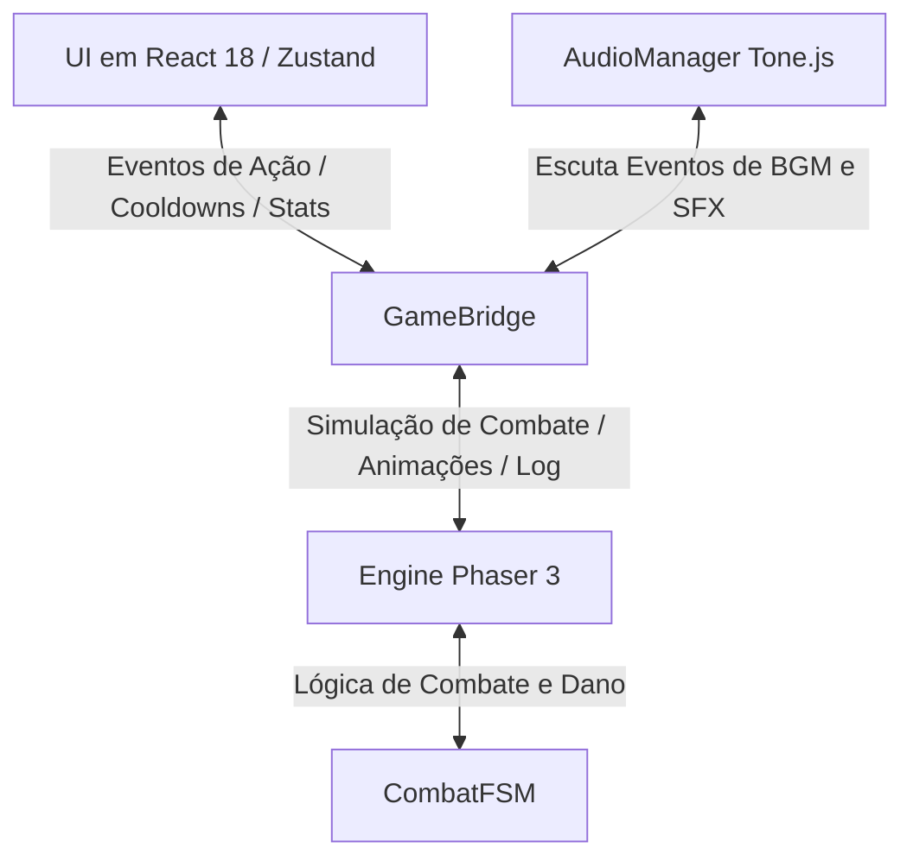

<div align="center">

# ⚔️ Amaro RPG Idle 🛡️

**Um RPG Idle (incremental) de fantasia sombria medieval, com combate automático em Phaser 3, progressão Roguelite profunda, modo história narrativo e interface moderna em React 18 + TypeScript.**


</div>

---

## 📖 Sobre o Jogo

**Amaro RPG Idle** é um jogo de progressão incremental (*idle/clicker*) ambientado no **Ciclo da Alma Partida**: uma única Alma-Mundo que se fragmentou em seis Ecos — as classes jogáveis — deixando para trás um Vazio primordial que dá origem a todas as criaturas e corrupções do reino.

O jogador assume a forma de um desses Ecos, avançando por biomas cada vez mais inóspitos em combate automático sidescrolling em tempo real. Através de múltiplos níveis de prestígio (**Ascensão** e **Transcendência**), construção da base persistente (**Cidadela Astral** e **Cidadela Submersa**), forja de runas, caça a leviatãs ancestrais e vivência da campanha narrativa (**Modo História "Ecos do Destino"**), o herói busca romper definitivamente o ciclo de dor da Alma-Mundo.

Toda a lore do universo — cosmologia, facções, biografias de chefes, biologia das criaturas e a linha do tempo dos eventos — está catalogada dentro do próprio jogo na aba **Codex** ([`src/core/codexData.ts`](file:///c:/Users/amaro/Documents/AmaroRpgIdle/src/core/codexData.ts) + [`src/components/CodexPanel.tsx`](file:///c:/Users/amaro/Documents/AmaroRpgIdle/src/components/CodexPanel.tsx)).

---

## 📑 Índice

- [Funcionalidades Principais](#-funcionalidades-principais)
  - [Navegação Reorganizada por Categorias](#-navegação-reorganizada-em-categorias-v1140)
  - [Modo História "Ecos do Destino"](#-modo-história-ecos-do-destino-v1100--v1140)
  - [Combate e Progressão](#-combate-e-progressão)
  - [Classes e Habilidades](#-classes-e-habilidades)
  - [Equipamentos, Runas e Oráculo Rúnico](#-sistema-de-equipamentos-runas-e-oráculo-rúnico-v1200)
  - [Cidadela Astral e Cidadela Submersa](#-cidadela-astral-e-cidadela-submersa)
  - [Títulos com Propósito](#-títulos-com-propósito-v1150)
  - [Torre Infinita e Eventos Sazonais](#-torre-infinita-e-eventos-sazonais)
  - [Roguelite, Ascensão e Transcendência](#-roguelite-ascensão-e-transcendência)
  - [Sistema de Áudio Procedural e SFX](#-sistema-de-áudio-procedural-e-trilha-sonora)
- [Stack Tecnológica](#️-stack-tecnológica)
- [Arquitetura da Aplicação (Ponte Phaser ↔ React)](#-arquitetura-da-aplicação-ponte-phaser--react)
- [Estrutura do Projeto](#-estrutura-do-projeto)
- [Como Rodar o Projeto Localmente](#-como-rodar-o-projeto-localmente)
- [Scripts Disponíveis](#-scripts-disponíveis)
- [Progressive Web App (PWA)](#-progressive-web-app-pwa--instalação-mobile)
- [Persistência e Saves Isolados](#-persistência-e-saves-isolados-por-personagem)
- [SEO e Compartilhamento](#-otimização-de-seo-search-engine-optimization)
- [Roadmap e Changelog](#-roadmap-e-changelog)
- [Contribuindo](#-contribuindo)
- [Licença](#-licença)

---

## 🎮 Funcionalidades Principais

### 🗂️ Navegação Reorganizada em Categorias (v11.4.0)
Para acomodar a constante expansão de conteúdo sem sobrecarregar a tela durante o combate, as abas do jogo são estruturadas em **5 Categorias Principais**:
- **⚔️ Combate**: Acesso instantâneo de 1 toque/clique para acompanhar a simulação Phaser, auto-cast e console de logs de batalha.
- **👤 Personagem**: Equipamento, Atributos Primários, Árvore de Habilidades e Diário de Jornada.
- **🎯 Atividades**: Torre Infinita, Abismo / Cidadela Submersa e Cidadela Astral.
- **🌟 Evolução**: Forja Mística, Ascensão (Prestígio), Transcendência e Loja / Mercador Ambulante.
- **📚 Codex**: Guia do Jogo, Bestiário e Enciclopédia de Lore (Codex).
- **⚙️ Opções**: Gerenciamento de Saves (múltiplos slots) e Configurações de Interface/Áudio.

No desktop, a navegação utiliza um **Sidebar Lateral** elegante à direita; no mobile, uma **Folha Modal Deslizante (☰)** oferece acesso rápido às categorias sem ocupar espaço no rodapé.

---

### 📜 Modo História "Ecos do Destino" (v11.0.0 — v11.4.0)
- **6 Atos Narrativos e 24 Capítulos**: Campanha sequencial completa abrangendo desde o *Despertar do Eco* até a incursão no *Coração do Abismo*.
- **Cutscenes de Ato (Visual Novel)**: Apresentação cinematográfica com trilha sonora atmosférica, máquina de escrever e arte em alta definição de personagens como a Voz da Alma-Mundo, Valéria, Vulkan, O Andarilho do Vazio e o Castelão Afundado.
- **Banners de Diálogo de NPC**: Interações narrativas ricas acionadas ao concluir marcos capitulares no jogo.
- **7 Artefatos Narrativos Permanentes**: Itens de história únicos concedidos ao término dos capítulos (ex: *Fragmento da Alma-Mundo*, *Promessa Quebrada do Vazio*). Os artefatos **permanecem intactos após a Ascensão e Transcendência**, concedendo atributos acumuláveis e revelação visual em tela com halo radiante.

---

### ⚔️ Combate e Progressão
- **Combate Automático Sidescrolling (Phaser 3)**: Batalhas contínuas com física 2D, números de dano flutuantes e animações fluidas a 60 FPS.
- **7 Biomas Únicos**: Avanço contínuo pelo Bosque Sussurrante, Floresta Antiga, Deserto de Ouro, Picos Glaciais, Cemitério Maldito, Ruínas Sombrias e o Purgatório.
- **Modo Pandemônio**: Fases sem fim desbloqueadas pós-Purgatório, apresentando dificuldade adaptativa exponencial e drops de raridade superior.

---

### 🛡️ Classes e Habilidades
- **8 Classes Jogáveis** organizadas em hierarquia de evolução:
  - **Classes Iniciais**: Guerreiro, Mago e Arqueiro.
  - **Evoluções (Nível 50)**: Paladino, Clérigo e Ladrão.
  - **Classe Desbloqueável**: Necromante (desbloqueado ao evoluir Clérigo e Ladrão a Nível 50 em qualquer save).
  - **Classe Suprema**: Avatar (desbloqueado pós-Transcendência, unificando os 5 atributos cardinais).
- **Árvores de Habilidades Gráficas**: Habilidades ativas, passivas e uma habilidade **Ultimate** exclusiva por classe, expansíveis até o Nível 10/15.
- **Controle de Auto-Cast por IA**: IA configurável para conjurar habilidades e curas automaticamente durante o combate idle.

---

### 🔮 Sistema de Equipamentos, Runas e Oráculo Rúnico (v12.0.0)
- **9 Slots de Equipamento**: Cabeça, Peitoral, Pernas, Luvas, Arma, Colar, Amuleto, Anel e Relíquia Ativa.
- **Raridades e Sets**: Do Comum ao Místico (+1 a +8 na Forja Mística), com conjuntos temáticos que ativam bônus poderosos por peças equipadas.
- **Câmara de Gravação & Palavras Rúnicas Pesadas**: Perfuração de soquetes em peças pesadas para engaste de Runas e gravação de Palavras Rúnicas (*Fome do Abismo*, *Coração do Leviatã*).
- **Oráculo Rúnico (13ª construção da Cidadela Astral — Rework do Amuleto)**:
  - Circulo de 6 espaços dedicados exclusivamente ao Amuleto.
  - **9 Runas Astrais** divididas em 3 Tiers utilitários/suporte.
  - **Palavras Rúnicas Astrais**: Reconhecimento passivo de receitas de runas. Palavras lendárias de 6 runas concedem **habilidades ativas totalmente novas** ao jogador.
  - **Suporte a 2 Palavras Simultâneas**: No nível máximo do Oráculo, o Amuleto pode manter duas palavras rúnicas ativas ao mesmo tempo (uma em cada metade do círculo).
  - **Consumível "Garrafa Perdida"**: Item raro de Pesca que pode revelar receitas desconhecidas de Palavras Rúnicas Astrais.
- **Rework do Anel**: Foco exclusivo em atributo primário puro com o **dobro do valor** normal das demais peças.
- **Relíquias Ativas e Passivas**: Relíquia Ativa com atributos dinâmicos e botão de uso com cooldown próprio, combinada ao Altar da Alma com 8 Relíquias Passivas permanentes.

---

### 🏰 Cidadela Astral e Cidadela Submersa
- **Cidadela Astral (13 Construções Permanentes)**:
  Hub persistente entre Ascensões com Depósito, Quartel de Expedições, Academia Militar, Torre de Vigia, Oficina da Forja, Sifão Cósmico, Altar de Sincronia, Laboratório de Relíquias, Laboratório de Alquimia, Santuário de Contratos, Câmara de Gravação e o **Oráculo Rúnico**.
- **A Cidadela Submersa & O Abismo**:
  - **Mergulho nas Profundezas (Abyss Dive)**: Incursões aquáticas com gestão de Oxigênio, Pressão e Luz em Traje de Mergulho personalizável.
  - **Restauração dos 4 Distritos**: Doca, Distrito Residencial, Templo Submerso e Arquivo Abissal.
  - **Litoral e Pesca Ativa**: Minijogo de pesca manual ("Puxar a Linha") e redes automatizadas para obter Coral Vivo, Pérolas Abissais e Garrafas Perdidas.
  - **Caça aos Leviatãs**: Enfrentamento dos 3 Leviatãs ancestrais com mecânicas únicas de fase.

---

### 🏷️ Títulos com Propósito (v11.5.0)
Os títulos honoríficos obtidos na Torre Infinita e no Abismo concedem bônus estratégicos reais ao personagem baseados no título atualmente equipado:
- **Torre Normal**: **+2% Vida Máxima por nível de título** (`maxHpPct`).
- **Ramificação de Maldições**: **+2% Dano Geral por nível de título** (`damageMultiplierPct`).
- **Profundezas do Abismo**: **+5% Dano Crítico por nível de título** (`critDamage`).

---

### 🗼 Torre Infinita e Eventos Sazonais
- **Torre Infinita (3 Modos)**:
  - **Torre Normal**: Progressão andar a andar com andares de chefe a cada 5 níveis.
  - **Ramificação de Maldições**: Modo Roguelike com maldições e bençãos aleatórias por andares.
  - **Provações do Vácuo**: Desafio de sobrevivência extrema pós-Transcendência.
- **Eventos Sazonais & Calendário Real**:
  - **Lua de Sangue**: Ativa nos finais de semana, aumentando a força dos inimigos em troca de multiplicadores de Ouro/XP e drops raros.
  - **Inimigos Elites**: Inimigos com afixos aleatórios (*Enfurecido*, *Vampírico*, *Resistente*).
  - **Convergência (Chefe Mundial)**: Chefe colossal que rotaciona semanalmente entre 4 formas, disponível apenas às quartas-feiras.

---

### 🔄 Roguelite, Ascensão e Transcendência
- **Ascensão (Prestígio)**: Reinicia o nível e as fases do personagem em troca de Pontos de Prestígio aplicáveis em uma árvore de talentos permanente em formato de diamante.
- **Transcendência**: Camada suprema de prestígio desbloqueada pós-Purgatório. Abre o bioma da **Ecoterra** e a Árvore Cósmica de Talentos de Transcendência.

---

### 🎵 Sistema de Áudio Procedural e Trilha Sonora
- **Tone.js & Web Audio API**: Motor de áudio dinâmico integrado ([`src/core/AudioManager.ts`](file:///c:/Users/amaro/Documents/AmaroRpgIdle/src/core/AudioManager.ts)).
- **Trilha Sonora Adaptativa (BGM)**: Músicas procedurais e sintetizadas que mudam de acordo com o bioma atual, chefe, evento sazonal ou cutscene narrativa.
- **Efeitos Sonoros (SFX)**: Feedback sonoro para golpes, acertos críticos, consumo de poções, subida de nível, conquistas e menus.

---

### 🔔 Indicadores Visuais de Notificação (v11.3.0)
Bolinhas pulsantes animadas ([`src/components/TabBadgeDot.tsx`](file:///c:/Users/amaro/Documents/AmaroRpgIdle/src/components/TabBadgeDot.tsx)) alertam o jogador em tempo real sobre:
- Pontos de Atributos ou Habilidades livres para distribuir.
- Missões da Jornada ou Contratos prontos para resgate.
- Upgrades disponíveis na Cidadela Astral ou Submersa.
- Redes de pesca prontas para coleta no Litoral.

---

## 🛠️ Stack Tecnológica

| Camada | Tecnologia | Descrição |
| --- | --- | --- |
| **Core** | React 18 · TypeScript 5 · Vite 5 | Framework de UI, tipagem estrita e build otimizado. |
| **Motor Gráfico** | Phaser 3.85 | Renderização 2D Canvas/WebGL, física de combate e animações de sprites. |
| **Estado Global** | Zustand 4 | Gerenciamento de estado reativo e descentralizado (`useGameStore`, `useRelicStore`, `useTowerStore`, `useQuestStore`, `useDiveStore`, `useLeviathanStore`). |
| **Áudio & Música** | Tone.js · Web Audio API | Síntese de áudio procedural e reprodução de BGMs/SFX adaptativos. |
| **Estilização** | CSS3 Vanilla | Design System Dark Fantasy com suporte a glassmorphism, variáveis CSS e responsividade mobile-first. |
| **Persistência** | `localStorage` | Múltiplos slots de save independentes com migração de schema e isolamento de progresso. |
| **Distribuição** | Progressive Web App (PWA) | Service Worker offline-first (`sw.js`) e Web App Manifest standalone. |

---

## 📐 Arquitetura da Aplicação (Ponte Phaser ↔ React)

O projeto utiliza o padrão **Bridge (Ponte de Eventos)**, implementado na classe [`GameBridge`](file:///c:/Users/amaro/Documents/AmaroRpgIdle/src/bridge/GameBridge.ts), para garantir comunicação assíncrona de alta performance entre o motor Phaser 3 e a interface React:



1. **Comunicação por Eventos (`GameEvent`)**: A UI solicita uso de habilidades ou alterações de velocidade; o Phaser transmite ticks de HP/Mana, drops, e finalização de estágios.
2. **Atualização Direta do DOM**: Elementos de alta frequência (barras de vida/mana e cooldowns) atualizam seus estilos CSS diretamente no DOM para manter 60 FPS cravados sem re-renderizar a árvore de componentes React.
3. **Camada de Domínio Isolada**: Toda a matemática de atributos, fórmulas da Cidadela, fórmulas rúnicas, peixes, bestiário e dados do Codex residem em [`src/core/`](file:///c:/Users/amaro/Documents/AmaroRpgIdle/src/core/), sem dependências do React.

---

## 📂 Estrutura do Projeto

```
src/
├── App.tsx                    # Roteamento principal, montagem do Phaser e carregamento de assets
├── main.tsx                   # Ponto de entrada React
├── index.css                  # Design System, variáveis CSS, temas dark e animações
├── bridge/
│   └── GameBridge.ts           # Ponte de comunicação de eventos Phaser ↔ React
├── core/                      # Lógica de domínio pura
│   ├── types.ts               # Interfaces e tipos globais
│   ├── CombatFSM.ts           # Máquina de estados de combate, inimigos e relíquias
│   ├── StatEngine.ts           # Cálculo de atributos finais, sets, bestiário e bônus de lore
│   ├── AudioManager.ts        # Motor de som Tone.js e efeitos sonoros
│   ├── bgmThemes.ts           # Definição e síntese de trilhas sonoras procedurais
│   ├── astralRuneFormulas.ts  # Runas e Palavras Rúnicas Astrais do Oráculo
│   ├── runeFormulas.ts        # Sistema de Soquetes e Runas pesadas
│   ├── sunkenCitadelFormulas.ts# Fórmulas de restauração dos 4 Distritos Submersos
│   ├── abyssFormulas.ts       # Mergulho no Abismo e Pesca no Litoral
│   ├── titleFormulas.ts       # Títulos honoríficos e bônus estratégicos
│   ├── citadelFormulas.ts     # Fórmulas de produção e upgrade da Cidadela Astral
│   ├── codexData.ts           # Catálogo de enciclopédia e lore
│   └── quests/                # Sistema de Missões e Jornada Principal
│       ├── mainQuestsData.ts  # Catálogo dos 6 Atos e 24 Capítulos
│       ├── storyCutscenesData.ts# Roteiros das cutscenes de história
│       └── QuestGenerator.ts  # Gerador procedural de contratos de caça
├── store/                     # Stores Zustand para estado global
│   ├── useGameStore.ts        # Personagem, inventário, habilidades, forja, ascensão e cidadela
│   ├── useQuestStore.ts       # Estado da Jornada Principal, contratos e diálogos
│   ├── useRelicStore.ts       # Estado das Relíquias Passivas do Altar
│   ├── useTowerStore.ts       # Estado da Torre Infinita e Títulos
│   ├── useDiveStore.ts        # Estado de mergulho no Abismo e Pesca
│   └── useLeviathanStore.ts   # Estado de caça aos Leviatãs
├── components/                # Componentes da Interface React
│   ├── GameUI.tsx             # Hub central do jogo, categorias e gerenciador de abas
│   ├── MainMenu.tsx           # Tela inicial com animações e seleção de modo
│   ├── CharacterSelect.tsx    # Seleção e criação de heróis
│   ├── SavesMenu.tsx          # Gerenciador de slots de save
│   ├── ForgeView.tsx          # Forja Mística e fusão de equipamentos
│   ├── TowerPanel.tsx         # Painel dos 3 modos da Torre Infinita
│   ├── QuestLogPanel.tsx      # Diário de Jornada, Contratos e Artefatos
│   ├── CodexPanel.tsx         # Enciclopédia do jogo e Bestiário
│   ├── nav/                   # Componentes de navegação por Categorias e Sub-abas
│   │   ├── navConfig.ts       # Configuração das 5 Categorias
│   │   ├── CategorySidebar.tsx# Sidebar de categorias (Desktop)
│   │   └── MobileNavSheet.tsx # Folha modal de categorias (Mobile)
│   ├── citadel/               # Construções da Cidadela Astral (Oficina, Oráculo, etc.)
│   ├── abyss/                 # Cidadela Submersa, Abismo, Pesca e Leviatãs
│   ├── tower/                 # Componentes da Torre e Ramificação de Maldições
│   └── shared/                # Botões, modais, tooltips e overlays reaproveitáveis
├── phaser/
│   └── scenes/
│       └── CombatScene.ts     # Cena principal Phaser (sprites, física, paralaxe e efeitos)
└── hooks/                     # Hooks reutilizáveis (useHoldRepeat, useTabNotifications, etc.)
```

---

## 🚀 Como Rodar o Projeto Localmente

### Pré-requisitos
- [Node.js](https://nodejs.org/) versão 18.0 ou superior
- npm (geralmente instalado junto ao Node.js)

### 1. Clonar o Repositório
```bash
git clone https://github.com/AmaroCostaPRO/AmaroRpgIdle.git
cd AmaroRpgIdle
```

### 2. Instalar as Dependências
```bash
npm install
```

### 3. Iniciar o Servidor de Desenvolvimento
```bash
npm run dev
```
Abra o navegador no endereço indicado (geralmente `http://localhost:5173/`).

### 4. Gerar a Build de Produção
```bash
npm run build
```
Os arquivos estáticos otimizados para produção serão gerados na pasta `/dist`.

### 5. Testar a Build de Produção Localmente
```bash
npm run preview
```

---

## 📜 Scripts Disponíveis

| Comando | Descrição |
| --- | --- |
| `npm run dev` | Inicia o servidor Vite de desenvolvimento com Hot Module Replacement (HMR). |
| `npm run build` | Executa a verificação estática de tipos via `tsc` e compila os arquivos de produção para `/dist`. |
| `npm run preview` | Executa um servidor local simulando a build de produção para testes finais. |

---

## 📱 Progressive Web App (PWA) & Instalação Mobile

O jogo foi projetado com abordagem **Mobile-First** e suporte total às especificações PWA:
1. **Modo Standalone**: Funciona como um aplicativo nativo sem barras de endereço do navegador.
2. **Suporte Offline**: O Service Worker ([`public/sw.js`](file:///c:/Users/amaro/Documents/AmaroRpgIdle/public/sw.js)) adota estratégia *Network-First* com fallback em cache, permitindo jogar sem conexão à internet.
3. **Instalação em 1 Clique**: Compatível com instalação nativa no Android/Chrome e através da opção "Adicionar à Tela de Início" no iOS/Safari.

---

## 💾 Persistência e Saves Isolados por Personagem

- **Múltiplos Slots de Save**: Suporte a diversos slots de save gerenciados em [`src/components/SavesMenu.tsx`](file:///c:/Users/amaro/Documents/AmaroRpgIdle/src/components/SavesMenu.tsx).
- **Isolamento Completo (v11.1.0)**: Todo o progresso do herói (equipamentos, nível, jornada principal, relíquias, torre e recordes pessoais) é salvo **de forma isolada por slot de save**, permitindo manter múltiplos personagens simultâneos sem contaminação entre saves.
- **Normalização e Segurança**: O carregamento valida e normaliza os dados salvos contra valores negativos, infinitos ou `NaN`.

---

## 🔍 Otimização de SEO (Search Engine Optimization)

- Metadados primários, Open Graph e Twitter Cards totalmente estruturados em [`index.html`](file:///c:/Users/amaro/Documents/AmaroRpgIdle/index.html) para visualização rica de links em redes sociais (Discord, WhatsApp, X/Twitter e Facebook).

---

## 🗺️ Roadmap e Changelog

O histórico técnico detalhado de todas as versões, notas de balanceamento e decisões de arquitetura é mantido em:
- 📖 [`Manual Técnico Amaro RPG Idle.md`](file:///c:/Users/amaro/Documents/AmaroRpgIdle/Manual%20T%C3%A9cnico%20Amaro%20RPG%20Idle.md)
- 📝 [`Histórico de Updates e Otimizações.md`](file:///c:/Users/amaro/Documents/AmaroRpgIdle/Hist%C3%B3rico%20de%20Updates%20e%20Otimiza%C3%A7%C3%B5es.md)

---

## 🤝 Contribuindo

Este é um projeto pessoal de desenvolvimento solo. Sugestões, ideias e relatórios de problemas são bem-vindos através das [Issues](https://github.com/AmaroCostaPRO/AmaroRpgIdle/issues) no repositório.

---

## 📄 Licença

Todos os direitos reservados. Este repositório é privado/proprietário (conforme `"private": true` em [`package.json`](file:///c:/Users/amaro/Documents/AmaroRpgIdle/package.json)) e não possui uma licença open source formal. O código não deve ser redistribuído ou reutilizado comercialmente sem autorização expressa do autor.

---

<div align="center">

Desenvolvido por **Amaro** — Um RPG Idle construído com React 18, TypeScript, Phaser 3 e Zustand.

</div>
