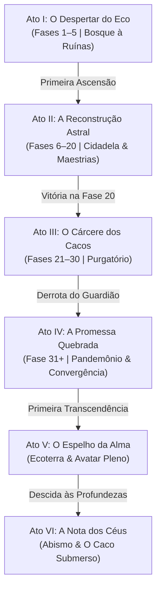
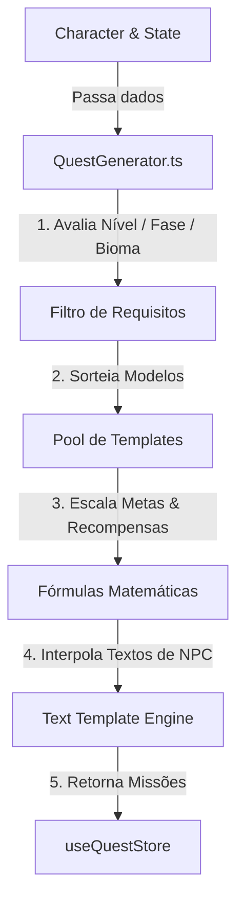
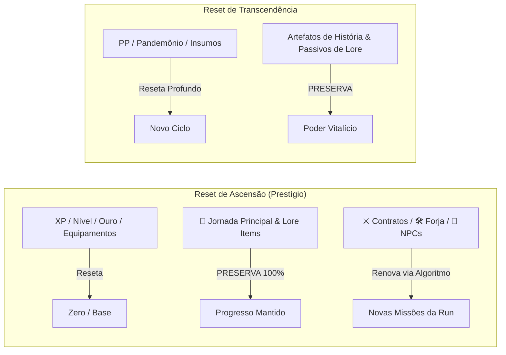

# Plano de Implementação Completo — Update v11: "Ecos do Destino" (Modo História Robusto & Sistema de Missões)

> **Documento Definitivo de Especificação Técnica, Arquitetura de Software e Design de Gameplay**  
> **Projeto**: Amaro RPG Idle  
> **Versão de Referência**: v11.0.0  
> **Idioma**: Português do Brasil (pt-BR)

---

## 1. Visão Geral e Filosofia de Design

O **Update v11 ("Ecos do Destino")** transforma a experiência do *Amaro RPG Idle*, unificando a lore profunda e atmosférica já estabelecida no Codex, no Guia e nas Cutscenes em um **Modo História Robusto e Sistema de Missões Integrado**.

### Diretrizes Fundamentais de Design:
1. **Integração Orgânica (Sem Modos Separados)**: A história não será um menu isolado ou um minigame separado. As missões e narrativas fluem diretamente dentro das fases da campanha, das construções da Cidadela Astral/Submersa, das subidas da Torre Infinita, dos mergulhos no Abismo e dos resets de Ascensão/Transcendência.
2. **Posicionamento da Interface (Aba de Topo)**:
   - A nova aba **📜 Jornada** ficará **posicionada exatamente ao lado da aba ⚔️ Combate** (como a 2ª aba na barra superior desktop e no carrossel mobile), garantindo acesso rápido e visibilidade constante durante a gameplay.
   - Ordem das abas: `⚔️ Combate` → `📜 Jornada` → `◆ Atributos` → `★ Habilidades` → `🛡️ Equipamento` → `⚒️ Forja` → `🌊 Abismo` → `🌌 Cidadela`...
3. **Variedade Rica e Equilibrada de Missões**: O sistema unifica a narrativa artesanal da **Jornada Principal** com um **Motor Procedural Dinâmico (`QuestGenerator.ts`)** que engloba Caçadas por Afixo/Tempo Limite, Desafios de Forja/Alquimia/Runas e Requisições Táticas de NPCs da Cidadela e do Abismo.

---

## 2. Estrutura Narrativa e Trigger Points no Loop de Gameplay

A história do jogo é dividida em **6 Atos Principais**, acompanhando a evolução do herói desde o primeiro despertar até o confronto com as forças além dos céus:



### Detalhamento dos Trigger Points (Momentos em que a História Entra):

| Ato | Requisito / Gatilho | Evento de História / NPC Interventor | Tema / Contexto Narrativo |
| :--- | :--- | :--- | :--- |
| **Ato I: O Despertar** | Início de novo jogo / Fases 1–5 | **Voz da Alma-Mundo** & **Golem / Arquidemônio** | O herói acorda no Bosque Sussurrante sem memória, percebendo que os monstros do Vazio imitam a vida. A primeira Ascensão é apresentada como "aprender a lembrar". |
| **Ato II: A Reconstrução** | Primeira Ascensão + Nível 50 em classe | **Valéria, a Arquivista Astral** & **Vulkan, o Mestre da Forja** | A Cidadela Astral ganha vida. Missões focam em reconstruir as alas (Quartel, Academia, Forja), compreender os 6 Ecos e destravar as classes avançadas. |
| **Ato III: O Cárcere** | Fase 21 (Entrada no Purgatório) | **O Espectro da Memória** | Descobrindo que o Purgatório não é um bioma natural, mas o cárcere onde a Alma-Mundo prendeu seus próprios cacos. Investigação sobre o Guardião dos Cacos. |
| **Ato IV: A Promessa** | Quebra da Fase 30 (Altar de Alma) | **O Mercador das Encruzilhadas (Sem Rosto)** | O fim da segurança da campanha e o início do Loop Infinito do Pandemônio. A Convergência de quarta-feira e a ameaça de *O Que Ainda Sonha*. |
| **Ato V: O Espelho** | Fase 50 + Rito de Transcendência | **O Eco do Avatar** | Entrando na Ecoterra. O herói aprende a harmonizar os 5 atributos cardinais para atingir a forma de Avatar Pleno e reescrever a roda do destino. |
| **Ato VI: A Nota dos Céus** | Vitória contra O Leviatã do Ciclo | **Os Ecos Afogados & Heraldo dos Céus** | A colheita do fruto da Cutscene v10.0.0. O Caco Submerso entoa uma única nota que responde do céu, desbloqueando a fase de Missões Supremas dos Céus. |

---

## 3. Catálogo Completo das 4 Categorias de Missões

O sistema unifica a profundidade narrativa artesanal com 3 tipos de missões dinâmicas geradas proceduralmente pelo algoritmo `QuestGenerator.ts`:

```
📜 SISTEMA DE MISSÕES DE V11
├── 🌟 1. Jornada Principal (Handcrafted / Fixa)    -> Escrita à mão, linear, focada em lore e nunca reseta
├── ⚔️ 2. Contratos de Caçada (Algoritmo Caças)     -> Elites com afixos, tempo limite em bosses e ondas na Torre
├── 🛠️ 3. Forja, Alquimia & Runas (Algoritmo Craft)  -> Sintetização de elixires, palavras rúnicas e refinamento
└── 🤝 4. Requisições de NPCs (Algoritmo Tático)    -> Desafios de classes/maestrias, alocação de Ecos e Cidadela
```

### 1. 🌟 Jornada Principal (Main Story Quests — Fixas & Artesanais)
- **Estrutura**: Capítulos lineares por Ato (`src/core/quests/mainQuestsData.ts`), com narrativas profundas e diálogos fixos de NPCs.
- **Exemplo de Objetivo**: *"Capítulo 2: Reconstrua o Depósito na Cidadela Astral, derrote o Rei Escorpião de Ouro no Deserto e alcance o Nível 50 com a classe Guerreiro."*
- **Persistência**: **100% imune a Ascensões e Transcendências**. Avança continuamente ao longo da história do jogo.

### 2. ⚔️ Contratos de Caçada (Bounties & Hunts — Geradas por Algoritmo)
- **Foco**: Desafios de combate de alta intensidade e rotação rápida por run ou ciclo diário.
- **Variantes Geradas Proceduralmente**:
  - **Caça por Afixo de Elite**: *"Eliminar 3 monstros Elites com o afixo [ENFURECIDO] no Deserto ou Picos Glaciais."*
  - **Duelo Contra o Relógio**: *"Derrotar o Chefe de Fase em menos de 15 segundos sem quebrar a barra de HP."*
  - **Provação Amaldiçoada**: *"Sobreviver a 5 andares seguidos na Ramificação de Maldições da Torre Infinita."*
- **Integração**: Expande o **Santuário de Contratos de Caça** da Cidadela Astral com recompensas em Fragmentos de Forja, Insígnias e Ouro.

### 3. 🛠️ Missões de Forja, Alquimia e Runas (Crafting & Collection — Geradas por Algoritmo)
- **Foco**: Incentivar o engajamento com a economia, o sistema de soquetes de runas e o laboratório de elixires.
- **Variantes Geradas Proceduralmente**:
  - **Alquimia de Suporte**: *"Sintetizar 3 Elixires do Mercador no Laboratório de Alquimia da Cidadela."*
  - **Ressonância Rúnica**: *"Completar e engastar a Palavra Rúnica [CORO SUBMERSO] ou [FAÍSCA DO VAZIO] na Câmara de Gravação."*
  - **Mestria do Metal**: *"Forjar ou refinar 1 equipamento para a raridade Ancestral ou Celestial."*
- **Recompensas**: Fragmentos de Forja, Pérolas Abissais e Cristais de Alquimia.

### 4. 🤝 Requisições de NPCs (Side Quests Táticas — Geradas por Algoritmo)
- **Foco**: Ajudar figuras marcantes da Cidadela Astral e Submersa através de desafios táticos e requisitos específicos de classes e gestão.
- **Variantes Geradas Proceduralmente**:
  - **Requisição de Valéria (Arquivista)**: *"Alcançar o Nível 50 com a classe Clérigo e Ladrão em uma mesma conta."*
  - **Requisição de Vulkan (Mestre da Forja)**: *"Desmontar 20 equipamentos Lendários para recuperar fragmentos puros."*
  - **Requisição do Castelão Afundado**: *"Alocar 3 Ecos Afogados com eficácia combinada acima de 35% no Salão dos Ecos."*
- **Recompensas**: Aumento permanente de reputação com a facção, bônus de eficiência de produção nas construções e Títulos Honoríficos.

---

## 4. Funcionamento Detalhado do Motor Procedural (`QuestGenerator.ts`)

O motor procedural de geração de missões funciona em tempo real lendo o estado reativo do personagem (`Character`) a cada reset de Ascensão, avanço de fase ou virada de ciclo diário:



### A. Entradas de Contexto Lido pelo Algoritmo:
- `character.currentStage` & `character.highestStageReached` (determinam a zona elegível e o teto de dificuldade).
- `character.level` & `character.classId` (ajustam o filtro de requisições de classe).
- `character.citadel.buildings` (garantem que só sejam geradas missões de construções já desbloqueadas).
- `character.coastal.unlocked` (habilita missões de mergulho e Ecos Afogados se o Abismo estiver ativo).

### B. Motor de Interpolação de Textos (Text Template Engine):
Para que os contratos e requisições procedurais pareçam vivos e integrados à lore, o algoritmo possui matrizes de diálogos categorizadas por facção/NPC:

- **Exemplo de Template de Caçada (Cidadela Astral)**:
  - *Frase base*: `"{npc}: 'Nossas patrulhas relataram que {monstro} atrai o Vazio para {bioma}. Precisamos de {quantidade} abates antes que a Cidadela seja ameaçada.'"`.
- **Exemplo de Template de Forja (Vulkan)**:
  - *Frase base*: `"{npc}: 'A bigorna exige metal nobre. Refine {quantidade} peças para a raridade {raridade} e prove seu domínio sobre a chama.'"`.
- **Exemplo de Template dos Ecos Afogados (Castelão)**:
  - *Frase base*: `"{npc}: 'A maré está agitada em {zona}. Traga {quantidade} Pérolas ou aloque novos Ecos para estabilizar o distrito.'"`.

### C. Fórmulas Matemáticas de Escalonamento de Metas e Recompensas:
1. **Meta de Abates Normal**:
   $$\text{Meta} = \text{clamp}\left(\lfloor 15 + \text{Fase} \times 2.5 \rfloor, 15, 100\right)$$
2. **Meta de Abates Elite**:
   $$\text{Meta Elite} = \text{clamp}\left(\lfloor 2 + \text{Fase} \times 0.4 \rfloor, 2, 10\right)$$
3. **Recompensa em Fragmentos de Forja**:
   $$\text{Fragmentos} = \lfloor (50 + \text{Fase} \times 15) \times \text{Multiplicador Dificuldade} \rfloor$$
4. **Recompensa em Ouro**:
   $$\text{Ouro} = \lfloor (200 + \text{Fase} \times 100) \times (1 + \text{Sorte} \times 0.01) \rfloor$$

### D. Exemplo de Código do Gerador (`src/core/quests/QuestGenerator.ts`):
```typescript
export function generateRunQuests(character: Character): QuestDef[] {
  const stage = character.currentStage || 1;
  const unlockedBiomes = getUnlockedBiomes(stage);

  return [
    // 1. Contrato de Caçada (Bounty com Afixo ou Tempo)
    generateHuntBounty(stage, unlockedBiomes),
    
    // 2. Desafio de Forja, Alquimia ou Runas
    generateCraftingChallenge(stage, character),
    
    // 3. Requisição Tática de NPC (Cidadela ou Abismo)
    generateNpcTacticalRequest(character)
  ];
}
```

---

## 5. Integração com o Loop Roguelite & Tratamento dos Itens de História

Para manter a consistência com as regras de resiliência e persistência do jogo, a relação entre as missões e os resets é estritamente regulada:



### Tratamento Detalhado dos Itens de História (Lore Artifacts):
- É criada uma subcategoria dedicada na interface e no estado: **"Itens de História & Artefatos Narrativos"** (`character.storyInventory`).
- **Regras de Persistência e Comportamento**:
  1. **Slots Separados**: Não ocupam o inventário padrão de 30 slots de equipamentos comuns.
  2. **Imunidade a Resets**: **Sobrevivem 100% tanto à Ascensão quanto à Transcendência** (mesmo padrão aplicado às Chaves da Torre Evoluídas).
  3. **Passivos Globais Ativos**: Cada item de história coletado concede um bônus numérico permanente aplicado via `StatEngine.ts` em todas as *runs* presentes e futuras.
  4. **Exemplos de Artefatos**:
     - *Fragmento de Memória da Alma*: $+5\%$ de XP Vitalício em todas as fases.
     - *Selo do Arquidemônio Vencido*: $+10$ de Força permanente e $+3\%$ de Chance de Crítico.
     - *Bússola Astral da Alma-Mundo*: $+5\%$ de Chance de Drop de Equipamentos e Chaves da Torre.
     - *Relicário dos Ecos Afogados*: $+15\%$ de Regeneração de HP e Mana na Ecoterra e Abismo.

---

## 6. UI/UX, Banners de NPCs e Implementação Visual

### A. Posicionamento da Aba no Menu Principal
A aba **📜 Jornada** é posicionada como a **segunda aba oficial** na barra superior desktop e no carrossel circular mobile:

```
[ ⚔️ Combate ] [ 📜 Jornada ] [ ◆ Atributos ] [ ★ Habilidades ] [ 🛡️ Equipamento ] ...
```

### B. Estrutura Interna da Aba Jornada (`QuestLogPanel.tsx`)
A aba divide-se internamente em três sub-abas superiores para navegação limpa:

```
📜 JORNADA DA ALMA
┌──────────────────────────────────────────────────────────────────────────┐
│  🌟 JORNADA PRINCIPAL  |  ⚔️ CONTRATOS & CAÇADAS  |  🤝 REQUISIÇÕES NPCS  │
├──────────────────────────────────────────────────────────────────────────┤
│  🌟 JORNADA PRINCIPAL: ATO III — O CÁRCERE DOS CACOS                     │
│  Capítulo 3: A Tranca de Pedra                                           │
│  "Investigue a presença do Guardião no Purgatório."                      │
│                                                                          │
│  [✓] Elimine 50 Espectros do Purgatório (50/50)                         │
│  [▶] Derrote o Guardião dos Cacos na Fase 30 (0/1)                      │
│  [ ] Forje uma peça de Set Ancestral na Oficina                         │
│                                                                          │
│  Recompensas: 🏆 Título: Quebrador de Trancas | 💎 500 Frag. de Forja   │
│  [ RECLAMAR RECOMPENSA ]                                                 │
└──────────────────────────────────────────────────────────────────────────┘
```

### C. Sistema de Diálogos & Banners de NPCs em Tempo Real (`NpcDialogOverlay.tsx`)
Quando um marco de missão é atingido ou um NPC inicia uma conversa com o herói, um **Banner de Diálogo Suspenso** é renderizado sobre o combate (Phaser canvas):

- **Estilo Visual**: Dark Mode premium com moldura em degradê colorido animado conforme a facção do NPC (Ciano para Ecos Afogados, Roxo/Dourado para Cidadela Astral, Vermelho para o Vazio, Amarelo para o Mercador).
- **Retrato do NPC**: Renderizado no canto esquerdo em alta densidade (`1024x1024` transparente).
- **Efeito Máquina de Escrever (Typewriter Effect)**: O texto é digitado letra a letra (velocidade calibrada de ~25ms por caractere).
- **Áudio Sintetizado**: Efeitos sonoros leves e harmônicos sintetizados via Web Audio API (`AudioManager.ts`) ao surgir o banner e avançar as falas.
- **Diálogos com Opções (Ramificação)**: Suporte a botões de resposta do jogador, permitindo escolhas leves de lore ou aceitação de missões.

```
┌──────────────────────────────────────────────────────────────────────────┐
│ [ Retrato NPC ]  VALÉRIA, A ARQUIVISTA ASTRAL                            │
│  "O véu do Purgatório está cedendo... O que você enfrentou na Fase 30   │
│   não era um monstro, mas uma tranca viva erguida pela própria Alma."   │
│                                                                          │
│  (1) "O que devo fazer para quebrar a tranca?"                           │
│  (2) "Vou continuar explorando o Pandemônio."                            │
│                                           [ Continuar ▶ ] [ Pular ⏭ ]   │
└──────────────────────────────────────────────────────────────────────────┘
```

---

## 7. Catálogo de Ativos Gráficos & Sprites (Specs para v11)

Seguindo estritamente as especificações das **Seções 3.B, 3.G e 18.H do Manual Técnico**:

### 1. Sprites de NPCs & Personagens de História (Padrão 3.G):
- **Tamanho**: `1024 x 1024` pixels.
- **Fundo**: Branco puro sólido (`#FFFFFF`) sem brilho externo.
- **Estilo**: Pixel Art HD (512-bit), contornos pretos nítidos, sombra elíptica preta opaca sob os pés.

| Arquivo | Nome do NPC | Facção / Papel | Direção de Arte |
| :--- | :--- | :--- | :--- |
| `npc_archivist_valeria.png` | Valéria, a Arquivista Astral | Cidadela Astral | Túnica estelar azul-marinho, pergaminho flutuante translúcido nas mãos, óculos de leitor místico. |
| `npc_forge_master_vulkan.png` | Vulkan, o Mestre da Forja | Cidadela Astral | Anão místico de barba de brasas, avental de couro reforçado com runas incandescentes, martelo colossal. |
| `npc_void_wanderer.png` | O Andarilho do Vazio | Neutro / Mercador | Silhueta encapuzada em manto esfarrapado roxo-escuro, sem rosto (apenas dois pontos de luz violeta), lanterna de almas. |
| `npc_sky_herald.png` | O Heraldo dos Céus | Desconhecido | Ser alado espectral em armadura dourada trincada, segurando uma trombeta de cristal que emite luz azulada. |

### 2. Itens de História & Artefatos Narrativos:
| Arquivo | Nome do Item | Efeito Passivo Permanente |
| :--- | :--- | :--- |
| `story_shard_memory.png` | Fragmento de Memória da Alma | $+5\%$ de XP Vitalício ganho em todas as fases. |
| `story_seal_archdemon.png` | Selo do Arquidemônio Vencido | $+10$ de Força permanente e $+3\%$ de Chance de Crítico. |
| `story_astral_compass.png` | Bússola Astral da Alma-Mundo | $+5\%$ de Chance de Drop de Equipamentos e Chaves da Torre. |
| `story_drowned_locket.png` | Relicário dos Ecos Afogados | $+15\%$ de Regeneração de HP e Mana na Ecoterra e Abismo. |

---

## 8. Sistema de Recompensas do Modo História (5 Níveis)

Completar capítulos da história e contratos concede 5 níveis de recompensas integradas:

1. **Bônus Permanentes de Conta (Lore Perks)**:
   - Incrementos diretos em stats base via `Character` store (não somem na Ascensão).
2. **Itens de História & Relíquias Narrativas**:
   - Desbloqueio de artefatos únicos que entram na subcategoria de itens de história e ativam passivos globais.
3. **Títulos Honoríficos Equipáveis**:
   - Exibidos no HUD de combate e perfil (ex.: *Herdeiro da Memória*, *Sentinela do Vazio*).
4. **Receitas Secretas de Forja, Alquimia e Runas Exclusivas**:
   - Palavras rúnicas secretas e elixires especiais liberados para fabricação.
5. **Moedas e Insumos Especiais**:
   - Pacotes de Fragmentos de Forja, Pérolas Abissais e Essências de Transcendência.

---

## 9. Arquitetura de Código & Engenharia de Software

### A. Nova Store Zustand: `useQuestStore.ts`
```typescript
export interface QuestDef {
  id: string;
  category: 'main' | 'hunt' | 'craft' | 'npc';
  act?: 1 | 2 | 3 | 4 | 5 | 6;
  title: string;
  description: string;
  npcId?: string;
  isProcedural?: boolean;
  objectives: {
    id: string;
    type: 'kill' | 'kill_elite' | 'boss_time' | 'stage' | 'level' | 'craft' | 'runeword' | 'ascend' | 'abyss_echo';
    targetId?: string;
    requiredAmount: number;
    currentAmount: number;
  }[];
  rewards: {
    gold?: number;
    forgeFragments?: number;
    statBonus?: Partial<BaseStats>;
    titleId?: string;
    storyItemId?: string;
  };
  isCompleted: boolean;
  isClaimed: boolean;
}

export interface QuestStore {
  mainQuests: Record<string, QuestDef>;
  proceduralQuests: QuestDef[];
  completedQuestIds: string[];
  storyInventory: Record<string, number>;
  activeDialog: { npcId: string; text: string; options?: { label: string; action: string }[] } | null;
  // Ações
  generateRunQuests: (character: Character) => void;
  updateObjectiveProgress: (type: string, targetId?: string, amount?: number) => void;
  claimReward: (questId: string) => void;
  triggerNpcDialog: (npcId: string, text: string, options?: any[]) => void;
  closeDialog: () => void;
}
```

---

## 10. Plano de Verificação e Testes de Qualidade

1. **Teste de Cobertura das 4 Categorias de Missões**:
   - Confirmar que a `useQuestStore` e o `QuestGenerator.ts` geram e rastreiam perfeitamente:
     - 🌟 Missões da Jornada Principal (fixas).
     - ⚔️ Caçadas de Elites/Bosses/Torre (geradas).
     - 🛠️ Forja/Alquimia/Palavras Rúnicas (geradas).
     - 🤝 Requisições Táticas de NPCs (geradas).
2. **Teste do Motor Procedural (`QuestGenerator.ts`)**:
   - Validar a leitura de parâmetros (`currentStage`, `level`, biomas) e o cálculo correto das metas e recompensas numéricas.
3. **Teste de Resiliência nos Resets**:
   - Ascensão: Mantém Jornada Principal e Itens de História, renova as 3 categorias procedurais.
   - Transcendência: Mantém Artefatos de História e Passivos Globais.
4. **Teste de UI, Diálogos e Banners**:
   - Testar a máquina de escrever nos diálogos de NPCs e a execução dos sons sintetizados.
   - Confirmar a correta exibição da aba **📜 Jornada** como a 2ª aba ao lado de Combate.
